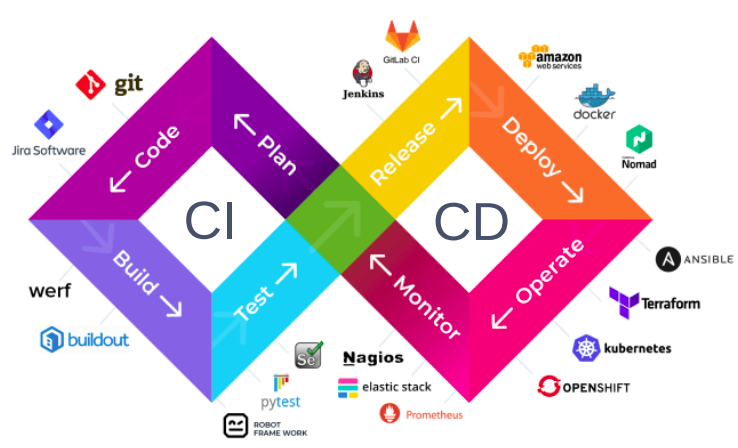
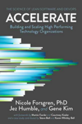
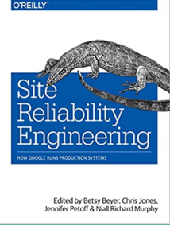
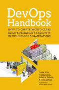
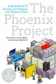

## Continuous Delivery: Course Outline
#### Reliable Software Releases through Build, Test, and Deployment Automation

<small><strong>Lecturer:</strong> Alireza Roshanzamir</small>

<small><strong>Keywords:</strong> Continuous Delivery, Continuous Integration, DevOps, Build, Test, Release, Deployment, Automation, Version Control, Deployment Pipeline</small>

<small><small>Tir 1402/August 2023</small></small>

Note

Mention the deploy vs release and why their order is different in different places (feature toggle, release candidate, library vs application, multiple release and versioning and one deployment).

---
## Lecturer
<table>
    <tr>
        <td></td>
        <td style="padding: 10px">
            <strong>Alireza Roshanzamir</strong>
             
            Software Engineer, Independent Consultant
             
             
            Professional Experience:
            <ul>
                <li>Team Leader and Python Developer, <i>Mahsan</i> | <small>2020 - Present</small></li>
                <li>C++ Developer, <i>Mahsan</i> | <small>2018 - 2020</small></li>
                <li>Web and Mobile Developer, <i>Resaa</i> | <small>2016 - 2018</small></li>
            </ul>
            Education:
            <ul>
                <li>M.Sc. in Artificial Intelligence, <i>Sharif University of Technology</i> | <small>2018 - 2020</small></li>
                <li>B.Sc. in Computer Software Engineering, <i>University of Tehran</i> | <small>2014 - 2018</small></li>
            </ul>
        </td>
    </tr>
</table>

---
## Main References
<table class="books">
    <tr>
        <td></td>
        <td>
        Continuous Delivery: Reliable Software Releases through Build, Test, and Deployment Automation
         
        <small>by Jez Humble and David Farley</small>
        </td>
    </tr>
    <tr>
        <td></td>
        <td>
            Accelerate: The Science of Lean Software and DevOps: Building and Scaling High-Performing Technology Organizations
             
            <small>by Nicole Forsgren Ph.D., Jez Humble, and Gene Kim</small>
        </td>
    </tr>
</table>

---
## Auxiliary References
<table class="books">
    <tr>
        <td></td>
        <td>
            Site Reliability Engineering: How Google Runs Production Systems
             
            <small>by Betsy Beyer, Chris Jones, Jennifer Petoff, Niall Richard Murphy</small>
        </td>
        <td></td>
        <td>
            Effective DevOps
             
            <small>by Jennifer Davis, Ryn Daniels</small>
        </td>
    </tr>
    <tr>
        <td></td>
        <td>
            Release It!: Design and Deploy Production-Ready Software
             
            <small>by Michael T. Nygard</small>
        </td>
        <td></td>
        <td>
            The DevOps Handbook: How to Create World-Class Agility, Reliability, and Security in Technology Organizations
             
            <small>by Gene Kim, Patrick Debois, John Willis, Jez Humble, John Allspaw</small>
        </td>
    </tr>
    <tr>
        <td></td>
        <td>
            The Phoenix Project: A Novel about IT, DevOps, and Helping Your Business Win 
             
            <small>by Gene Kim, Kevin Behr, George Spafford</small>
        </td>
        <td></td>
        <td>
            <ul>
                <li><a href="https://minimumcd.org/">Minimum Viable CD</a></li>
                <li><a href="http://bvajjala.github.io/projects/cd/continuous-delivery-patterns-and-antipatterns">Continuous Delivery Patterns & Antipatterns</a></li>
                <li><a href="https://www.youtube.com/watch?v=6DeWOrmvhRM">Adopting Continuous Delivery by Jez Humble</a></li>
                <li><a href="https://www.youtube.com/watch?v=i2DrLsnETk4">14 Step Continuous Delivery Checklist</a></li>
            </ul>
        </td>
    </tr>
</table>

---
## Table of Contents
<table>
    <tr>
        <td rowspan="5" style="writing-mode: vertical-lr; text-align: center">Foundations</td>
        <td>
            Introduction
             
            <small>
                Definition, Minimum Viable CD, Ingredients, Impacts, Relation with Other Movements, Scrumfall, Case Studies, CD Patterns Mindmap
            </small>
        </td>
        <td>45'</td>
    </tr>
    <tr>
        <td>
            The Problem of Delivering Software
             
            <small>
                Release Antipatterns, Goals, Criterias, Benefits, Release Candidate, Principles
            </small>
        </td>
        <td>30'</td>
    </tr>
    <tr>
        <td>
            Configuration Management
             
            <small>
                Version Control, Managing Dependencies, Managing Software Configuration, Managing Environments
            </small>
        </td>
        <td>90'</td>
    </tr>
    <tr>
        <td>
            Continuous Integration
             
            <small>
                Implementation, Prerequisites, Practices, Challenges
            </small>
        </td>
        <td>45'</td>
    </tr>
    <tr>
        <td>
            Testing Strategy
             
            <small>
                Test Categories, Test Levels (Types), Test Doubles, Test Coverage Criteria, TDD
            </small>
        </td>
        <td>90'</td>
    </tr>
</table>

---
## Table of Contents
<table>
    <tr>
        <td rowspan="6" style="writing-mode: vertical-lr; text-align: center">Deployment Pipeline</td>
        <td>
            Anatomy
             
            <small>
                Stages, Practices, Commit Stage, Test Stages, Release and Deployment Stages, Metrics, Adoption
            </small>
        </td>
        <td>45'</td>
    </tr>
    <tr>
        <td>
            Build and Deployment Scripting
             
            <small>
                Build Tools, Monorepo vs Polyrepo, Principles and Practices, Package Managers, Code Generation, Sample Project Structure (Changelogs, Docs, Tests, Assets, Examples, Dependencies, Version, Pipelines, Linting, Formatting, Type-checking, Code Generation), Deployment Scripting, Tips and Tricks, Infrastructure as a Code (Terraform, Ansible)
            </small>
        </td>
        <td>45'</td>
    </tr>
    <tr>
        <td>
            Commit Stage
             
            <small>
                Linting, Language/Technology Specific Checks, Unit-testing, Building Documentation, Principles and Practices, Test Suite Principles and Practices, Results
            </small>
        </td>
        <td>90'</td>
    </tr>
    <tr>
        <td>
            Automated Acceptance Testing
             
            <small>
                Why?, Roles, Application Driver Layer, Implementation Patterns, Performance Practices
            </small>
        </td>
        <td>45'</td>
    </tr>
    <tr>
        <td>
            Testing Nonfunctional Requirements (Only Introduction)
        </td>
        <td>15'</td>
    </tr>
    <tr>
        <td>
            Deploying and Releasing Applications
             
            <small>
                Release Strategy, Deploying, Rolling Back Deployments, Zero-Downtime Releases, Emergency Fixes, Continuous Deployment, Tips and Tricks, Semantic Release
            </small>
        </td>
        <td>45'</td>
    </tr>
</table>

---
## Table of Contents
<table>
    <tr>
        <td rowspan="6" style="writing-mode: vertical-lr; text-align: center">Deployment Pipeline</td>
        <td>
            Managing Infrastructure and Environments
             
            <small>
                Operation Team Needs, Modeling and Managing Infrastructure, Provisioning and Configuration, Monitoring
            </small>
        </td>
        <td>30'</td>
    </tr>
    <tr>
        <td>
            Managing Data
             
            <small>
                Database Scripting, Incremental Change, Rolling Back Databases and Zero-Downtime Releases, Managing Test Data
            </small>
        </td>
        <td>45'</td>
    </tr>
    <tr>
        <td>
            Managing Components and Dependencies
             
            <small>
                Keeping Application (Trunk) Releasable, Dependencies (Dependency Pinning, Library vs Application), Components, Dependency Graph, Managing Binaries
            </small>
        </td>
        <td>45'</td>
    </tr>
    <tr>
        <td>
            Advanced Version Control
             
            <small>
                Brief history, Version Control Types, Branching and Merging, Gitflow, Develop on Mainline, Branch for Release, Branch by Feature, Branch by Team
            </small>
        </td>
        <td>45'</td>
    </tr>
    <tr>
        <td>
            Managing Continuous Delivery
             
            <small>
                Maturity Models (Jez Humble Maturity Model, QMM, Google Test Certified Ladder), Project Lifecycle, Risk Management Process, Common Delivery Problem (Symptoms and Causes)
            </small>
        </td>
        <td>60'</td>
    </tr>
</table>