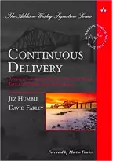
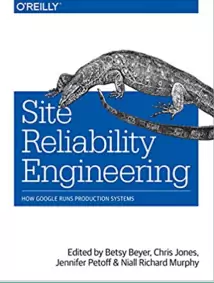
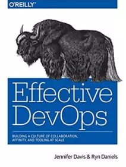
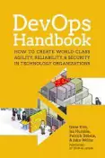

## Continuous Delivery: Course Outline
#### Reliable Software Releases through Build, Test, and Deployment Automation

<small><strong>Time to Read:</strong> 4 Minutes</small>, <small><strong>Time to Present:</strong> 15 Minutes</small>
 
<small><strong>Created By:</strong> Alireza Roshanzamir</small>
 
<small><strong>Keywords:</strong> Continuous Delivery, Continuous Integration, DevOps, Build, Test, Release, Deployment, Automation, Version Control, Deployment Pipeline</small>
  
<small style="color: darkred"><small>Press **"F"** to go fullscreen; some slides may not display properly otherwise.</small></small>

---
## Created By
<table>
    <tr>
        <td></td>
        <td style="padding: 10px">
            <strong>Alireza Roshanzamir</strong>
             
            Software Engineer, Independent Consultant
             
             
            Professional Experience:
            <ul>
                <li>Team Leader and Python Developer, <i>Mahsan</i> | <small>2020 - Present</small></li>
                <li>C++ Developer, <i>Mahsan</i> | <small>2018 - 2020</small></li>
                <li>Web and Mobile Developer, <i>Resaa</i> | <small>2016 - 2018</small></li>
            </ul>
             
            Education:
            <ul>
                <li>M.Sc. in Artificial Intelligence, <i>Sharif University of Technology</i> | <small>2018 - 2020</small></li>
                <li>B.Sc. in Computer Software Engineering, <i>University of Tehran</i> | <small>2014 - 2018</small></li>
            </ul>
             
            Social:
            <ul>
                <li>a.roshanzamir1996@gmail.com</li>
                <li><a href="https://alirezaroshanzamir.github.io" target="_blank">alirezaroshanzamir.github.io</a></li>
            </ul>
             
            Please <strong>star</strong> the <a href="https://github.com/AlirezaRoshanzamir/continuous-delivery-course">github.com/AlirezaRoshanzamir/continuous-delivery-course</a> repository.
        </td>
    </tr>
</table>

---
## Main References
<table class="books">
    <tr>
        <td></td>
        <td>
        Continuous Delivery: Reliable Software Releases through Build, Test, and Deployment Automation
         
        <small>by Jez Humble and David Farley</small>
        </td>
    </tr>
    <tr>
        <td></td>
        <td>
            Accelerate: The Science of Lean Software and DevOps: Building and Scaling High-Performing Technology Organizations
             
            <small>by Nicole Forsgren Ph.D., Jez Humble, and Gene Kim</small>
        </td>
    </tr>
</table>

---
## Auxiliary References
<table class="books">
    <tr>
        <td></td>
        <td>
            Site Reliability Engineering: How Google Runs Production Systems
             
            <small>by Betsy Beyer, Chris Jones, Jennifer Petoff, Niall Richard Murphy</small>
        </td>
        <td></td>
        <td>
            Effective DevOps
             
            <small>by Jennifer Davis, Ryn Daniels</small>
        </td>
    </tr>
    <tr>
        <td></td>
        <td>
            Release It!: Design and Deploy Production-Ready Software
             
            <small>by Michael T. Nygard</small>
        </td>
        <td></td>
        <td>
            The DevOps Handbook: How to Create World-Class Agility, Reliability, and Security in Technology Organizations
             
            <small>by Gene Kim, Patrick Debois, John Willis, Jez Humble, John Allspaw</small>
        </td>
    </tr>
    <tr>
        <td></td>
        <td>
            The Phoenix Project: A Novel about IT, DevOps, and Helping Your Business Win 
             
            <small>by Gene Kim, Kevin Behr, George Spafford</small>
        </td>
        <td></td>
        <td>
            <ul>
                <li><a href="https://minimumcd.org/">Minimum Viable CD</a></li>
                <li><a href="http://bvajjala.github.io/projects/cd/continuous-delivery-patterns-and-antipatterns">Continuous Delivery Patterns & Antipatterns</a></li>
                <li><a href="https://www.youtube.com/watch?v=6DeWOrmvhRM">Adopting Continuous Delivery by Jez Humble</a></li>
                <li><a href="https://www.youtube.com/watch?v=i2DrLsnETk4">14 Step Continuous Delivery Checklist</a></li>
                <li><a href="https://monorepo.tools">monorepo.tools</a></li>
            </ul>
        </td>
    </tr>
</table>

---
## Table of Contents: Foundations
<table>
    <tr>
        <td>
            <a href="../2-introduction" target="_blank">Introduction</a>
             
            <small>
                Definition, Minimum Viable CD, Ingredients, Deployment Pipeline, Why?, Impacts (Software Delivery Performance, Culture), Relation with Other Movements, Scrumfall, Case Studies, CD Patterns Mindmap
            </small>
        </td>
        <td>45'</td>
    </tr>
    <tr>
        <td>
            <a href="../3-the-problem-of-delivering-software" target="_blank">The Problem of Delivering Software</a>
             
            <small>
                Release Antipatterns, Goals, Criterias, Benefits, Release Candidate, Principles
            </small>
        </td>
        <td>30'</td>
    </tr>
    <tr>
        <td>
            <a href="../4-configuration-management" target="_blank">Configuration Management</a>
             
            <small>
                Version Control and Advices, Managing Dependencies, Managing Software Configuration, Managing Environments
            </small>
        </td>
        <td>75'</td>
    </tr>
    <tr>
        <td>
            <a href="../5-continuous-integration" target="_blank">Continuous Integration</a>
             
            <small>
                Implementation, Prerequisites, Practices, Challenges
            </small>
        </td>
        <td>60'</td>
    </tr>
    <tr>
        <td>
            <a href="../6-testing-strategy" target="_blank">Testing Strategy</a>
             
            <small>
                Types of Tests, Test Doubles, Test Coverage Criteria, TDD, Real-Life Situations and Strategies, Integration Testing, Process
            </small>
        </td>
        <td>105'</td>
    </tr>
</table>
 
<small>
Black: From the CD book, Purple: Mostly from the CD book, Green: Mostly from the Accelerate book, Brown: From the other references
</small>

---
## Table of Contents: Deplyment Pipeline
<table>
    <tr>
        <td>
            <a href="../7-anatomy-of-the-deployment-pipeline" target="_blank">Anatomy</a>
             
            <small>
                A Basic Deployment Pipeline, Practices, The Commit Stage, Test Stages, Release and Deployment Stages, Implementation, Metrics
            </small>
        </td>
        <td>45'</td>
    </tr>
    <tr>
        <td>
            <a href="../8-build-and-deployment-scripting" target="_blank">Build and Deployment Scripting</a>
             
            <small>
                Build Tools, Monorepo vs Polyrepo, Principles and Practices, Package Managers, Code Generation, Sample Project Structure, Deployment Scripting, Tips and Tricks, Infrastructure as Code
            </small>
        </td>
        <td>90'</td>
    </tr>
    <tr>
        <td>
            <a href="../9-the-commit-stage" target="_blank">Commit Stage</a>
             
            <small>
                Introduction, Principles and Practices, The Results, Commit Test Suite Principles and Practices
            </small>
        </td>
        <td>20'</td>
    </tr>
    <tr>
        <td>
            <a href="../10-automated-acceptance-testing" target="_blank">Automated Acceptance Testing</a>
             
            <small>
                Introduction, Why?, Process and Roles, Testing and Documentation, The Application Driver Layer, Implementation, The Acceptance Test Stage, Performance Practices
            </small>
        </td>
        <td>50'</td>
    </tr>
    <tr>
        <td>
            <a href="../11-managing-nonfunctional-requirements" target="_blank">Managing Nonfunctional Requirements</a>
        </td>
        <td>15'</td>
    </tr>
    <tr>
        <td>
            <a href="../12-deploying-and-releasing-applications" target="_blank">Deploying and Releasing Applications</a>
             
            <small>
                Introduction, Release Strategy, Deploying and Promoting Your Application, Semantic Versioning, Rolling Back Deployments and Zero-Downtime Releases, Emergency Fixes, Continuous Deployment, Semantic Release, Tips and Tricks
            </small>
        </td>
        <td>60'</td>
    </tr>
</table>

---
## Table of Contents: Delivery Ecosystem
<table>
    <tr>
        <td>
            <a href="../13-managing-infrastructure-and-environments" target="_blank">Managing Infrastructure and Environments</a>
             
            <small>
                Understanding Operation Team, Modeling and Managing Infrastructure, Managing Server Provisioning and Configuration, Managing the Configuration of Middleware, Managing Infrastructure Services, Virtualization, Cloud Computing, Monitoring Infrastructure and Applications
            </small>
        </td>
        <td>75'</td>
    </tr>
    <tr>
        <td>
            <a href="../14-managing-data" target="_blank">Managing Data</a>
             
            <small>
                Database Scripting, Incremental Change, Rolling Back Databases and Zero-Downtime Releases, Managing Test Data, Data Management and the Deployment Pipeline
            </small>
        </td>
        <td>45'</td>
    </tr>
    <tr>
        <td>
            Managing Components and Dependencies
             
            <small>
                Keeping Application (Trunk) Releasable, Dependencies, Components, Managing Dependency Graph, Managing Binaries</style>
            </small>
        </td>
        <td>45'</td>
    </tr>
    <tr>
        <td>
            Advanced Version Control
             
            <small>
                Brief history, Branching and Merging, Distributed Version Control Systems (DVCS), Stream-Based Version Control Systems, Branching Patterns, Popular Branching Policies
            </small>
        </td>
        <td>45'</td>
    </tr>
    <tr>
        <td>
            Managing Continuous Delivery
             
            <small>
                Maturity Models (Jez Humble Maturity Model, QMM, Google Test Certified Ladder), Project Lifecycle, Risk Management Process, Common Delivery Problem (Symptoms and Causes)
            </small>
        </td>
        <td>60'</td>
    </tr>
</table>