## Continuous Delivery: Automated Acceptance Testing
#### Introduction, Why?, Process and Roles, Testing and Documentation, The Application Driver Layer, Implementation, The Acceptance Test Stage, Performance Practices

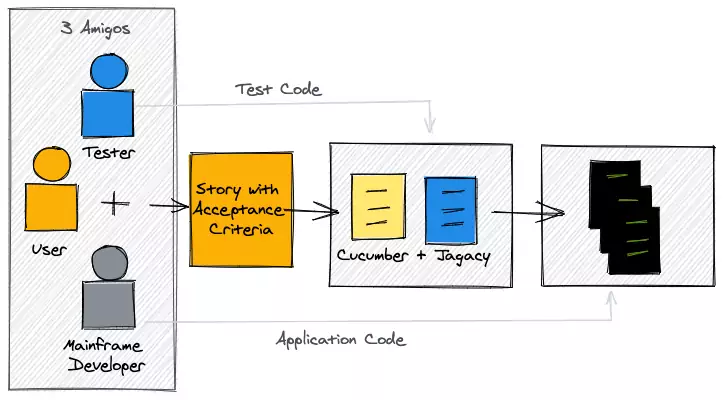

<small><strong>Time to Read:</strong> 10 Minutes</small>, <small><strong>Time to Present:</strong> 50 Minutes</small>

<small><strong>Created By:</strong> Alireza Roshanzamir</small>

<small><strong>Keywords:</strong> Continuous Delivery, Continuous Integration, DevOps, Build, Test, Release, Deployment, Automation, Version Control, Deployment Pipeline</small>

<small><small> Tir 1402/August 2023</small></small>

---
## Introduction
Once you have automated acceptance tests in place, you are testing the **business acceptance criteria** of your application, that is, validating that **it provides users with valuable functionality**.

They typically **run against** every version of your **software that passes the commit tests**.  <!-- .element: class="fragment fade-in-paragraph" -->

An individual acceptance test is intended to verify that the **acceptance criteria** of a **story or requirement** have been met.  <!-- .element: class="fragment fade-in-paragraph" -->

A **unit test** aims to show that a **single part of the application does what the programmer intends** it to; this is by no means the same as asserting that a **user has what they need**.  <!-- .element: class="fragment fade-in-paragraph" -->

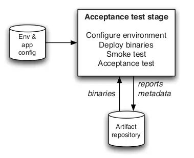

---
## Why Is Automated Acceptance Testing Essential?

There has always been a **great deal of controversy** around automated acceptance tests.  <!-- .element: class="fragment fade-in-paragraph" -->

**Project managers** and **customers** often think they are too expensive to create and maintain-which indeed, when done badly, they are.  <!-- .element: class="fragment fade-in-paragraph" -->

Many developers believe that unit test suites created through **test-driven development** are **enough to protect against regressions**.  <!-- .element: class="fragment fade-in-paragraph" -->

But, the **cost of a properly created and maintained** automated acceptance test suite is **much lower** than that of **performing frequent manual acceptance and regression testing**, or that of the alternative of releasing **poor-quality software**.  <!-- .element: class="fragment fade-in-paragraph" -->

Some people **in the Agile community** advocate that a combination of **unit** and **component tests** and **XP practices** are sufficient but:  <!-- .element: class="fragment fade-in-parent-with-next" -->
1. **No other type of test** proves that the application, running more or less as it would in production, **delivers the business** value its users are expecting.
2. Unit and component tests **do not test user scenarios** and are thus incapable of finding the kinds of defects that appear when users put the application through a **series of states** in the course of interacting with it.

------
### How to Create Maintainable Acceptance Test Suites: INVEST
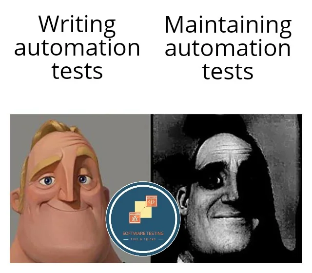

Acceptance tests are derived from **acceptance criteria**, so the acceptance criteria for your application must be written with automation in mind and must follow the **INVEST** principles:  <!-- .element: class="fragment fade-in-parent-with-next" -->
- **I**ndependent (of all others)
- **N**egotiable (not a contract for specific feature)
- **V**aluable (a vertical slice)
- **E**stimable (to a decent approximation)
- **S**mall (enough to fit in a single iteration)
- **T**estable (even if the test doesn't exist yet)

------
### How to Create Maintainable Acceptance Test Suites: Layering
Automated acceptance tests should always be layered:

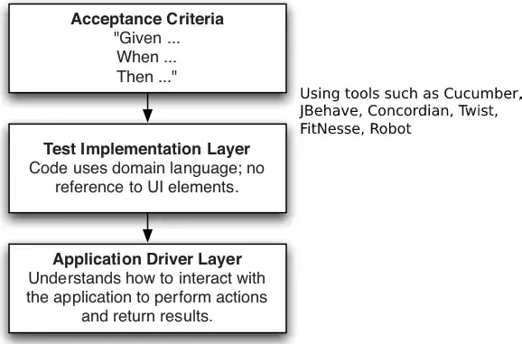

Test implementations that **refer directly** to the **application's API** or **UI** are **brittle**, and even **small changes to the UI** will immediately **break all the tests** referring to the changed UI element. Such tests are often the output of **record-and-playback-style test** automation products, which is one of the main reasons automated acceptance tests are perceived as expensive.

------
### Testing against the GUI

Drawbacks of the GUI testing:  <!-- .element: class="fragment fade-in-with-next" -->
- Its rapid rate of change  <!-- .element class="fragment highlight-current-blue" -->
- <!-- .element class="fragment highlight-current-blue" --> The complexity of scenario setup
  - Many interactions to get the system into a state ready for the test itself
- Access to test results  <!-- .element class="fragment highlight-current-blue" -->
- Untestable GUI technologies  <!-- .element class="fragment highlight-current-blue" -->

---
## Creating Acceptance Tests
Start with the identification of **acceptance criteria** by **analysts**, **testers**, and **customers** working together, and then talk about **representing acceptance criteria in a form that can be automated**.

------
### The Role of Analysts and Testers
The role of the **business analyst** is:
- Represent the customers and users of the system. They work with the customer to identify and prioritize requirements.  <!-- .element class="fragment highlight-current-blue" -->
- Work with the developers to ensure that they have a good understanding of the application from the user's perspective. They guide developers to ensure that stories deliver the business value that they are meant to.  <!-- .element class="fragment highlight-current-blue" -->
- Work with testers to ensure that acceptance criteria are specified properly, and to ensure that functionality developed meets these acceptance criteria and delivers the expected value.  <!-- .element class="fragment highlight-current-blue" -->

The role of the **testers** is:  <!-- .element class="fragment fade-in-parent-with-next" -->
- Ensure that the current quality and production-readiness of the software being developed is understood by everybody on the delivery team, including the customer.  <!-- .element class="fragment highlight-current-blue" -->
- Working with customers and analysts to define acceptance criteria for stories or requirements.  <!-- .element class="fragment highlight-current-blue" -->
- Working with developers to write automated acceptance tests.  <!-- .element class="fragment highlight-current-blue" -->
- Performing manual testing activities such as exploratory testing, manual acceptance testing, and showcases.  <!-- .element class="fragment highlight-current-blue" -->

Not every team has **separate individuals** who perform **these roles 100% of the time**. Sometimes, **developers act as analysts**, or **analysts act as testers**. In **Scrum** teams, **product owners** may do the analyst jobs.  <!-- .element class="fragment fade-in-paragraph" -->

------
### Analysis on Iterative Projects
1. Initially, the **analysts** will work closely with **testers** and the **customer** to define **acceptance criteria**.  <!-- .element class="fragment fade-in-then-semi-out-parent" -->
2. Once the **acceptance criteria have been defined**, the **analyst** and **tester** sit with the **developers** who will do the implementation, along **with the customer if available**. The **tester works with the developers** to **agree on a collection of automated acceptance tests**.  <!-- .element class="fragment fade-in-then-semi-out-parent" -->
3. While the requirement is **being implemented**, the **developers** will **consult with the analyst** if they find an **area that they don't understand** well enough, or if they have discovered a problem or a more efficient approach to solving the problem that the requirement poses.  <!-- .element class="fragment fade-in-then-semi-out-parent" -->
4. When the **developers** believe that they have **completed the work** (passed associated **unit**, **component**, and **acceptance tests**), they will **demonstrate** it to the **analyst**, the **tester**, and the **customer**.  <!-- .element class="fragment fade-in-then-semi-out-parent" -->
5. Once the **analyst** and the **customer** are happy that the **requirement has been fulfilled**, it **moves on to testing by the testers**.  <!-- .element class="fragment fade-in-then-semi-out-parent" -->

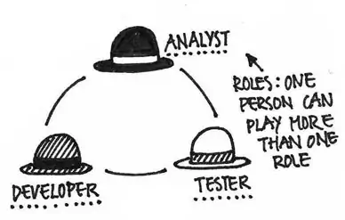

------
### Acceptance Criteria as Executable Specifications (BDD)
Acceptance tests are **executable specifications** of the **behavior of the software** being developed. This is a significant realization which has spawned a new approach to automated testing, known as **behavior-driven development (BDD)**.  <!-- .element class="fragment fade-in-paragraph" -->

In BDD, **acceptance criteria** should be written in the form of the **customer's expectations** of the behavior of the application. It should then be possible to take acceptance criteria thus written, and **execute them directly** against the application to **verify that the application meets its specifications**.  <!-- .element class="fragment fade-in-paragraph" -->

Most **specifications** begin to **become out-of-date** as the application evolves. But, with BDD and deployment pipeline, it's not possible.  <!-- .element class="fragment fade-in-paragraph" -->

------
### Acceptance Criteria as Executable Specifications Example
Financial trading application acceptance criterion and corresponding **Ruby Cucumber** implementation:

<pre class="gherkin"><code style="font-size: 15px; line-height: normal;" data-trim data-noescape>Feature: Placing an order
Scenario: User order should debit account correctly

Given there is an instrument called bond
  And there is a user called Dave with 50 dollars in his account
When I log in as Dave
  And I select the instrument bond
  And I place an order to buy 4 at 10 dollars each
  And the order is successful
Then I have 10 dollars left in my account
</code></pre>

<pre class="ruby"><code style="font-size: 15px; line-height: normal; height: 200px">require 'application_driver/admin_api'
require 'application_driver/trading_ui'

Before do
    @admin_api = AdminApi.new
    @trading_ui = TradingUi.new
end

Given /^there is an instrument called (\w+)$/ do |instrument|
    @admin_api.create_instrument(instrument)
end

Given /^there is a user called (\w+) with (\w+) dollars in his account$/
  do |user, amount|
    @admin_api.create_user(user, amount)
end

When /^I log in as (\w+)$/ do |user|
    @trading_ui.login(user)
end

When /^I select the instrument (\w+)$/ do |instrument|
    @trading_ui.select_instrument(instrument)
end

When /^I place an order to buy (\d+) at (\d+) dollars each$/
  do |quantity, amount|
    @trading_ui.place_order(quantity, amount)
end

When /^the order for (\d+) of (\w+) at (\d+) dollars each is successful$/
  do |quantity, instrument, amount|
    @trading_ui.confirm_order_success(instrument, quantity, amount)
end

Then /^I have (\d+) dollars left in my account$/ do |balance|
    @trading_ui.confirm_account_balance(balance)
end
</code></pre>

You should implement the **AdminApi** and **TradingUi** drivers. Running result:

<pre class="console"><code style="font-size: 15px; line-height: normal">Feature: Placing an order
1 scenario (1 passed)
7 steps (7 passed)
...
0m0.016s
</code></pre>

These executable specifications can generally be **turned into a document** suitable for auditing using a simple, automated process.

---
## Testing and Documentation
In addition to using BDD and employing human-readable executable specifications within the documentation, you can include the **tests as illustrative examples in the documents**. By **making assertions**, you should validate the outcomes of the code showcased in the documentation's examples. Consequently, the **code within the documentation** could effectively serve as an **automated acceptance test**, contributing to the concept of **"living documentation"**:

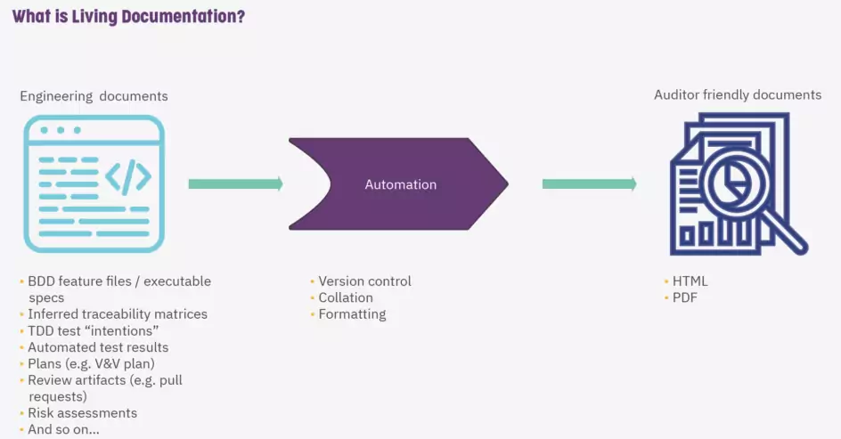

------
### Testing and Documentation: Doctest
Write **usage examples** for your code that work as **documentation** and **test cases** simultaneously:

<table>
  <tr>
    <th>Code</th>
    <th>Output</th>
  </tr>
  <tr class="simple">
    <td>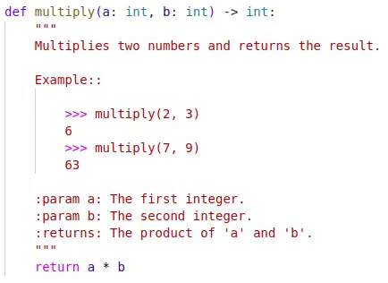</td>
    <td>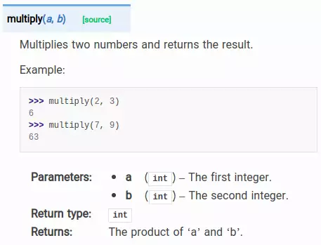</td>
  </tr>
  <tr>
    <td>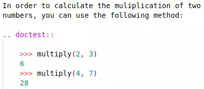</td>
    <td>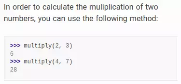</td>
  </tr>
</table>

------
### Testing and Documentation: FitNesse
FitNesse is an **open source test framework** that allows software testers, developers and customers to collaborate to create test cases on a **wiki**:

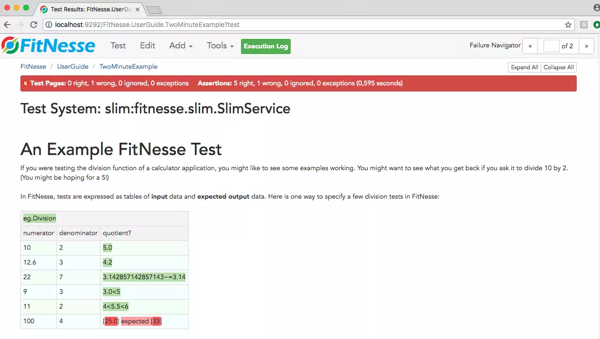

---
## The Application Driver Layer
The application driver layer is the layer that understands **how to talk to your application-the system under test (SUT)**.

The API for the application driver layer is expressed in a **domain language**.  <!-- .element class="fragment fade-in-paragraph" -->

This is the same acceptance test written using a **JUnit** test:  <!-- .element class="fragment fade-in-parent-with-next" -->
<pre class="java"><code style="font-size: 13px; line-height: normal">public class PlacingAnOrderAcceptanceTest extends DSLTestCase {
    @Test
    public void userOrderShouldDebitAccountCorrectly() {
        adminAPI.createInstrument("name: bond");
        adminAPI.createUser("Dave", "balance: 50.00");
        tradingUI.login("Dave");

        tradingUI.selectInstrument("bond");
        tradingUI.placeOrder("price: 10.00", "quantity: 4");
        tradingUI.confirmOrderSuccess("instrument: bond", "price: 10.00", "quantity: 4");

        tradingUI.confirmBalance("balance: 10.00");
    }
}
</code></pre>

It is instructive to compare the example acceptance test in **JUnit (internal DSL)**, above, to the one expressed in **Cucumber in the previous slides (external DSL)**. Either of these approaches will work just fine, and each has its **pros** and **cons** (**being textual**, **relation with acceptance crietria**, **auto-completeness**, **IDE**, **additional tools**, and etc.)  <!-- .element class="fragment fade-in-paragraph" -->

------
### The Window Driver Pattern: Decoupling the Tests from the GUI
When implementing the window driver pattern, you should write the equivalent of a device driver for each part of your GUI:

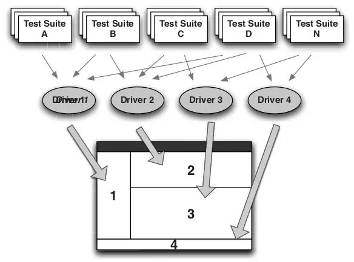

------
### Continued: The Window Driver Pattern: Decoupling the Tests from the GUI
Acceptance test without layering:

<pre class="java"><code style="font-size: 13px; line-height: normal">@Test
public void shouldDeductPaymentFromAccountBalance() {
    selectURL("http://my.test.bank.url");
    enterText("userNameFieldId", "testUserName");
    enterText("passwordFieldId", "testPassword");
    click("loginButtonId");
    waitForResponse("loginSuccessIndicator");

    String initialBalanceStr = readText("BalanceFieldId");

    enterText("PayeeNameFieldId", "testPayee");
    enterText("AmountFieldId", "10.05");
    click("payButtonId");

    BigDecimal initialBalance = new BigDecimal(initialBalanceStr);
    BigDecimal expectedBalance = initialBalance.subtract(new BigDecimal("10.05"));
    Assert.assertEquals(expectedBalance.toString(), readText("BalanceFieldId"));
}
</code></pre>

Refactored with the **AccountPanelDriver** as window driver (note the GUI control names in the entities and functions):

<pre class="java"><code style="font-size: 15px; line-height: normal; height: 280px">@Test
public void shouldDeductPaymentFromAccountBalance() {
    AccountPanelDriver accountPanel = new AccountPanelDriver(testContext);

    accountPanel.login("testUserName", "testPassword");
    accountPanel.assertLoginSucceeded();

    BigDecimal initialBalance = accountPanel.getBalance();
    accountPanel.specifyPayee("testPayee");
    accountPanel.specifyPaymentAmount("10.05");
    accountPanel.submitPayment();

    BigDecimal expectedBalance = initialBalance.subtract(new BigDecimal("10.05"));

    Assert.assertEquals(expectedBalance.toString(), accountPanel.getBalance());
}
</code></pre>

---
## Implementing Acceptance Tests
There is more to the implementation of acceptance tests than layering:
- Putting the application in a particular state, performing several actions on it, and verifying the results.  <!-- .element: class="fragment insides-fade-in-then-out" -->
  - An atomic test creates all it needs to execute and then tidies up behind itself, leaving no trace except a record of whether it passed or failed (e.g. create a new account at the start of every test).  <!-- .element: class="fragment fade-in-then-semi-out" -->
  - Otherwise, write defensive tests (check everything at the start) and use differential assertions.  <!-- .element: class="fragment fade-in-then-semi-out" -->
- Prevent privilaged access or backdoors for tests.  <!-- .element: class="fragment insides-fade-in-then-out" -->
- Handle asynchrony and timeouts in order to avoid flakiness.  <!-- .element: class="fragment insides-fade-in-then-out" -->
  - Has the test failed, or are we just waiting for the results to arrive?  <!-- .element: class="fragment fade-in-then-semi-out" -->
  - Make the sequence of events embodying the test appear to be synchronous:  <!-- .element: class="fragment fade-in-then-semi-out" -->
    - Prefer multiple small delays against a large delay.
- Test doubles are often required in order to allow any integration with external systems to be simulated.  <!-- .element: class="fragment insides-fade-in-then-out" -->
  - Your acceptance testing should be focused on providing a controllable environment (we don't have this limit in UAT).  <!-- .element: class="fragment fade-in-then-semi-out" -->
  - Create test doubles that represent the connection to all external systems that our system interacts with.  <!-- .element: class="fragment fade-in-then-semi-out" -->
  - <!-- .element: class="fragment fade-in-then-semi-out" --> Build small suites of tests around each integration point, intended to run in an environment that does have real connections to these external systems.
  - Have one component of our system to represent all interactions with an external system (a gateway or adapter). It also helps to implement other patterns such as circuit breaker.  <!-- .element: class="fragment fade-in-then-semi-out" -->

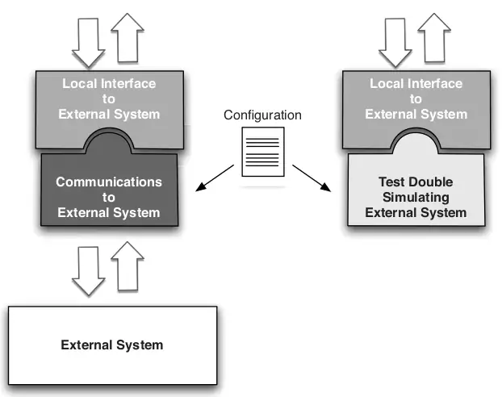

---
## The Acceptance Test Stage
Acceptance test suite should be run against **every build that passes the commit tests**. **Later pipeline stages** are most commonly treated as a matter of **human judgment**.

For projects of **extremely short duration** with a **small team**, maybe **four or fewer developers**, it **may be overkill**-you might instead run **a few end-to-end tests** as part of a single-stage CI process. But, it bears repeating that **large projects start out as small projects**, and by the time a project gets large, it is invariably **too late to retro-fit** a comprehensive set of automated acceptance tests **without a Herculean level of effort**.  <!-- .element: class="fragment fade-in-paragraph" -->

Tips for the acceptance test stage:  <!-- .element: class="fragment fade-in-with-next" -->
- <!-- .element class="fragment highlight-current-blue" --> Keeping Acceptance Tests Green
  - When an acceptance test breaks, the team needs to stop and immediately triage.
  - Determining what may have caused a specific acceptance test failure is not as simple as for a unit test.
- <!-- .element class="fragment highlight-current-blue" --> Deployment Tests
  - Choose to run a small selection of new smoke tests designed to assert that our environment (infrastructure tests or environment tests) -> Known-good starting point for the execution of the more functional acceptance tests.
  - This tests are prioritized and fail-fast.

---
## Acceptance Test Performance
Ultimately it is more important to have a **comprehensive automated test suite than one that runs in ten minutes**.

But, the longer the time between the point where a problem is introduced and the point of discovering it, the **more difficult** it will be to **find the source of the problem** and fix it:  <!-- .element: class="fragment fade-in-parent-with-next" -->
- Refactor and Improve Common Tasks and Initial States  <!-- .element class="fragment highlight-current-blue" -->
- Share Expensive Resources  <!-- .element class="fragment highlight-current-blue" -->
- Parallel Testing and Using Compute Grids  <!-- .element class="fragment highlight-current-blue" -->

---
## Summary
Automated acceptance tests are usually **more complex** than unit tests. They take more time to maintain, and they will probably spend **more of their life being broken** than unit tests.

The use of automated acceptance testing will **pay for itself** many times over; **we have never regretted their use**.  <!-- .element: class="fragment fade-in-paragraph" -->
