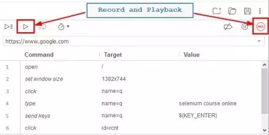
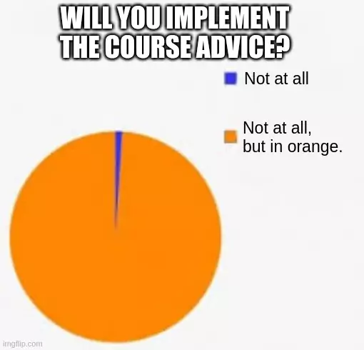
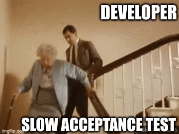
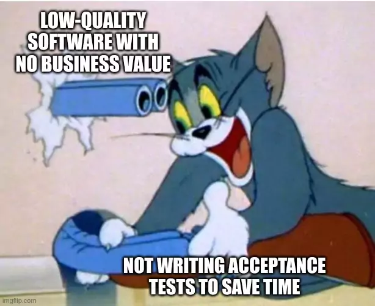
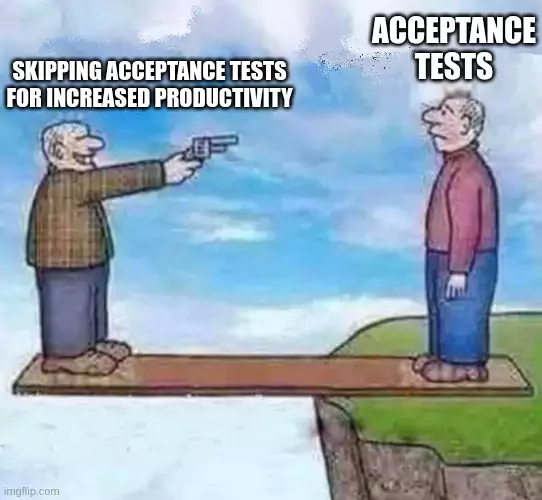

## Continuous Delivery: Automated Acceptance Testing
#### Why?, Process and Roles, Testing and Documentation, The Application Driver Layer, Implementation, The Acceptance Test Stage, Performance Practices

<small><strong>Time to Read:</strong> 11 Minutes</small>, <small><strong>Time to Present:</strong> 50 Minutes</small>
 
<small><strong>Created By:</strong> Alireza Roshanzamir</small>
 
<small><strong>Keywords:</strong> Continuous Delivery, Continuous Integration, DevOps, Build, Test, Release, Deployment, Automation, Version Control, Deployment Pipeline</small>
  
<small style="color: darkred"><small>Press **"F"** to go fullscreen; some slides may not display properly otherwise.</small></small>

---
## Introduction
Automating acceptance tests ensures your application meets  **business acceptance criteria** and **delivers valuable functionality**.

&shy;<!-- .element class="fragment fade-in" -->Thet usually run on **every software version** that **passes commit tests**.

&shy;<!-- .element class="fragment fade-in" -->Each **acceptance test** aims to confirm if a **story or requirement's acceptance criteria** are fulfilled.

&shy;<!-- .element class="fragment fade-in" -->Unit tests check if **a specific app part** works as intended **by the programmer**, which **isn't** the same as ensuring **user needs** are met.

---
## Why Is Automated Acceptance Testing Essential?

&shy;<!-- .element class="fragment fade-in" -->Automated acceptance tests have **long been a subject of controversy**.

&shy;<!-- .element class="fragment fade-in" -->**Project managers** and **customers** often think they are **too expensive** to **create** and **maintain**-indeed, when **done badly, they are**.

&shy;<!-- .element class="fragment fade-in" -->Developers often think unit tests from **test-driven development** are **enough to prevent regressions**.

&shy;<!-- .element class="fragment fade-in" -->But, a **well-maintained automated** acceptance test suite costs **far less** than **manual acceptance and regression testing** or **releasing low-quality software**.

&shy;<!-- .element: class="fragment fade-in-with-next custom" -->Some people **in the Agile community** suggest that a mix of **unit** and **component tests** along with **XP practices** suffice, but:
1. **No other type of test** proves that the application, running similarly to production, **delivers the business value** to users.
2. Unit and component tests **don't test user scenarios**, so they **can't find** defects that **arise as users interact** with the application through a **series of states**.

------
### How to Create Maintainable Acceptance Test Suites: INVEST

&shy;<!-- .element: class="fragment fade-in-with-next custom" -->Acceptance tests come from **acceptance criteria**, so your criteria must consider automation and follow the **INVEST** principles:
- **I**ndependent (of all others)
- **N**egotiable (not a contract for specific feature)
- **V**aluable (a vertical slice)
- **E**stimable (to a decent approximation)
- **S**mall (enough to fit in a single iteration)
- **T**estable (even if the test doesn't exist yet)

------
### Continued: How to Create Maintainable Acceptance Test Suites: INVEST
- User Story (from [here](https://capgemini.github.io/agile/invest-in-user-stories/) and [here](https://www.towerhousestudio.com/blog/how-to-evaluate-your-user-stories-using-the-invest-criteria)):
  <table style="font-size: 17px">
    <tr>
      <th>Bad</th>
      <th>Better</th>
    </tr>
    <tr>
      <td>
        <strong>As a customer</strong>, I want the website to have a <strong>new layout and design</strong> so that it <strong>looks more modern</strong>.
        

          
Why?

          This User Story is <strong>not independent</strong> as it requires changes to be made to the entire website. It is also <strong>not easily estimable</strong> as it is <strong>too broad</strong> and could require significant effort to complete.
        

      </td>
      <td>
        <strong>As a customer</strong>, I want to <strong>search for products by category</strong> so that I can <strong>find the products I am looking for more easily</strong>.
      </td>
    </tr>
    <tr>
      <td>
        <strong>As a salesperson</strong>, I want to <strong>view all of the company's financial information</strong> so that I can <strong>make better business decisions</strong>.
        

          
Why?

          This User Story is <strong>not negotiable</strong> as it <strong>requests access to sensitive information</strong>. It is also <strong>not easily testable</strong> as it <strong>requires access to sensitive financial information</strong>.
        

      </td>
      <td>
        <strong>As a salesperson</strong>, I want to <strong>view a list of my customers</strong> so that I can <strong>keep track of my customer relationships</strong>.
      </td>
    </tr>
    <tr>
      <td>
        <strong>As an XYZ customer ordering</strong> using the website, I want to be able to <strong>use the One-click Payment option</strong>, so that I can <strong>skip the payment pages and complete my order faster</strong>.
        

          
Why?

          <strong>Type of Customers</strong>: Is this feature available to all new and existing customers? 
          <strong>New Customers</strong>: What should be the workflow for a new customer after the One-click Payment option has gone live? 
          <strong>First Visit of Existing Customers without saved card details</strong>: What should be the workflow of an existing customer who has not saved any card details and visits for the first time after the One-click Payment option has gone live? 
          <strong>First Visit of Existing Customers with saved card details</strong>: What should be the workflow of an existing customer who has already saved their card details and visits for the first time after the One-click Payment option has gone live? 
          <strong>Existing Customers not opted for One-click Payment</strong>: What should be the workflow of an existing customer who has not opted to register for the One-click Payment in their previous visit after the feature has gone live? 
          <strong>Existing One-click Payment Customers</strong>: What should be the workflow of an existing customer who has successfully registered their card for the One-click Payment in their previous visit? 
        

      </td>
      <td>
        <strong>As an EXISTING ONE-CLICK PAYMENT XYZ CUSTOMER ordering</strong> from the <strong>WEB</strong> using a <strong>DESKTOP OR LAPTOP</strong>, I want to be able to <strong>CLICK ON THE ONE-CLICK PAYMENT OPTION</strong> so that I can <strong>skip the payment pages and complete my order faster</strong>.
      </td>
    </tr>
  </table>

- <!-- .element: class="fragment fade-in" --> Acceptance Criteria:
  **Given**: An EXISTING ONE-CLICK PAYMENT WEB XYZ Customer, **When**: The Customer orders through the website and clicks on Checkout using a desktop or a laptop, **Then**: The Customer must be presented with a One-click Payment button.

  **Checklists**: This test must pass when tested on:
  - Approved versions of IE browsers
  - Approved versions of Chrome browsers
  - Approved versions of Firefox browsers
  - Approved versions of Safari browsers

------
### How to Create Maintainable Acceptance Test Suites: Layering

&shy;<!-- .element: class="fragment fade-in-with-next custom" -->Automated acceptance tests should be layered:

&shy;<!-- .element: class="fragment fade-in-with-next custom" -->Tests that **directly use** the **application's API** or **UI** are **brittle** and **minor UI changes** can **break all such tests**. They often result from **record-and-playback-style test** automation tools, one of the main reasons automated acceptance tests are perceived as expensive.

------
### Testing against the GUI

Drawbacks of the GUI testing:  <!-- .element: class="fragment fade-in-with-next custom" -->
- Rapid rate of change  <!-- .element class="fragment highlight-current-blue" -->
- <!-- .element class="fragment highlight-current-blue" --> The complexity of scenario setup
  - Many interactions to get the system into a state ready for the test itself
- Access to test results  <!-- .element class="fragment highlight-current-blue" -->
- Untestable GUI technologies  <!-- .element class="fragment highlight-current-blue" -->

---
## Creating Acceptance Tests
Begin with **analysts**, **testers**, and **customers** collaborating to **identify acceptance criteria**. Then, **transform** these criteria into **a format suitable for automation**.

------
### The Role of Analysts and Testers
The role of the **business analyst** is:
- Represent the customers and users of the system. They work with the customer to identify and prioritize requirements.  <!-- .element class="fragment highlight-current-blue" -->
- Work with developers to ensure they grasp the application from the user's perspective. Guide developers to ensure that stories deliver the intended business value.  <!-- .element class="fragment highlight-current-blue" -->
- Work with testers to ensure correct acceptance criteria and functionality alignment, delivering expected value.  <!-- .element class="fragment highlight-current-blue" -->

&shy;<!-- .element: class="fragment fade-in-with-next custom" -->The role of the **testers** is:
- Ensure everyone, including the customer, understands the software's current quality and production readiness.  <!-- .element class="fragment highlight-current-blue" -->
- Working with customers and analysts to define acceptance criteria for stories or requirements.  <!-- .element class="fragment highlight-current-blue" -->
- Working with developers to write automated acceptance tests.  <!-- .element class="fragment highlight-current-blue" -->
- Performing manual testing activities such as exploratory testing, manual acceptance testing, and showcases.  <!-- .element class="fragment highlight-current-blue" -->

&shy;<!-- .element class="fragment fade-in" -->Not every team has **separate individuals** who perform **these roles 100% of the time**. Sometimes, **developers act as analysts**, or **analysts act as testers**. In **Scrum** teams, **product owners** may do the analyst jobs.

------
### Analysis on Iterative Projects
1. &shy;<!-- .element class="fragment fade-in-then-semi-out" -->At first, **analysts** collaborate with **testers** and the **customer** to define **acceptance criteria**.
2. &shy;<!-- .element class="fragment fade-in-then-semi-out" -->Then, just before implementation, the **analyst**, **tester**, and **developers** (plus the customer if available) **meet**. The **analyst** explains the **requirement and criteria**, and the **tester and developers** **create automated tests** for validation.
3. &shy;<!-- .element class="fragment fade-in-then-semi-out" -->While **implementing the requirement**, **developers** **consult with the analyst** if they **encounter unclear areas** or **identify issues or better solutions** to address the requirement.
4. &shy;<!-- .element class="fragment fade-in-then-semi-out" -->Once **developers** believe they've **finished the work** (including passing **unit**, **component**, and **acceptance tests**), they'll **present** it to the **analyst**, **tester**, and **customer**.
5. &shy;<!-- .element class="fragment fade-in-then-semi-out" -->Once the **analyst** and the **customer** are happy that the **requirement has been fulfilled**, it **moves on to testing by the testers**.

------
### Acceptance Criteria as Executable Specifications (BDD)
Acceptance tests act as **executable specs** for the **software's behavior**, lead to **behavior-driven development** in automated testing.

&shy;<!-- .element class="fragment fade-in" -->In BDD, **acceptance criteria** are **customer expectations** for **application behavior**, **written** to **execute directly** and **verify compliance with specifications**.

&shy;<!-- .element class="fragment fade-in" -->Most **specifications** can **become outdated** as the application evolves, but with BDD and a deployment pipeline, it's not possible.

------
### Acceptance Criteria as Executable Specifications Example
Financial trading application acceptance criterion and **Ruby Cucumber** implementation:

<pre class="gherkin"><code style="font-size: 17px; line-height: normal;" data-trim data-noescape>Feature: Placing an order
Scenario: User order should debit account correctly

Given there is an instrument called bond
  And there is a user called Dave with 50 dollars in his account
When I log in as Dave
  And I select the instrument bond
  And I place an order to buy 4 at 10 dollars each
  And the order is successful
Then I have 10 dollars left in my account
</code></pre>

<pre class="ruby"><code style="font-size: 17px; line-height: normal; height: 200px">require 'application_driver/admin_api'
require 'application_driver/trading_ui'

Before do
    @admin_api = AdminApi.new
    @trading_ui = TradingUi.new
end

Given /^there is an instrument called (\w+)$/ do |instrument|
    @admin_api.create_instrument(instrument)
end

Given /^there is a user called (\w+) with (\w+) dollars in his account$/
  do |user, amount|
    @admin_api.create_user(user, amount)
end

When /^I log in as (\w+)$/ do |user|
    @trading_ui.login(user)
end

When /^I select the instrument (\w+)$/ do |instrument|
    @trading_ui.select_instrument(instrument)
end

When /^I place an order to buy (\d+) at (\d+) dollars each$/
  do |quantity, amount|
    @trading_ui.place_order(quantity, amount)
end

When /^the order for (\d+) of (\w+) at (\d+) dollars each is successful$/
  do |quantity, instrument, amount|
    @trading_ui.confirm_order_success(instrument, quantity, amount)
end

Then /^I have (\d+) dollars left in my account$/ do |balance|
    @trading_ui.confirm_account_balance(balance)
end
</code></pre>

You should implement the **AdminApi** and **TradingUi** drivers. Running result:

<pre class="console"><code style="font-size: 15px; line-height: normal">Feature: Placing an order
1 scenario (1 passed)
7 steps (7 passed)
...
0m0.016s
</code></pre>

You can turn these specs into an audit-friendly **document** with a simple automated process.

---
## Testing and Documentation
Besides using BDD and human-readable executable specs in documentation, you can also include **tests as examples in the documents**. By **asserting** and **validating code outcomes** in the documentation's examples, this code can serve as **automated acceptance tests**, supporting the idea of **"living documentation"**:

------
### Testing and Documentation: Doctest
Create **usage examples** that serve as both **documentation** and **test cases** simultaneously:

<table>
  <tr>
    <th>Code</th>
    <th>Output</th>
  </tr>
  <tr class="simple">
    <td></td>
    <td></td>
  </tr>
  <tr>
    <td></td>
    <td></td>
  </tr>
</table>

------
### Testing and Documentation: FitNesse
FitNesse is an **open source test framework** that allows testers, developers, and customers to collaborate on test cases using a **wiki**:

---
## The Application Driver Layer
The application driver layer is the layer that understands **how to talk to your application-the system under test (SUT)**.

&shy;<!-- .element class="fragment fade-in" -->The API for the application driver layer is expressed in a **domain language**.

&shy;<!-- .element: class="fragment fade-in-with-next custom" -->This is the same acceptance test written using a **JUnit** test:
<pre class="java"><code style="font-size: 20px; line-height: normal">public class PlacingAnOrderAcceptanceTest extends DSLTestCase {
    @Test
    public void userOrderShouldDebitAccountCorrectly() {
        adminAPI.createInstrument("name: bond");
        adminAPI.createUser("Dave", "balance: 50.00");
        tradingUI.login("Dave");

        tradingUI.selectInstrument("bond");
        tradingUI.placeOrder("price: 10.00", "quantity: 4");
        tradingUI.confirmOrderSuccess("instrument: bond", "price: 10.00", "quantity: 4");

        tradingUI.confirmBalance("balance: 10.00");
    }
}
</code></pre>

&shy;<!-- .element class="fragment fade-in" -->**Comparing** the **JUnit (internal DSL)** and **Cucumber (external DSL)** acceptance tests is useful. Each has **pros** and **cons**, like **text-based**, **alignment with criteria**, **auto-completion**, **IDE support**, and **extra tools**.

------
### The Window Driver Pattern: Decoupling the Tests from the GUI
When using the window driver pattern, create a device driver **for each part of your GUI**:

------
### Continued: The Window Driver Pattern: Decoupling the Tests from the GUI
Acceptance test **without** layering:

<pre class="java"><code style="font-size: 14px; line-height: normal">@Test
public void shouldDeductPaymentFromAccountBalance() {
    selectURL("http://my.test.bank.url");
    enterText("userNameFieldId", "testUserName");
    enterText("passwordFieldId", "testPassword");
    click("loginButtonId");
    waitForResponse("loginSuccessIndicator");

    String initialBalanceStr = readText("BalanceFieldId");

    enterText("PayeeNameFieldId", "testPayee");
    enterText("AmountFieldId", "10.05");
    click("payButtonId");

    BigDecimal initialBalance = new BigDecimal(initialBalanceStr);
    BigDecimal expectedBalance = initialBalance.subtract(new BigDecimal("10.05"));
    Assert.assertEquals(expectedBalance.toString(), readText("BalanceFieldId"));
}
</code></pre>

**Refactored** with the **AccountPanelDriver** as window driver (note the GUI control names in the entities and functions):

<pre class="java"><code style="font-size: 15px; line-height: normal; height: 280px">@Test
public void shouldDeductPaymentFromAccountBalance() {
    AccountPanelDriver accountPanel = new AccountPanelDriver(testContext);

    accountPanel.login("testUserName", "testPassword");
    accountPanel.assertLoginSucceeded();

    BigDecimal initialBalance = accountPanel.getBalance();
    accountPanel.specifyPayee("testPayee");
    accountPanel.specifyPaymentAmount("10.05");
    accountPanel.submitPayment();

    BigDecimal expectedBalance = initialBalance.subtract(new BigDecimal("10.05"));

    Assert.assertEquals(expectedBalance.toString(), accountPanel.getBalance());
}
</code></pre>

---
## Implementing Acceptance Tests

There is more to the implementation of acceptance tests than layering:  <!-- .element: class="fragment fade-in-with-next custom" -->
- Putting the application in a particular state, performing several actions on it, and verifying the results.  <!-- .element: class="fragment insides-fade-in-then-out" -->
  - &shy;<!-- .element class="fragment fade-in-then-semi-out" -->An **atomic** test **sets up** and **cleans up** everything it needs, leaving only a pass or fail record (e.g., making a new account at the test's beginning).
  - &shy;<!-- .element class="fragment fade-in-then-semi-out" -->Otherwise, write **defensive tests** (check everything at the start) and use **differential assertions**.
- Prevent privilaged access or backdoors for tests.  <!-- .element: class="fragment insides-fade-in-then-out" -->
- Handle asynchrony and timeouts in order to avoid flakiness.  <!-- .element: class="fragment insides-fade-in-then-out" -->
  - Has the test failed, or are we just waiting for the results to arrive?  <!-- .element: class="fragment fade-in-then-semi-out" -->
  - Make the sequence of events embodying the test appear to be synchronous:  <!-- .element: class="fragment fade-in-then-semi-out" -->
    - Prefer multiple small delays against a large delay.
- Test doubles are often required in order to allow any integration with external systems to be simulated.  <!-- .element: class="fragment insides-fade-in-then-out" -->
  - Your acceptance testing should be focused on providing a controllable environment (we don't have this limit in UAT).  <!-- .element: class="fragment fade-in-then-semi-out" -->
  - Create test doubles that represent the connection to all external systems that our system interacts with.  <!-- .element: class="fragment fade-in-then-semi-out" -->
  - <!-- .element: class="fragment fade-in-then-semi-out" --> Make small test sets for each integration point in an environment with real external system connections.
  - Use a component (e.g., gateway) for external interactions, assisting in implementing patterns like the circuit breaker.  <!-- .element: class="fragment fade-in-then-semi-out" -->

---
## The Acceptance Test Stage
Run the acceptance test suite against **every build that passes the commit tests**. **Later pipeline stages** are often subject to **human judgment**.

&shy;<!-- .element class="fragment fade-in" -->In **very short projects** with a **small team (four or fewer developers)**, using a **few end-to-end tests** in a single-stage CI process may **suffice**. However, remember that **large projects begin as small ones**, and retrofitting a comprehensive set of automated acceptance tests into a large project **later on requires a herculean effort**.

Tips for the acceptance test stage:  <!-- .element: class="fragment fade-in-with-next custom" -->
- <!-- .element class="fragment highlight-current-blue" --> Keeping Acceptance Tests Green
  - When an acceptance test breaks, the team needs to stop and immediately triage.
  - Determining what may have caused a specific acceptance test failure is not as simple as for a unit test.
- <!-- .element class="fragment highlight-current-blue" --> Deployment Tests
  - Select a small set of new smoke tests to verify our environment (infrastructure or environment tests) &rArr; A reliable starting point for running more functional acceptance tests.
  - This tests are prioritized and fail-fast.

---
## Acceptance Test Performance

&shy;<!-- .element class="fragment fade-in" -->Ultimately it is more important to have a **comprehensive automated test suite than one that runs in ten minutes**.

&shy;<!-- .element: class="fragment fade-in-with-next custom" -->But, the **longer** it takes to **discover a problem** after it's introduced, the **harder** it is to **identify and fix its source**:
- Refactor and Improve Common Tasks and Initial States  <!-- .element class="fragment highlight-current-blue" -->
- Share Expensive Resources  <!-- .element class="fragment highlight-current-blue" -->
- Parallel Testing and Using Compute Grids  <!-- .element class="fragment highlight-current-blue" -->

---
## Summary

&shy;<!-- .element class="fragment fade-in" -->Automated acceptance tests are typically **more complex** than unit tests. They require more maintenance and are **likely to be broken more often**.

&shy;<!-- .element class="fragment fade-in" -->The use of automated acceptance testing will **pay for itself** many times over; **we have never regretted their use**.

