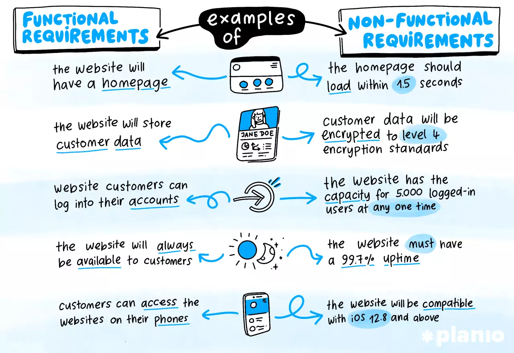
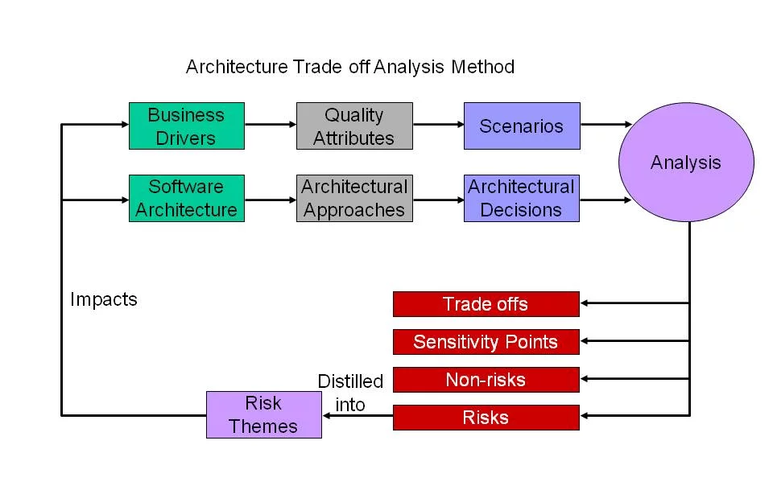
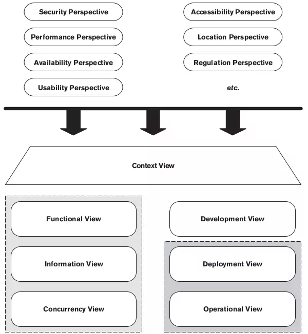
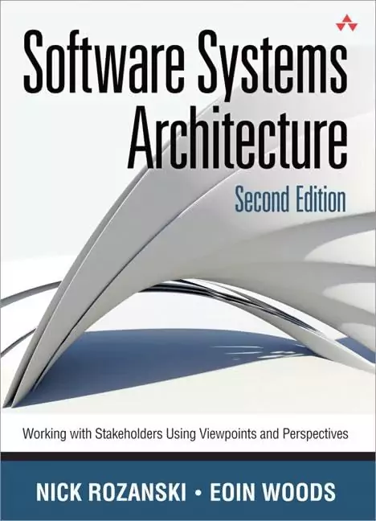
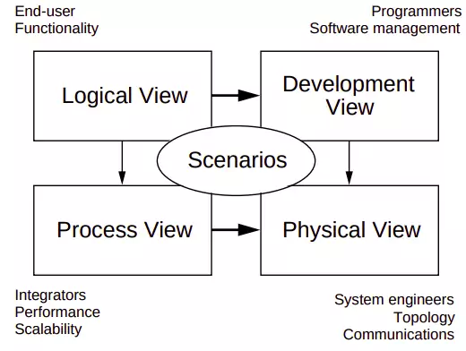
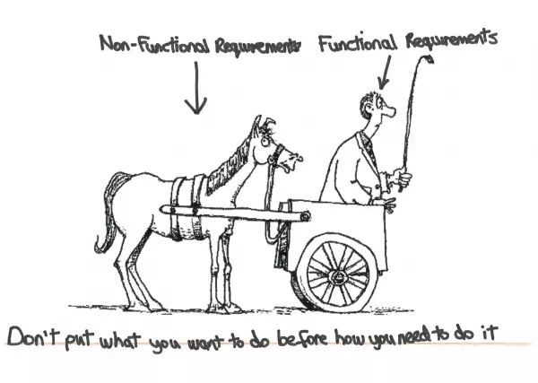

## Continuous Delivery: Managing Nonfunctional Requirements
#### Managing Nonfunctional Requirements

<small><strong>Time to Read:</strong> 5 Minutes</small>, <small><strong>Time to Present:</strong> 15 Minutes</small>
 
<small><strong>Created By:</strong> Alireza Roshanzamir</small>
 
<small><strong>Keywords:</strong> Continuous Delivery, Continuous Integration, DevOps, Build, Test, Release, Deployment, Automation, Version Control, Deployment Pipeline</small>
  
<small style="color: darkred"><small>Press **"F"** to go fullscreen; some slides may not display properly otherwise.</small></small>

---
## Introduction
Nonfunctional requirements (NFRs), like other requirements, add **real business value**. But they're different because they often **cross the boundaries** of other requirements, making them **hard** to handle in **analysis** and **implementation**.

&shy;<!-- .element class="fragment fade-in" -->**Performance** is about **processing time** for **one transaction**, measured **alone** or **under stress**. In practice, it's often a **catch-all** term.

&shy;<!-- .element class="fragment fade-in" -->**Throughput** is the **transactions per time** a system can handle, always limited by a **some bottleneck** in the system.

&shy;<!-- .element class="fragment fade-in" -->**Capacity** is the **max throughput** a system can sustain for a **given workload**, while ensuring **acceptable response times** per **request**.

&shy;<!-- .element class="fragment fade-in" -->NFRs like **availability**, **capacity**, **security**, and **maintainability** are as vital as functional ones and essential for the system to work.

&shy;<!-- .element class="fragment fade-in" -->It's essential to identify which NFRs are important **at the beginning of the project**.

---
## Managing Nonfunctional Requirements
NFRs are **complex** because they usually have a very **strong influence** on the **architecture of the system**.

<table>
    <tr>
        <td></td>
        <td>
            <small>NFRs applies to architectural views:</small>
             
            
        </td>
    </tr>
</table>

------
### Continued: Managing Nonfunctional Requirements
NFRs tend to **conflict**: High security may affect ease of use, extreme flexibility can impact performance, and so forth.

&shy;<!-- .element: class="fragment fade-in-with-next custom" -->You can find more information about the **architectural views and perspectives** in the following references:
<table>
  <tr>
    <td></td>
    <td>
      Software Systems Architecture: Working With Stakeholders Using Viewpoints and Perspectives
       
      <small>by Nick Rozanski, Eoin Woods</small>
    </td>
  </tr>
  <tr>
    <td></td>
    <td>
      Architectural Blueprints-The "4+1" View Model of Software Architecture
       
      <small>by Philippe Kruchten</small>
    </td>
  </tr>
</table>

    
Note

    Perspectives:
    <ul>
        <li>
            Security: The ability of the system to reliably control, monitor, and audit who can perform what actions on which resources and the ability to detect and recover from security breaches.
        </li>
        <li>
            Performance and Scalability: The ability of the system to predictably execute within its mandated performance profile and to handle increased processing volumes in the future if required.
        </li>
        <li>
            Availability and Resilience: The ability of the system to be fully or partly operational as and when required and to effectively handle failures that could affect system availability.
        </li>
        <li>
            Evolution: The ability of the system to be flexible in the face of the inevitable change that all systems experience after deployment, balanced against the costs ofproviding such flexibility.
        </li>
        <li>
            Accessibility: The ability of the system to be used by people with disabilities.
        </li>
        <li>
            Development, Resource: The ability of the system to be designed, built, deployed, and operated within known constraints related to people, budget, time, and materials.
        </li>
        <li>
            Internationalization: The ability of the system to be independent from any particular language, country, or cultural group.
        </li>
        <li>
            Location: The ability of the system to overcome problems brought about by the absolute location of its elements and the distances between them.
        </li>
        <li>
            Regulation: The ability of the system to conform to local and international laws, quasilegal regulations, company policies, and other rules and standards.
        </li>
        <li>
            Usability: The ease with which people who interact with the system can work effectively.
        </li>
    </ul>

------
### Analyzing Nonfunctional Requirements
We often add NFRs **as regular acceptance criteria** for functional stories when we **don't expect much extra effort** to meet them.

&shy;<!-- .element class="fragment fade-in" -->This can be **inefficient**. It makes sense to create **specific sets of stories or tasks** for NFRs as well, especially at the **project's start**.

An example of these two approaches:  <!-- .element class="fragment fade-in-with-next custom" -->
- All important interactions with the system should be audited.
- Capture requirements from the perspective of an auditor and describe the auditor's requirements for each report they want to see, so, auditing is no longer a crosscutting NFR.

&shy;<!-- .element class="fragment fade-in" -->**A blend of both approaches is needed.**

&shy;<!-- .element class="fragment fade-in" -->It's crucial to provide **sufficient detail** when analyzing NFRs. **"As fast as possible"** or **"All user interactions will take less than two seconds to respond"** aren't good NFRs.

&shy;<!-- .element class="fragment fade-in" -->Common **misuse** of performance requirements is as a **lazy way to describe the usability** of the system. Sometimes, people when they say **"Respond in two seconds"** mean **"I don't want to sit in front of a computer without any feedback for too long."**.

---
## Summary

Designing systems to meet their NFRs is complex. The crosscutting nature of many NFRs makes it **hard to manage their risks**, which can **lead to two paralyzing behaviors**:  <!-- .element: class="fragment fade-in-with-next custom" -->
- &shy;<!-- .element class="fragment highlight-current-blue" -->**Not paying enough** attention to them from the **start of the project**.
- &shy;<!-- .element class="fragment highlight-current-blue" -->At the other extreme, **defensive architecture** and **over-engineering**.
