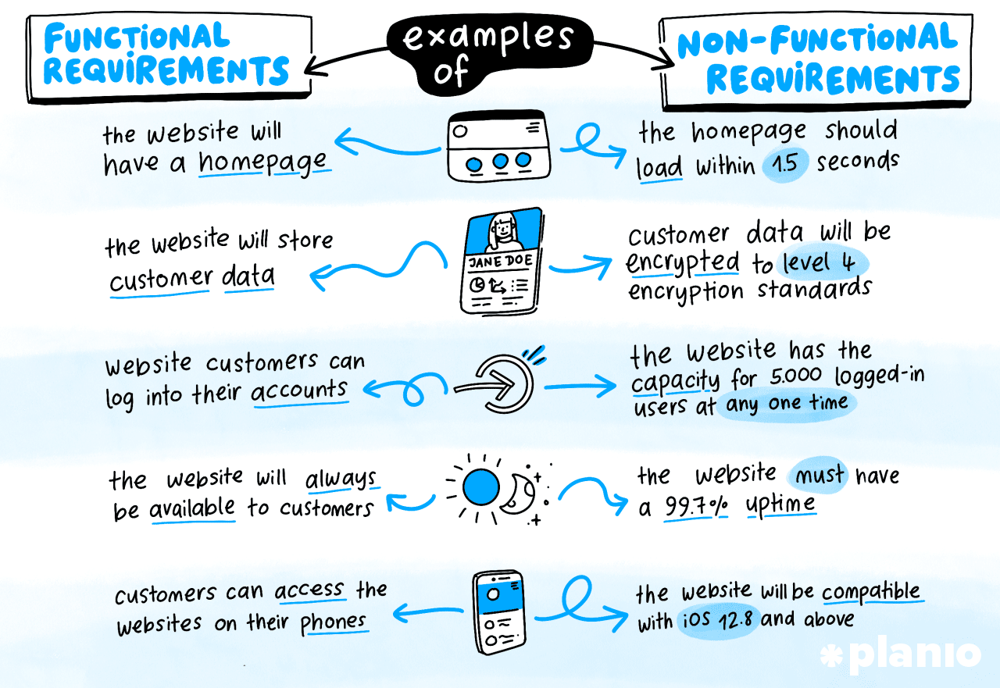

## Continuous Delivery: Testing Nonfunction Requirements
Introduction

<small><strong>Lecturer:</strong> Alireza Roshanzamir</small>

<small><strong>Keywords:</strong> Continuous Delivery, Continuous Integration, DevOps, Build, Test, Release, Deployment, Automation, Version Control, Deployment Pipeline</small>

<small><small> Tir 1402/August 2023</small></small>
