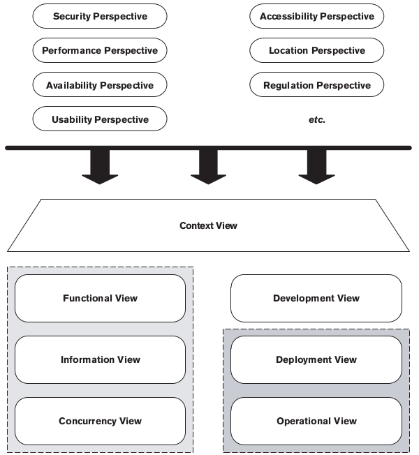
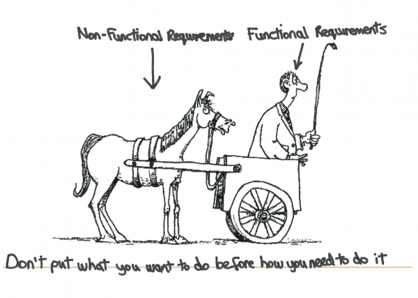

## Continuous Delivery: Testing Nonfunctional Requirements
#### Introduction, Managing Nonfunctional Requirements

<small><strong>Time to Read:</strong> 5 Minutes</small>, <small><strong>Time to Present:</strong> 15 Minutes</small>

<small><strong>Created By:</strong> Alireza Roshanzamir</small>

<small><strong>Keywords:</strong> Continuous Delivery, Continuous Integration, DevOps, Build, Test, Release, Deployment, Automation, Version Control, Deployment Pipeline</small>

<small><small> Tir 1402/August 2023</small></small>

---
## Introduction
In one sense, nonfunctional requirements (NFRs) are the same as any others: They can have **real business value**. In another sense, they are different, in that they tend to **cross the boundaries** of other requirements. The crosscutting nature of many NFRs makes them **hard to handle** both in terms of **analysis** and in terms of **implementation**.

To paraphrase, **performance** is a measure of the time taken to process a single transaction, and can be measured either in isolation or under load. In real life, performance is often used as a **catch-all** term.<!-- .element class="fragment fade-in-paragraph" -->

**Throughput** is the **number of transactions** a system can process in a **given timespan**. It is always **limited by some bottleneck** in the system.  <!-- .element class="fragment fade-in-paragraph" -->

The **maximum throughput** a system can sustain, for a **given workload**, while maintaining an **acceptable response time** for each **individual request**, is **capacity**.  <!-- .element class="fragment fade-in-paragraph" -->

Nonfunctional requirements such as **availability**, **capacity**, **security**, and **maintainability** are every bit as important and valuable as functional ones, and they are essential to the functioning of the system.  <!-- .element class="fragment fade-in-paragraph" -->

It's essential to identify which nonfunctional requirements are important at the beginning of the project.  <!-- .element class="fragment fade-in-paragraph" -->

---
## Managing Nonfunctional Requirements
NFRs are **complex** because they usually have a very **strong influence** on the **architecture of the system**.

<table>
    <tr>
        <td></td>
        <td>
            <small>Nonfunctional requirements applies to architectural views:</small>
             
            
        </td>
    </tr>
</table>

NFRs tend to **interact with one another** in an **unhelpful manner**: Very secure systems often compromise on ease of use; very flexible systems often compromise on performance, and so forth.  <!-- .element class="fragment fade-in-paragraph" -->

    
Note:

    Perspectives:
    <ul>
        <li>
            Security: The ability of the system to reliably control, monitor, and audit who can perform what actions on which resources and the ability to detect and recover from security breaches.
        </li>
        <li>
            Performance and Scalability: The ability of the system to predictably execute within its mandated performance profile and to handle increased processing volumes in the future if required.
        </li>
        <li>
            Availability and Resilience: The ability of the system to be fully or partly operational as and when required and to effectively handle failures that could affect system availability.
        </li>
        <li>
            Evolution: The ability of the system to be flexible in the face of the inevitable change that all systems experience after deployment, balanced against the costs ofproviding such flexibility.
        </li>
        <li>
            Accessibility: The ability of the system to be used by people with disabilities.
        </li>
        <li>
            Development, Resource: The ability of the system to be designed, built, deployed, and operated within known constraints related to people, budget, time, and materials.
        </li>
        <li>
            Internationalization: The ability of the system to be independent from any particular language, country, or cultural group.
        </li>
        <li>
            Location: The ability of the system to overcome problems brought about by the absolute location of its elements and the distances between them.
        </li>
        <li>
            Regulation: The ability of the system to conform to local and international laws, quasilegal regulations, company policies, and other rules and standards.
        </li>
        <li>
            Usability: The ease with which people who interact with the system can work effectively.
        </li>
    </ul>

------
### Analyzing Nonfunctional Requirements
We sometimes capture NFRs **as regular acceptance criteria for functional stories** where we don't anticipate that a significant additional effort will be required to meet them.

This can be **inefficient**. It often makes sense, instead, to create **specific sets of stories** or **tasks** for nonfunctional requirements as well, especially at the **beginning of a project**.  <!-- .element class="fragment fade-in-paragraph" -->

An example of these two common approaches:  <!-- .element class="fragment fade-in-with-next" -->
- All important interactions with the system should be audited.
- Capture requirements from the perspective of an auditor and describe the auditor's requirements for each report they want to see, so, auditing is no longer a crosscutting NFR.

**A blend of both approaches is needed.**  <!-- .element class="fragment fade-in-paragraph" -->

It is essential to supply a reasonable **level of detail** when analyzing NFRs. **"As fast as possible"** or even **"All user interactions will take less than two seconds to respond"** are not good NFRs.  <!-- .element class="fragment fade-in-paragraph" -->

Common **misuse** of performance requirements is as a **lazy way to describe the usability** of the system. Sometimes, people when they say **"Respond in two seconds"** mean **"I don't want to sit in front of a computer without any feedback for too long."**.  <!-- .element class="fragment fade-in-paragraph" -->

---
## Summary

Designing systems to meet their nonfunctional requirements is a complex topic. The crosscutting nature of many NFRs means that it is **hard to manage the risks** that they pose to any given project. This, in turn, can **lead to two paralyzing behaviors**:  <!-- .element: class="fragment fade-in-with-next" -->
- Not paying enough attention to them from the start of the project.  <!-- .element class="fragment highlight-current-blue" -->
- At the other extreme, defensive architecture and over-engineering.  <!-- .element class="fragment highlight-current-blue" -->
