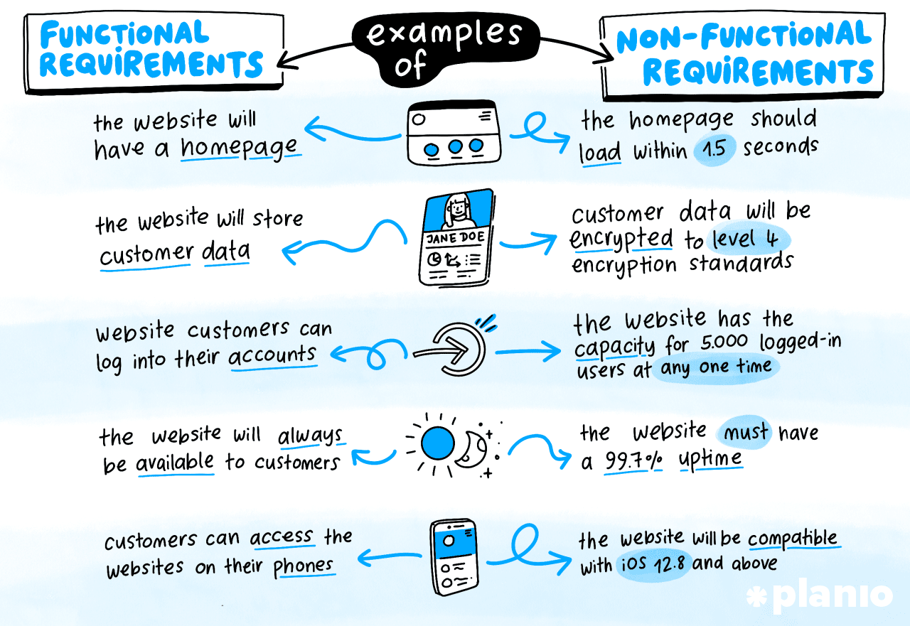

## Continuous Delivery: Testing Nonfunctional Requirements
#### Introduction, Managing Nonfunctional Requirements

<small><strong>Lecturer:</strong> Alireza Roshanzamir</small>

<small><strong>Keywords:</strong> Continuous Delivery, Continuous Integration, DevOps, Build, Test, Release, Deployment, Automation, Version Control, Deployment Pipeline</small>

<small><small> Tir 1402/August 2023</small></small>

---
## Introduction
In one sense, nonfunctional requirements (NFRs) are the same as any others: They can have real business value. In another sense, they are different, in that they tend to cross the boundaries of other requirements. The crosscutting nature of many NFRs makes them hard to handle both in terms of analysis and in terms of implementation.

To paraphrase, **performance** is a measure of the time taken to process a single transaction, and can be measured either in isolation or under load. 

**Throughput** is the number of transactions a system can
process in a given timespan. It is always limited by some bottleneck in the system.

The maximum throughput a system can sustain, for a given workload, while maintaining an acceptable response time for each individual request, is its **capacity**.

In real life, "performance" is often used as a catch-all term

Nonfunctional requirements such as **availability**, **capacity**, **security**, and **maintainability** are every bit as important and valuable as functional ones, and they are essential to the functioning of the system.

It's essential to identify which nonfunctional requirements are important at the beginning of the project.

---
## Managing Nonfunctional Requirements
NFRs are complex because they usually have a very strong influence on the architecture of the system.

NFRs tend to interact with one another in an unhelpful manner: Very secure systems often  compromise on ease of use; very flexible systems often compromise on performance, and so forth:

------
### Analyzing Nonfunctional Requirements
We sometimes capture NFRs as regular acceptance criteria for functional stories where we don't anticipate that a significant additional effort will be required to meet them.

This can be inefficient. It often makes sense, instead, to create specific sets of stories or tasks for nonfunctional requirements as well, especially at the beginning of a project.

An example of these two common approaches:
- All important interactions with the system should be audited.
- Capture requirements from the perspective of an auditor and describe the auditor's requirements for each report they want to see, so, auditing is no longer a crosscutting NFR.
A blend of both approaches is needed.

It is essential to supply a reasonable level of detail when analyzing NFRs. "As fast as possible" or even "All user interactions will take less than two seconds to respond" are not good NFRs.

Common misuse of performance requirements is as a lazy way to describe the usability of the system. Sometimes, people when they say "Respond in two seconds" mean "I don't want to sit in front of a computer without any feedback for too long.".

---
## Summary
Designing systems to meet their nonfunctional requirements is a complex topic. The crosscutting nature of many NFRs means that it is hard to manage the risks that they pose to any given project. This, in turn, can lead to two paralyzing behaviors:
- Not paying enough attention to them from the start of the project.
- At the other extreme, defensive architecture and over-engineering.
