## Continuous Delivery: Deploying and Releasing Applications
#### Release Strategy, Deploying and Promoting Your Application, Semantic Versioning, Rolling Back Deployments and Zero-Downtime Releases, Emergency Fixes, Continuous Deployment, Semantic Release, Tips and Tricks

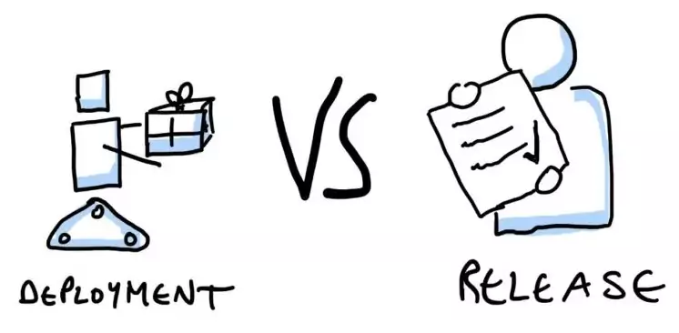

<small><strong>Time to Read:</strong> 12 Minutes</small>, <small><strong>Time to Present:</strong> 60 Minutes</small>
 
<small><strong>Created By:</strong> Alireza Roshanzamir</small>
 
<small><strong>Keywords:</strong> Continuous Delivery, Continuous Integration, DevOps, Build, Test, Release, Deployment, Automation, Version Control, Deployment Pipeline</small>
  
<small style="color: darkred"><small>Press **"F"** to go fullscreen; some slides may not display properly otherwise.</small></small>

---
## Introduction
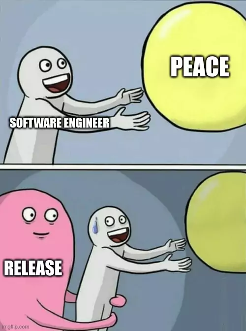

&shy;<!-- .element class="fragment fade-in" -->There are differences between **releasing software into production** and **deploying it to testing environments**, particularly in the level of adrenaline. However, these **differences should be encapsulated in configuration files**.

&shy;<!-- .element: class="fragment fade-in-with-next custom" -->The main difference between **[only] deploying** and **releasing (making software available to users)** is the ability to **roll back**. Two powerful techniques for **zero-downtime releases** and **rollbacks** on any production system are:
- Blue-green deployments
- Canary releasing

---
## Creating a Release Strategy
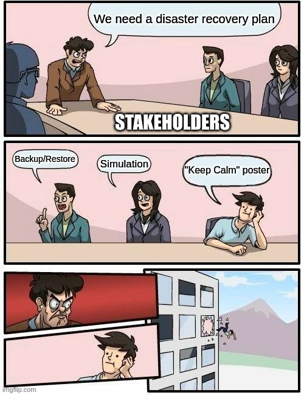

&shy;<!-- .element: class="fragment fade-in-with-next custom" -->The key aspect of forming a release strategy is for the **stakeholders to gather during project planning**. They should consider:
- &shy;<!-- .element class="fragment fade-in-then-semi-out" -->**Parties in charge** of deployments to **each environment**, as well as in charge of the release.
- &shy;<!-- .element class="fragment fade-in-then-semi-out" -->An asset and **configuration management** strategy.
- &shy;<!-- .element class="fragment fade-in-then-semi-out" -->A description of the **technology** used for deployment.
- &shy;<!-- .element class="fragment fade-in-then-semi-out" -->A plan for implementing the **deployment pipeline**.
- &shy;<!-- .element class="fragment fade-in-then-semi-out" -->An enumeration of the **environments** available for acceptance, capacity, integration, and user acceptance testing.
- &shy;<!-- .element class="fragment fade-in-then-semi-out" -->Requirements for **monitoring** the application.
- &shy;<!-- .element class="fragment fade-in-then-semi-out" -->A discussion of the method by which the **application**'s deploy-time and runtime **configuration** will be managed.
- &shy;<!-- .element class="fragment fade-in-then-semi-out" -->Description of the **integration with any external systems**.
- &shy;<!-- .element class="fragment fade-in-then-semi-out" -->Details of **logging**.
- &shy;<!-- .element class="fragment fade-in-then-semi-out" -->A **disaster recovery** plan.
- &shy;<!-- .element class="fragment fade-in-then-semi-out" -->The **service-level agreements** for the software.
- &shy;<!-- .element class="fragment fade-in-then-semi-out" -->Production **sizing** and **capacity** planning.
- &shy;<!-- .element class="fragment fade-in-then-semi-out" -->An **archiving** strategy.
- &shy;<!-- .element class="fragment fade-in-then-semi-out" -->How the **initial deployment** to production works.
- &shy;<!-- .element class="fragment fade-in-then-semi-out" -->How **fixing defects** and **applying patches** to the production environment will be handled.
- &shy;<!-- .element class="fragment fade-in-then-semi-out" -->How **upgrades to the production environment** will be handled.
- &shy;<!-- .element class="fragment fade-in-then-semi-out" -->How **application support** will be managed.

------
### The Release Plan

&shy;<!-- .element: class="fragment fade-in-with-next custom" -->The **first release** is typically the **riskiest** and requires **careful planning**. The outcomes of this planning may involve **automated scripts**, **documentation**, and **procedures** for **reliable** and **repeatable** production deployment. It includes:
- Deploy steps  <!-- .element class="fragment fade-in-then-semi-out" -->
- Deployment tests  <!-- .element class="fragment fade-in-then-semi-out" -->
- Back out steps  <!-- .element class="fragment fade-in-then-semi-out" -->
- Backup and restore application's state  <!-- .element class="fragment fade-in-then-semi-out" -->
- Upgrade application without destroying the state  <!-- .element class="fragment fade-in-then-semi-out" -->
- Restart and redeploy steps  <!-- .element class="fragment fade-in-then-semi-out" -->
- Logs location  <!-- .element class="fragment fade-in-then-semi-out" -->
- Monitoring  <!-- .element class="fragment fade-in-then-semi-out" -->
- Data migration  <!-- .element class="fragment fade-in-then-semi-out" -->

------
### Releasing Products
In the context of software projects targeting **commercial products**, you must address **additional considerations and deliverables**:
- Pricing model  <!-- .element class="fragment fade-in-then-semi-out" -->
- Licensing strategy  <!-- .element class="fragment fade-in-then-semi-out" -->
- Copyright issues around third-party technologies used  <!-- .element class="fragment fade-in-then-semi-out" -->
- Packaging  <!-- .element class="fragment fade-in-then-semi-out" -->
- Marketing materials-print, web-based, podcasts, blogs, press releases, conferences, etc.  <!-- .element class="fragment fade-in-then-semi-out" -->
- Product documentation  <!-- .element class="fragment fade-in-then-semi-out" -->
- Installers  <!-- .element class="fragment fade-in-then-semi-out" -->
- Preparing sales and support teams  <!-- .element class="fragment fade-in-then-semi-out" -->

---
## Deploying and Promoting Your Application
The key to deploying any application **reliably** is **consistent practice**: Use the **same deployment process** for **every environment**, including production.

------
### The First Deployment
One of the **main goals** of the **first iteration** of a project is to get the **early stages of our deployment pipeline** running and to be able to **deploy** and demonstrate something, no matter how small.

In this **rare case**, **prioritize technical value** over **business value**. Consider it as priming the pump of your development process.

At the end of this pump-priming iteration, you should have the following in place:  <!-- .element class="fragment fade-in-with-next custom" -->
- &shy;<!-- .element class="fragment highlight-current-blue" -->Your deployment pipeline's **commit stage**
- &shy;<!-- .element class="fragment highlight-current-blue" -->A **production-like environment** to deploy to
- &shy;<!-- .element class="fragment highlight-current-blue" -->An automated process that **takes the binaries** created by your commit stage and **deploys** them into the environment
- &shy;<!-- .element class="fragment highlight-current-blue" -->A simple **smoke test** that verifies that the **deployment** worked and the application is running

&shy;<!-- .element: class="fragment fade-in-with-next custom" -->In general, a **production-like environment** has the following characteristics:
- &shy;<!-- .element class="fragment highlight-current-blue" -->Has same **operating system** as the production system
- &shy;<!-- .element class="fragment highlight-current-blue" -->Same **software installed** as the production system. **None of the development tools** (compilers, IDEs, ...) should be installed.
- &shy;<!-- .element class="fragment highlight-current-blue" -->**Managed** the same way as the production environment
- &shy;<!-- .element class="fragment highlight-current-blue" -->In the case of client-installed software, should be representative of your **clients' hardware statistics**.

------
### Modeling Your Release Process and Promoting Builds
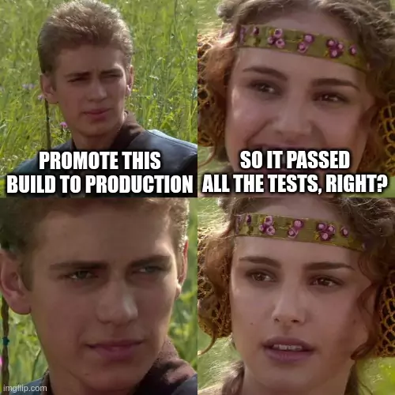

Promoting builds across environments involves these considerations:  <!-- .element class="fragment fade-in-with-next custom" -->
- Stages a build must pass for release (e.g. integration testing, QA acceptance testing, UAT, staging, and production)  <!-- .element class="fragment highlight-current-blue" -->
- What the required gates or approval are  <!-- .element class="fragment highlight-current-blue" -->
- For each gate, who has the authority to approve a build passing through that gate  <!-- .element class="fragment highlight-current-blue" -->

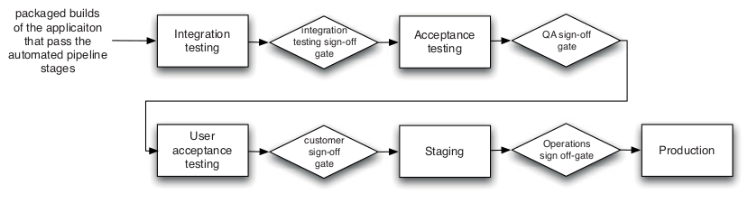

------
### Orchestration
**Environments** are often **shared** between **several applications**:
- &shy;<!-- .element class="fragment highlight-current-blue" -->New deployment of an application should not **disturb the operation of other applications**. Consider **virtualization** for this.
- &shy;<!-- .element class="fragment highlight-current-blue" -->If applications sharing the environment depend on each other, **system integration testing (SIT)** helps.

------
### Deployments to Staging Environments
Before releasing your application to users, perform some **final tests** in a **staging environment** that is **very similar to production**.

&shy;<!-- .element class="fragment fade-in" -->For **simple systems** **without external interactions**, you can use the **capacity testing** environment for **staging** as well.

---
## Semantic Versioning (SemVer)
Semantic Versioning (SemVer) is a **versioning scheme** that uses **meaningful version numbers**, primarily focused on indicating the **level of backwards-compatibility** in API versions:

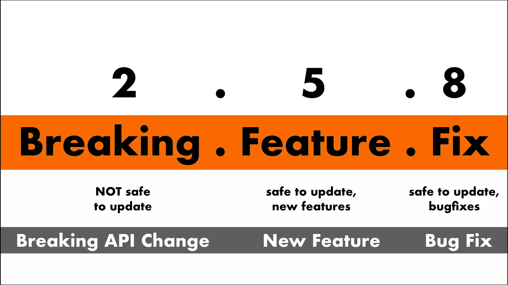

- If you are not sure about your public API, you can use **0.x.y** versions.
- Always read the version from **only a single place**. Preferrably **Git tags** or a **single file** in the repository.

Visit the https://semver.org for more information.

---
## Rolling Back Deployments and Zero-Downtime Releases

&shy;<!-- .element class="fragment fade-in" -->It is essential to be able to **roll back** a deployment in case it goes **wrong**.

&shy;<!-- .element class="fragment fade-in" -->Various rollback methods exist. More advanced techniques like **blue-green deployments** and **canary releasing** can be used for **zero-downtime releases and rollbacks**.

&shy;<!-- .element: class="fragment fade-in-with-next custom" -->There are two important **constraints**:
- **Data**: If your release process makes changes to your data, it can be **hard** to roll back.
- **Other systems**: Releases involving **multiple systems** (aka **orchestrated releases**) make the rollback process more **complex**.

&shy;<!-- .element: class="fragment fade-in-with-next custom" -->Rolling back **principles**:
- Ensure that the state of your production system, including **databases** and **state held on the filesystem**, is **backed up**.
- **Practice your rollback** plan, including **restoring** from the backup or migrating the database back before every release.

------
### Rolling Back by Redeploying the Previous Good Version
The simplest way to get **back to a good state** is to **redeploy** the previous good version from scratch.

------
### Zero-Downtime Releases (Hot Deployment)
The key to zero-downtime releases is **decoupling the various parts** of the release process, enabling **independent** updates. You can update **shared resources** like **databases**, **services**, and **static resources** **before upgrading** your applications.

&shy;<!-- .element: class="fragment fade-in-with-next custom" -->You can use **versioning** for **static resources** and **web-based services**:
- For example, AWS has a **date-based versioning system**, with the latest version of the EC2 API available at _http://ec2.amazonaws.com/doc/2009-11-30/AmazonEC2.wsdl_.
- Store **static resources** (**images**, **Javascript**, **HTML**, **CSS**) in a new directory, e.g., version 2.6.5 images under _/static/2.6.5/images_.

We talk about database later.  <!-- .element class="fragment fade-in" -->

------
### Blue-Green Deployments
Have two **identical versions** of your production environment, which we'll call **blue** and **green**:

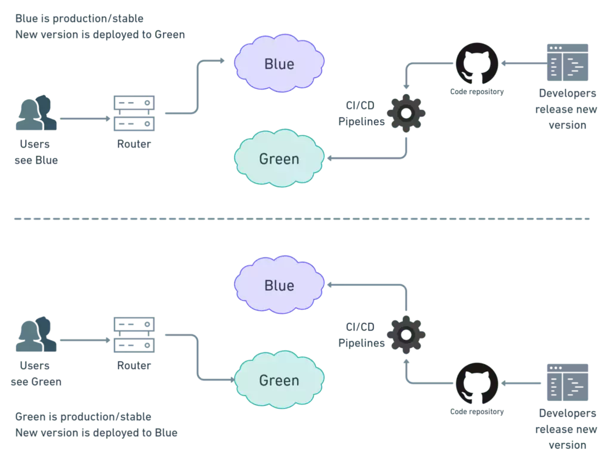

**Direct transition** from the green database to the blue database is typically **not feasible** due to the **time** required for **data migration** when there are **schema changes**.

------
### Continued: Blue-Green Deployments
Steps:
- &shy;<!-- .element class="fragment highlight-current-blue" -->Put the application into **read-only** mode shortly before switchover
- &shy;<!-- .element class="fragment highlight-current-blue" -->Take a **copy of the green database** and **restore** it into the **blue database**
- &shy;<!-- .element class="fragment highlight-current-blue" -->Perform the **migration**
- &shy;<!-- .element class="fragment highlight-current-blue" -->**Switch over** to the **blue system**
- &shy;<!-- .element class="fragment highlight-current-blue" -->Put the application **back into read-write** mode

&shy;<!-- .element class="fragment fade-in" -->You can also migrate database **independent of the the upgrade process** which we describe later.

&shy;<!-- .element class="fragment fade-in" -->If you can only have **one production environment**, you can **still** use blue-green deployments by running **two isolated copies** of your application **side by side** in the **same environment**.

&shy;<!-- .element class="fragment fade-in" -->You can use your **staging** and **production** environments **as** your **blue** and **green** environments, known as **shadow domain releasing** or **live-live releasing**.

------
### Canary Releasing

&shy;<!-- .element class="fragment fade-in" -->In an **extremely large production environment**, creating a **meaningful capacity testing** environment is **impossible**.

&shy;<!-- .element: class="fragment fade-in-with-next custom" -->Canary releasing is **deploying a new application version** to a **subset of production servers** to obtain **fast feedback**:

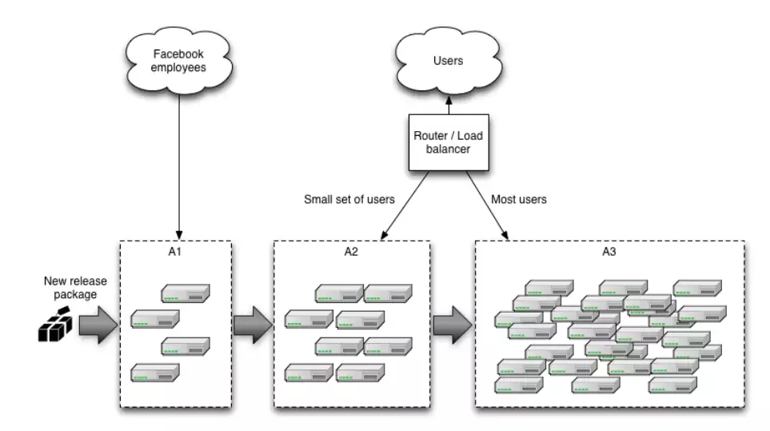

    
Note

    The term "canary release" is inspired by the historical use of canaries in coal mines. Miners used to take caged canaries into mines with them. These birds are very sensitive to dangerous gases like carbon monoxide. If the canary showed signs of distress or died, it served as an early warning signal to the miners that there were toxic gases present, prompting them to evacuate the mine before they too were affected.

------
### Continued: Canary Releasing
Steps:
- Initially deploy the new version of the application to a set of servers where **no users are routed to**.
- Do **smoke tests** and, if desired, **capacity tests**, on the new version.
- Start to **route selected users** (**power users**) to the new version of the application.

Benefits:  <!-- .element class="fragment fade-in-with-next custom" -->
- Easy rollback by resetting routing
- A/B testing
- Gradually ramping up the load to check the capacity requirements

&shy;<!-- .element class="fragment fade-in" -->Finally, it is important to keep as **few versions** of your application in production as possible-try to limit it to **two**.

---
## Release Patterns Summary
<table>
  <tr>
    <td>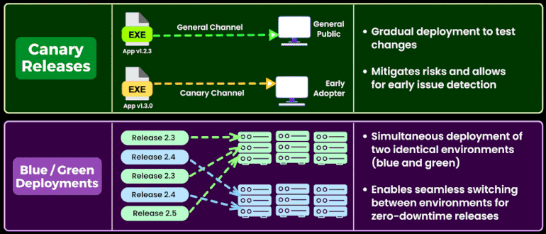</td>
    <td>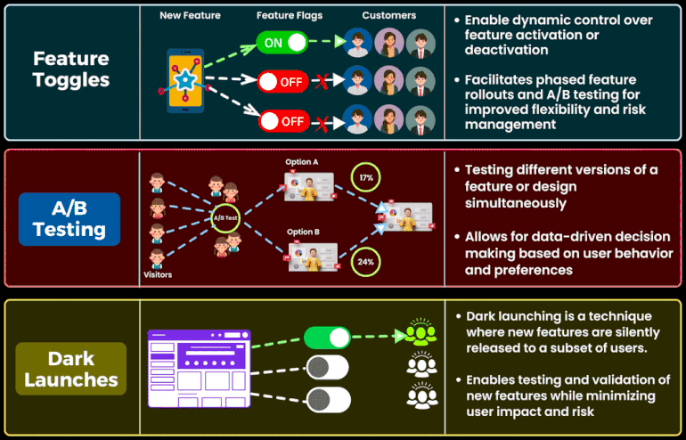</td>
  </tr>
</table>

The images are downloaded from <a href="https://www.linkedin.com/posts/brijpandeyji_the-5-deployment-patterns-to-know-in-2023-activity-7096090445641826305-KqDp?utm_source=share&utm_medium=member_desktop" target="_blank">this</a> Linkedin post.

---
## Emergency Fixes

&shy;<!-- .element: class="fragment fade-in-with-next custom" -->There comes a moment when a **critical defect** is discovered and has to be **fixed as soon as possible**:
- &shy;<!-- .element class="fragment fade-in-then-semi-out" -->**Never bypass your process**, such as logging directly into production environments and making uncontrolled changes.
  - The change is **not tested properly**, which may **exacerbate** the problem.
  - The environment ends up in an **unknown state** that makes it **impossible to reproduce**.
- &shy;<!-- .element class="fragment fade-in-then-semi-out" -->Sometimes it's **better to roll back** to the previous version than to deploy a fix.
- &shy;<!-- .element class="fragment fade-in-then-semi-out" -->**Never do them late** at night and **pair with somebody else**.
- &shy;<!-- .element class="fragment fade-in-then-semi-out" -->Make sure you have **tested your emergency fix process**.
- &shy;<!-- .element class="fragment fade-in-then-semi-out" -->Only **under extreme circumstances** circumvent the usual process for making changes to your application.
- &shy;<!-- .element class="fragment fade-in-then-semi-out" -->Make sure you have **tested making an emergency fix** using your **staging** environment.

---
## Continuous Deployment
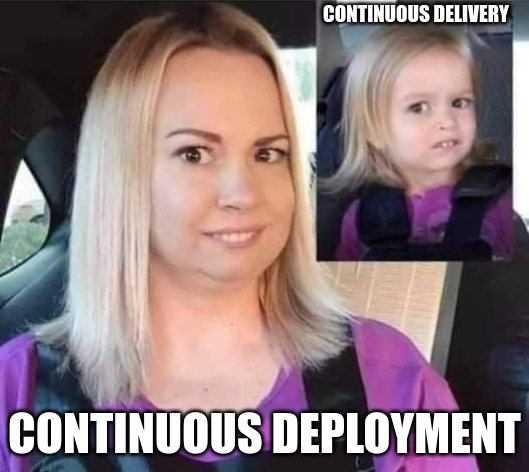

&shy;<!-- .element class="fragment fade-in" -->The **extreme approach** is to automatically **deploy every change** that **passes your automated tests** to production. This technique is called continuous deployment **[to production]**.

&shy;<!-- .element class="fragment fade-in" -->It can be combined with **canary releasing** to **reduce risk**.

&shy;<!-- .element class="fragment fade-in" -->The **typical concern** with continuous deployment is that it can be **risky**. It requires a robust **suite of automated tests**. If you have valid reasons for not releasing every change (though they are **fewer than you think**), you should **act as if you were going to do so**.

---
## Semantic Release
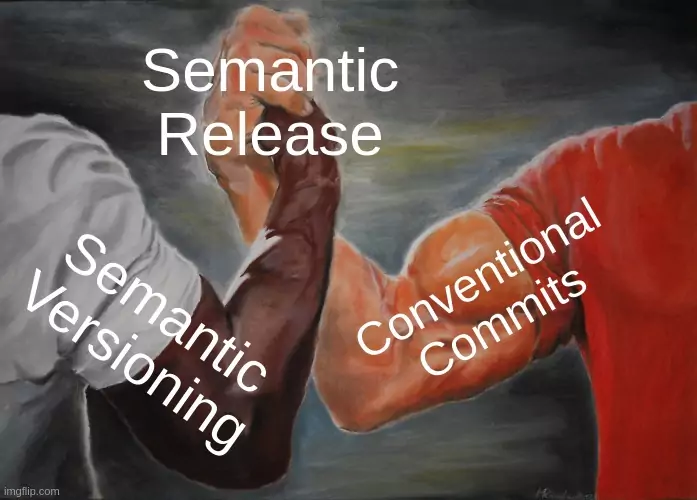

&shy;<!-- .element: class="fragment fade-in-with-next custom" -->[Semantic Release](https://semantic-release.gitbook.io) **automates the whole package release workflow** including: determining the **next version number**, generating the **release notes**, and **publishing the package**:
- Fully automated release  <!-- .element class="fragment highlight-current-blue" -->
- Enforce Semantic Versioning specification  <!-- .element class="fragment highlight-current-blue" -->
- New features and fixes are immediately available to users  <!-- .element class="fragment highlight-current-blue" -->
- Use formalized commit message convention to document changes in the codebase  <!-- .element class="fragment highlight-current-blue" -->
- Avoid potential errors associated with manual releases  <!-- .element class="fragment highlight-current-blue" -->

------
### Semantic Release: Steps
- &shy;<!-- .element class="fragment highlight-current-blue" -->**Verify Conditions**: Verify all the conditions to proceed with the release.
- &shy;<!-- .element class="fragment highlight-current-blue" -->**Get last release**: Obtain the commit corresponding to the last release by analyzing Git tags.
- &shy;<!-- .element class="fragment highlight-current-blue" -->**Analyze commits**: Determine the type of release based on the commits added since the last release.
- &shy;<!-- .element class="fragment highlight-current-blue" -->**Generate notes**: Generate release notes for the commits added since the last release.
- &shy;<!-- .element class="fragment highlight-current-blue" -->**Create Git tag**: Create a Git tag corresponding to the new release version.
- &shy;<!-- .element class="fragment highlight-current-blue" -->**Publish**: Publish the release.
- &shy;<!-- .element class="fragment highlight-current-blue" -->**Notify**: Notify of new releases or errors.

---
## Tips and Tricks
- The People Who Do the Deployment Should Be Involved in Creating the Deployment Process  <!-- .element: class="fragment fade-in-then-semi-out" -->
- Log Deployment Activities  <!-- .element: class="fragment fade-in-then-semi-out" -->
- <!-- .element: class="fragment fade-in-then-semi-out" --> Don't Delete the Old Files, Move Them
  - You can use the symbolic link technique
- Deployment Is the Whole Team's Responsibility  <!-- .element: class="fragment fade-in-then-semi-out" -->
- Server Applications Should Not Have GUIs  <!-- .element: class="fragment fade-in-then-semi-out" -->
- <!-- .element: class="fragment fade-in-then-semi-out" --> Have a Warm-Up Period for a New Deployment
  - Until the caches are full, the application will often have a poor response time and may even fail.
- <!-- .element: class="fragment fade-in-then-semi-out" --> Fail Fast
  - The system should perform the checks as it initializes, and if it encounters an error, it should fail to start.
- <!-- .element: class="fragment fade-in-then-semi-out" --> Don't Make Changes Directly on the Production Environment
  - Production environments should be completely locked down; only your deployment pipeline can make changes to it.

---
## Summary
In the **later pipeline stages**, the focus is on **deploying into testing/production environments**. Your implementation should **allow deploying any version** that **passed automated tests** into any environment with a **push of a button** and the **right credentials**.

&shy;<!-- .element class="fragment fade-in" -->Your team should have visibility into **what**'s deployed **where** and the **included changes**.

&shy;<!-- .element class="fragment fade-in" -->Still, for any size and complex system, the **first production release** remains a **crucial event**. It's vital to have well-thought-out **plans** to make it as **straightforward as possible**.

&shy;<!-- .element class="fragment fade-in" -->The most crucial part of release planning is **assembling representatives** from every part of your organization involved in delivery: **build**, **infrastructure**, and **operations teams**, **development teams**, **testers**, **DBAs**, and **support personnel**.
