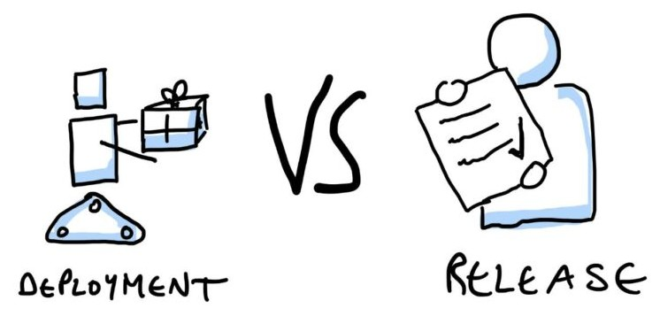
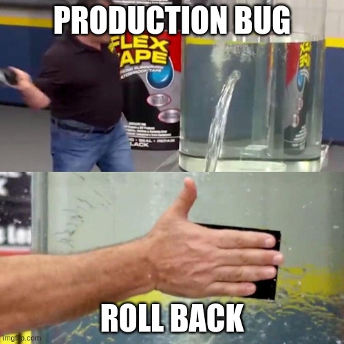
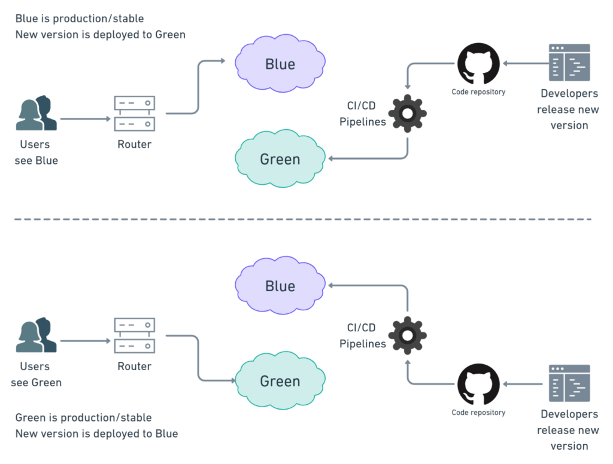
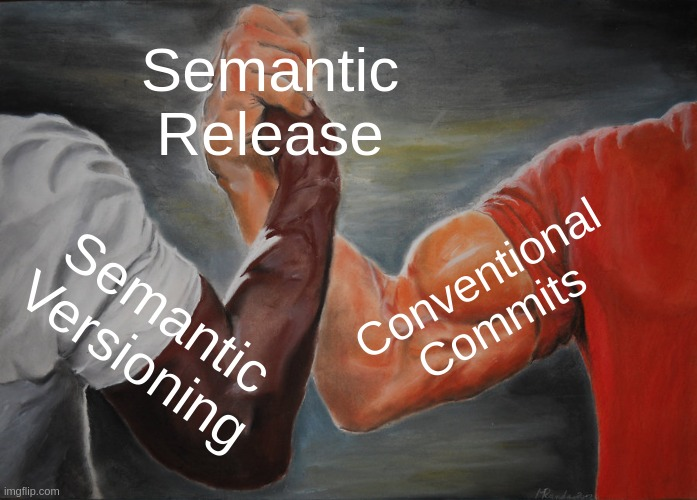

## Continuous Delivery: Deploying and Releasing Applications
#### Introduction, Release Strategy, Deploying and Promoting Your Application, Semantic Versioning, Rolling Back Deployments and Zero-Downtime Releases, Emergency Fixes, Continuous Deployment, Semantic Release, Tips and Tricks

<small><strong>Time to Read:</strong> 10 Minutes</small>, <small><strong>Time to Present:</strong> 50 Minutes</small>

<small><strong>Created By:</strong> Alireza Roshanzamir</small>

<small><strong>Keywords:</strong> Continuous Delivery, Continuous Integration, DevOps, Build, Test, Release, Deployment, Automation, Version Control, Deployment Pipeline</small>

<small><small> Tir 1402/August 2023</small></small>

---
## Introduction

There are differences between **releasing software into production** and **deploying it to testing environments**-not least, in the level of adrenaline in the blood of the person performing the release. However, in technical terms, these **differences should be encapsulated in a set of configuration files**.  <!-- .element: class="fragment fade-in-paragraph" -->

The **main difference between deploying and releasing** is the ability to **roll back**. Two extremely powerful techniques that can be used to perform **zero-downtime releases** and **rollbacks** on even the largest of production systems are:  <!-- .element: class="fragment fade-in-parent-with-next" -->
- Blue-green deployments
- Canary releasing

---
## Creating a Release Strategy
The most important part of creating a release strategy is for the application's **stakeholders to meet up during the project planning** process. They should consider:
- Parties in charge of deployments to each environment, as well as in charge of the release.  <!-- .element class="fragment fade-in-then-semi-out" -->
- An asset and configuration management strategy.  <!-- .element class="fragment fade-in-then-semi-out" -->
- A description of the technology used for deployment.  <!-- .element class="fragment fade-in-then-semi-out" -->
- A plan for implementing the deployment pipeline.  <!-- .element class="fragment fade-in-then-semi-out" -->
- An enumeration of the environments available for acceptance, capacity, integration, and user acceptance testing.  <!-- .element class="fragment fade-in-then-semi-out" -->
- Requirements for monitoring the application.  <!-- .element class="fragment fade-in-then-semi-out" -->
- A discussion of the method by which the application's deploy-time and runtime configuration will be managed.  <!-- .element class="fragment fade-in-then-semi-out" -->
- Description of the integration with any external systems.  <!-- .element class="fragment fade-in-then-semi-out" -->
- Details of logging.  <!-- .element class="fragment fade-in-then-semi-out" -->
- A disaster recovery plan.  <!-- .element class="fragment fade-in-then-semi-out" -->
- The service-level agreements for the software.  <!-- .element class="fragment fade-in-then-semi-out" -->
- Production sizing and capacity planning.  <!-- .element class="fragment fade-in-then-semi-out" -->
- An archiving strategy.  <!-- .element class="fragment fade-in-then-semi-out" -->
- How the initial deployment to production works.  <!-- .element class="fragment fade-in-then-semi-out" -->
- How fixing defects and applying patches to the production environment will be handled.  <!-- .element class="fragment fade-in-then-semi-out" -->
- How upgrades to the production environment will be handled.  <!-- .element class="fragment fade-in-then-semi-out" -->
- How application support will be managed.  <!-- .element class="fragment fade-in-then-semi-out" -->

------
### The Release Plan
The **first release** is usually the one that carries the **highest risk**; it needs **careful planning**. The results of this planning may be **automated scripts**, **documentation**, or **other procedures** needed to reliably and repeatedly deploy the application into the production environment. It usually includes:
- Deploy steps  <!-- .element class="fragment fade-in-then-semi-out" -->
- Deployment tests  <!-- .element class="fragment fade-in-then-semi-out" -->
- Back out steps  <!-- .element class="fragment fade-in-then-semi-out" -->
- Backup and restore application's state  <!-- .element class="fragment fade-in-then-semi-out" -->
- Upgrade application without destroying the state  <!-- .element class="fragment fade-in-then-semi-out" -->
- Restart and redeploy steps  <!-- .element class="fragment fade-in-then-semi-out" -->
- Logs location  <!-- .element class="fragment fade-in-then-semi-out" -->
- Monitoring  <!-- .element class="fragment fade-in-then-semi-out" -->
- Data migration  <!-- .element class="fragment fade-in-then-semi-out" -->

------
### Releasing Products
One class of software projects where you must consider other issues is software destined to be released as a **commercial product**. Here's a list of **additional deliverables** that should be considered if the output of your project is a software product:
- Pricing model  <!-- .element class="fragment fade-in-then-semi-out" -->
- Licensing strategy  <!-- .element class="fragment fade-in-then-semi-out" -->
- Copyright issues around third-party technologies used  <!-- .element class="fragment fade-in-then-semi-out" -->
- Packaging  <!-- .element class="fragment fade-in-then-semi-out" -->
- Marketing materials-print, web-based, podcasts, blogs, press releases, conferences, etc.  <!-- .element class="fragment fade-in-then-semi-out" -->
- Product documentation  <!-- .element class="fragment fade-in-then-semi-out" -->
- Installers  <!-- .element class="fragment fade-in-then-semi-out" -->
- Preparing sales and support teams  <!-- .element class="fragment fade-in-then-semi-out" -->

---
## Deploying and Promoting Your Application
The key to deploying any application in a reliable, consistent manner is constant practice.

------
### The First Deployment
One of the **principal goals** of the **first iteration** of a project is to get the **early stages of our deployment pipeline** running and to be able to **deploy** and demonstrate something, **no matter how small**, at the end.

This is one of the very few situations where we recommend **prioritizing technical value** over **business value**. You can think of this strategy as priming the pump of your development process.

At the end of this pump-priming iteration, you should have the following in place:  <!-- .element class="fragment fade-in-with-next" -->
- Your deployment pipeline's commit stage  <!-- .element class="fragment highlight-current-blue" -->
- A production-like environment to deploy to  <!-- .element class="fragment highlight-current-blue" -->
- An automated process that takes the binaries created by your commit stage and deploys them into the environment  <!-- .element class="fragment highlight-current-blue" -->
- A simple smoke test that verifies that the deployment worked and the application is running  <!-- .element class="fragment highlight-current-blue" -->

In general, a production-like environment has the following characteristics:  <!-- .element class="fragment fade-in-with-next" -->
- Has same operating system as the production system  <!-- .element class="fragment highlight-current-blue" -->
- Same software installed as the production system will-and in particular, none of the development toolchain (such as compilers or IDEs) should be installed on it.  <!-- .element class="fragment highlight-current-blue" -->
- Managed the same way as the production environment  <!-- .element class="fragment highlight-current-blue" -->
- In the case of client-installed software, should be representative of your clients' hardware statistics.  <!-- .element class="fragment highlight-current-blue" -->

------
### Modeling Your Release Process and Promoting Builds

Promoting builds between environments requires to consider the following concerns:  <!-- .element class="fragment fade-in-with-next" -->
- What stages a build has to go through in order to be released (for example, integration testing, QA acceptance testing, user acceptance testing, staging, production)  <!-- .element class="fragment highlight-current-blue" -->
- What the required gates or approval are  <!-- .element class="fragment highlight-current-blue" -->
- For each gate, who has the authority to approve a build passing through that gate  <!-- .element class="fragment highlight-current-blue" -->

------
### Orchestration
**Environments** are often **shared** between **several applications**:
- New deployment of an application should not disturb the operation of any other applications (you might consider using some form of virtualization technology)  <!-- .element class="fragment highlight-current-blue" -->
- If applications sharing the environment depend on each other, system integration testing (SIT) helps.  <!-- .element class="fragment highlight-current-blue" -->

------
### Deployments to Staging Environments
Before you let your application loose on unsuspecting users, you should perform some **final tests** in a **staging environment** that is **very similar to production**.

For **simple systems** **without interaction** with **external systems**, you can employ the **capacity testing** environment for both capacity testing and staging.  <!-- .element class="fragment fade-in-paragraph" -->

---
## Semantic Versioning (SemVer)
Semantic Versioning is a **versioning scheme** for using **meaningful version numbers**. Specifically, the meaning revolves around how API versions compare in terms of **backwards-compatibility**:

- If you are not sure about your public API, you can use **0.x.y** versions.
- Always read the version from **only a single place**. Preferrably **Git tags** or a **single file** in the repository.

Visit the https://semver.org for more information.

---
## Rolling Back Deployments and Zero-Downtime Releases

It is essential to be able to **roll back** a deployment in case it goes **wrong**.  <!-- .element class="fragment fade-in-paragraph" -->

There are several methods of performing a rollback. The more advanced techniques such as **blue-green deployments** and **canary releasing** can also be used to perform **zero-downtime releases** and **rollbacks**.  <!-- .element class="fragment fade-in-paragraph" -->

There are two important **constraints**:  <!-- .element class="fragment fade-in-parent-with-next" -->
- **Data**: If your release process makes changes to your data, it can be **hard** to roll back.
- **Other systems**: releases involving more than one system (known as orchestrated releases), the rollback process becomes more **complex**.

Rolling back **principles**:  <!-- .element class="fragment fade-in-parent-with-next" -->
- Ensure that the state of your production system, including **databases** and **state held on the filesystem**, is **backed up**.
- **Practice your rollback** plan, including **restoring** from the backup or migrating the database back before every release.

------
### Rolling Back by Redeploying the Previous Good Version
The simplest way to get **back to a good state** is to **redeploy** the previous good version from scratch.

------
### Zero-Downtime Releases (Hot Deployment)
The key to zero-downtime releases is **decoupling the various parts** of the release process so they can happen independently as far as possible. It should be possible to put in place **new versions** of shared resources your applications depend on, such as **databases**, **services**, and **static resources**, **before you upgrade** your applications.

You can use **versioning** for **static resources** and **web-based services**:  <!-- .element class="fragment fade-in-parent-with-next" -->
- For example, AWS has a date-based versioning system, with the latest version of the EC2 API available at _http://ec2.amazonaws.com/doc/2009-11-30/AmazonEC2.wsdl_.
- Put the static resources such as images, Javascript, HTML, and CSS to a new directory-for example, you could put the images for version 2.6.5 of your application under _/static/2.6.5/images_.

We talk about database later.  <!-- .element class="fragment fade-in" -->

------
### Blue-Green Deployments
Have two **identical versions** of your production environment, which we'll call **blue** and **green**:

It is usually **not possible** to switch over directly from the **green database** to the **blue database** because it **takes time** to **migrate the data** from one release to the next **if there are schema changes**.  <!-- .element class="fragment fade-in" -->

------
### Continued: Blue-Green Deployments
Steps:
- Put the application into read-only mode shortly before switchover  <!-- .element class="fragment highlight-current-blue" -->
- Take a copy of the green database and restore it into the blue database  <!-- .element class="fragment highlight-current-blue" -->
- Perform the migration  <!-- .element class="fragment highlight-current-blue" -->
- Switch over to the blue system  <!-- .element class="fragment highlight-current-blue" -->
- Put the application back into read-write mode  <!-- .element class="fragment highlight-current-blue" -->

You can also migrate database independent of the the upgrade process which we describe later.  <!-- .element class="fragment fade-in" -->

If you can only **afford a single production** environment, you can **still** use blue-green deployments. Simply **have two copies** of your application running **side by side** on the **same environment** (but **isolated** to each other).  <!-- .element class="fragment fade-in-paragraph" -->

You can use your **staging** and **production** environments **as** your **blue** and **green** environments (called **shadow domain releasing**, **shadow environment releasing**, or **live-live releasing**).  <!-- .element class="fragment fade-in-paragraph" -->

------
### Canary Releasing
If you have an **extremely large production environment**, it's **impossible** to create a **meaningful capacity testing** environment.  <!-- .element class="fragment fade-in-paragraph" -->

Canary releasing is defined as **rolling out a new version** of an application to a **subset of the production servers** to get fast feedback:  <!-- .element class="fragment fade-in-parent-with-next" -->

------
### Continued: Canary Releasing
Steps:
- Initially deploy the new version of the application to a set of servers where **no users are routed to**.
- Do **smoke tests** and, if desired, **capacity tests**, on the new version.
- Start to **route selected users** (**power users**) to the new version of the application.

Benefits:  <!-- .element class="fragment fade-in-with-next" -->
- Easy rollback by resetting routing
- A/B testing
- Gradually ramping up the load to check the capacity requirements

Finally, it is important to keep as **few versions** of your application in production as possible-try to limit it to **two**.  <!-- .element class="fragment fade-in-paragraph" -->

---
## Emergency Fixes
There comes a moment when a **critical defect** is discovered and has to be **fixed as soon as possible**:  <!-- .element class="fragment fade-in-parent-with-next" -->
- **Do not**, under any circumstances, **subvert your process** (such as logging directly into production environments and making uncontrolled changes).
  - The change is **not tested properly**, which may **exacerbate** the problem.
  - The environment ends up in an **unknown state** that makes it **impossible to reproduce**.

Some other considerations:  <!-- .element class="fragment fade-in-with-next" -->
- Sometimes it's **better to roll back** to the previous version than to deploy a fix.
- **Never do them late** at night and **pair with somebody else**.
- Make sure you have **tested your emergency fix process**.
- Only **under extreme circumstances** circumvent the usual process for making changes to your application.
- Make sure you have **tested making an emergency fix** using your **staging** environment.

---
## Continuous Deployment
The **logical extreme** is to **deploy every change** that **passes your automated tests** to production (by making the final step automatic). This technique is known as continuous deployment (**to production**).

It can be combined with **canary releasing** to **reduce risk**.  <!-- .element class="fragment fade-in-paragraph" -->

The **intuitive objection** to continuous deployment is that it is too **risky**. You can't do it without a comprehensive, reliable set of automated tests. If you have good reasons for not releasing every change you make-and there are less such reasons than you might think-you should behave as if you were going to do so.  <!-- .element class="fragment fade-in-paragraph" -->

---
## Semantic Release

[Semantic Release](https://semantic-release.gitbook.io) **automates the whole package release workflow** including: determining the **next version number**, generating the **release notes**, and **publishing the package**:  <!-- .element class="fragment fade-in-parent-with-next" -->
- Fully automated release  <!-- .element class="fragment highlight-current-blue" -->
- Enforce Semantic Versioning specification  <!-- .element class="fragment highlight-current-blue" -->
- New features and fixes are immediately available to users  <!-- .element class="fragment highlight-current-blue" -->
- Use formalized commit message convention to document changes in the codebase  <!-- .element class="fragment highlight-current-blue" -->
- Avoid potential errors associated with manual releases  <!-- .element class="fragment highlight-current-blue" -->

------
### Semantic Release: Steps
- **Verify Conditions**: Verify all the conditions to proceed with the release.
- **Get last release**: Obtain the commit corresponding to the last release by analyzing Git tags.
- **Analyze commits**: Determine the type of release based on the commits added since the last release.
- **Generate notes**: Generate release notes for the commits added since the last release.
- **Create Git tag**: Create a Git tag corresponding to the new release version.
- **Publish**: Publish the release.
- **Notify**: Notify of new releases or errors.

---
## Tips and Tricks
- The People Who Do the Deployment Should Be Involved in Creating the Deployment Process  <!-- .element: class="fragment insides-fade-in-then-out" -->
- Log Deployment Activities  <!-- .element: class="fragment insides-fade-in-then-out" -->
- Don't Delete the Old Files, Move Them  <!-- .element: class="fragment insides-fade-in-then-out" -->
  - You can use the symbolic link technique  <!-- .element: class="fragment fade-in-then-out" -->
- Deployment Is the Whole Team's Responsibility  <!-- .element: class="fragment insides-fade-in-then-out" -->
- Server Applications Should Not Have GUIs  <!-- .element: class="fragment insides-fade-in-then-out" -->
- Have a Warm-Up Period for a New Deployment  <!-- .element: class="fragment insides-fade-in-then-out" -->
  - Until the caches are full, the application will often have a poor response time and may even fail.  <!-- .element: class="fragment fade-in-then-out" -->
- Fail Fast  <!-- .element: class="fragment insides-fade-in-then-out" -->
  - The system should perform the checks as it initializes, and if it encounters an error, it should fail to start.  <!-- .element: class="fragment fade-in-then-out" -->
- Don't Make Changes Directly on the Production Environment  <!-- .element: class="fragment insides-fade-in-then-out" -->
  - Production environments should be completely locked down, so that only your deployment pipeline can make changes to it.  <!-- .element: class="fragment fade-in-then-out" -->

---
## Summary
The **latter stages** of the deployment pipeline are all concerned with **deploying into testing and production environments**. Your implementation should make it **possible to deploy any version** of your application that has made it **past the automated tests** into any of your environments at the **push of a button**, given the correct credentials. It should be possible for everyone on your team to see exactly **what** is deployed **where**, and **what changes** are included in that version.

Nevertheless, for a system of any size and complexity, the **first release into production** will always be a **momentous occasion**. It is vital to have thought about the process and planned for it sufficiently to make it as straightforward as possible.  <!-- .element: class="fragment fade-in-paragraph" -->

The most crucial part of release planning is **assembling representatives** from every part of your organization involved in delivery: **build**, **infrastructure**, and **operations teams**, **development teams**, **testers**, **DBAs**, and **support personnel**.  <!-- .element: class="fragment fade-in-paragraph" -->
