## Continuous Delivery: Managing Infrastructure and Environments
#### Understanding Operation Team, Modeling and Managing Infrastructure, Managing Server Provisioning and Configuration, Managing the Configuration of Middleware, Managing Infrastructure Services, Virtualization, Cloud Computing, Monitoring Infrastructure and Applications

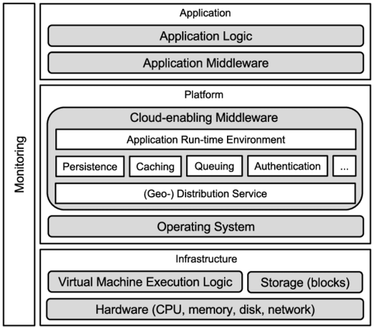

<small><strong>Time to Read:</strong> 14 Minutes</small>, <small><strong>Time to Present:</strong> 50 Minutes</small>
 
<small><strong>Created By:</strong> Alireza Roshanzamir</small>
 
<small><strong>Keywords:</strong> Continuous Delivery, Continuous Integration, DevOps, Build, Test, Release, Deployment, Automation, Version Control, Deployment Pipeline</small>
 
<small style="color: darkred"><small>Press **"F"** to go fullscreen; some slides may not display properly otherwise.</small></small>

---
## Introduction
An **environment** is all of the **resources** that your application **needs** to work and their **configuration**:
- The hardware configuration includes server details like **CPU count**, **memory**, **spindles**, **NICs**, and **networking**.  <!-- .element: class="fragment fade-in-parent custom" -->
- The configuration of the **OS** and **middleware** like **messaging systems**, **application/web servers** and **database servers** for running applications.  <!-- .element: class="fragment fade-in-parent custom" -->

"Infrastructure" encompasses all your **organization's environments and supporting services**, including **DNS**, **firewalls**, **routers**, **version control**, **storage**, **monitoring**, **mail servers**, etc.  <!-- .element: class="fragment fade-in-paragraph custom" -->

------
### Principles
Principles for **preparing** and **managing** environments **before** and **after deployment**:
- The desired state of your infrastructure should be specified through **version-controlled** configuration.  <!-- .element: class="fragment fade-in-parent custom" -->
- Infrastructure should be **autonomic**, meaning it **corrects itself** to the desired state automatically.  <!-- .element: class="fragment fade-in-parent custom" -->
- You should always **know the actual state** of your **infrastructure** through instrumentation and **monitoring**.  <!-- .element: class="fragment fade-in-parent custom" -->

Infrastructure should be **autonomic**, **but** it's crucial to keep it **easy to recreate**. So, in case of **hardware failure**, you can **quickly reestablish** a new known-good configuration. Therefore, **automate infrastructure provisioning** as well.  <!-- .element: class="fragment fade-in-paragraph custom" -->

**Automated provisioning** and **autonomic maintenance** ensure **predictable** infrastructure **rebuilding** in case of **failure**.  <!-- .element: class="fragment fade-in-paragraph custom" -->

------
### Subjects
In this session, we will talk about the following:
- The **operating system** and its **configuration**, for testing/production environments.  <!-- .element class="fragment highlight-current-blue-parent custom" -->
- The **middleware software stack** and its **configuration**, including **application servers**, **messaging systems**, and **databases**.  <!-- .element class="fragment highlight-current-blue-parent custom" -->
- Infrastructural software, such as **version control repositories**, **directory services**, and **monitoring systems**.  <!-- .element class="fragment highlight-current-blue-parent custom" -->
- External integration points, such as **external systems** and **services**.  <!-- .element class="fragment highlight-current-blue-parent custom" -->
- **Network infrastructure**, including **routers**, **firewalls**, **switches**, **DNS**, **DHCP**, and so on.  <!-- .element class="fragment highlight-current-blue-parent custom" -->
- The **relationship** between the application **development team** and the **infrastructure management team**.  <!-- .element class="fragment highlight-current-blue-parent custom" -->

---
## Understanding Operation Team
Most projects **fail** because of **people problems**, **not technical issues**.  <!-- .element: class="fragment fade-in-paragraph custom" -->

In most **medium to large** companies, **development** and **infrastructure management (operations)** are **separate**, often causing **tension** between these two stakeholder groups (aka **"wall of confusion"**).  <!-- .element: class="fragment fade-in-paragraph custom" -->

In **small** organizations, the **development team** typically **handles operations too**.  <!-- .element: class="fragment fade-in-paragraph custom" -->

**Operations teams** use **QoS metrics** like **mean time between failures** and **mean time to repair** to assess **performance**. They must meet **service-level agreements (SLAs)**. Any **change** poses a **risk** to meeting these goals and complying with regulations.

------
### Operation Team Concerns
Here are some of the most important **high-level** concerns of operations teams:
- Documentation and Auditing  <!-- .element: class="fragment insides-fade-in-then-out" -->
  - Any change to any environment they control is **documented** and **audited**.  <!-- .element class="fragment highlight-current-blue-parent custom" -->
  - So that, if things **go wrong**, they can find the **relevant changes** that **caused the problem**.  <!-- .element class="fragment highlight-current-blue-parent custom" -->
  - **Development team** should **learn** the **operations team's systems and processes** (e.g. **Change Management Processes**) and follow them.  <!-- .element class="fragment highlight-current-blue-parent custom" -->
- Alerts for Abnormal Events  <!-- .element: class="fragment insides-fade-in-then-out" -->
  - They should be **notified of abnormal conditions** in systems they manage to **minimize downtime**.  <!-- .element class="fragment highlight-current-blue-parent custom" -->
  - Using tools such as **OpenNMS**, **Nagios**, or **HP's Operations Manager**.  <!-- .element class="fragment highlight-current-blue-parent custom" -->
  - The **development team** must **consider** the operations team's **monitoring needs** within the release plan.  <!-- .element class="fragment highlight-current-blue-parent custom" -->
- IT Service Continuity Planning  <!-- .element: class="fragment insides-fade-in-then-out" -->
  - Each service managed by the operations team has a **RPO** (recovery point objective; acceptable data loss time before a disaster) and an **RTO** (recovery time objective; maximum allowed time for service restoration).  <!-- .element class="fragment highlight-current-blue-parent custom" -->
  - The **RPO** governs the **data backup** and **restore strategy**, ensuring **frequent backups to meet the RPO**.  <!-- .element class="fragment highlight-current-blue-parent custom" -->
  - To meet **RTO**, creating a **backup of the production setup** in **another location** for **main system failure** may be needed.  <!-- .element class="fragment highlight-current-blue-parent custom" -->
  - Another consideration is **archiving**, as production applications can generate a **significant amount of data rapidly**.  <!-- .element class="fragment highlight-current-blue-parent custom" -->
- Use the Technology the Operations Team Is Familiar With  <!-- .element: class="fragment insides-fade-in-then-out" -->
  - So they can **own** and **maintain** their environments.  <!-- .element class="fragment highlight-current-blue-parent custom" -->
  - Operations teams are typically **proficient in Bash or PowerShell**, but might **not have expertise in Java or C#**.  <!-- .element class="fragment highlight-current-blue-parent custom" -->
  - Operations teams may **veto deployment systems** they **don't have the skills to maintain**.  <!-- .element class="fragment highlight-current-blue-parent custom" -->
  - Development and operations teams should **plan application deployment** **together** at **project start**.  <!-- .element class="fragment highlight-current-blue-parent custom" -->

  
Note

  IT Service Continuity Planning is the process of ensuring that IT services can continue or be quickly restored after a disruption or disaster.

---
## Modeling and Managing Infrastructure
Types of servers, divided up by **level of abstraction**:  <!-- .element class="fragment fade-in-parent-with-next custom" -->

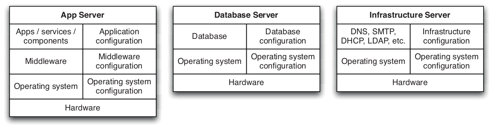

You must address each of the following **questions**:  <!-- .element class="fragment fade-in-parent-with-next custom" -->
- How will we **provision** our infrastructure?
- How will we **deploy** and **configure** the **various bits** of software that form part of our infrastructure?
- How do we **manage** our infrastructure **once it is provisioned** and **configured**?

You should **keep everything** you **need** to **create** and **maintain** your infrastructure under **version control**:  <!-- .element class="fragment fade-in-parent-with-next custom" -->
- **OS install definitions** (such as those used by Debian Preseed, RedHat Kickstart, and Solaris Jumpstart).
- **Configuration** for data center **automation tools** like Puppet or CfEngine.
- **General infrastructure configuration**, such as DNS, DHCP and SMTP, and firewall configuration files.
- **Any scripts** you use for managing your infrastructure.

------
### Controlling Access to Your Infrastructure
If you have a system that's **not well controlled**, you'll need to figure out how to **regain control**. This involves three steps:
- Controlling access to **prevent** anyone from **making a change without approval**.
- Defining an **automated process** for **making changes** to your infrastructure.
- **Monitoring** your infrastructure to detect any issues as soon as they occur.

Don't log in and **explore** to fix issues in that environment (called **problem-solving heuristic**):  <!-- .element class="fragment fade-in-parent-with-next custom" -->
- This can **disrupt services** as people might randomly reboot or apply updates.
- If something goes wrong later, there's **no record of actions taken**, making it **impossible** to determine the **cause of any issues**.

**Change requests** for **testing/production** environments should follow a **structured process**. This need **not be bureaucratic**: As noted in "The Visible Ops Handbook," **high-performing organizations** achieved **high MTBF** and **MTTR** with a **99%+ change success rate**, even with **1000-1500 weekly changes**.  <!-- .element class="fragment fade-in-paragraph custom" -->

  
Note

  A problem-solving heuristic is an informal, intuitive, speculative procedure that leads to a solution in some cases but not in others

------
### Making Changes to Infrastructure
Characteristics of an **effective change management process**:
- All changes, like firewall rules updates or service deployments, must follow the **same change management process**.  <!-- .element class="fragment highlight-current-blue-parent custom" -->
- This process should be managed with a **single ticketing system** for all, **tracking metrics** like **average cycle time per change**.  <!-- .element class="fragment highlight-current-blue-parent custom" -->
- The exact change that is made should be **logged** so it can be easily audited later.  <!-- .element class="fragment highlight-current-blue-parent custom" -->
  - Prefer automation over documentation.
  - **Documentation** **doesn't** always ensure a **change was done right**. **Differences** between **claimed** and **actual** actions can cause **days of troubleshooting**.
- A **history of changes** in **every environment**, **including deployments**, should be visible.  <!-- .element class="fragment highlight-current-blue-parent custom" -->
- The changes should be checked with **automated tests** to **avoid disrupting other applications**.  <!-- .element class="fragment highlight-current-blue-parent custom" -->
- Changes should **go through version control** and be applied via the **automated process** for infrastructural updates.  <!-- .element class="fragment highlight-current-blue-parent custom" -->
- There should be a **test to verify** that the change has worked.  <!-- .element class="fragment highlight-current-blue-parent custom" -->

---
## Managing Server Provisioning and Configuration
Provisioning and configuring servers is often **neglected** in small to medium-sized operations because it **seems complicated**.

An example of automated provisioning and configuration of servers:  <!-- .element class="fragment fade-in-with-next custom" -->

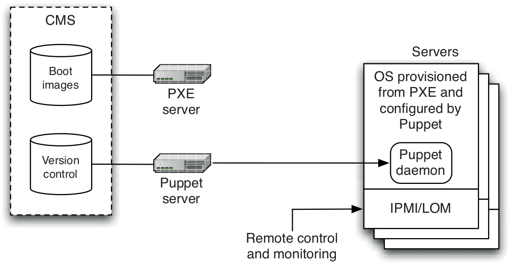

------
### Provisioning Servers
There are several ways to create **operating system baselines**:
- <!-- .element class="fragment highlight-current-blue" --> A fully manual process: Not repeatable, reliable, and scalable.
- <!-- .element class="fragment highlight-current-blue" --> Automated remote installation
  - PXE (Preboot eXecution Environment)
    - PXE is a standard for booting boxes over Ethernet.
    - When you choose to boot via the network in your BIOS, what happens under the hood is PXE.
  - WDS (Windows Deployment Services)
    - It uses PXE under the hood.

  <table>
    <tr>
      <td></td>
      <td>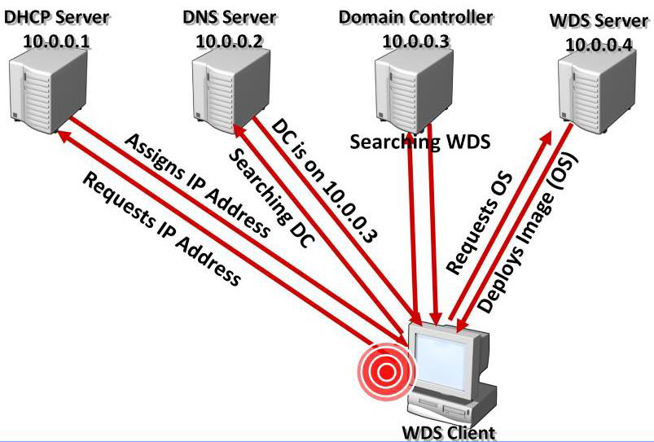</td>
    </tr>
  </table>
- <!-- .element class="fragment highlight-current-blue" --> Virtualization: We will discuss this later.

------
### Ongoing Management of Servers
After installing the OS, it's essential to **prevent uncontrolled configuration changes**. This means:
- Nobody is able to log into the boxes except the operations team
- Any changes are performed using an automated system

The goal of **configuration management process** is to ensure that **configuration management** is **declarative** and **idempotent**.  <!-- .element class="fragment fade-in-paragraph custom" -->

On **Windows**, Microsoft provides **System Center Configuration Manager (SCCM)** to **manage your Microsoft infrastructure**. SCCM uses **ActiveDirectory (AD)** and **Windows Software Update Services** for **OS configuration**, **updates**, and **settings** across your organization. It also **deploys applications** and manages **virtual servers** like physical ones. **Access control** is via **Group Policy**, integrated with **AD**, and standard in Microsoft servers since Windows 2000.  <!-- .element class="fragment fade-in-paragraph custom" -->

In the **UNIX** realm, **LDAP** and **standard UNIX access controls** **regulate user permissions**. **Various tools are available** for **managing OS configuration**, **software**, and **updates**. Prominent options include **CfEngine**, **Puppet**, and **Chef**.  <!-- .element class="fragment fade-in-paragraph custom" -->

These tools work similarly. You define **the desired state** for your systems, and the **tool ensures** your **infrastructure matches that state**. They enforce **idempotence**, aiming for **autonomic (aka self-healing)** infrastructure.  <!-- .element class="fragment fade-in-paragraph custom" -->

------
### Ongoing Management of Servers: SCCM and CfEngine
<table>
  <tr>
    <td>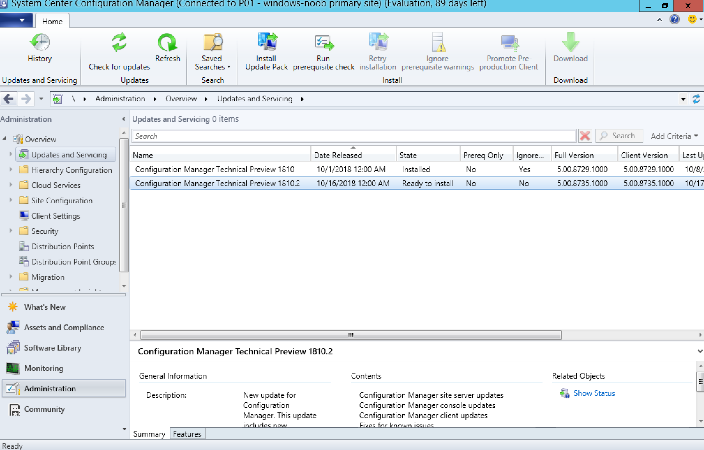</td>
    <td>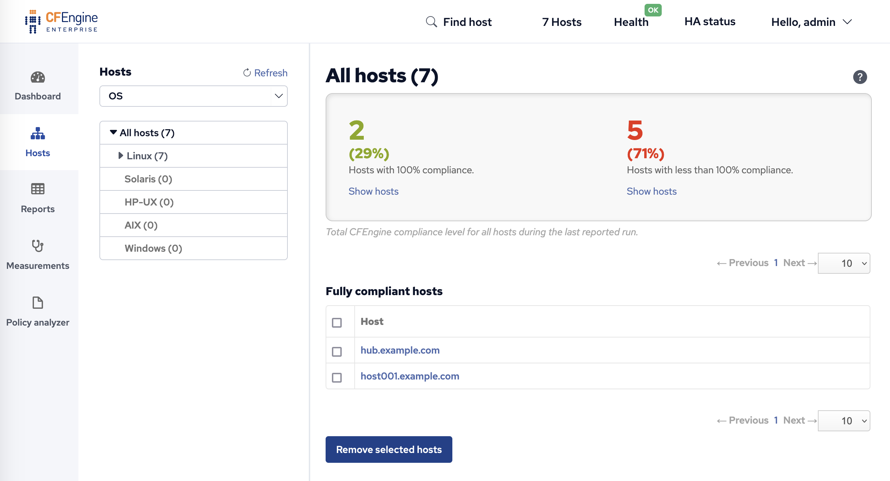</td>
  </tr>
</table>

------
### Ongoing Management of Servers: Puppet
Puppet is one of the **most popular open source systems** currently available (along with CfEngine and Chef).

Puppet uses a **external DSL** to handle configuration in a **declarative** way.

The **central master server** runs the **Puppet master daemon (puppetmasterd)** which **has and controls a list of machines**.

Each machine has the **Puppet agent (puppetd)**, **communicates** with the server to **sync** servers with the **latest configuration**.

When a **configuration changes**, the **master updates the clients**, **installs/configures new software**, and **restarts servers as needed**.

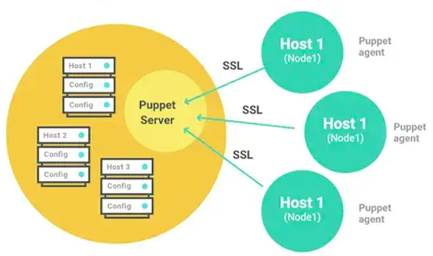

**Declarative configuration** defines the **desired server state**, **applicable from any starting points**, including fresh VM copies or newly provisioned machines.

------
### Continued: Ongoing Management of Servers: Puppet
Example:

<pre class="puppet"><code style="font-size: 16px; line-height: normal;" data-trim data-noescape># /etc/puppet/modules/postfix/manifests/init.pp
class postfix {
  package { postfix: ensure => installed }
  service { postfix: ensure => running, enable => true }
  file { "/etc/postfix/main.cf":
    content => template("postfix/main.cf.erb"),
    mode => 755,
  }
}
</code></pre>

<pre class="puppet"><code style="font-size: 16px; line-height: normal;" data-trim data-noescape># /etc/puppet/manifests/site.pp
node default {
  package { tzdata: ensure => installed }
  file { "/etc/localtime":
    ensure => "file:///usr/share/zoneinfo/US/Pacific"
  }
}

node 'smtp.thoughtworks.com' {
  include postfix
}
</code></pre>

<pre class="puppet"><code style="font-size: 16px; line-height: normal; height: 200px" data-trim data-noescape># /etc/puppet/modules/apt/manifests/init.pp
class apt {
  if ($operatingsystem == "Debian") {
    file { "/etc/apt/sources.list.d/custom-repository":
      source => "puppet:///apt/custom-repository",
      ensure => present,
    }
    cron { apt-update:
      command => "/usr/bin/apt-get update",
      user => root,
      hour => 0,
      minute => 0,
    }
  }
}

define apt::key(keyid) {
  file { "/root/$name-gpgkey":
    source => "puppet:///apt/$name-gpgkey"
  }

  exec { "Import $keyid to apt keystore":
    path => "/bin:/usr/bin",
    environment => "HOME=/root",
    command => "apt-key add /root/$name-gpgkey",
    user => "root",
    group => "root",
    unless => "apt-key list | grep $keyid",
  }
}
</code></pre>

---
## Managing the Configuration of Middleware
Middleware-whether web servers, messaging systems, or commercial off-the-shelf software (COTS)-can be decomposed into three parts: binaries, configuration, and data.

Managing Configuration:
- Database schemas, web server configuration files, application server configuration information, message queue configuration, and every other aspect of the system that needs to be changed for your system to work should be under version control.
- If your middleware isn't part of the standard operating system install, the next best thing is to package it up using your operating system's package management system and put it on your organization's internal package server. Then you can use your chosen server management system to manage this middleware using the same model.

Research the Product:
- When looking for a low-cost, low-energy solution, the obvious starting point is to be absolutely certain that the product in question doesn't have a poorly advertised automated configuration option.
- Make sure that there isn't a better option before you move on to the other strategies.
- All we are asking for is the ability to version-control the work that we invest in their product. Our favorite response from one large vendor was, "Oh yes, we are going to build our own version control into the system in the release after next." Even if they had done so, and even if having the feature a year or two later could make any difference to the project we were working on at the time, integrating to a crude, proprietary version control system wouldn't have helped us manage a consistent configuration set.

Examine How Your Middleware Handles State:
- If you are certain that your middleware does not support any form of automated configuration, the next step is to see if you can cheat by version-controlling its storage behind its back.
- If the third-party system stores its state in binary files, consider revision-controlling these binaries:
  - The simplest option is to store the relevant binaries in version control along with a script that installs them to the relevant environment.
  - Really go ahead and write your own installer (or a package such as an RPM if you're using a RedHat-derived Linux distribution, for example).

Look for a Configuration API:
- One strategy is to define your own simple configuration file for the system that you are working with. Create custom build tasks to interpret those scripts and to use the API to configure the system.
- This strategy of "invent your own" configuration files puts configuration management back into your hands-allowing you to version-control the configuration files and automate their use.

Use a Better Technology
- At some point we would strongly recommend adopting an alternate technology which is more tractable.
- Many organizations are wary about changing the software platform that they
use because they have already spent a great deal of money on it. However, this argument, known as the **sunk cost fallacy**, does not take into account the lost opportunity cost of moving to a superior technology.

---
## Managing Infrastructure Services
It is extremely common for problems with infrastructure services-such as routers, DNS, and directory services-to break software in production environments that worked perfectly all through the deployment pipeline.

Michael Nygard wrote an article for InfoQ in which he tells the story of a system which died mysteriously at the same time every day [bhc2vR]. The problem turned out to be a firewall which dropped inactive TCP connections after one hour. As the system was idle at night, when activity started in the morning, the TCP packets from the pooled database connections would be dropped silently by the firewall.

Problems like this will happen to you, and when they do, they will be maddeningly difficult to diagnose.

Advices:
- Every part of your networking infrastructure's configuration, from DNS zone files to DHCP to firewall and router configurations to SMTP and other services your applications rely on, should be version-controlled.
- Install a good network monitoring system such as Nagios, OpenNMS, HP Operations Manager, or one of their brethren. Make sure that you know when network connectivity is broken, and monitor every port on every route that your application uses.
- Your applications should log at WARNING level every time a network connection times out or is found to be unexpectedly closed. You should log at INFO or, if the logs are too verbose, DEBUG level every time you close a connection. You should log at DEBUG level every connection that you open, including as much information as possible on the endpoint of the connection.
- Make sure that your smoke tests check all of the connections at deployment time to flush out any routing or connectivity problems.
- Make your integration testing environment's network topology as similar as possible to production, including using the same pieces of hardware with the same physical connections between them.
- When something does go wrong, have forensic tools available. Wireshark and Tcpdump are both fantastically useful tools that make it easy to see packets flying past, and filter them so you can isolate exactly the packets you're looking for. The UNIX tool Lsof and its Windows cousins Handle and TCPView (part of the Sysinternals suite) also come in very handy to see what files and sockets are open on your machine.

Multihomed servers:
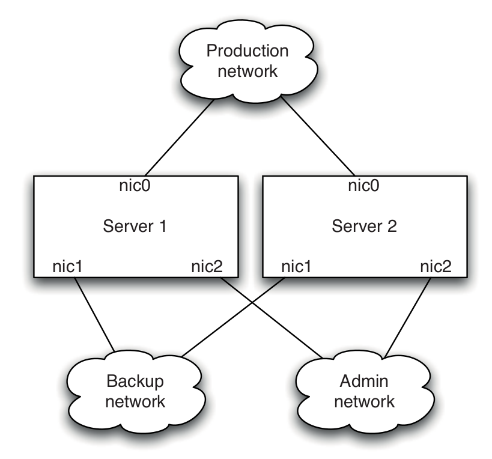

---
## Virtualization
In general, virtualization is a technique that adds a layer of abstraction on top of one or more computer resources.

Platform virtualization means simulating an entire computer system so as to run multiple instances of operating systems simultaneously on a single physical machine. In this configuration, there is a virtual machine monitor (VMM), or hypervisor, which has full control of the physical machine's hardware resources. Guest operating systems run on virtual machines, which are managed by the VMM. Environment
virtualization involves simulating one or more virtual machines as well as the network connections between them.

Virtualization was originally developed by IBM in the 1960s as an alternative to creating a multitasking time-sharing operating system.

In particular, virtualization provides the following benefits:
- Fast response to changing requirements: Need a new testing environment? A new virtual machine can be provisioned in seconds at no cost, versus days or weeks to obtain a new physical environment.
- Consolidation: When organizations are relatively immature, each team will often have its own CI servers and testing environments sitting on physical boxes under their desks. Virtualization makes it easy to consolidate CI and testing infrastructure so it can be offered as a service to delivery teams. It is also more efficient in terms of hardware usage.
- Standardizing hardware: Functional differences between components and subsystems of your application no longer force you to maintain distinct hardware configurations, each with its own specification. Virtualization allows you to standardize on a single hardware configuration for physical environments but run a variety of heterogeneous environments and platforms virtually.
- Easier-to-maintain baselines: You can maintain a library of baseline images-operating system plus application stacks-or even environments, and push them out to a cluster at the click of a button.

Virtualization also provides the capability to significantly speed up long-running tests. Instead of running them on a single box, you can run them in parallel on a build grid of virtual machines (e.g. from 13 hours to 45 minutes).

------
### Managing Virtual Environments
One of the most important characteristics of VMMs is that a virtual machine image is a single file. Such a file is called a disk image. The useful thing about disk images is that you can copy them and version them (probably not in version control, unless your VCS can handle lots of very large binary files).

You can then use them as templates, or baselines (known-good versions of your environments, on which the rest of your configuration and deployment can be made):

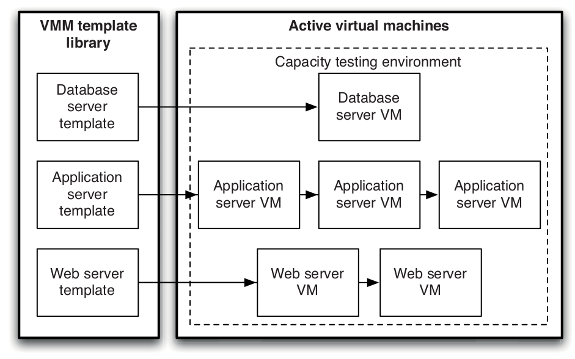

You can then run your automated process to configure the operating system and install and configure any software required by your applications. Once again, at this point, save a copy of each type of box in your environment as a baseline:

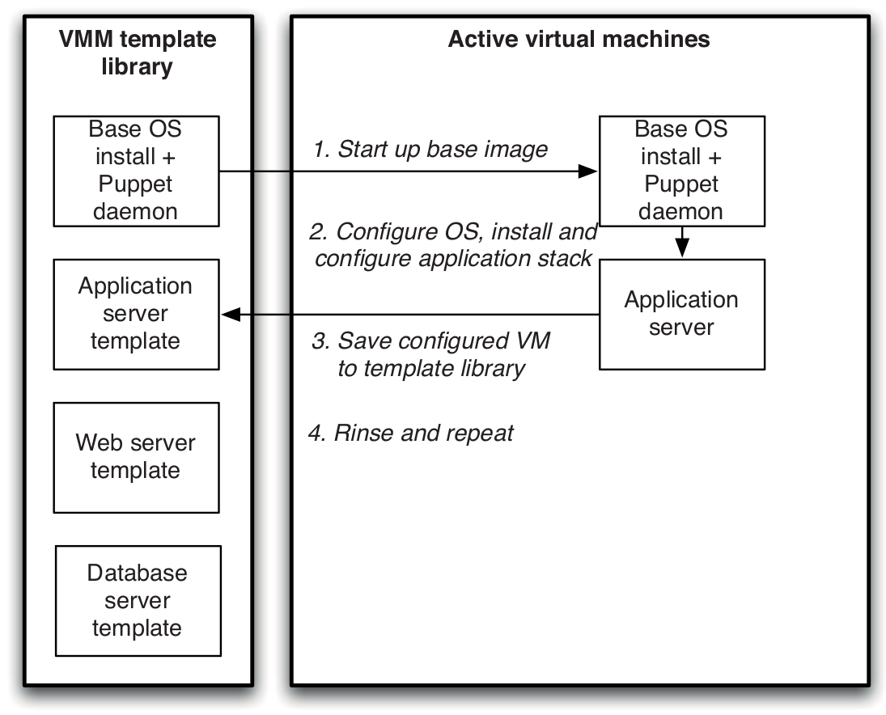

Virtualization provides a valuable way to move incrementally from managing environments manually to an automated approach. Instead of automating your provisioning process from scratch, create templates based on your current known-good systems. Again, you can replace the real environments with the virtual ones to confirm that your templates are good.

Virtualization provides a way to deal with software that your application relies on that cannot be installed or configured in an automated way.

---
## Cloud Computing
In cloud computing, **information is stored on the internet** and **accessed** and **managed** through **online software services**.

Cloud computing's key feature is **scalability**, where **resources** like **CPU**, **memory**, and **storage** can **grow or shrink as needed**, with **costs based on usage**. It **encompasses** both **software services** and the underlying **hardware/software environments**.  <!-- .element class="fragment fade-in-paragraph custom" -->

Cloud types:  <!-- .element class="fragment fade-in-with-next custom" -->
- Infrastructure in the Cloud
  - e.g. Amazon Elastic Compute Cloud (AWS EC2)
- Platforms in the Cloud 
  - e.g. Google App Engine, Force.com

**One Size Doesn't Have to Fit All**:  You can host **static content and video on AWS**, the **application on Google App Engine**, and a **proprietary service on your own infrastructure**.  <!-- .element class="fragment fade-in-paragraph custom" -->

------
## Cloud Computing: Google App Engine
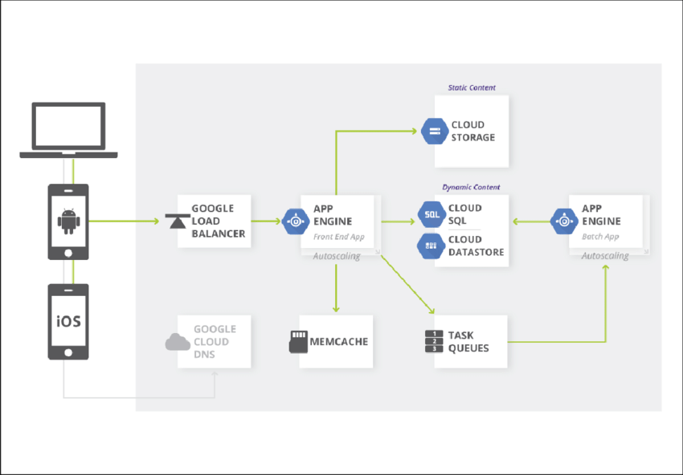

---
## Monitoring Infrastructure and Applications
It is essential to have insight into what is going on in your production environments for three reasons:
- Businesses can get feedback on their strategies much faster if they have real-time business intelligence, such as how much revenue
they are generating and where that revenue is coming from.
- When something goes wrong, the operations team needs to be informed immediately that there is an incident, and have the necessary tools to track down the root cause of the incident and fix it.
- Historical data is essential for planning purposes. If you don't have detailed data on how your systems behaved when there was an unexpected spike in demand, or when new servers were added, it's impossible to plan evolving your infrastructure to meet your business
requirements.

There are four areas to consider when creating a monitoring strategy:
- Instrumenting your applications and your infrastructure so you can collect the data you need
- Storing the data so it can easily be retrieved for analysis
- Creating dashboards which aggregate the data and present it in a format suitable for operations and for the business
- Setting up notifications so that people can find out about the events they care about

------
### Collecting Data
Monitoring data can come from the following sources:
- Your hardware, via out-of-band management (also known as lights-out management or LOM). Almost all modern server hardware implements the Intelligent Platform Management Interface (IPMI) which lets you monitor voltages, temperatures, system fan speeds, peripheral health, and so forth, as well as perform actions such as power cycling or lighting an identification light on the front panel, even if the box is powered off.
- The operating system on the servers comprising your infrastructure. All operating systems provide interfaces to get performance information such as memory usage, swap usage, disk space, I/O bandwidth (per disk and NIC), CPU usage, and so forth. It's also useful to monitor the process table to work out the resources each process is consuming. On UNIX, Collectd is the standard way to gather this data. On Windows, it's done using a system called performance counters, which can also be used by other providers of performance data.
- Your middleware. This can provide information on the usage of resources such as memory, database connection pools, and thread pools, as well as information on the number of connections, response time, and so forth.
- Your applications. Applications should be written so that they have hooks to monitor things that both operations and business users care about, such as the number of business transactions, their value, conversion rate, and so forth. Applications should also make it easy to analyze user demographics and behavior. They should record the status of connections to external systems that they rely on. Finally, they should be able to report their version number and the versions of their internal components, if applicable.

There are many tools that will gather everything described above across your whole data center, store it, produce reports, graphs, and dashboards, and provide notification mechanisms:
- Zabbix
- Grafana
- Prometheus
- Pro
- Nagios
- OpenNMS
- Flapjack
- Zenoss
- IBM Tivoli
- HP Operations MAnager
- Splunk

------
### Collecting Data: SNMP
SNMP is the most venerable and ubiquitous standard for monitoring:
- Managed Devices (physical systems such as servers, switches, firewalls, and so forth)
- Agents (talk to the individual applications or devices that you want to monitor and manage via SNMP)
- Network Management System (monitors and controls managed devices)

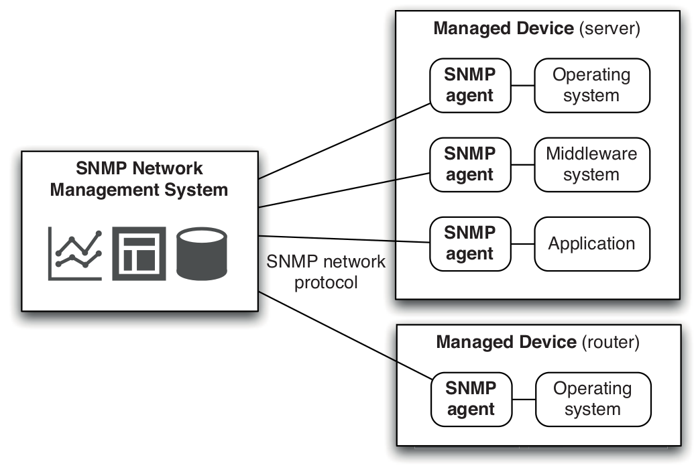

In SNMP, everything is a variable. You monitor systems by watching variables and control them by setting variables. Which variables are available for any given type of SNMP agent, with their descriptions, their types, and whether they can be written to or are read-only, is described in a MIB (Management Information Base), an extensible database format.

Each vendor defines MIBs for the systems it provides SNMP agents for, and the IANA maintains a central registry.

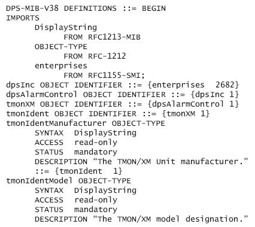

Most operating systems, most common middleware (Apache, WebLogic, and Oracle, for example), as well as many devices have SNMP built-in.

------
### Logging
Logging also has to form a central part of your monitoring strategy. Logging, which is part of auditability, should be treated as a first-level set of
requirements, the same as any other nonfunctional requirements.

It's important to pay attention to log levels, but be configurable at run time or deploy time to show other levels when debugging is necessary:

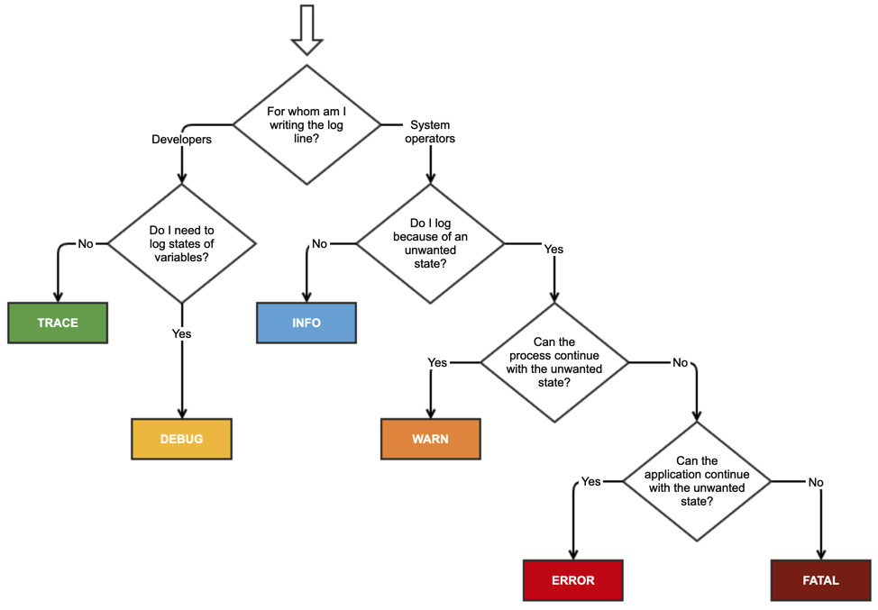

The operations team is the main consumer of log files.

------
### Creating Dashboards
It's essential that the operations team has a big visible display where they can see at a high level if there are any incidents

All the open source and commercial tools offer this kind of facility, including the ability to view historical trends and do some kind of reporting:

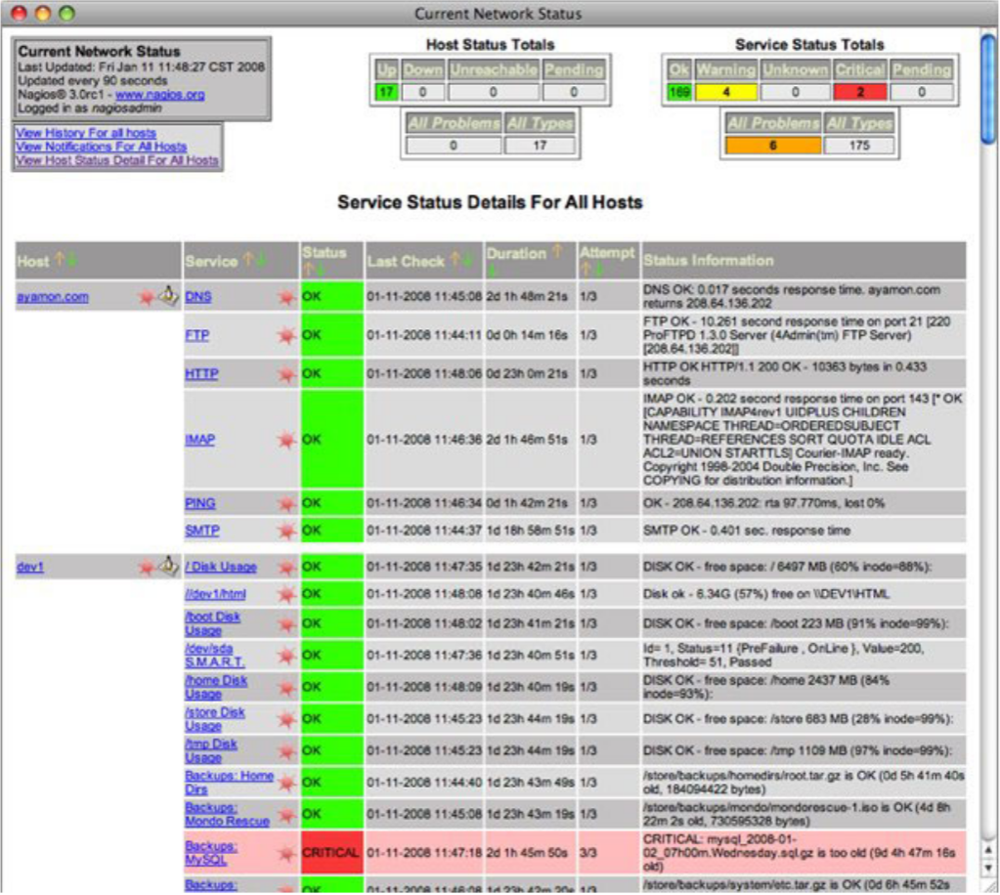

There are potentially thousands of things that you could monitor, and it is essential to plan ahead so your operations dashboard isn't drowned in noise. Come up with a list of risks, categorized by probability and impact.

In terms of aggregating data, the red-amber-green traffic light aggregation is well understood and commonly used. Green means all of the following are true:
- All expected events have occurred.
- No abnormal events have occurred.
- All metrics are nominal (within two standard deviations for this time period).
- All states are fully operational.
Amber means at least one of the following is true:
- An expected event has not occurred.
- At least one abnormal event, with a medium severity, has occurred.
- One or more parameters are above or below the nominal values.
- A noncritical state is not fully operational (for example, a circuit breaker has cut off a noncritical feature).
Red means at least one of the following is true:
- A required event has not occurred.
- At least one abnormal event, with a high severity, has occurred.
- One or more parameters are far above or below the nominal values.
- A critical state is not fully operational (for example, "accepting requests" is false where it should be true).

------
### Behavior-Driven Monitoring [Infrastructure]
Operations personnel can write automated tests to verify the behavior of their infrastructure

You can start by writing the test, verifying that it fails, and then defining a Puppet manifest (or whatever your configuration management tool of choice is) that puts your infrastructure into the expected state. You then run the test to verify that the configuration worked correctly and your infrastructure behaves as expected.

Example (can be run by [Cucumber Nagios](https://auxesis.github.io/cucumber-nagios/)):

<pre class="gherkin"><code style="font-size: 17px; line-height: normal;" data-trim data-noescape>Feature: google.com
  It should be up
  And I should be able to search for things

  Scenario: Searching for things
    When I go to "http://www.google.com.au/"
    And I fill in "q" with "wikipedia"
    And I press "Google Search"
    Then I should see "www.wikipedia.org"
</code></pre>

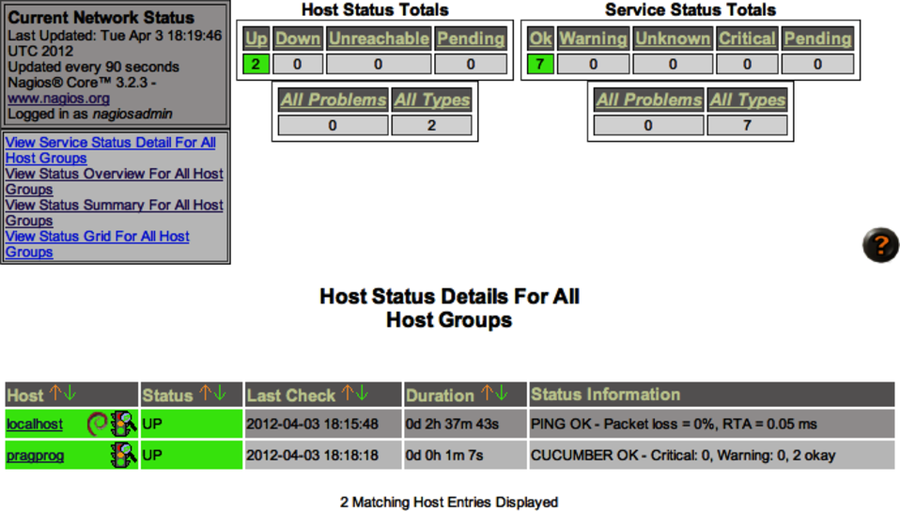

---
## Summary
When **assessing third-party products** for your enterprise system, **prioritize compatibility with** your **automated configuration management strategy**.

Have an **infrastructure management strategy** from the **project's start** and **involve** both **development and operations** teams' stakeholders.
