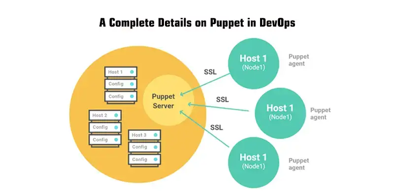

## Continuous Delivery: Managing Infrastructure and Environments
#### ...

<small><strong>Time to Read:</strong> 11 Minutes</small>, <small><strong>Time to Present:</strong> 50 Minutes</small>
 
<small><strong>Created By:</strong> Alireza Roshanzamir</small>
 
<small><strong>Keywords:</strong> Continuous Delivery, Continuous Integration, DevOps, Build, Test, Release, Deployment, Automation, Version Control, Deployment Pipeline</small>
  
<small style="color: darkred"><small>Press **"F"** to go fullscreen; some slides may not display properly otherwise.</small></small>

---
## Introduction
An **environment** is all of the **resources** that your application **needs** to work and their **configuration**:
- The hardware configuration of the servers that form the environment (such as the number and type of CPUs, amount of memory, spindles, NICs, and so on) and the networking infrastructure that connects them
- The configuration of the operating system and middleware (such as messaging systems, application and web servers, database servers) required to support the applications that will run within it

The general term infrastructure represents all environments in your organization, along with the services that support them, such as DNS servers, firewalls, routers, version control repositories, storage, monitoring applications, mail servers, and so on.

------
### Principles
Preparing environments for deployment and managing them after deployment principles:
- The desired state of your infrastructure should be specified through version-controlled configuration.
- Infrastructure should be autonomic-that is, it should correct itself to the desired state automatically.
- You should always know the actual state of your infrastructure through instrumentation and monitoring.

While infrastructure should be autonomic, it is also essential that it should be simple to re-create, so that, in the case of a hardware failure for example, you can quickly reestablish a new known-good configuration. This means that infrastructure provisioning should also be an automated process. This combination of automated provisioning and autonomic maintenance ensures that infrastructure can be rebuilt in a predictable amount of time in the event of failure.

------
### Subjects
In this session, we will talk about the following:
- The operating system and its configuration, for both testing and production environments
- The middleware software stack and its configuration, including application servers, messaging systems, and databases
- Infrastructural software, such as version control repositories, directory services, and monitoring systems
- External integration points, such as external systems and services
- Network infrastructure, including routers, firewalls, switches, DNS, DHCP, and so on
- The relationship between the application development team and the infrastructure management team

---
## Understanding Operation Team
It is axiomatic that most projects fail due to people problems rather than technical problems.

Almost all medium and large companies separate the activities of development and infrastructure management (or operations as it is often known). It is often the case that these two groups of stakeholders have an uneasy relationship (wall of confusion).

In small organizations, the development team is often responsible for operations.

Operations teams measure their effectiveness in terms of the key quality-of-service metrics such as mean time between failures (MTBF) and mean time to repair failures (MTTR). Often operations teams have service-level agreements (SLAs) they have to meet. Any change, including a change in process, which has an effect on operations teams' ability to meet these and any other targets (such as conformance to legal regulation), represents a risk.

------
### Operation Team Concerns
Here are some of the most important high-level concerns of operations teams:
- Documentation and Auditing
  - Any change to any environment they control is documented and audited
  - So that, if things go wrong, they can find the relevant changes that caused the problem
  - Member of the software development team have a responsibility to familiarize themselves with any such systems and processes (such as Change Management Processes) that the operations team has in place, and comply with them.
- Alerts for Abnormal Events
  - Alerted when an abnormal condition occurs in any of the systems they manage so that they can minimize any downtime
  - Using tools such as OpenNMS, Nagios, or HP's Operations Manager.
  - It is the development team's responsibility to determine the operations team's monitoring requirements and make them part of the release plan
- IT Service Continuity Planning
  - Each service the operations team manages will have a recovery point objective (RPO)-a
measure of the length of time prior to a disaster for which data loss is acceptable, and a recovery time objective (RTO)-the maximum length of time allowed before services are restored.
  - The RPO governs the data backup and restore strategy, since data must be backed up frequently enough that the RPO can be achieved
  - In order to meet the business’ desired RTO, it might be necessary to establish a copy of the production environments and infrastructure in a second location that can be used if the primary systems fail.
  - A related requirement is for archiving: The amount of data generated by an application in production may become very large very quickly.
- Use the Technology the Operations Team Is Familiar With
  - So they can own and maintain their environments.
  - It is quite common for operations teams to be well versed in Bash or PowerShell, but less likely that they will be Java or C# ninjas.
  - Operations teams may veto deployment systems they don’t have the skills to maintain.
  - Development team and operations team should sit down at the beginning of every project and decide how deployment of the application will be performed.

---
### Modeling and Managing Infrastructure
Everything in this session can be broadly considered a branch of configuration management.

Types of servers, divided up by level of abstraction:

You must address each of the following questions:
- How will we provision our infrastructure?
- How will we deploy and configure the various bits of software that form part of our infrastructure?
- How do we manage our infrastructure once it is provisioned and configured?

You should keep everything you need to create and maintain your infrastructure under version control:
- Operating system install definitions (such as those used by Debian Preseed, RedHat Kickstart, and Solaris Jumpstart)
- Configuration for data center automation tools like Puppet or CfEngine
- General infrastructure configuration, such as DNS zone files, DHCP and SMTP server configuration files, firewall configuration files, and so forth
- Any scripts you use for managing your infrastructure

------
### Controlling Access to Your Infrastructure
If you have an existing system that is not under good control, you’ll need to work out how to get it under control. There are three parts to this:
- Controlling access to prevent anyone from making a change without approval
- Defining an automated process for making changes to your infrastructure
- Monitoring your infrastructure to detect any issues as soon as they occur

Avoid the _problem-solving heuristic_ process:
- Leads to service disruptions (people tend to try rebooting or applying service packs at random)
- If something goes wrong later, there is no record of who did what when, which means it’s impossible to work out the cause of whatever problem you’re facing.

Requests to make changes to your production and testing environments should go through a change management process. This need not be bureaucratic: As is
pointed out in The Visible Ops Handbook, many organizations which perform best in terms of the MTBF (mean time between failures) and MTTR (mean time to repair) “were doing 1000–1500 changes per week, with a change success rate of over 99%.”

------
### Making Changes to Infrastructure
Characteristics of an effective change management process:
- Every change, whether it’s updating firewall rules or deploying a new version of your flagship service, should go through the same change management process.
- This process should be managed using a single ticketing system that everybody can log into and which generates useful metrics such as average cycle time per change.
- The exact change that is made should be logged so it can be easily audited later.
  - Prefer automation over documentation.
  - Written documentation is never a guarantee that the documented change was performed correctly, and the differences between what somebody claims they did and what they actually did are sufficient to cause a problem that may take hours or days to track down.
- It should be possible to see a history of changes made to every environment, including deployments.
- The change you want to make should first have been tested on one of your production-like testing environments, and automated tests should be run to ensure that it doesn’t break any of the applications that use the environment.
- The change should be made to version control and then applied through your automated process for deploying infrastructural changes.
- There should be a test to verify that the change has worked.

---
## Managing Server Provisioning and Configuration
Provisioning servers and managing their configuration is often overlooked in small and even medium-sized operations for the simple reason that it seems complicated.

An overview of example of automated provisioning and configuration of servers:

------
### Provisioning Servers
There are several ways to create operating system baselines:
- A fully manual process  &rArr;  Not repeatable, reliable, and scalable
- Automated remote installation
  - PXE (Preboot eXecution Environment)
  - WDS (Windows Deployment Services)
- Virtualization

------
### Ongoing Management of Servers
Once you have got the operating system installed, you will need to ensure that its configuration doesn't change in an uncontrolled manner which means:
- Nobody is able to log into the boxes except the operations team
- Any changes are performed using an automated system

The goal of your configuration management process is to ensure that configuration management is declarative and idempotent.

On Windows, Microsoft provides (in addition to Windows Deployment Services) a solution for managing your Microsoft infrastructure: System Center Configuration Manager. SCCM uses ActiveDirectory and Windows Software Update Services to manage operating system configuration, including updates and settings on each of the boxes in your organization. You can also deploy applications using SCCM. SCCM also talks to Microsoft virtualization technologies, allowing you to manage virtual servers the same way you manage physical ones. Access control is managed using Group Policy, which integrates with ActiveDirectory and is built into all Microsoft servers since Windows 2000.

In the UNIX world, LDAP along with the usual UNIX access controls are used to control who can do what on which boxes. There are a number of solutions for managing operating system configuration, including which software and updates are installed, on an ongoing basis. Perhaps the most popular are CfEngine, Puppet, and Chef, but several other similar tools exist, such as Bcfg2 and LCFG.

All of these tools-whether open source or commercial-operate in a similar way. You specify what you want the state of your boxes to be, and the tool ensures that your infrastructure is in the specified state. The key characteristic of such systems is that they enforce idempotence. This achieves the higher goal of making your infrastructure autonomic-in other words, self-healing.

------
### Ongoing Management of Servers: Puppet
Puppet is one of the most popular open source systems currently available (along with CfEngine and Chef).

Puppet manages configuration through a declarative, external domain-specific language (DSL) tailored to configuration information.

Puppet configuration is managed by a central master server. This server runs the Puppet master daemon (puppetmasterd) which has a list of machines that it controls. Each of the controlled machines run the Puppet agent (puppetd).

It communicates with the server to ensure that the servers under Puppet's control are synchronized with the latest version of the configuration.

When a configuration changes, the Puppetmaster will propagate that change to all the clients that need to be updated, install and configure the new software, and restart the servers where necessary.

The configuration is declarative, and describes the desired end state of each server. This means they can be configured from any starting state, including a fresh copy of a VM or a newly provisioned machine.

Example:

<pre class="puppet"><code style="font-size: 17px; line-height: normal;" data-trim data-noescape># /etc/puppet/modules/postfix/manifests/init.pp
class postfix {
  package { postfix: ensure => installed }
  service { postfix: ensure => running, enable => true }
  file { "/etc/postfix/main.cf":
    content => template("postfix/main.cf.erb"),
    mode => 755,
  }
}
</code></pre>

<pre class="puppet"><code style="font-size: 17px; line-height: normal;" data-trim data-noescape># /etc/puppet/manifests/site.pp
node default {
  package { tzdata: ensure => installed }
  file { "/etc/localtime":
    ensure => "file:///usr/share/zoneinfo/US/Pacific"
  }
}

node 'smtp.thoughtworks.com' {
  include postfix
}
</code></pre>

<pre class="puppet"><code style="font-size: 17px; line-height: normal;" data-trim data-noescape># /etc/puppet/modules/apt/manifests/init.pp
class apt {
  if ($operatingsystem == "Debian") {
    file { "/etc/apt/sources.list.d/custom-repository":
      source => "puppet:///apt/custom-repository",
      ensure => present,
    }
    cron { apt-update:
      command => "/usr/bin/apt-get update",
      user => root,
      hour => 0,
      minute => 0,
    }
  }
}

define apt::key(keyid) {
  file { "/root/$name-gpgkey":
    source => "puppet:///apt/$name-gpgkey"
  }

  exec { "Import $keyid to apt keystore":
    path => "/bin:/usr/bin",
    environment => "HOME=/root",
    command => "apt-key add /root/$name-gpgkey",
    user => "root",
    group => "root",
    unless => "apt-key list | grep $keyid",
  }
}
</code></pre>

---
## Managing the Configuration of Middleware
Middleware-whether web servers, messaging systems, or commercial off-the-shelf software (COTS)-can be decomposed into three parts: binaries, configuration, and data.

Managing Configuration:
- Database schemas, web server configuration files, application server configuration information, message queue configuration, and every other aspect of the system that needs to be changed for your system to work should be under version control.
- If your middleware isn't part of the standard operating system install, the next best thing is to package it up using your operating system's package management system and put it on your organization's internal package server. Then you can use your chosen server management system to manage this middleware using the same model.

Research the Product:
- When looking for a low-cost, low-energy solution, the obvious starting point is to be absolutely certain that the product in question doesn't have a poorly advertised automated configuration option.
- Make sure that there isn't a better option before you move on to the other strategies.
- All we are asking for is the ability to version-control the work that we invest in their product. Our favorite response from one large vendor was, "Oh yes, we are going to build our own version control into the system in the release after next." Even if they had done so, and even if having the feature a year or two later could make any difference to the project we were working on at the time, integrating to a crude, proprietary version control system wouldn't have helped us manage a consistent configuration set.

Examine How Your Middleware Handles State:
- If you are certain that your middleware does not support any form of automated configuration, the next step is to see if you can cheat by version-controlling its storage behind its back.
- If the third-party system stores its state in binary files, consider revision-controlling these binaries:
  - The simplest option is to store the relevant binaries in version control along with a script that installs them to the relevant environment.
  - Really go ahead and write your own installer (or a package such as an RPM if you’re using a RedHat-derived Linux distribution, for example).

Look for a Configuration API:
- One strategy is to define your own simple configuration file for the system that you are working with. Create custom build tasks to interpret those scripts and to use the API to configure the system.
- This strategy of "invent your own" configuration files puts configuration management back into your hands-allowing you to version-control the configuration files and automate their use.

Use a Better Technology
- At some point we would strongly recommend adopting an alternate technology which is more tractable.
- Many organizations are wary about changing the software platform that they
use because they have already spent a great deal of money on it. However, this argument, known as the **sunk cost fallacy**, does not take into account the lost opportunity cost of moving to a superior technology.

---
## Managing Infrastructure Services
It is extremely common for problems with infrastructure services-such as routers, DNS, and directory services-to break software in production environments that worked perfectly all through the deployment pipeline.

Michael Nygard wrote an article for InfoQ in which he tells the story of a system which died mysteriously at the same time every day [bhc2vR]. The problem turned out to be a firewall which dropped inactive TCP connections after one hour. As the system was idle at night, when activity started in the morning, the TCP packets from the pooled database connections would be dropped silently by the firewall.

Problems like this will happen to you, and when they do, they will be maddeningly difficult to diagnose.

Advices:
- Every part of your networking infrastructure’s configuration, from DNS zone files to DHCP to firewall and router configurations to SMTP and other services your applications rely on, should be version-controlled.
- Install a good network monitoring system such as Nagios, OpenNMS, HP Operations Manager, or one of their brethren. Make sure that you know when network connectivity is broken, and monitor every port on every route that your application uses.
- Your applications should log at WARNING level every time a network connection times out or is found to be unexpectedly closed. You should log at INFO or, if the logs are too verbose, DEBUG level every time you close a connection. You should log at DEBUG level every connection that you open, including as much information as possible on the endpoint of the connection.
- Make sure that your smoke tests check all of the connections at deployment time to flush out any routing or connectivity problems.
- Make your integration testing environment’s network topology as similar as possible to production, including using the same pieces of hardware with the same physical connections between them.
- When something does go wrong, have forensic tools available. Wireshark and Tcpdump are both fantastically useful tools that make it easy to see packets flying past, and filter them so you can isolate exactly the packets you’re looking for. The UNIX tool Lsof and its Windows cousins Handle and TCPView (part of the Sysinternals suite) also come in very handy to see what files and sockets are open on your machine.

Multihomed servers:

---
## Virtualization
In general, virtualization is a technique that adds a layer of abstraction on top of one or more computer resources.

Platform virtualization means simulating an entire computer system so as to run multiple instances of operating systems simultaneously on a single physical machine. In this configuration, there is a virtual machine monitor (VMM), or hypervisor, which has full control of the physical machine’s hardware resources. Guest operating systems run on virtual machines, which are managed by the VMM. Environment
virtualization involves simulating one or more virtual machines as well as the network connections between them.

Virtualization was originally developed by IBM in the 1960s as an alternative to creating a multitasking time-sharing operating system.

In particular, virtualization provides the following benefits:
- Fast response to changing requirements: Need a new testing environment? A new virtual machine can be provisioned in seconds at no cost, versus days or weeks to obtain a new physical environment.
- Consolidation: When organizations are relatively immature, each team will often have its own CI servers and testing environments sitting on physical boxes under their desks. Virtualization makes it easy to consolidate CI and testing infrastructure so it can be offered as a service to delivery teams. It is also more efficient in terms of hardware usage.
- Standardizing hardware: Functional differences between components and subsystems of your application no longer force you to maintain distinct hardware configurations, each with its own specification. Virtualization allows you to standardize on a single hardware configuration for physical environments but run a variety of heterogeneous environments and platforms virtually.
- Easier-to-maintain baselines: You can maintain a library of baseline images-operating system plus application stacks-or even environments, and push them out to a cluster at the click of a button.

Virtualization also provides the capability to significantly speed up long-running tests. Instead of running them on a single box, you can run them in parallel on a build grid of virtual machines (e.g. from 13 hours to 45 minutes).

------
### Managing Virtual Environments
One of the most important characteristics of VMMs is that a virtual machine image is a single file. Such a file is called a disk image. The useful thing about disk images is that you can copy them and version them (probably not in version control, unless your VCS can handle lots of very large binary files).

You can then use them as templates, or baselines (known-good versions of your environments, on which the rest of your configuration and deployment can be made):

You can then run your automated process to configure the operating system and install and configure any software required by your applications. Once again, at this point, save a copy of each type of box in your environment as a baseline:

Virtualization provides a valuable way to move incrementally from managing environments manually to an automated approach. Instead of automating your provisioning process from scratch, create templates based on your current known-good systems. Again, you can replace the real environments with the virtual ones to confirm that your templates are good.

Virtualization provides a way to deal with software that your application relies on that cannot be installed or configured in an automated way.

---
## Cloud Computing
In cloud computing, information is stored on the Internet and accessed and manipulated through software services also available on the Internet.

The defining characteristic of cloud computing is that the computing resources you use, such as CPU, memory, storage, and so on, can expand and contract to meet your need, and you pay only for what you use. Cloud computing can refer to both the software services themselves, and the hardware and software environments that they run on.

- Infrastructure in the Cloud
  - e.g. AWS EC2
- Platforms in the Cloud 
  - e.g. Google App Engine, Force.com
- One Size Doesn't Have to Fit All
  - You might have static content and streaming video hosted on AWS, your application hosted on Google App Engine, and a proprietary service running on your own infrastructure.

---
## Monitoring Infrastructure and Applications
It is essential to have insight into what is going on in your production environments for three reasons:
- Businesses can get feedback on their strategies much faster if they have real-time business intelligence, such as how much revenue
they are generating and where that revenue is coming from.
- When something goes wrong, the operations team needs to be informed immediately that there is an incident, and have the necessary tools to track down the root cause of the incident and fix it.
- Historical data is essential for planning purposes. If you don’t have detailed data on how your systems behaved when there was an unexpected spike in demand, or when new servers were added, it’s impossible to plan evolving your infrastructure to meet your business
requirements.

There are four areas to consider when creating a monitoring strategy:
- Instrumenting your applications and your infrastructure so you can collect the data you need
- Storing the data so it can easily be retrieved for analysis
- Creating dashboards which aggregate the data and present it in a format suitable for operations and for the business
- Setting up notifications so that people can find out about the events they care about

------
### Collecting Data
Monitoring data can come from the following sources:
- Your hardware, via out-of-band management (also known as lights-out management or LOM). Almost all modern server hardware implements the Intelligent Platform Management Interface (IPMI) which lets you monitor voltages, temperatures, system fan speeds, peripheral health, and so forth, as well as perform actions such as power cycling or lighting an identification light on the front panel, even if the box is powered off.
- The operating system on the servers comprising your infrastructure. All operating systems provide interfaces to get performance information such as memory usage, swap usage, disk space, I/O bandwidth (per disk and NIC), CPU usage, and so forth. It’s also useful to monitor the process table to work out the resources each process is consuming. On UNIX, Collectd is the standard way to gather this data. On Windows, it’s done using a system called performance counters, which can also be used by other providers of performance data.
- Your middleware. This can provide information on the usage of resources such as memory, database connection pools, and thread pools, as well as information on the number of connections, response time, and so forth.
- Your applications. Applications should be written so that they have hooks to monitor things that both operations and business users care about, such as the number of business transactions, their value, conversion rate, and so forth. Applications should also make it easy to analyze user demographics and behavior. They should record the status of connections to external systems that they rely on. Finally, they should be able to report their version number and the versions of their internal components, if applicable.

There are many tools that will gather everything described above across your whole data center, store it, produce reports, graphs, and dashboards, and provide notification mechanisms:
- Zabbix
- Grafana
- Prometheus
- Pro
- Nagios
- OpenNMS
- Flapjack
- Zenoss
- IBM Tivoli
- HP Operations MAnager
- Splunk

------
### Collecting Data: SNMP
SNMP is the most venerable and ubiquitous standard for monitoring:
- Managed Devices (physical systems such as servers, switches, firewalls, and so forth)
- Agents (talk to the individual applications or devices that you want to monitor and manage via SNMP)
- Network Management System (monitors and controls managed devices)

In SNMP, everything is a variable. You monitor systems by watching variables and control them by setting variables. Which variables are available for any given type of SNMP agent, with their descriptions, their types, and whether they can be written to or are read-only, is described in a MIB (Management Information Base), an extensible database format.

Each vendor defines MIBs for the systems it provides SNMP agents for, and the IANA maintains a central registry.

Most operating systems, most common middleware (Apache, WebLogic, and Oracle, for example), as well as many devices have SNMP built-in.

------
### Logging
Logging also has to form a central part of your monitoring strategy. Logging, which is part of auditability, should be treated as a first-level set of
requirements, the same as any other nonfunctional requirements.

It’s important to pay attention to log levels, but be configurable at run time or deploy time to show other levels when debugging is necessary:

The operations team is the main consumer of log files.

------
### Creating Dashboards
It’s essential that the operations team has a big visible display where they can see at a high level if there are any incidents

All the open source and commercial tools offer this kind of facility, including the ability to view historical trends and do some kind of reporting:

There are potentially thousands of things that you could monitor, and it is essential to plan ahead so your operations dashboard isn’t drowned in noise. Come up with a list of risks, categorized by probability and impact.

In terms of aggregating data, the red-amber-green traffic light aggregation is well understood and commonly used. Green means all of the following are true:
- All expected events have occurred.
- No abnormal events have occurred.
- All metrics are nominal (within two standard deviations for this time period).
- All states are fully operational.
Amber means at least one of the following is true:
- An expected event has not occurred.
- At least one abnormal event, with a medium severity, has occurred.
- One or more parameters are above or below the nominal values.
- A noncritical state is not fully operational (for example, a circuit breaker has cut off a noncritical feature).
Red means at least one of the following is true:
- A required event has not occurred.
- At least one abnormal event, with a high severity, has occurred.
- One or more parameters are far above or below the nominal values.
- A critical state is not fully operational (for example, "accepting requests" is false where it should be true).

------
### Behavior-Driven Monitoring

---
## Summary
