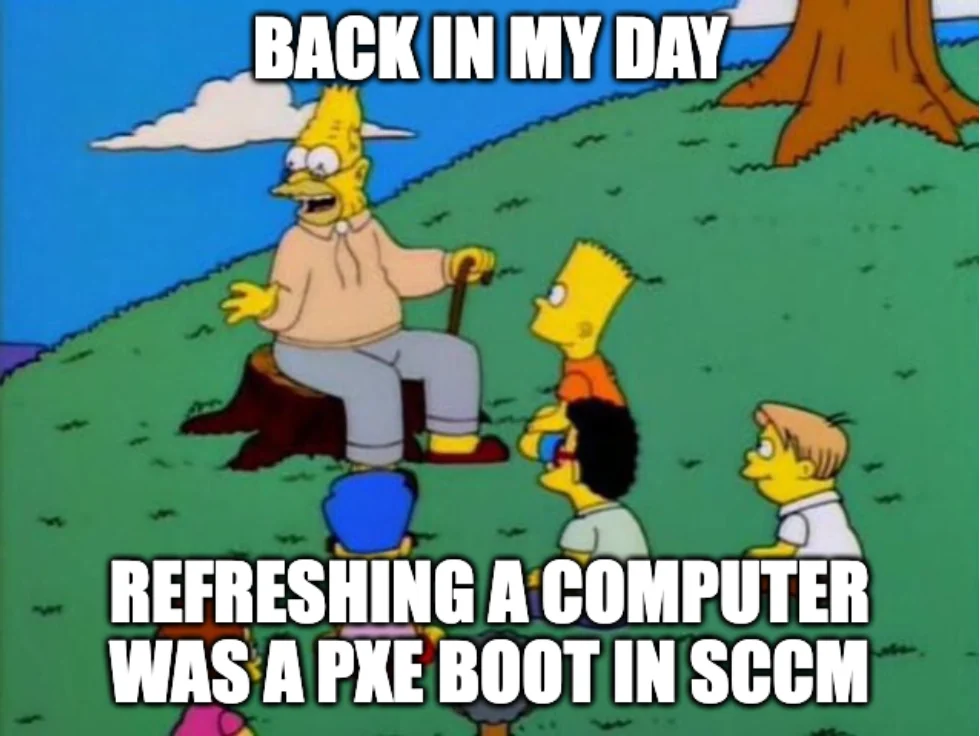

## Continuous Delivery: Managing Infrastructure and Environments
#### Understanding Operation Team, Modeling and Managing Infrastructure, Managing Server Provisioning and Configuration, Managing the Configuration of Middleware, Managing Infrastructure Services, Virtualization, Cloud Computing, Monitoring Infrastructure and Applications

<small><strong>Time to Read:</strong> 18 Minutes</small>, <small><strong>Time to Present:</strong> 75 Minutes</small>
 
<small><strong>Created By:</strong> Alireza Roshanzamir</small>
 
<small><strong>Keywords:</strong> Continuous Delivery, Continuous Integration, DevOps, Build, Test, Release, Deployment, Automation, Version Control, Deployment Pipeline</small>
 
<small style="color: darkred"><small>Press **"F"** to go fullscreen; some slides may not display properly otherwise.</small></small>

---
## Introduction
An **environment** is all of the **resources** that your application **needs** to work and their **configuration**:
- &shy;<!-- .element class="fragment fade-in" -->The hardware configuration includes server details like **CPU count**, **memory**, **spindles**, **NICs**, and **networking**.
- &shy;<!-- .element class="fragment fade-in" -->The configuration of the **OS** and **middleware** like **messaging systems**, **application/web servers** and **database servers** for running applications.

&shy;<!-- .element class="fragment fade-in" -->"Infrastructure" encompasses all your **organization's environments and supporting services**, including **DNS**, **firewalls**, **routers**, **version control**, **storage**, **monitoring**, **mail servers**, etc.

------
### Principles
Principles for **preparing** and **managing** environments **before** and **after deployment**:
- &shy;<!-- .element class="fragment fade-in" -->The desired state of your infrastructure should be specified through **version-controlled** configuration.
- &shy;<!-- .element class="fragment fade-in" -->Infrastructure should be **autonomic**, meaning it **corrects itself** to the desired state automatically.
- &shy;<!-- .element class="fragment fade-in" -->You should always **know the actual state** of your **infrastructure** through instrumentation and **monitoring**.

&shy;<!-- .element class="fragment fade-in" -->Infrastructure should be **autonomic**, **but** it's crucial to keep it **easy to recreate**. So, in case of **hardware failure**, you can **quickly reestablish** a new known-good configuration. Therefore, **automate infrastructure provisioning** as well.

&shy;<!-- .element class="fragment fade-in" -->**Automated provisioning** and **autonomic maintenance** ensure **predictable** infrastructure **rebuilding** in case of **failure**.

------
### Subjects
In this session, we will talk about the following:
- &shy;<!-- .element class="fragment highlight-current-blue" -->The **operating system** and its **configuration**, for testing/production environments.
- &shy;<!-- .element class="fragment highlight-current-blue" -->The **middleware software stack** and its **configuration**, including **application servers**, **messaging systems**, and **databases**.
- &shy;<!-- .element class="fragment highlight-current-blue" -->Infrastructural software, such as **version control repositories**, **directory services**, and **monitoring systems**.
- &shy;<!-- .element class="fragment highlight-current-blue" -->External integration points, such as **external systems** and **services**.
- &shy;<!-- .element class="fragment highlight-current-blue" -->**Network infrastructure**, including **routers**, **firewalls**, **switches**, **DNS**, **DHCP**, and so on.
- &shy;<!-- .element class="fragment highlight-current-blue" -->The **relationship** between the application **development team** and the **infrastructure management team**.

---
## Understanding Operation Team

&shy;<!-- .element class="fragment fade-in" -->Most projects **fail** because of **people problems**, **not technical issues**.

&shy;<!-- .element class="fragment fade-in" -->In most **medium to large** companies, **development** and **infrastructure management (operations)** are **separate**, often causing **tension** between these two stakeholder groups (aka **"wall of confusion"**).

&shy;<!-- .element class="fragment fade-in" -->In **small** organizations, the **development team** typically **handles operations too**.

&shy;<!-- .element class="fragment fade-in" -->**Operations teams** use **QoS metrics** like **mean time between failures** and **mean time to repair** to assess **performance**. They must meet **service-level agreements (SLAs)**. Any **change** poses a **risk** to meeting these goals and complying with regulations.

------
### Operation Team Concerns

Here are some of the most important **high-level** concerns of operations teams:
- Documentation and Auditing  <!-- .element: class="fragment insides-fade-in-then-out" -->
  - &shy;<!-- .element class="fragment highlight-current-blue" -->Any change to any environment they control is **documented** and **audited**.
  - &shy;<!-- .element class="fragment highlight-current-blue" -->So that, if things **go wrong**, they can find the **relevant changes** that **caused the problem**.
  - &shy;<!-- .element class="fragment highlight-current-blue" -->**Development team** should **learn** the **operations team's systems and processes** (e.g. **Change Management Processes**) and follow them.
- Alerts for Abnormal Events  <!-- .element: class="fragment insides-fade-in-then-out" -->
  - &shy;<!-- .element class="fragment highlight-current-blue" -->They should be **notified of abnormal conditions** in systems they manage to **minimize downtime**.
  - &shy;<!-- .element class="fragment highlight-current-blue" -->Using tools such as **OpenNMS**, **Nagios**, or **HP's Operations Manager**.
  - &shy;<!-- .element class="fragment highlight-current-blue" -->The **development team** must **consider** the operations team's **monitoring needs** within the release plan.
- IT Service Continuity Planning  <!-- .element: class="fragment insides-fade-in-then-out" -->
  - &shy;<!-- .element class="fragment highlight-current-blue" -->Each service managed by the operations team has a **RPO** (recovery point objective; acceptable data loss time before a disaster) and an **RTO** (recovery time objective; maximum allowed time for service restoration).
  - &shy;<!-- .element class="fragment highlight-current-blue" -->The **RPO** governs the **data backup** and **restore strategy**, ensuring **frequent backups to meet the RPO**.
  - &shy;<!-- .element class="fragment highlight-current-blue" -->To meet **RTO**, creating a **backup of the production setup** in **another location** for **main system failure** may be needed.
  - &shy;<!-- .element class="fragment highlight-current-blue" -->Another consideration is **archiving**, as production applications can generate a **significant amount of data rapidly**.
- Use the Technology the Operations Team Is Familiar With  <!-- .element: class="fragment insides-fade-in-then-out" -->
  - &shy;<!-- .element class="fragment highlight-current-blue" -->So they can **own** and **maintain** their environments.
  - &shy;<!-- .element class="fragment highlight-current-blue" -->Operations teams are typically **proficient in Bash or PowerShell**, but might **not have expertise in Java or C#**.
  - &shy;<!-- .element class="fragment highlight-current-blue" -->Operations teams may **veto deployment systems** they **don't have the skills to maintain**.
  - &shy;<!-- .element class="fragment highlight-current-blue" -->Development and operations teams should **plan application deployment** **together** at **project start**.

  
Note

  IT Service Continuity Planning is the process of ensuring that IT services can continue or be quickly restored after a disruption or disaster.

---
## Modeling and Managing Infrastructure
&shy;<!-- .element: class="fragment fade-in-with-next custom" -->Types of servers, divided up by **level of abstraction**:

&shy;<!-- .element: class="fragment fade-in-with-next custom" -->You must address each of the following **questions**:
- How will we **provision** our infrastructure?
- How will we **deploy** and **configure** the **various bits** of software that form part of our infrastructure?
- How do we **manage** our infrastructure **once it is provisioned** and **configured**?

&shy;<!-- .element: class="fragment fade-in-with-next custom" -->You should **keep everything** you **need** to **create** and **maintain** your infrastructure under **version control**:
- **OS install definitions** (such as those used by Debian Preseed, RedHat Kickstart, and Solaris Jumpstart).
- **Configuration** for data center **automation tools** like Puppet or CfEngine.
- **General infrastructure configuration**, such as DNS, DHCP and SMTP, and firewall configuration files.
- **Any scripts** you use for managing your infrastructure.

------
### Controlling Access to Your Infrastructure

&shy;<!-- .element: class="fragment fade-in-with-next custom" -->If you have a system that's **not well controlled**, you'll need to figure out how to **regain control**. This involves three steps:
- Controlling access to **prevent** anyone from **making a change without approval**.
- Defining an **automated process** for **making changes** to your infrastructure.
- **Monitoring** your infrastructure to detect any issues as soon as they occur.

&shy;<!-- .element: class="fragment fade-in-with-next custom" -->Don't log in and **explore** to fix issues in that environment (called **problem-solving heuristic**):
- This can **disrupt services** as people might randomly reboot or apply updates.
- If something goes wrong later, there's **no record of actions taken**, making it **impossible** to determine the **cause of any issues**.

&shy;<!-- .element class="fragment fade-in" -->**Change requests** for **testing/production** environments should follow a **structured process**. This need **not be bureaucratic**: As noted in "The Visible Ops Handbook," **high-performing organizations** achieved **high MTBF** and **MTTR** with a **99%+ change success rate**, even with **1000-1500 weekly changes**.

  
Note

  A problem-solving heuristic is an informal, intuitive, speculative procedure that leads to a solution in some cases but not in others

------
### Making Changes to Infrastructure
Characteristics of an **effective change management process**:
- &shy;<!-- .element class="fragment highlight-current-blue" -->All changes, like firewall rules updates or service deployments, must follow the **same change management process**.
- &shy;<!-- .element class="fragment highlight-current-blue" -->This process should be managed with a **single ticketing system** for all, **tracking metrics** like **average cycle time per change**.
- &shy;<!-- .element class="fragment highlight-current-blue" -->The exact change that is made should be **logged** so it can be easily audited later.
  - Prefer automation over documentation.
  - **Documentation** **doesn't** always ensure a **change was done right**. **Differences** between **claimed** and **actual** actions can cause **days of troubleshooting**.
- &shy;<!-- .element class="fragment highlight-current-blue" -->A **history of changes** in **every environment**, **including deployments**, should be visible.
- &shy;<!-- .element class="fragment highlight-current-blue" -->The changes should be checked with **automated tests** to **avoid disrupting other applications**.
- &shy;<!-- .element class="fragment highlight-current-blue" -->Changes should **go through version control** and be applied via the **automated process** for infrastructural updates.
- &shy;<!-- .element class="fragment highlight-current-blue" -->There should be a **test to verify** that the change has worked.

---
## Managing Server Provisioning and Configuration
Provisioning and configuring servers is often **neglected** in small to medium-sized operations because it **seems complicated**.

An example of automated provisioning and configuration of servers:  <!-- .element class="fragment fade-in-with-next custom" -->

------
### Provisioning Servers
There are several ways to create **operating system baselines**:
- <!-- .element class="fragment highlight-current-blue" --> A fully manual process: Not repeatable, reliable, and scalable.
- <!-- .element class="fragment highlight-current-blue" --> Automated remote installation
  - PXE (Preboot eXecution Environment)
    - PXE is a standard for booting boxes over Ethernet.
    - When you choose to boot via the network in your BIOS, what happens under the hood is PXE.
  - WDS (Windows Deployment Services)
    - It uses PXE under the hood.

  <table>
    <tr>
      <td></td>
      <td></td>
    </tr>
  </table>
- <!-- .element class="fragment highlight-current-blue" --> Virtualization: We will discuss this later.

------
### Ongoing Management of Servers
After installing the OS, it's essential to **prevent uncontrolled configuration changes**. This means:
- Nobody is able to log into the boxes except the operations team
- Any changes are performed using an automated system

&shy;<!-- .element class="fragment fade-in" -->The goal of **configuration management process** is to ensure that **configuration management** is **declarative** and **idempotent**.

&shy;<!-- .element class="fragment fade-in" -->On **Windows**, Microsoft provides **System Center Configuration Manager (SCCM)** to **manage your Microsoft infrastructure**. SCCM uses **ActiveDirectory (AD)** and **Windows Software Update Services** for **OS configuration**, **updates**, and **settings** across your organization. It also **deploys applications** and manages **virtual servers** like physical ones. **Access control** is via **Group Policy**, integrated with **AD**, and standard in Microsoft servers since Windows 2000.

&shy;<!-- .element class="fragment fade-in" -->In the **UNIX** realm, **LDAP** and **standard UNIX access controls** **regulate user permissions**. **Various tools are available** for **managing OS configuration**, **software**, and **updates**. Prominent options include **CfEngine**, **Puppet**, and **Chef**.

&shy;<!-- .element class="fragment fade-in" -->These tools work similarly. You define **the desired state** for your systems, and the **tool ensures** your **infrastructure matches that state**. They enforce **idempotence**, aiming for **autonomic (aka self-healing)** infrastructure.

------
### Ongoing Management of Servers: SCCM and CfEngine
<table>
  <tr>
    <td></td>
    <td></td>
  </tr>
</table>

------
### Ongoing Management of Servers: Puppet
Puppet is one of the **most popular open source systems** currently available (along with CfEngine and Chef).

Puppet uses a **external DSL** to handle configuration in a **declarative** way.

The **central master server** runs the **Puppet master daemon (puppetmasterd)** which **has and controls a list of machines**.

Each machine has the **Puppet agent (puppetd)**, **communicates** with the server to **sync** servers with the **latest configuration**.

When a **configuration changes**, the **master updates the clients**, **installs/configures new software**, and **restarts servers as needed**.

**Declarative configuration** defines the **desired server state**, **applicable from any starting points**, including fresh VM copies or newly provisioned machines.

------
### Continued: Ongoing Management of Servers: Puppet
Example:

<pre class="puppet"><code style="font-size: 16px; line-height: normal;" data-trim data-noescape># /etc/puppet/modules/postfix/manifests/init.pp
class postfix {
  package { postfix: ensure => installed }
  service { postfix: ensure => running, enable => true }
  file { "/etc/postfix/main.cf":
    content => template("postfix/main.cf.erb"),
    mode => 755,
  }
}
</code></pre>

<pre class="puppet"><code style="font-size: 16px; line-height: normal;" data-trim data-noescape># /etc/puppet/manifests/site.pp
node default {
  package { tzdata: ensure => installed }
  file { "/etc/localtime":
    ensure => "file:///usr/share/zoneinfo/US/Pacific"
  }
}

node 'smtp.thoughtworks.com' {
  include postfix
}
</code></pre>

<pre class="puppet"><code style="font-size: 16px; line-height: normal; height: 200px" data-trim data-noescape># /etc/puppet/modules/apt/manifests/init.pp
class apt {
  if ($operatingsystem == "Debian") {
    file { "/etc/apt/sources.list.d/custom-repository":
      source => "puppet:///apt/custom-repository",
      ensure => present,
    }
    cron { apt-update:
      command => "/usr/bin/apt-get update",
      user => root,
      hour => 0,
      minute => 0,
    }
  }
}

define apt::key(keyid) {
  file { "/root/$name-gpgkey":
    source => "puppet:///apt/$name-gpgkey"
  }

  exec { "Import $keyid to apt keystore":
    path => "/bin:/usr/bin",
    environment => "HOME=/root",
    command => "apt-key add /root/$name-gpgkey",
    user => "root",
    group => "root",
    unless => "apt-key list | grep $keyid",
  }
}
</code></pre>

---
## Managing the Configuration of Middleware
**Middleware**-web servers, messaging systems, or commercial off-the-shelf software (COTS)-can be divided into **binaries**, **configuration**, and **data**.

Managing Configuration:  <!-- .element class="fragment fade-in-with-next custom" -->
- **Database schemas**, **web server configs**, **app server settings**, **message queue configs**, and **any other system components** needing changes should be **version-controlled**.
- For **database schemas** and **messaging queues**, consider using **code-first** or **class-first** approaches.
- If your middleware isn't part of the **standard OS packages**, package it using your **OS's package manager** and place it on your **internal package server**. This allows you to manage the middleware with your **server management system consistently**.

&shy;<!-- .element: class="fragment fade-in-with-next custom" -->Effective **middleware evaluation** and **configuration strategies**:
- Research the Product  <!-- .element: class="fragment insides-fade-in-then-out" -->
  - When seeking a low-cost, low-energy solution, ensure the product has a **strong automated configuration option**.
  - Make sure that **there isn't a better option** before you move on.
  - We only want to **version-control** our **work in their product**. One vendor's response was, "We'll add **our version control** in a future release." However, even if they did, it wouldn't have helped with our **immediate** project's configuration **consistency**.
- Examine How Your Middleware Handles State  <!-- .element: class="fragment insides-fade-in-then-out" -->
  - If your middleware **lacks automated configuration**, try **version-controlling** its **state storage (e.g. state binary files)**:
    - A simplest method is to **store the binaries in version control** along with **an installation script**.
    - Consider creating your **installer** or a **package** (like an RPM for RedHat-based Linux) for your specific needs.
- Look for a Configuration API  <!-- .element: class="fragment insides-fade-in-then-out" -->
  - One approach is to define **your own configuration file** for the system and using custom build tasks to interpret the scripts and use the API for configuration.
  - The **"invent your own"** configuration files strategy **empowers control**, enabling **version control** and **automation**.
- Use a Better Technology  <!-- .element: class="fragment insides-fade-in-then-out" -->
  - **At some point** we would strongly recommend adopting an **alternate technology** which is **more tractable**.
  - Many organizations **hesitate to switch software platforms** due to the **money already invested (sunk cost fallacy)**. But this ignores the potential benefits of adopting better technology.

---
## Managing Infrastructure Services
It's common for **infrastructure services** (like routers and directory services) **issues** to **break software in production** environments.

&shy;<!-- .element class="fragment fade-in" -->Michael Nygard shared a story about **mysterious daily shutdowns** caused by a firewall dropping **inactive TCP connections after an hour**. During **idle nights**, the **firewall silently discarded TCP packets** from **pooled database connections**.

&shy;<!-- .element: class="fragment fade-in-with-next custom" -->**Issues like this** can occur, and when they do, they can be **frustratingly hard to diagnose**. These are advices to make this easier:
- &shy;<!-- .element class="fragment fade-in-then-semi-out" -->**Network component configurations**, like DNS, DHCP, firewalls, routers, and application services (e.g. SMTP), should be **version-controlled**.
- &shy;<!-- .element class="fragment fade-in-then-semi-out" -->Install a good **network monitoring system** like **Nagios**, OpenNMS, HP Operations Manager, or similar. Monitor **network connectivity** and **all ports used by your application routes**.
- &shy;<!-- .element class="fragment fade-in-then-semi-out" -->Log at **WARNING** when a **network connection times out/unexpectedly closes** and **INFO/DEBUG** when **opening/closing a connection** with **endpoint details**.
- &shy;<!-- .element class="fragment fade-in-then-semi-out" -->During **deployment**, ensure **smoke tests** check **all connections** for **routing or connectivity issues**.
- &shy;<!-- .element class="fragment fade-in-then-semi-out" -->For integration testing, replicate **production's network topology**, using the **same hardware/physical connections**.
- &shy;<!-- .element class="fragment fade-in-then-semi-out" -->For troubleshooting, you can use **forensic tools** like **Wireshark** and **Tcpdump** to inspect packets. For **file** and **socket insights**, rely on **Lsof (Unix)** or **Handle and TCPView (Windows)**.

------
### Managing Infrastructure Services: Multihomed Systems

---
## Virtualization

Virtualization, in essence, adds a **layer of abstraction to computer resources**.

&shy;<!-- .element class="fragment fade-in" -->**Platform virtualization** involves simulating a computer system to run **multiple OS instances** concurrently on **one physical machine**. A **virtual machine monitor** (VMM) or **hypervisor** manages hardware, and **guest OSes** run on VMs managed by it. **Environment virtualization** extends this to **simulate one or more virtual machines** and **network connections** between them.

&shy;<!-- .element class="fragment fade-in" -->Virtualization, **developed** by **IBM in the 1960s**, offered an **alternative to multitasking time-sharing operating systems**.

Benefits:  <!-- .element class="fragment fade-in-with-next custom" -->
- &shy;<!-- .element class="fragment fade-in-then-semi-out" -->**Fast response to changing requirements**: Need a new testing environment? A **new virtual machine can be provisioned in seconds** at no cost, versus **days or weeks to obtain a new physical environment**.
- &shy;<!-- .element class="fragment fade-in-then-semi-out" -->**Consolidation**: In immature organizations, teams often have separate CI and testing servers on physical machines. Virtualization helps by **unifying infrastructure into a service** for delivery teams, **improving hardware efficiency**.
- &shy;<!-- .element class="fragment fade-in-then-semi-out" -->**Standardizing hardware**: Functional differences between application subsystems **no longer need separate hardware setups**. Virtualization allows using a **single physical configuration** to run **various virtual environments and platforms**.
- &shy;<!-- .element class="fragment fade-in-then-semi-out" -->**Easier-to-maintain baselines**: Keep a library of **baseline images (OS, apps, and even environments)**, deploy them to a cluster with a click.
- &shy;<!-- .element class="fragment fade-in-then-semi-out" -->**Speed up long-running tests**: Instead of running them on a single machine, run them **parallel on a virtual machine grid** (e.g., from 13 hours to 45 minutes).

------
### Managing Virtual Environments
A crucial **feature** of VMMs is that a virtual machine image is a **single file (aka disk image)**. Disk images are valuable because you can **copy** and **version** them, although **storing** them in **version control might be impractical**.

&shy;<!-- .element: class="fragment fade-in-with-next custom" -->You can use them as **templates** or **baselines** (**known-good** versions for configuring and deploying the **rest** of your environments). Run automated process to **configure the OS and install software**. **Save a copy** of each box type in your environment **as a baseline**:

<table>
  <tr>
    <td>
      <small>Creating virtual environments from templates</small>
      
    </td>
    <td>
      <small>Creating VM templates</small>
      
    </td>
  </tr>
</table>

&shy;<!-- .element class="fragment fade-in" -->Virtualization helps **shift from manual to automated** environment management **gradually**. Create **templates** based on known-good systems **instead of automating from scratch**.

&shy;<!-- .element class="fragment fade-in" -->Virtualization helps with software that your application relies on that **cannot be installed or configured** in an **automated** way.

---
## Cloud Computing

&shy;<!-- .element class="fragment fade-in" -->In cloud computing, **information is stored on the internet** and **accessed** and **managed** through **online software services**.

&shy;<!-- .element class="fragment fade-in" -->Cloud computing's key feature is **scalability**, where **resources** like **CPU**, **memory**, and **storage** can **grow or shrink as needed**, with **costs based on usage**. It **encompasses** both **software services** and the underlying **hardware/software environments**.

Cloud types:  <!-- .element class="fragment fade-in-with-next custom" -->
- Infrastructure in the Cloud
  - e.g. Amazon Elastic Compute Cloud (AWS EC2)
- Platforms in the Cloud 
  - e.g. Google App Engine, Force.com

&shy;<!-- .element class="fragment fade-in" -->**One Size Doesn't Have to Fit All**:  You can host **static content and video on AWS**, the **application on Google App Engine**, and a **proprietary service on your own infrastructure**.

------
## Cloud Computing: Google App Engine

---
## Monitoring Infrastructure and Applications
It is essential to **have insight** into **what is going on** in your **production environments** for three reasons:
- &shy;<!-- .element class="fragment highlight-current-blue" -->Businesses get **faster feedback on strategies** with real-time business intelligence, including **revenue quantity and sources**.
- &shy;<!-- .element class="fragment highlight-current-blue" -->In case of issues, the operations team must be **immediately alerted about incidents** and equipped with tools to **identify and resolve the root cause**.
- &shy;<!-- .element class="fragment highlight-current-blue" -->**Historical data** is vital for **planning**. Without detailed records of system behavior during **unexpected demand spikes** or **server additions**, planning **infrastructure evolution** becomes **impossible to meet business needs**.

&shy;<!-- .element: class="fragment fade-in-with-next custom" -->Consider these four **monitoring strategy areas**:
- &shy;<!-- .element class="fragment highlight-current-blue" -->**Instrumenting** your **applications** and **infrastructure** so you can **collect the data** you need.
- &shy;<!-- .element class="fragment highlight-current-blue" -->**Storing** the data so it can easily be **retrieved for analysis**.
- &shy;<!-- .element class="fragment highlight-current-blue" -->**Creating dashboards** which **aggregate** the data and **present** it in a format **suitable for operations and business**.
- &shy;<!-- .element class="fragment highlight-current-blue" -->**Setting up notifications** so that people can find out about the **events** they care about.

------
### Collecting Data
Monitoring data can come from the following **sources**:
- &shy;<!-- .element class="fragment highlight-current-blue" -->**Hardware** via out-of-band management and Intelligent Platform Management Interface (IPMI):
  - Monitor voltages, temperatures, fan speeds, peripheral health, etc.
  - Perform actions like power cycling and front panel identification light control.
- &shy;<!-- .element class="fragment highlight-current-blue" -->**Operating system** performance monitoring:
  - Track memory usage, swap usage, disk space, I/O bandwidth, CPU usage.
  - Monitor process resource consumption (UNIX: Collectd, Windows: performance counters).
- &shy;<!-- .element class="fragment highlight-current-blue" -->**Middleware** resource utilization:
  - Observe memory, database connection pools, thread pools, connections, response time, etc.
- &shy;<!-- .element class="fragment highlight-current-blue" -->**Application** monitoring and reporting:
  - Track business transactions, value, conversion rate, user demographics, and behavior.
  - Record external system connection status and component versions.

&shy;<!-- .element class="fragment fade-in" -->Numerous tools, such as Zabbix, Grafana, Prometheus, Nagios, OpenNMS, Flapjack, Zenoss, IBM Tivoli, HP Operations Manager, and Splunk, handle **data center info**, **storage**, **reporting**, **graphs**, **dashboards**, and **notifications**.

------
### Collecting Data: SNMP

&shy;<!-- .element: class="fragment fade-in-with-next custom" -->SNMP is a widely adopted and long-standing **monitoring standard** which has three main components:
- **Managed Devices** (physical systems such as servers, switches, firewalls, and so forth)
- **Agents** (talk to the individual applications or devices that you want to monitor and manage via SNMP)
- **Network Management System** (monitors and controls managed devices)

------
### Continued: Collecting Data: SNMP
SNMP relies on **variables**. **Monitoring** involves **observing these variables**, while **control** means **modifying them**. Details about **available variables**, including **descriptions**, **types**, and **read/write status**, are documented in a **MIB (Management Information Base)**, which is an extensible database format.

&shy;<!-- .element class="fragment fade-in" -->Each **vendor defines MIBs** for the systems it **provides SNMP agents for**, and the IANA maintains a central registry.

&shy;<!-- .element class="fragment fade-in" -->Most operating systems, middlewares (Apache, WebLogic, and Oracle, for example), devices have **SNMP built-in**.

------
### Logging

&shy;<!-- .element class="fragment fade-in" -->Logging is **essential** in your **monitoring strategy**. Treat it as a **key part of auditability**, just like other **non-functional requirements**.

&shy;<!-- .element: class="fragment fade-in-with-next custom" -->Pay attention to **log levels** but ensure **configurability at runtime/deployment** to show different levels when debugging is needed:

&shy;<!-- .element class="fragment fade-in" -->The operations team is the **main consumer of log files**.

------
### Creating Dashboards
The operations team needs a **big display** to quickly **check for any incidents at a high level**.

&shy;<!-- .element: class="fragment fade-in-with-next custom" -->Many open source and commercial tools provide this feature, including **historical trend** viewing and **reporting** capabilities:

&shy;<!-- .element class="fragment fade-in" -->**Plan ahead** to prevent your operations dashboard from becoming **too noisy**. Create a **list of risks** **categorized** by their **probability** and **impact**.

------
### Continued: Creating Dashboards

**Red-amber-green traffic light** aggregation is common in data aggregation.

Green means **all** of the following are **true**:
- All expected events have occurred.
- No abnormal events have occurred.
- All metrics are nominal (within two standard deviations for this time period).
- All states are fully operational.

Amber means **at least one** of the following is **true**:
- An expected event has not occurred.
- At least one abnormal event, with a medium severity, has occurred.
- One or more parameters are above or below the nominal values.
- A noncritical state is not fully operational (for example, a circuit breaker has cut off a noncritical feature).

Red means **at least one** of the following is **true**:
- A required event has not occurred.
- At least one abnormal event, with a high severity, has occurred.
- One or more parameters are far above or below the nominal values.
- A critical state is not fully operational (for example, "accepting requests" is false where it should be true).

------
### Behavior-Driven Monitoring [Infrastructure]
**Operations personnel** can write automated tests to verify the **behavior of their infrastructure**.

&shy;<!-- .element class="fragment fade-in" -->Start by writing the **test**, check for **failure**, **create a configuration manifest** to set the infrastructure, and **test** it for proper behavior.

&shy;<!-- .element: class="fragment fade-in-with-next custom" -->Example (can be run by [Cucumber Nagios](https://auxesis.github.io/cucumber-nagios/)):

<table>
  <tr>
    <td style="min-width: 550px">
<pre class="gherkin"><code style="font-size: 16px; line-height: normal" data-trim data-noescape>Feature: google.com
  It should be up
    And I should be able to search for things
  Scenario: Searching for things
    When I go to "http://www.google.com.au/"
      And I fill in "q" with "wikipedia"
      And I press "Google Search"
    Then I should see "www.wikipedia.org"
</code></pre>
    </td>
    <td style="min-width: 500px"></td>
  </tr>
</table>

---
## Summary
When **assessing third-party products** for your enterprise system, **prioritize compatibility with** your **automated configuration management strategy**.

Have an **infrastructure management strategy** from the **project's start** and **involve** both **development and operations** teams' stakeholders.
