## Continuous Delivery: Managing Data
#### Database Scripting, Incremental Change, Rolling Back Databases and Zero-Downtime Releases, Managing Test Data, Data Management and the Deployment Pipeline

<small><strong>Time to Read:</strong> 12 Minutes</small>, <small><strong>Time to Present:</strong> 50 Minutes</small>
 
<small><strong>Created By:</strong> Alireza Roshanzamir</small>
 
<small><strong>Keywords:</strong> Continuous Delivery, Continuous Integration, DevOps, Build, Test, Release, Deployment, Automation, Version Control, Deployment Pipeline</small>
  
<small style="color: darkred"><small>Press **"F"** to go fullscreen; some slides may not display properly otherwise.</small></small>

---
## Introduction
**Data** and its **management** present particular problems for testing/deployment:
- &shy;<!-- .element class="fragment fade-in" -->Dealing with the **sheer data volume** is a significant issue; **behavior data (code and configs)** is **much smaller** than **state data**.
- &shy;<!-- .element class="fragment fade-in" -->Application **data's lifecycle** **differs from other system parts**; it must be **preserved** and often **outlasts the applications themselves**. This **preservation/migration** are crucial during system **deployments/rollbacks**.

&shy;<!-- .element class="fragment fade-in" -->When a system enters production, its data **grows** and is the **most valuable part**, making structure/content changes **risky**/tricky.

&shy;<!-- .element class="fragment fade-in" -->Usually, we can **replace old code with new code** for a **fresh start**. However, this is **often impossible for data** in real-world systems.

&shy;<!-- .element class="fragment fade-in" -->Systems need changes as they grow. **Automating database migration** **reduces disruption** and **improves reliability**. Tools simplify this, allowing scripting in automated deployment and supporting **versioning** and **migration** across **database versions**.

&shy;<!-- .element class="fragment fade-in" -->In this session, we also address **test data management**. Many teams use **production data dump** for acceptance/capacity or even unit testing, which **has issues** like **dataset size**. We provide alternative strategies.

---
## Database Scripting
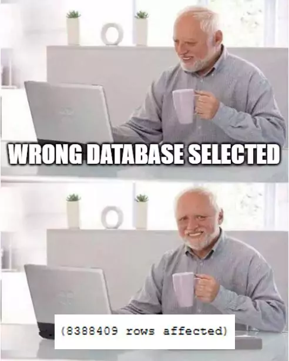

&shy;<!-- .element class="fragment fade-in" -->Database **initialization** and **migrations** need to be stored as **scripts in version control**.

&shy;<!-- .element class="fragment fade-in-with-next custom" -->Initializing databases:
- &shy;<!-- .element class="fragment highlight-current-blue" -->Most data management systems can initialize data stores, including **schemas** and **user credentials**, from automated scripts.
- &shy;<!-- .element class="fragment highlight-current-blue" -->Your script sets up the database **structure**, **instances**, **schemas**, and fills tables with **initial data** for application startup.

&shy;<!-- .element class="fragment fade-in-with-next custom" -->For a basic deployment of a **transient dataset**, the process is as follows:
- **Erase** what was there before.
- **Create** the database structure, database instances, schemas, etc.
- **Load** the database with data.

&shy;<!-- .element class="fragment fade-in" -->**Otherwise**, the existing data that has to be **migrated** as part of the deployment process.

---
## Incremental Change
**Applying CI/CD** to the data[base] is important as well.

------
### Versioning Your Database
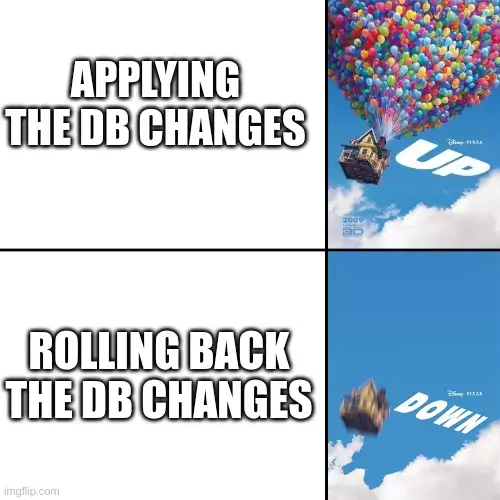

&shy;<!-- .element class="fragment fade-in-with-next custom" -->To **automate data migration**, begin by **versioning your database**. Create a **version table** and generate **two scripts** for each change:
- **Roll-forward (Up)**: Moves the database from version x to x + 1.
- **Roll-back (Down)**: Revert the database from version x + 1 to x.

&shy;<!-- .element class="fragment fade-in" -->During deployment, use a **tool** to **compare** the **deployed database version** with the **application's required database version**. Then it finds the **necessary scripts** for **migration** and run them **sequentially**:

<table class="fragment fade-in">
  <tr>
    <td>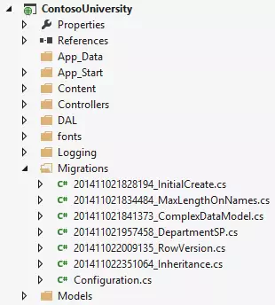</td>
    <td>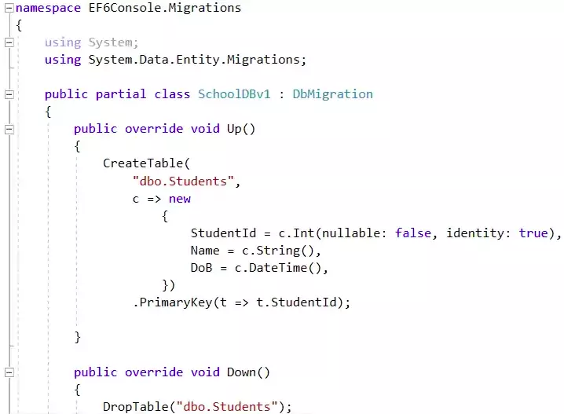</td>
    <td>
      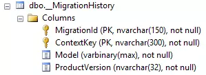
      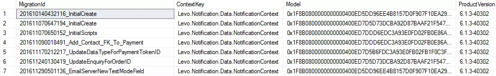
    </td>
  </tr>
</table>

&shy;<!-- .element class="fragment fade-in" -->There are **limits** to **moving databases back and forth**, especially when **changing the schema**. **Additive** changes are usually **okay**, but **subtractive** ones can lead to **difficulties** in **re-establishing lost relationships** between records.

------
### Managing Orchestrated Changes
In many organizations, they **integrate all applications** through a **single database** (although **SOA is recommended instead**):

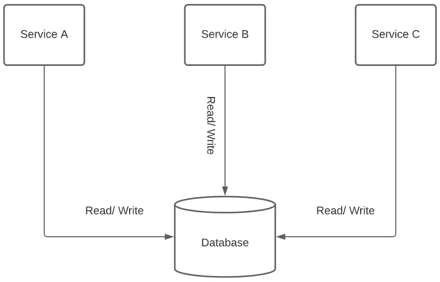

&shy;<!-- .element class="fragment fade-in" -->So, **modifying the database** can **affect other applications**. **Test** these changes in an **orchestrated environment** similar to production, including the **other applications** (Systems Integration Testing - SIT environment).

&shy;<!-- .element class="fragment fade-in" -->Finally, **collaborate** with the **teams maintaining other applications** to agree on permissible changes.

&shy;<!-- .element class="fragment fade-in" -->You can handle incremental change by having **applications support multiple database versions**, enabling **application-independent database migration** (also useful for **zero-downtime releases**).

---
## Rolling Back Databases and Zero-Downtime Releases

&shy;<!-- .element class="fragment fade-in" -->Two **common requirements** that add **extra constraints** to a production deployment are:
- &shy;<!-- .element class="fragment highlight-current-blue" -->The ability to **roll back without losing transactions** performed **since the upgrade**.
- &shy;<!-- .element class="fragment highlight-current-blue" -->Ensuring application **availability** according to the **SLA**, called **hot deployment** or **zero-downtime releases**.

------
### Rolling Back without Losing Data

&shy;<!-- .element class="fragment fade-in" -->Your roll-back scripts can usually be designed to **preserve any transactions** that occur **after the upgrade took place**.

&shy;<!-- .element class="fragment fade-in-with-next custom" -->**No** issues if your rollback scripts meet these criteria:
- &shy;<!-- .element class="fragment highlight-current-blue" -->They involve **schema** changes **without data loss** (e.g., normalization, denormalization, or moving a column).
- &shy;<!-- .element class="fragment highlight-current-blue" -->If the data deleted is **non-critical** and **understood only by the new system**.

&shy;<!-- .element class="fragment fade-in-with-next custom" -->When rolling back involves the following, **just running the scripts is not enough**:
- &shy;<!-- .element class="fragment highlight-current-blue" -->**Adding back** in data from temporary tables, risking **integrity constraint violations** with new **records added since upgrade**.
- &shy;<!-- .element class="fragment highlight-current-blue" -->**Deleting** new transactions, which the system **can't afford to lose**.

&shy;<!-- .element class="fragment fade-in-with-next custom" -->Solutions:
- &shy;<!-- .element class="fragment highlight-current-blue" -->**Store** and **cache** **vital transactions**, enabling **replay** when needed.
  - Easier with an **event-driven** application.
  - This method needs **careful design** and testing but can be worth it to prevent data loss during a rollback.
- &shy;<!-- .element class="fragment highlight-current-blue" -->**Blue-green deployments**
  - **Releasing** is switching user requests. **Without databse hot-backup support**, you may need **read-only mode**.
  - **Rolling back** is switching back to the old version and **reapplying transactions** before or after the next upgrade.

------
### Decoupling Application Deployment from Database Migration
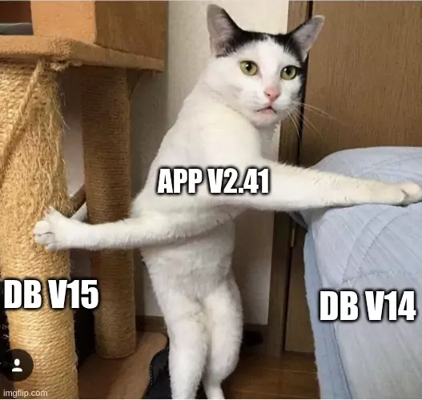

&shy;<!-- .element class="fragment fade-in-with-next custom" -->A third approach for managing hot deployments is that you **don't** have to **migrate your database with every app release**:
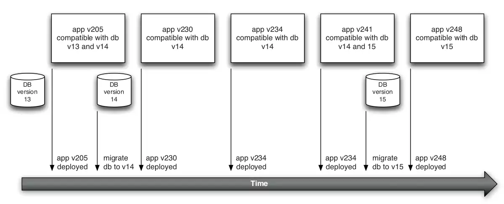

&shy;<!-- .element class="fragment fade-in" -->This helps when database **rollback is hard** (e.g. due to **big schema changes**). It **prevents data loss** and aids going back to an older software version. **Deploy** the **new app version**, ensure it **works** with the **old schema**, then **make database changes** confidently.

&shy;<!-- .element class="fragment fade-in" -->**Forward compatibility** is also useful for **common changes**. It lets **older app versions** work with **newer database schemas**, which is a **good default** for most changes, **adding new tables or columns** without altering existing structures when possible.

&shy;<!-- .element class="fragment fade-in" -->You can also use an **abstraction layer** with **stored procedures and views**. Modify the database objects while keeping the app **interface consistent** through these views and procedures. It's known as **"branch by abstraction"**.

---
## Managing Test Data
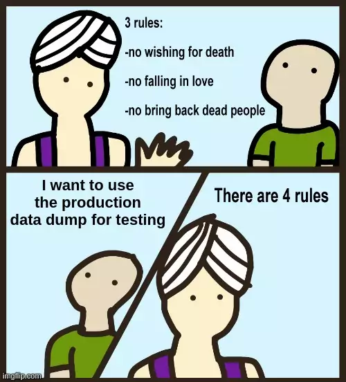

&shy;<!-- .element class="fragment fade-in" -->Which data simulates **typical system interactions**? What data covers **edge cases**? What data **triggers errors** to assess the application's responses?

&shy;<!-- .element class="fragment fade-in-with-next custom" -->This section will address **two concerns**:
- Test performance
  - &shy;<!-- .element class="fragment highlight-current-blue" -->In **unit tests**, **avoid databases**, or use in-memory DB.
  - &shy;<!-- .element class="fragment highlight-current-blue" -->For other tests, handle test data carefully, **avoid** using **production DB dumps** except in rare cases.
- Test isolation
  - &shy;<!-- .element class="fragment highlight-current-blue" -->Ideal tests have **controlled inputs** and clear outputs. But, **databases retain data** between tests, making starting conditions **uncertain** when test order is not controlled.

------
### Faking the Database for Unit Tests
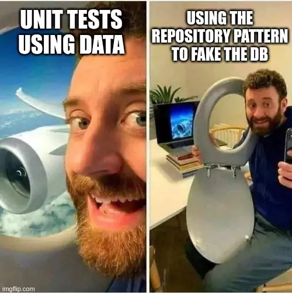

&shy;<!-- .element class="fragment fade-in-with-next custom" -->In unit tests, **replace services that talk to databases with test doubles**. If not possible (e.g., for testing these services):
- Replace your database access code with a test double (**Repository Pattern**)
  - 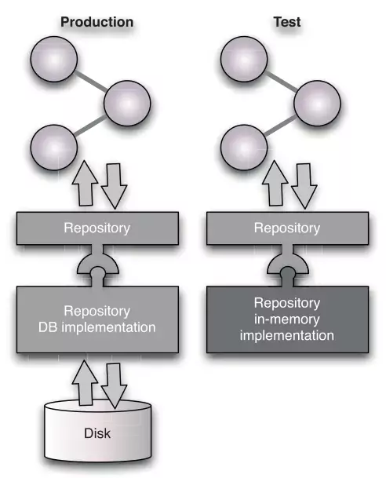
- &shy;<!-- .element class="fragment fade-in" -->Use in-memory relational database (e.g. H2, SqlLite, or JavaDB)
  - **Encourages more decoupled code**, **capable** of working with **two different database implementations**.
  - **Future changes** to a **newer version** or **different RDBMS** will be **easier**.

------
### Managing the Coupling between Tests and Data
For test data, each test needs a **known starting state** for **comparison after the test** to verify behavior of the SUT.

&shy;<!-- .element class="fragment fade-in-with-next custom" -->Three **test state management** approaches:
- &shy;<!-- .element class="fragment highlight-current-blue" -->**Test isolation**: Organize tests to keep each **test's data private** to itself.
  - Strongly **recommded**.
  - Enhances tests **flexability**.
  - Can run in **parallel**.
- &shy;<!-- .element class="fragment highlight-current-blue" -->**Adaptive tests**: Each test **evaluates its data environment** and **adapt its behavior** to suit the data it sees.
- &shy;<!-- .element class="fragment highlight-current-blue" -->**Test sequencing**: Tests run in a **specified order**, with each **relying on its predecessors' outputs as inputs**.

&shy;<!-- .element class="fragment fade-in" -->Both of the **later** apporaches **don't scale up** well. With **larger test suites and complex interactions**, they lead to **hard-to-find failures** and **obscure test interactions**, increasing **maintenance costs**.

------
### Test Isolation

&shy;<!-- .element class="fragment fade-in-with-next custom" -->Test isolation ensures tests are **atomic**, **independent**, and **not influenced by the others** [success/failure]. This can be achieved by:
- &shy;<!-- .element class="fragment highlight-current-blue" -->**Resetting** the database to its **initial state** **before each test**
  - You can create a **database transaction before** and **rollback after** the test.
- &shy;<!-- .element class="fragment highlight-current-blue" -->**Functional partitioning** of the data
  - For tests that need to **modify the state of the system**, use **unique test-specific names** for **created entities**, ensuring each test only works with its specific data.

------
### Setup and Tear Down
Well-isolated tests usually **need a setup** stage to **populate relevant test data** to the database, either through:
- A **new transaction** that's **rolled back** after the test.
- By **inserting test-specific records**.

&shy;<!-- .element class="fragment fade-in" -->**Adaptive tests** should assess the **data environment** in order to **establish the known starting position at startup**.

------
### Coherent Test Scenarios
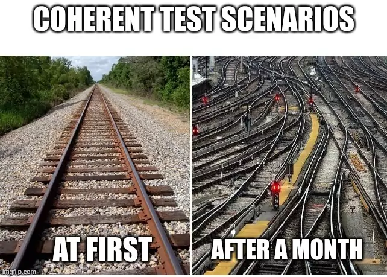

&shy;<!-- .element class="fragment fade-in-with-next custom" -->There's a temptation to create a **"story" for tests** to **maintain coherent data**, **reducing setup and teardown**:
- &shy;<!-- .element class="fragment highlight-current-blue" -->**Simplifies each test**, as it **doesn't** need to **handle** its **test data**.
- &shy;<!-- .element class="fragment highlight-current-blue" -->**Speeds** up the entire test suite by **minimizing data creation and destruction**.

&shy;<!-- .element class="fragment fade-in-with-next custom" -->But, it **tightly couples tests** due to the desire for a coherent story:
- &shy;<!-- .element class="fragment highlight-current-blue" -->**Designing** tests gets **harder** as the test **suite grows**.
- &shy;<!-- .element class="fragment highlight-current-blue" -->If **one test fails**, it can **cause subsequent tests** that rely on its outputs to **fail** as well.
- &shy;<!-- .element class="fragment highlight-current-blue" -->Business or technical **changes** can require **painful reworking** of the test suite.
- &shy;<!-- .element class="fragment highlight-current-blue" -->The sequential view of testing **doesn't align** with **reality of testing**. Typically, we need to **test** success, **failure**, and boundary conditions **at each steps**. We need to **run various tests** with **similar initial conditions**.

---
## Data Management and the Deployment Pipeline
What is the **test data** we need for commit, acceptance, and capacity **stages** in the **pipeline** and how to **manage it**?

------
### Data in Commit Stage Tests
&shy;<!-- .element class="fragment fade-in" -->**Struggling** to **set up test data** indicates a **need** for **improved design decomposition**.

&shy;<!-- .element class="fragment fade-in-with-next custom" -->We commonly isolate code for **creating test data instances** and **share them across multiple test cases**:
- A `CustomerHelper` or `CustomerFixture` class can simplify the creation of `Customer` objects for tests, ensuring consistent creation with default values for each `Customer`.

&shy;<!-- .element class="fragment fade-in" -->Aim to **minimize test-specific data** to what **directly influences the test's behavior**. This is the goal for every test.

------
### Data in Acceptance Tests
Again, the aim is to **reduce test dependence** on **large/complex data structures**. Create the **minimum data** to test the behavior.

&shy;<!-- .element class="fragment fade-in-with-next custom" -->Three types of data (**class boundaries** may **overlap** in specific tests):
- <!-- .element: class="fragment insides-fade-in-then-out custom" -->Test-specific data
  - &shy;<!-- .element class="fragment highlight-current-blue" -->**Influences** the **behavior** being tested and embodies the **specifics of the test case**.
  - &shy;<!-- .element class="fragment highlight-current-blue" -->Should be **unique**.
  - &shy;<!-- .element class="fragment highlight-current-blue" -->Should use test **isolation** strategies.
- <!-- .element: class="fragment insides-fade-in-then-out custom" -->Test reference data
  - &shy;<!-- .element class="fragment highlight-current-blue" -->**Necessary** for a test but has **minimal impact on the behavior** under test. It's a **supporting role**, not the main focus.
  - &shy;<!-- .element class="fragment highlight-current-blue" -->Can be managed by using **prepopulated seed data** that's **reused in multiple tests** to set up the general environment.
  - &shy;<!-- .element class="fragment highlight-current-blue" -->**Remains unaffected** by the the **tests**.
- <!-- .element: class="fragment insides-fade-in-then-out custom" -->Application reference data
  - &shy;<!-- .element class="fragment highlight-current-blue" -->**Irrelevant** to the **behavior** under test but **necessary** for the **application to start**.
  - &shy;<!-- .element class="fragment highlight-current-blue" -->Can be **any value at all**, **even null**, **as long as** they continue to **not impact the test** outcome.

&shy;<!-- .element class="fragment fade-in" -->**Dependency** on the application's **complete data universe** is a **mistake**. **Consider each test** with **some degree of isolation**, or the **whole suite** **fail with minor data changes**.

&shy;<!-- .element class="fragment fade-in-with-next custom" -->**Unlike commit tests**, it's **not advisable to use application code** [or database dumps] to **set the initial state** for the test. For these system-level tests, it's better to **use the application's API** to establish the correct state:
- &shy;<!-- .element class="fragment highlight-current-blue" -->**Bypassing business logic** or **using application code** cause **inconsistencies**. The **API** **ensures consistency** in acceptance tests.
- &shy;<!-- .element class="fragment highlight-current-blue" -->**Refactoring** the database/app **doesn't impact acceptance tests**, as they **don't alter the public API**, making tests **less fragile**.
- &shy;<!-- .element class="fragment highlight-current-blue" -->Our acceptance tests also serve as **tests for application's API**.

------
### Data in Capacity Tests
Capacity tests pose a **data scale challenge** for most applications, involving:
- &shy;<!-- .element class="fragment highlight-current-blue" -->Providing **sufficient volume of input data** for the test.
- &shy;<!-- .element class="fragment highlight-current-blue" -->**Supplying suitable reference data** for multiple cases under test simultaneously.

&shy;<!-- .element class="fragment fade-in" -->We **see capacity testing** as primarily an exercise in **rerunning acceptance tests**, but for **many cases** at the **same time**. For example, if your application handles orders, you'd expect to process numerous orders at once during capacity tests.

&shy;<!-- .element class="fragment fade-in" -->**Automate large data volumes generation**, both input and reference, using **tools** and **interaction templates**. They **scale the data** from an acceptance test to **create multiple "cases"**, allowing **numerous interactions** with the system **based on that single test**.

------
### Data in Other Test Stages
For **manual testing stages** like **exploratory** or **UAT**, there are **two approaches**:
- &shy;<!-- .element class="fragment highlight-current-blue" -->Run in a **minimal** set of tests/application **reference data** to enable the application to **start up** in an **empty initial state**.
- &shy;<!-- .element class="fragment highlight-current-blue" -->**Load a larger dataset** for scenarios **assuming** the **application has been in use for some time**.
  - **Avoid** using a complete **production database dump** for these scenarios.
  - We recommend creating a **customized dataset**, based either on:
    - A **subset** of the production data.
    - A dump of the database taken **after** a set of automated acceptance/capacity tests have been run.

---
## Summary
&shy;<!-- .element class="fragment fade-in" -->**Version** your **database** and **use tools** for **automated migrations**.

&shy;<!-- .element class="fragment fade-in" -->Aim for both **forward and backward compatibility** with **schema changes** to **separate data and application deployment**.

&shy;<!-- .element class="fragment fade-in" -->Ensure **tests create their required data** during **setup** and **partition it** to **prevent interference with concurrent tests**.

&shy;<!-- .element class="fragment fade-in" -->**Share setup data** between tests **only** for **application startup** and **some very general reference data**.

&shy;<!-- .element class="fragment fade-in" -->Use the **application's public API** to **set up** the desired test state whenever feasible.

&shy;<!-- .element class="fragment fade-in" -->**Avoid** using **production dataset dumps for testing**; create **custom datasets** from **smaller subsets of production data**, or from acceptance/capacity test runs.
