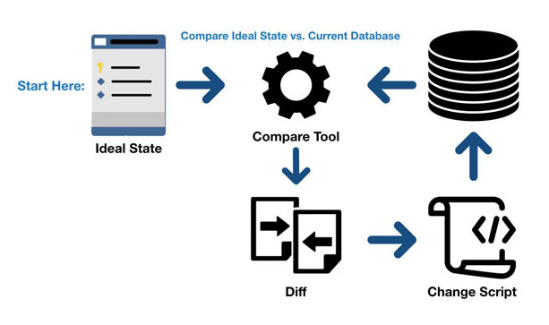
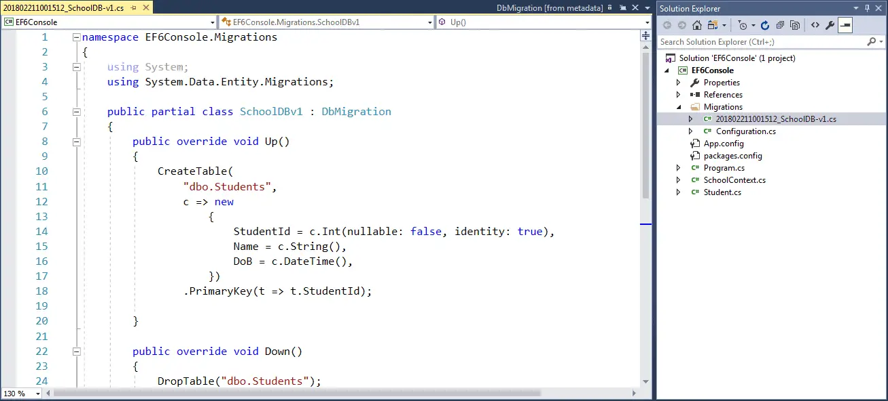
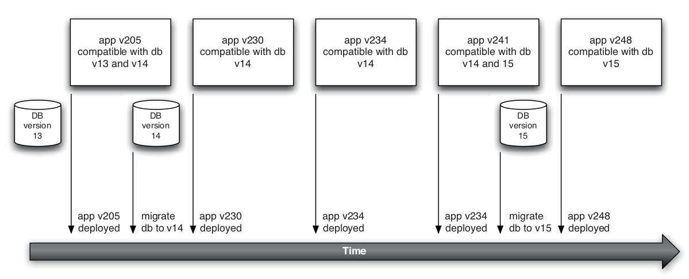
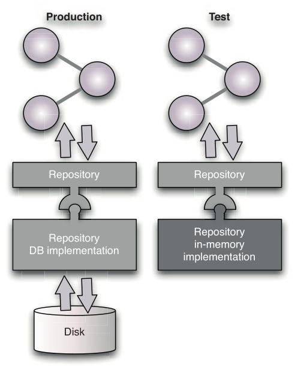

## Continuous Delivery: Managing Data
#### Database Scripting, Incremental Change, Rolling Back Databases and Zero-Downtime Releases, Managing Test Data, Data Management and the Deployment Pipeline

<small><strong>Time to Read:</strong> 12 Minutes</small>, <small><strong>Time to Present:</strong> 50 Minutes</small>
 
<small><strong>Created By:</strong> Alireza Roshanzamir</small>
 
<small><strong>Keywords:</strong> Continuous Delivery, Continuous Integration, DevOps, Build, Test, Release, Deployment, Automation, Version Control, Deployment Pipeline</small>
  
<small style="color: darkred"><small>Press **"F"** to go fullscreen; some slides may not display properly otherwise.</small></small>

---
## Introduction
**Data** and its **management** present pose particular problems for testing and deployment:
- Dealing with the sheer data volume is a significant issue. **Application behavior data (code and configs)** is typically **much smaller** than the **data storing its state**.
- Application **data's lifecycle** **differs from other system parts**; it must be **preserved** and often **outlasts the applications themselves**. This **preservation** and **migration** are crucial during system **deployments** or **rollbacks**.

Usually, we can **replace old code with new code** for a **fresh start**. However, this is **often impossible for data** in real-world systems.

After a system enters production, its data **grows** and becomes **highly valuable**, often the **most valuable part**. This poses challenges/risks when altering its structure/content.

Systems need changes as they grow. **Automating database migration** **reduces disruption** and **improves reliability**. Tools simplify this, allowing scripting in automated deployment and supporting **versioning** and **migration** across **database versions**.

In this session, we also address **test data management**. Many teams default to using a **production data dump** for acceptance, capacity, or even unit testing, which **has issues**, including **dataset size**. We provide alternative strategies.

---
## Database Scripting
Database **initialization** and **migrations** need to be stored as **scripts in version control**.

Initializing databases:
- Most data management systems can initialize data stores, including **schemas** and **user credentials**, from automated scripts.
- Your script sets up the database **structure**, **instances**, **schemas**, and fills tables with **initial data** for application startup.

For a basic deployment of a **transient dataset**, the process is as follows:
- **Erase** what was there before.
- **Create** the database structure, database instances, schemas, etc.
- **Load** the database with data.

**Otherwise**, the existing data that has to be **migrated** as part of the deployment process.

---
## Incremental Change
Applying CI/CD to the data[base] is important as well.

------
### Versioning Your Database
One effective way to **automate data migration** is by **versioning your database**. Start by creating a table for the database version. Whenever you **make changes**, create two scripts:
- **Roll-forward (Up)**: Moves the database from version x to x + 1.
- **Roll-back (Down)**: Revert the database from version x + 1 to x.

During deployment, use a **tool** to **compare** the **deployed database version** with the **application's required database version**. Then it finds the **necessary scripts** to **migrate** the database from current version to the required one and **run them sequentially**:

There are **limits** to **moving databases back and forth**, especially when **changing the schema**. **Additive** changes are usually **okay**, but **subtractive** ones can lead to **difficulties** in **re-establishing lost relationships** between records.

------
### Managing Orchestrated Changes
In many organizations, they **integrate all applications** through a **single database** (although **SOA is recommended instead**).

So, **modifying the database** can **affect other applications**. **Test** these changes in an **orchestrated environment** similar to production, including the **other applications** (Systems Integration Testing - SIT environment).

Finally, **collaborate** with the **teams maintaining other applications** to agree on permissible changes.

You can handle incremental change by having **applications support multiple database versions**, enabling **application-independent database migration** (also useful for **zero-downtime releases**).

---
## Rolling Back Databases and Zero-Downtime Releases
Two **common requirements** that add **extra constraints** to a production deployment are:
- The ability to **roll back without losing transactions** performed **since the upgrade**.
- Ensuring application **availability** according to the **SLA**, called **hot deployment** or **zero-downtime releases**.

------
### Rolling Back without Losing Data
Your roll-back scripts can usually be designed to **preserve any transactions** that occur **after the upgrade took place**.

**No** issues if your rollback scripts meet these criteria:
- They involve **schema** changes **without data loss** (e.g., normalization, denormalization, or moving a column).
- If the data deleted is **non-critical** and **understood only by the new system**.

When rolling back involves the following, **just running the scripts is not enough**:
- **Adding back** in data from temporary tables, risking **integrity constraint violations** with new **records added since upgrade**.
- **Deleting** new transactions, which the system **can't afford to lose**.

Solutions:
- **Store** and **cache** **vital transactions**, enabling **replay** when needed.
  - Easier with an **event-driven** application.
  - This method needs **careful design** and testing but can be worth it to prevent data loss during a rollback.
- **Blue-green deployments**
  - **Releasing** is switching user requests. **Without databse hot-backup support**, you may need **read-only mode**.
  - **Rolling back** is reverting to the old version and **reapplying transactions** before or after the next upgrade.
  - In **data-heavy systems**, backup and restore can't work without causing **too much downtime**, making it infeasible.

------
### Decoupling Application Deployment from Database Migration
A third approach for managing hot deployments is that you **don't** have to **migrate your database with every app release**:

This method is useful when reverting the database is difficult (such as due to significant schema changes), potentially causing data loss and hampering a return to an earlier software version. We deployed the new app version, ensured it worked with the old database schema, and then implemented the database changes with confidence.

Forward compatibility is also not a generic solution, though for the run-of-the-mill, normal changes it is a useful strategy to adopt. It is the ability of an earlier version of an application to work against the database schema of a later version. It is best to adopt this as the default approach for most changes. That is, most changes should be additive, adding new tables or columns to our database, but not changing existing structures, where possible.

Another approach to managing database changes and refactorings is to use an abstraction layer, in the form of stored procedures and views. It is possible to make changes to the underlying database objects while keeping the interface presented to the application by the views and stored procedures constant. This is an example of "branch by abstraction".

---
## Managing Test Data
What data will allow us to simulate common interactions with the system? What data represents edge cases that will prove that our application works for unusual inputs? What data will force the application into error conditions so that we can evaluate its response under those circumstances?

There are two concerns that we will highlight in this section:
- Test performance: In the case of unit tests, that means either not running against a database at all, or running against an in-memory database. For other types of tests, it means managing test data carefully, and certainly not using a dump of the production database except in a few limited cases.
- Test isolation: An ideal test runs in a well-defined environment whose inputs are controlled so that we can easily evaluate its outputs. A database, on the other hand, is a durable store of information that allows changes to persist between test invocations. This can make the starting conditions unclear, particularly when you may have no direct control over the execution order of your tests, which is usually the case.

------
### Faking the Database for Unit Tests
Usually unit tests will inject test doubles in place of services that talk to databases. If this is not possible (for example, if you want to test these services), there are two other strategies that you can apply:
- Replace your database access code with a test double (Repository Pattern)

  
- Using in-memory relational database (e.g. H2, SqlLite, or JavaDB)
  - Encourages code to be written in a slightly more decoupled way, at least to the degree that it will work against two different database implementations.
  - Future changes-to a newer version, or even perhaps to a different RDBMS vendor-will be easier to accomplish.

------
### Managing the Coupling between Tests and Data
When it comes to test data, it is important that each individual test in a test suite has some state on which it can depend. Only when the starting state is known can you compare it against the state after the test has finished, and thus verify the behavior under test.

Three approaches to managing state for tests:
- Test isolation: Organize tests so that each test’s data is only visible to that test.
  - Strongly recommded.
  - Isolating tests from one another makes them more flexible.
  - Capable of being run in parallel to optimize test suite performance.
- Adaptive tests: Each test is designed to evaluate its data environment and adapt its behavior to suit the data it sees.
- Test sequencing: Tests are designed to run in a known sequence, each depending, for inputs, on the outputs of its predecessors.

Both of the other apporaches don’t scale up well. As the suite of tests becomes larger and the interactions it embodies more complex, both of these strategies tend to result in failures that are very hard to detect and correct. Interactions between tests become increasingly obscure, and the cost of maintaining a working suite of tests begins to grow.

------
### Test Isolation
Test isolation is a strategy for ensuring that each individual test is atomic. That is, it should not depend on the outcome of other tests to establish its state, and other tests should not affect its success or failure in any way.
- The simplest approach is to ensure that, at the conclusion of the test, you always return the data in the database to the state it was in before the test was run.
  - Create a transaction at the beginning of the test, perform all of the operations and interactions with the database that we require within that transaction, and at the conclusion of the test (whether it passed or not), we roll back the transaction.
- Functional partitioning of the data
  - For tests that need to modify the state of the system as an outcome, make the principal entities that you create in your tests follow some test-specific naming convention, so that each test will only look for and see data that was created specifically for it.

------
### Setup and Tear Down
For well-isolated tests, a setup stage is usually needed to populate the database with relevant test data. This may involve creating a new transaction that will be rolled back at the conclusion of the test, or simply writing a few records of test-specific information.

Adaptive tests will be evaluating the data environment in order to establish the known starting position at startup.

------
### Coherent Test Scenarios
The intent of this approach is that the data created is coherent, so setting up and tearing down of test cases is minimized.

This should mean that each test is, in itself, a little simpler, since it is no longer responsible for managing its own test data.

The problem with this strategy is that in striving for a coherent story we tightly couple tests together:
- Tests become more difficult to design as the size of the test suite grows.
- When one test fails, it can have a cascade effect on subsequent tests that depend on its outputs, making them fail too.
- Changes in the business scenario, or the technical implementation, can lead to painful reworking of the test suite.
- We want to explore what happens for success, what happens for failures, what happens for boundary conditions, and so on (we will necessarily have to establish and reestablish the test data environment).

---
## Data Management and the Deployment Pipeline
What is the test data that we need for each of the testing stages (commit, acceptance, and capacity) in the deployment pipeline, and how should we manage it?

------
### Data in Commit Stage Tests
If you find yourself working hard to establish the data for a particular test, it is a sure indicator that your design needs to be better decomposed.

We will often isolate the code creating test instances of such commonly used data structures and share them between many different test cases.

We may have a `CustomerHelper` or `CustomerFixture` class that will simplify the creation of `Customer` objects for our tests, so they are created in a consistent manner with a collection of standard default values for each `Customer`.

Our objective is to minimize the data specific to each test to that which directly impacts the behavior the test is attempting to establish. This should be a goal for every test that you write.

------
### Data in Acceptance Tests
Again, the goal is to minimize the dependence of our tests on large complex data structures as far as possible.

We should be creating just enough data to test the expected behavior of the system.

Three kinds of data (the boundaries between classes of data may be somewhat blurred in the context of a specific test):
- Test-specific data: This is the data that drives the behavior under test. It represents the specifics of the case under test.
  - Should be unique.
  - Should use test isolation strategies.
- Test reference data: There is often a second class of data that is relevant for a test but actually has little bearing upon the behavior under test. It needs to be there, but it is part of the supporting cast, not the main player.
  - Can be managed by using prepopulated seed data that is reused in a variety of tests to establish the general environmen.
  - Remains unaffected by the operation of the tests.
- Application reference data: Often, there is data that is irrelevant to the behavior under test, but that needs to be there to allow the application to start up.
  - Can be any value at all, even null values, provided the values chosen continue to have no effect on the test outcome.

It is important to be able to consider each test with some degree of isolation, or the entire test suite becomes too brittle and will fail constantly with every small change in data.

Unlike commit tests, we do not recommend using application code or database dumps to put the application into the correct initial state for the test. Instead, in keeping with the system-level nature of the tests, we recommend using the application’s API to put it into the correct state:
- Using the application code, or any other mechanism that bypasses the application’s business logic, can put the system into an inconsistent state. Using the application’s API ensures that the application is never in an inconsistent state during acceptance tests.
- Refactorings of the database or the application itself will have no effect on the acceptance tests since, by definition, refactorings do not alter the behavior of the application’s public API. This will make your acceptance tests significantly less brittle.
- Your acceptance tests will also serve as tests of your application’s API.

------
### Data in Capacity Tests
Capacity tests present a problem of scale in the data required by most applications:
- The ability to deliver a sufficient volume of input data for the test
- The provision of suitable reference data to support many cases under test simultaneously

We see capacity testing as primarily an exercise in rerunning acceptance tests, but for many cases at the same time. If your application supports the concept of placing an order, we would expect to be placing many orders simultaneously when we are capacity-testing.

Automate the generation of these large volumes of data, both input and reference, using mechanisms like interaction templates.

For capacity testing, we use tools that will take the data associated with a selected acceptance test and scale it up to many different “cases” so that we can apply many interactions with the system based on that one test.

------
### Data in Other Test Stages
For manual testing stages, such as exploratory testing or user acceptance testing environments, there are a couple of approaches:
- Run in a minimal set of test and application reference data to enable the application to start up in an empty initial state.
- Load a much larger set of data so that testers can perform scenarios that assume the application has been in use for some time.
  - We do not recommend taking a dump of the whole production database for these scenarios.
  - We recommend creating a customized dataset to use for manual testing, based either on a subset of the production data, or on a dump of the database taken after a set of automated acceptance or capacity tests have been run.

---
## Summary
Version your database and use a tools to manage migrations automatically.

Strive to retain both forward and backward compatibility with schema changes so that you can separate data deployment and migration issues from application deployment issues.

Make sure tests create the data they rely on as part of the setup process, and that data is partitioned to ensure it does not affect other tests that might be running at the same time.

Reserve the sharing of setup between tests only for data required to have the application start, and perhaps some very general reference data.

Try to use the application’s public API to set up the correct state for tests wherever possible.

In most cases, don’t use dumps of the production dataset for testing purposes. Create custom datasets by carefully selecting a smaller subset of production data, or from acceptance or capacity test runs.
