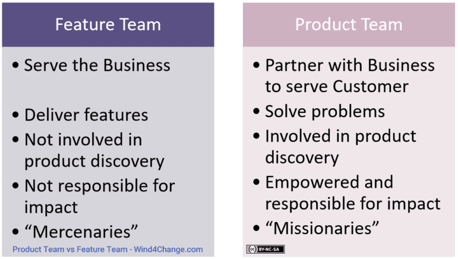

## Continuous Delivery: Managing Components and Dependencies
#### Keeping Application Releasable, Dependencies, Components, Managing Dependency Graph, Managing Binaries</style>

<small><strong>Time to Read:</strong> ? Minutes</small>, <small><strong>Time to Present:</strong> ? Minutes</small>
 
<small><strong>Created By:</strong> Alireza Roshanzamir</small>
 
<small><strong>Keywords:</strong> Continuous Delivery, Continuous Integration, DevOps, Build, Test, Release, Deployment, Automation, Version Control, Deployment Pipeline</small>
  
<small style="color: darkred"><small>Press **"F"** to go fullscreen; some slides may not display properly otherwise.</small></small>

---
## Introduction
In CD, you should maintain a **releasable application** even during **major refactoring** or **adding complex features**. Using **branching** in version control may **appear as a solution**, but we believe it's **not the right answer**.

A key technique is **componentization** of larger apps. We'll delve into **building** and **managing** multi-component projects in detail.

Component is a **loaded** term in software. Here, it means a fairly **large code structure** within an app with a well-defined **API** that can be replaced with **another implementation**.

Opposite to **component-based (modular)** systems is **monolithic** ones **without clear boundaries**, **lacking encapsulation**, have **tight coupling** between unrelated structures, and **violating the Law of Demeter**.

In **Windows**, a component is normally packaged as a **DLL**. In **UNIX**, it might be an **SO** file, and in **Java**, it's likely a **JAR** file.

Many projects are **fine** with **one** version control **repository** and **a basic deployment pipeline**. But some have turned into **unmanageable code messes** because **no one** decided to create **distinct components** when it was feasible.

Build system **aspects**:
- Deployment Pipeline
- Branches
- Components

**Large systems** often **combine all three**. Components may have **dependencies** and use external libraries, each with **multiple release branches**. Creating a **working system** from these components can be **complex**, but necessary **for the deployment pipeline**.

---
## Keeping Application Releasable
These processes results in **weeks or months release gaps**, **prevents** the application to **always be in a releasable state**:
- **Major architectural changes**: During these activities the application is not releasable.
- **Before release**: Teams focus on bugfixing, not new features. After release, a branch is made, and new development starts on the main trunk.

One approach is creating branches, merged when work's done, to keep mainline releasable. But this **isn't ideal** as **CI isn't happening on branches**.

Instead, we suggest everyone **checks in on the mainline**. But how?
- **Hide** new functionality **until completion**.
- Implement changes gradually in **small**, **releasable** increments.
- Use **branch by abstraction** for significant codebase alterations.
- Use **components** to decouple parts of your application that **change at different rates** (we'll discuss later).

------
### Hide New Functionality Until It Is Finished
What if a feature (a set of features) takes a long time to develop?
- **- Branching**: Start development on a new branch and integrate when the functionality is complete to avoid disrupting ongoing system work, which could delay its release.
- **+ Deploying semi-completed functionalities (with rest of the system)**: Add new features but hide them from users.

For example, introducing hotel bookings on a travel website through a **separate URL** (e.g., /hotel), **deploying with rest** of the system, but **controlling user access** using web server settings.

You can also control access with **configuration settings**. For example, **have two menus**, one with the new feature and one without. Use a setting to **switch** between them via **CLI** or **config (deploy-time or runtime)**. It is also valuable for running automated tests.

It is good practice because it allows **CI** and **testing** of the **entire** system, ensuring **new components** can be **deployed alongside existing software** from the beginning.

------
### Make All Changes Incrementally
**Branching** claims that developers can make large, high-level changes, break the application, and reconnect later to work faster. However, **in practice**, **reintegration can be challenging**, especially with **concurrent team work** and **larger changes**.

**Breaking large changes** into **small**, **incremental** ones can be **tough**, but it ensures that the **application works**, prevents future pains, and allows for flexibility to **stop at any point if necessary**, avoiding the sunk cost of abandoning a big change midway.

**Analysis** is vital for breaking large changes into smaller ones, using a process **like breaking down requirements into smaller tasks**.

------
### Branch by Abstraction
Some changes are **too hard to make incrementally**. Therefore, consider **branching by abstraction** as an **alternative to branching**:
1. Create an **abstraction** over the **part to change**.
2. Refactor the system to **use this abstraction**.
3. Develop a **new implementation** separately.
4. Update the abstraction layer to **delegate to the new implementation**.
5. **Remove** the **old** implementation.
6. **Remove** the **abstraction** if **no longer needed**.

Branch by abstraction can be **high-level** (changing an entire persistence layer) or **low-level** (swapping classes with the strategy pattern). **Dependency injection** also supports it. The **key** is **finding or creating points** for an abstraction layer.

It's ideal for moving from a **messy monolithic to a modular one**. **Pick the part** to separate or rewrite, **manage entry points (facade pattern)**, and **use branch by abstraction** to keep working with the old code while you create a new, modularized version of the same functionality (known as **"sweeping it under the rug"** or **"Potemkin village"**).

At times, finding a **good seam** in code is **tough**, and **branching** is the **only option**. Use it **only to prepare for branch by abstraction**.

For **big changes** (using **any** technique), **rely** on a **full acceptance test** suite. **Unit/component** tests **can't** fully **protect business** functionality during major changes.

---
## Dependencies
A dependency occurs when one software piece **depends** on another to **build** or **run**.

Regarding dependencies, there are **distinctions** between:
- Components and libraries
    - Libraries are software packages **your team doesn't control**, **chosen for use** and **updated infrequently**.
    - Components are software parts your **application relies on**, **made by your team or other teams in your organization**, and **updated more frequently**.
- Build-time and runtime dependencies
    - Build-time dependencies are required during application **compilation and linking (if necessary)**.
    - Runtime dependencies are needed **when the application runs** and performs its regular function.

**Managing dependencies can be hard**. We'll start with an overview of **common runtime library dependency issues**.

------
### Dependency Hell (DLL Hell)
Dependency hell occurs when an application **depends on one version** but is **deployed** with a **different version or none** at all:
- In **older Windows**, DLL hell was common due to **shared libraries (DLLs) lacking versioning**, **causing overwrites of old versions**.
- The **.NET** introduced **versioned assemblies** and a **global assembly cache (GAC)** to address DLL hell on Windows.
- Linux uses **integers in .so files** and **soft links** for version management, needing **testing** or **source compilation** for **compatibility**.
- **Static compilation** bundles dependencies at **compile time** but leads to **large binaries** and **OS version coupling**.
- **Dynamic** languages like Rails **ship frameworks and libraries** with apps to **allow different versions** to coexist.
- **Java** faces **runtime dependency** issues due to **classloader limits**, addressed by the OSGi framework, but managing dependencies at build time is crucial.
- The **diamond dependency** issue arises when an app depends on **two libraries** with **different versions of the same underlying library**, potentially causing runtime problems.

------
### Managing Libraries
Two ways to manage libraries in software projects:
- Check them into version control
  - Suitable for small projects.
  - Traditionally, a lib directory is used for this purpose.
  - Use nunit-2.5.5.dll instead of nunit.dll.
  - Over time, the repository may grow large and messy.
  - Managing transitive dependencies across projects is painful, while package managers aim to address this issue.
- Declare and use tools like Maven or Ivy to download libraries from the Internet or (preferably) your organization's repository
  - 
  - Transitively resolving dependencies on other projects and avoiding inconsistencies in the project dependency graph.
  - Local caching.
  - Try to maintain your own artifact repository (Nexus, JFrog, etc.).
    - Simplifies library auditing and avoid legal issues, like using GPL-licensed libraries in BSD-licensed software.

**Organize** dependencies into **files/subdirectories/sections** for **build-time**, **test-time**, and **runtime** as well as for **testing**, **linting**, **building (app and docs)**, **development**, **packaging**, and **running** to **avoid duplication** and **improve developer convenience**.

------
### Dependency Pinning (Locking)
Dependency pinning means **fixing** a **library's version** to ensure **consistency** and **prevent updates**. This can also be done **recursively** for project dependencies, keeping the **entire tree locked** to specific versions:

<table>
  <tr>
    <th>Tool/Technology</th>
    <th>Direct Dependencies</th>
    <th>Pinned [Recursive] Dependencies</th>
  </tr>
  <tr>
    <td>Python/Pip/Pip-tools</td>
    <td><pre><code>portion>=2.2.0,&lt;3</pre></code></td>
    <td>
      <pre><code>portion==2.4.1 \
    --hash=sha256:9dcbf1808898f440aed304a5e9f0742a2859eca3b0ac7f1f58e50502852a8ef9 \
    --hash=sha256:e4b3d7a394382bed97de0d36458ba62d11a0cbbc01ea13163c2bbde5da6b4eba
    # via -r requirements.txt
sortedcontainers==2.4.0 \
    --hash=sha256:25caa5a06cc30b6b83d11423433f65d1f9d76c4c6a0c90e3379eaa43b9bfdb88 \
    --hash=sha256:a163dcaede0f1c021485e957a39245190e74249897e2ae4b2aa38595db237ee0
    # via portion</code></pre>
    </td>
  </tr>
  <tr>
    <td>Docker</td>
    <td><pre><code>FROM python:3</pre></code></td>
    <td><pre><code>FROM python:3.9.18-slim@sha256:f8bab700e49d929b44a0d95ea78617ab24d5e6028640f78e27ef20183ac2e54d</code></pre></td>
  </tr>
  <tr>
    <td>Java/Gradle</td>
    <td>
      <pre><code>org.springframework:spring-beans:[5.0,6.0)</code></pre>
    </td>
    <td>
      <pre><code>org.springframework:spring-beans:5.0.5.RELEASE=compileClasspath, runtimeClasspath
org.springframework:spring-core:5.0.5.RELEASE=compileClasspath, runtimeClasspath
org.springframework:spring-jcl:5.0.5.RELEASE=compileClasspath, runtimeClasspath
empty=annotationProcessor</code></pre>
    </td>
  </tr>
</table>

  
Note

  Mention these considerations with the Debian packages and repositories:
  <ul>
    <li>Most standard repositories remove the old versions of a single package. So, the pinned version may not work in the future.</li>
    <li>Some repositories use version in the package name to support installing multiple versions at the same time (e.g. python packages in the deadsnakes repository).</li>
  </ul>

------
### Application vs Library
When developing a **library**:
- Support a **range of third-party versions** for **compatibility in various** environments.
- **Enforcing a specific version** on clients can **lead to conflicts**.
- **Pinning** is used only during **development** for **faster dependency resolution** (**avoiding backtracking** the graph space).

When developing [and deploying] an **application**:
- **Pin or lock the versions** of the third-party libraries used, specifying exact versions.
- It **enhances reliability and confidence** by reducing the risk of unexpected issues.
- For **shared environments with multiple apps**, consider **isolation if different library versions can't coexist**.

------
### Dependency Refactoring
A valuable feature of dependency managers like Maven, Pants/Pip, etc., is their ability to identify **undeclared or unused declared dependencies** in your project.

**Consolidate common dependencies** (names or only versions) to **avoid duplication**. If your dependency manager lacks direct support, create a **dummy project containing these dependencies** and have your component depend on it:

<table>
  <td>
    Extracting [only] common dependency <strong>versions</strong> in the parent project
    <pre><code><project>
<modelVersion>4.0.0</modelVersion>
<parent>
<groupId>com.continuousdelivery</groupId>
<artifactId>parent</artifactId>
<version>1.0.0</version>
</parent>
<artifactId>simple</artifactId>
<packaging>jar</packaging>
<version>1.0-SNAPSHOT</version>
<name>demo</name>
<url>http://maven.apache.org</url>
<dependencies>
<dependency>
<groupId>junit</groupId>
<artifactId>junit</artifactId>
<scope>test</scope>
</dependency>
</dependencies>
</project></pre></code>
  </td>
  <td>
    Specifying another Pom file as a dependency
    <pre><code><project>
...
<dependencies>
...
  <dependency>
    <groupId>com.thoughtworks.golive</groupId>
    <artifactId>parent</artifactId>
    <version>1.0</version>
    <type>pom</type>
  </dependency>
</dependencies>
</project></code></pre>
  </td>
  <td>
    Including another requirements (using -r)
    <pre><code>-e .[all]
-r requirements-tests.txt
-r requirements-docs.txt
uvicorn[standard] >=0.12.0,&lt;0.23.0
pre-commit >=2.17.0,&lt;4.0.0
playwright</code></pre>
  </td>
</table>

---
## Components
Software systems consist of a collection of components. These components may be DLLs, JAR files, OSGi bundles, Perl modules, or something else.

Most applications start off as a single component. Some start off as two or three (for example, a client-server application).

Unless these relationships are managed effectively, it can compromise the ability to use them as part of a continuous integration system.

------
### How to Divide a Codebase into Components
A component is reusable, replaceable with something else that implements the same API, independently deployable, and encapsulates some coherent set of behaviors and responsibilities of the system.

Lower bound: A component should have a certain level of complexity before it can be considered an independent piece of your application (a single class is not considered a component and deployed independently).

Upper bound: Our aim in dividing a system into components is to increase our efficiency as a team. There are several reasons why components make the software development process more efficient:
1. They divide the problem into smaller and more expressive chunks.
2. Components often represent differences in the rates of change of different parts of the system, and have different lifecycles.
3. They encourage us to design and maintain software with clear delineation of responsibilities, which in turn limits the impact of change, and makes understanding and changing the codebase easier.
4. They can provide us with additional degrees of freedom in optimizing our build and deployment process.

A significant feature of most components is that they expose an API of some form: dynamic linking, static linking, a web service, file exchange, message exchange, and so forth.

It is the degree of coupling between components, both in terms of interface and behavior, that adds complexity when they are separated and treated as independent units in a build and deployment process.

Reasons to separate out a component from your codebase:
1. Part of your codebase needs to be deployed independently (for example, a server or a rich client).
2. You want to turn a monolithic codebase into a core and a set of plugins, perhaps to replace some part of your system with an alternative implementation, or to provide user extensibility.
3. The component provides an interface to another system (for example a framework or a service which provides an API).
4. It takes too long to compile and link the code.
5. It takes too long to open the project in the development environment.
6. Your codebase is too large to be worked on by a single team.
  - If you need more than ten people to develop at the speed you need to, one very effective way to do this is to divide your system into loosely coupled components, and divide the teams too.

We do not recommend making teams responsible for individual components. This is because in most cases, requirements don't divide along component boundaries. In our experience, cross-functional teams in which people develop features end-to-end are much more effective. Although one team per component may seem more efficient, this is not in fact the case:
  - It is often hard to write and test requirements for a single component in isolation, since usually implementing a piece of functionality will touch more than one component. If you group teams by component, you thus require two or more teams to collaborate to complete a feature, automatically adding a large and unnecessary communication cost.
  - People in component-centered teams tend to form silos and optimize locally, losing their ability to judge what is in the best interest of the project as a whole.
  - One of the more serious dangers of having a team per component is that the application as a whole won't work until the end of the project because nobody has the incentive to integrate the components.

It is better to split teams up so that each team takes on one stream of stories (perhaps all with a common theme), and touches whatever components they need to in order to get their work done:
- Organize teams by functional area rather than by component.
  - 
- Ensure that everybody has the right to change any part of the codebase.
- Rotate people between teams regularly.
- Ensure that there is good communication between teams.
- Making all the components work together is everybody's responsibility, not just that of the integration team.
- Try to move from Feature Team to Product Team
  - 

Two common extreme failings:
- Components everywhere
- The one component to rule them all

Conway's Law: Organizations which design systems . . . are constrained to produce designs which are copies of the communication structures of these organizations:
- Open source projects where developers communicate only by email tend to be very modular with few interfaces.
- A product developed by a small, colocated team will tend to be tightly coupled and not modular.

Be careful of how you set up your development team-it will affect the architecture of your application (the Reverse Convey Maneuver).

&shy;<!-- .element: class="fragment fade-in-with-next custom" -->You can find more information in the following books and articles:
<table>
  <tr>
    <td></td>
    <td>
      Exploring the Duality between Product and Organizational Architectures: A Test of the "Mirroring" Hypothesis
       
      <small>by Alan MacCormack, John Rusnak, Carliss Baldwin</small>
    </td>
  </tr>
  <tr>
    <td></td>
    <td>
      Clean Architecture: A Craftsman's Guide to Software Structure and Design (Robert C. Martin Series)
       
      <small>by by Robert Cecil Martin</small>
    </td>
  </tr>
  <tr>
    <td></td>
    <td>
      Principles of Package Design: Creating Reusable Software Components
       
      <small>by Matthias Noback</small>
    </td>
  </tr>
</table>

------
### Pipelining Components
The simplest approach, and one that scales up to a surprising degree, is to have a single pipeline for your entire application and components. Every time a change is committed, everything is built and tested.

We would recommend building your system as a single entity until the process of getting feedback becomes too slow.

There is always some additional overhead to the management of a component-based build.

However, realistically there are many circumstances that benefit from splitting your system into several different pipelines:
- Parts of your application that have a different lifecycle (perhaps you build your own version of an OS kernel as part of your application, but you only need to do this once every few weeks).
- Functionally separate areas of your application that are worked on by different (perhaps distributed) teams may have components specific to those teams.
- Components that use different technologies or build processes.
- Shared components that are used by several other projects.
- Components that are relatively stable and do not change frequently.
- It takes too long to build your application, and creating builds for each component will be faster (but beware, the point at which this becomes true is much later than most people think).

Once the binaries (libraries, executables, etc.) have passed through their own mini release process (you will need to publish them to an artifact repository), they are ready for promotion to an integration build (more on this in the next section).

In general, the guiding principle should be to minimize the number of builds that you operate.

------
### The Integration Pipeline
The integration pipeline:
1. Takes as its starting point the binary outpu from each of the components.
2. Create a package (or packages) suitable for deployment by composing the appropriate collections of binaries.
3. Deploy the resulting application to a production-like environment and run smoke tests against it to give early indication of any basic integration problems (fail fast).
4. Move on to a conventional acceptance test stage, running whole application acceptance tests in the usual way.

Principles:
- Fast feedback
  - Feedback can be compromised by long pipelines, or chains of pipelines. If you find yourself in this situation and you have sufficient hardware, one solution is to trigger downstream pipelines as soon as binaries are created and the unit tests pass.
- Provide visibility into the status of the build for all interested parties
  - Backward: Ability to trace back from an integration build to the versions of each component that contributed to it.
  - Forward: The team working on the components should have visibility into which versions of their component actually ended up in a green integration pipeline (and can thus be considered good for integration). Only these versions of the components are in fact really "green."

If several components change between one run of the integration pipeline and the next, it is probable that it will spend much of its time broken:
- The best and simplest approach: Build every single possible combination of the good versions of your components. It's good when:
  - Your components don't change that often.
  - you have sufficient computing power on your build grid, you can do this.
- The next good approach: Build as many versions of your application as you can:
  - Takes the latest version of every component and assembles your application as frequently as it can.
  - If this operation is sufficiently fast, you can run a short smoke test suite against each version of your app.
  - You could then have some manual way to say "Assemble these and create an instance of my integration pipeline with them".

---
## Managing Dependency Graphs
It is vital to version dependencies, including libraries and components.

Components can have dependencies on other components, including third-party libraries. If you draw a diagram of the dependencies between components, it should be a directed acyclic graph (DAG).

If your graph has cycles you have a pathological dependency problem, which we'll address shortly.

------
### Building Dependency Graphs
We refer to a component further to the left of the diagram as an "upstream" dependency, and a component further to the right as a "downstream" dependency (CDS pricing library is a third-party):

Each component could have its own pipeline, triggered by changes in that component's source code or by changes to any upstream dependency. Downstream dependencies will be triggered by this component passing all of its automated tests.

When an upstream component changes, it triggers a recursive rebuild and test of itself and all downstream components respectively. If any immediate/intermediate upstream fail, downstreams are not initiated.

When a change is made to the framework and the pricing engine. In this case, the whole graph needs to be rebuilt. But there are several possible outcomes, each with its own considerations:
- The happy path is that all three intermediate components pass with the new versions of the framework and the CDS pricing library.
- But what if the settlement engine fails? Clearly the portfolio management application should not build against the new (but broken) version of the framework. However, you might well want the portfolio management application to build with the new version of the pricing engine, which (crucially) should be built against the new version of the CDS pricing library and the old (known good) version of the framework. Of course now you're in trouble, because no such version of the pricing library exists.

The most important constraint on these scenarios is that the portfolio management application should only build against one version of the framework. We particularly don't want to end up with a version of (say) the pricing engine built against one version of the framework, and the settlement engine built against another version. This is the classic "diamond dependency” problem-which is the build-time analogue of the runtime "dependency hell” problem.

------
### Pipelining Dependency Graphs
The key elements of the pipeline are that the team must get feedback as rapidly as possible on any breakages, and that we should obey the rules for building dependencies described above:

Features:
- To increase the speed of feedback, dependent projects are triggered once the commit stage of each project's pipeline is complete.
- All of the triggers are automatic (with the exception of deployments to the manual testing and production environments)

It is essential that teams can trace the origins of the components that went into a particular build of the application:

<table>
  <td></td>
  <td></td>
</table>

------
### When Should We Trigger Builds?
All of the examples discussed above assume that we trigger a new build whenever there is any change to upstream dependencies. This is the right thing to do, but it is not the norm in many teams-rather, they tend to only update their dependencies once their codebase is stable, perhaps at integration time, or when development has reached some other milestone. This behavior emphasizes stability, but at the cost of potential risk of spending a great deal of time integrating.

It can be seen that there is a tension in the development process where dependencies are involved. On one hand, it is best to keep up with the newest versions of upstream dependencies to make sure that you have the most up-to-date features and bugfixes. On the other hand, there can be a cost to integrating the latest version of every dependency, because you can spend all your time fixing breakages caused by these new versions. Most teams compromise and do a refresh of all their dependencies after every release, when the risks of updating are low.

A key consideration when deciding how often to update dependencies is how much you trust new versions of these dependencies:
- If you have a few components depending upon a component also developed by your team, you can usually fix breakages caused by API changes very quickly and simply, so integrating often is best. If the components are sufficiently small, it is preferable to have a single build for the whole application-giving the fastest feedback of all.
- If the upstream dependencies are developed by another team within your own organization, it is probably best if these components are built independently in their own pipeline. You can then decide whether or not to take the latest version of these upstream components each time that they are changed, or stick with a particular version. This decision is based on how frequently they change, and how fast the teams working on them respond to problems.

You need to strike a balance between getting fast feedback on whether your application is going to integrate and having hyperactive builds that continually spam you with breakages that you don't care about.

------
### Cautious Optimism
Alex Chaffee suggests adding a new state to the dependency graph: "static," "guarded," or "fluid" for upstream dependencies:
- Changes in a static upstream dependency do not trigger a new build.
- Changes in a fluid upstream dependency always trigger a new build. If a change in a "fluid” upstream dependency triggers a build and the build fails, the upstream dependency is marked "guarded,” and the component is pinned to the known-good version of the upstream dependency.
- A "guarded” upstream dependency behaves like a static one-it doesn't take new changes-but it serves to remind the development team that there is a problem that needs to be resolved with the upstream dependency.

Chaffee mentions a strategy called "informed pessimism” as a starting point for any implementation of a dependency tracking algorithm. In this strategy, every trigger is set to "static,” but developers working on downstream dependencies are notified when a new version of their upstream dependency becomes available.

------
### Circular Dependencies
Probably the nastiest dependency problem is the circular dependency.

The simplest example is that you have a component, A, that depends on another component, B. Unfortunately component B in turn depends on component A.

The key point is that you never begin a project with circular dependencies-they tend to creep in later.

It is possible, but not recommended if you can avoid it, to survive this problem so long as there is a version of component A that you can use to build component B. You can then use the new version of B to build the new version of A. This results in a kind of "build ladder":

No build system supports such a configuration out of the box, so you have to hack your toolchain to support it.

Always try to get rid of circular dependencies; but if you find yourself working in a codebase that has them, don't despair-you can use the build ladder as a temporary workaround until you can eliminate the problem.

---
## Managing Binaries
In most cases, components should have binary rather than source-level dependencies on one other.

In this section, we'll discuss the general principles behind the workings of an artifact repository.

- How an Artifact Repository Should Work
  - The most important property of an artifact repository is that it should not contain anything that cannot be reproduced. You should be able to delete your artifact repository without worrying that you won't be able to regain anything valuable. Ultimately you'll need to delete them in order to free up space.
  - So, your version control system needs to contain everything required to re-create any given binary, including the automated build scripts.
  - The simplest artifact repository is a directory structure on disk. Generally, this directory structure will be on a RAID or a SAN, because while artifacts should be disposable, you should be the one deciding that they can be deleted, not some badly behaved piece of hardware. The most important constraint on this directory structure is that it should enable you to to associate a binary with the version from source control that was used to create it.
  - If you don't want to use a shared drive for your artifact repository, you can add a web service to store and retrieve artifacts. However, if you have reached this point, you should consider using one of the many free or commercial products on the market.

  <table>
    <td>
      
      JFrog
    </td>
    <td>
      
      Nexus
    </td>
  </table>
- How Your Deployment Pipeline Should Interact with the Artifact Repository
  - Your deployment pipeline implementation needs to do two things: Store artifacts generated by the build process into the artifact repository, and then retrieve them for later use.

---
## Summary
The principle is to ensure that teams get fast feedback on the effect of their changes on the production-readiness of the application:
- Ensure every change is broken down into small, incremental steps which are checked into mainline.
- Break your application down into components.

Until your application gets sufficiently large, there is no need to build your components individually-the simplest thing is to have a single pipeline that builds your whole application at once as the first stage.

If you concentrate on efficient commit builds and fast unit testing, and implement build grids for acceptance testing, your project can grow to a much larger degree that you might think possible. A team of up to **20 people working full-time** for a **couple of years** should **not need to create multiple build pipelines**, although of course they should **still separate their application into components**.

Once you exceed these limits, though, the use of components, dependency-based build pipelines, and effective artifact management are the key to efficient delivery and fast feedback.