## Continuous Delivery: Managing Components and Dependencies
#### Keeping Application Releasable, Dependencies, Components, Managing Dependency Graph, Managing Binaries</style>

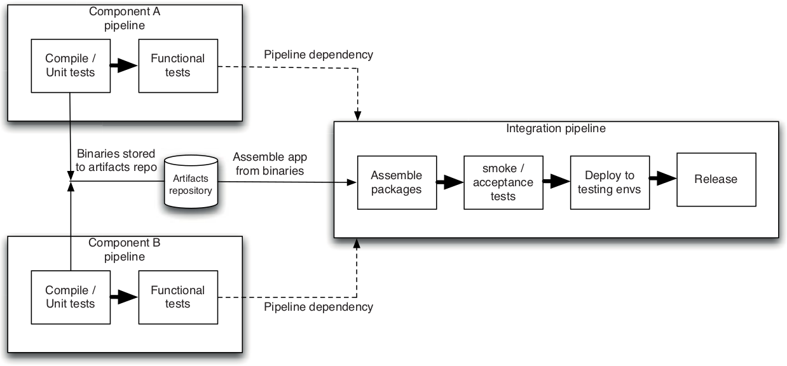

<small><strong>Time to Read:</strong> 16 Minutes</small>, <small><strong>Time to Present:</strong> 75 Minutes</small>
 
<small><strong>Created By:</strong> Alireza Roshanzamir</small>
 
<small><strong>Keywords:</strong> Continuous Delivery, Continuous Integration, DevOps, Build, Test, Release, Deployment, Automation, Version Control, Deployment Pipeline</small>
  
<small style="color: darkred"><small>Press **"F"** to go fullscreen; some slides may not display properly otherwise.</small></small>

---
## Introduction
In CD, you should maintain a **releasable application** even during **major refactoring** or **adding complex features**. Using **branching** in version control may **appear as a solution**, but we believe it's **not the right answer**.

&shy;<!-- .element class="fragment fade-in" -->A key technique is **componentization** of larger apps. Component is a **loaded** term in software. Here, it means a fairly **large code structure** within an app with a well-defined **API** that can be replaced with **another implementation**.

&shy;<!-- .element class="fragment fade-in" -->Opposite to **component-based (modular)** systems is **monolithic** ones **without clear boundaries**, **lacking encapsulation**, have **tight coupling** between unrelated structures, and **violating the Law of Demeter**.

&shy;<!-- .element class="fragment fade-in" -->In **Windows**, a component is normally packaged as a **DLL**. In **UNIX**, it might be an **SO** file, and in **Java**, it's likely a **JAR** file.

&shy;<!-- .element class="fragment fade-in" -->Many projects have turned into **unmanageable code messes** because **no one** created **distinct components** when it was feasible.

&shy;<!-- .element class="fragment fade-in-with-next custom" -->Build system **aspects**:
1. Deployment Pipeline
2. Branches
3. Components

&shy;<!-- .element class="fragment fade-in" -->**Large systems** often **combine all three**. Components may have **dependencies** and use external libraries, each with **multiple release branches**. Creating a **working system** from these components can be **complex**, but necessary **for the deployment pipeline**.

---
## Keeping Application Releasable
&shy;<!-- .element class="fragment fade-in-with-next custom" -->These events results in **weeks or months release gaps**, **prevents** the application to **always be in a releasable state**:
- &shy;<!-- .element class="fragment highlight-current-blue" -->**Major architectural changes**: During these activities the application is not releasable.
- &shy;<!-- .element class="fragment highlight-current-blue" -->**Before release**: Teams focus on bugfixing, not new features. After release, a branch is made, and new development starts on the main trunk.

&shy;<!-- .element class="fragment fade-in" -->One approach is creating branches, merged when work's done, to keep mainline releasable. But this **isn't ideal** as **CI isn't happening on branches**.

&shy;<!-- .element class="fragment fade-in-with-next custom" -->Instead, we suggest everyone **checks in on the mainline**. But how?
- **Hide** new functionality **until completion**.
- Implement changes gradually in **small**, **releasable** increments.
- Use **branch by abstraction** for significant codebase alterations.
- Use **components** to decouple parts of your application that **change at different rates** (we'll discuss later).

------
### Hide New Functionality Until It Is Finished

&shy;<!-- .element class="fragment fade-in-with-next custom" -->What if a feature (a set of features) takes a **long time to develop**?
- **- Branching**: Start development on a new branch and integrate when the functionality is complete to avoid disrupting ongoing system work, which could delay its release.
- **+ Deploying semi-completed functionalities (with rest of the system)**: Add new features but hide them from users.

&shy;<!-- .element class="fragment fade-in" -->For example, introducing hotel bookings on a travel website through a **separate URL** (e.g., /hotel), **deploying with rest** of the system, but **controlling user access** using web server settings.

&shy;<!-- .element class="fragment fade-in" -->You can also control access with **configuration settings**. For example, **have two menus**, one with the new feature and one without. Use a setting to **switch** between them via **CLI** or **config (deploy-time or runtime)**. It is also valuable for running automated tests.

&shy;<!-- .element class="fragment fade-in" -->It is good practice because it allows **CI** and **testing** of the **entire** system, ensuring **new components** can be **deployed alongside existing software** from the beginning.

------
### Make All Changes Incrementally

&shy;<!-- .element class="fragment fade-in-with-next custom" -->**Branching** claims that developers can make large, high-level changes, break the application, and reconnect later to work faster. However, **in practice**, **reintegration can be challenging**, especially with **concurrent team work** and **larger changes**:

&shy;<!-- .element class="fragment fade-in" -->**Breaking large changes** into **small**, **incremental** ones can be **tough**, but it ensures that the **application works**, prevents future pains, and allows for flexibility to **stop at any point if necessary**, avoiding the sunk cost of abandoning a big change midway.

&shy;<!-- .element class="fragment fade-in" -->**Analysis** is vital for breaking large changes into smaller ones, using a process **like breaking down requirements into smaller tasks**.

------
### Branch by Abstraction
&shy;<!-- .element class="fragment fade-in-with-next custom" -->Some changes are **too hard to make incrementally**. Therefore, consider **branching by abstraction** as an **alternative to branching**:
1. &shy;<!-- .element class="fragment highlight-current-blue" -->Create an **abstraction** over the **part to change**.
2. &shy;<!-- .element class="fragment highlight-current-blue" -->Refactor the system to **use this abstraction**.
3. &shy;<!-- .element class="fragment highlight-current-blue" -->Develop a **new implementation** separately.
4. &shy;<!-- .element class="fragment highlight-current-blue" -->Update the abstraction layer to **delegate to the new implementation**.
5. &shy;<!-- .element class="fragment highlight-current-blue" -->**Remove** the **old** implementation.
6. &shy;<!-- .element class="fragment highlight-current-blue" -->**Remove** the **abstraction** if **no longer needed**.

&shy;<!-- .element class="fragment fade-in" -->Branch by abstraction can be **high-level** (changing an entire persistence layer) or **low-level** (swapping classes with the strategy pattern). **Dependency injection** also supports it. The **key** is **finding or creating points** for an abstraction layer.

------
### Continued: Branch by Abstraction
<table>
  <tr>
    <td></td>
    <td></td>
  </tr>
</table>

It's ideal for moving from a **messy monolithic to a modular one**. **Pick the part** to separate or rewrite, **manage entry points (facade pattern)**, and **use branch by abstraction** to keep working with the old code while you create a new, modularized version of the same functionality (known as **"sweeping it under the rug"** or **"Potemkin village"**).

&shy;<!-- .element class="fragment fade-in" -->At times, finding a **good seam** in code is **tough**, and **branching** is the **only option**. Use it **only to prepare for branch by abstraction**.

&shy;<!-- .element class="fragment fade-in" -->For **big changes** (using **any** technique), **rely** on a **full acceptance test** suite. **Unit/component** tests **can't** fully **protect business** functionality during major changes.

---
## Dependencies
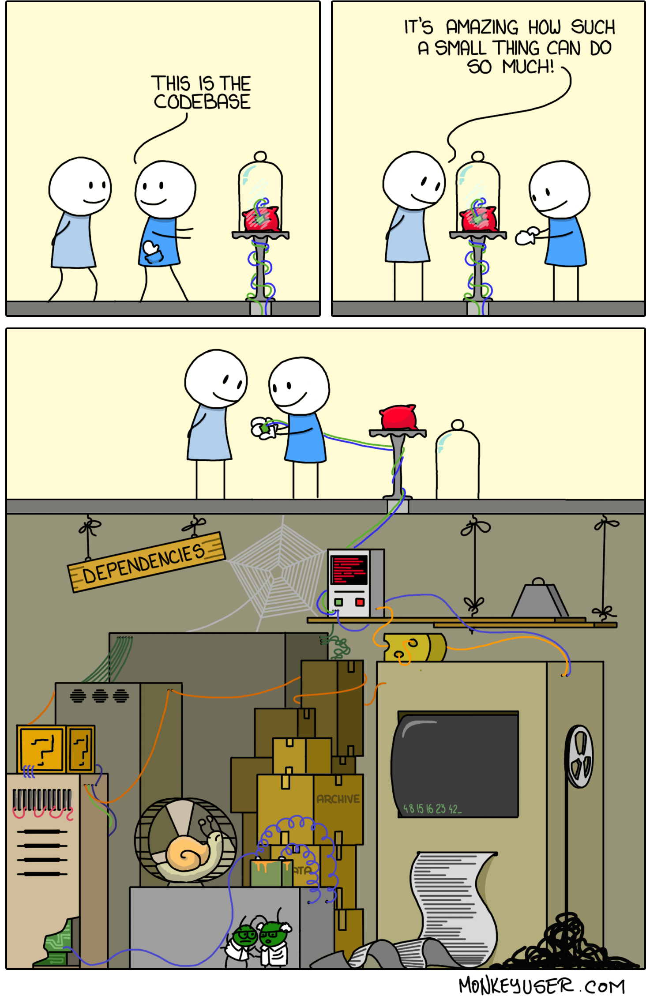

&shy;<!-- .element class="fragment fade-in" -->A dependency occurs when one software piece **depends** on another to **build** or **run**.

&shy;<!-- .element class="fragment fade-in-with-next custom" -->Regarding dependencies, there are **distinctions** between:
- Components vs libraries
    - &shy;<!-- .element class="fragment highlight-current-blue" -->Libraries are software packages **your team doesn't control**, **chosen for use** and **updated infrequently**.
    - &shy;<!-- .element class="fragment highlight-current-blue" -->Components are software parts your **application relies on**, **made by your team or other teams in your organization**, and **updated more frequently**.
- Build-time vs runtime dependencies
    - &shy;<!-- .element class="fragment highlight-current-blue" -->Build-time dependencies are required during application **compilation and linking (if necessary)**.
    - &shy;<!-- .element class="fragment highlight-current-blue" -->Runtime dependencies are needed **when the application runs** and performs its regular function.

&shy;<!-- .element class="fragment fade-in" -->**Managing dependencies can be hard**. We'll start with an overview of **common runtime library dependency issues**.

------
### Dependency Hell (DLL Hell)

&shy;<!-- .element class="fragment fade-in-with-next custom" -->Dependency hell occurs when an application **depends on one version** but is **deployed** with a **different version or none** at all.

&shy;<!-- .element class="fragment fade-in-with-next custom" -->OS-wide dependencies:
- &shy;<!-- .element class="fragment fade-in-then-semi-out" -->In **older Windows**, DLL hell was common due to **shared libraries (DLLs) lacking versioning**, **overwriting old versions**.
- &shy;<!-- .element class="fragment fade-in-then-semi-out" -->The **.NET** introduced **versioned assemblies** and a **global assembly cache (GAC)** to address DLL hell on Windows.
- &shy;<!-- .element class="fragment fade-in-then-semi-out" -->Linux uses **integers in .so files** and **soft links** for versioning, needing **testing** or **source compilation** for **compatibility**.

&shy;<!-- .element class="fragment fade-in-with-next custom" -->Some answers to the problem of OS-wide dependencies:
- &shy;<!-- .element class="fragment fade-in-then-semi-out" -->**Static compilation** bundles dependencies at **compile time** but leads to **large binaries** and **OS version coupling**.
- &shy;<!-- .element class="fragment fade-in-then-semi-out" -->**Dynamic** languages like Ruby **ship frameworks and libraries** with apps to **allow different versions** to coexist.

&shy;<!-- .element class="fragment fade-in" -->The **diamond dependency** issue arises when an app depends on **two libraries** with **different versions of the same underlying library**, potentially causing runtime problems.

------
### Managing Libraries
**Two ways** to manage libraries in software projects:
- <!-- .element: class="fragment insides-fade-in-then-out custom" -->Check them into version control
  - &shy;<!-- .element class="fragment highlight-current-blue" -->Suitable for small projects.
  - &shy;<!-- .element class="fragment highlight-current-blue" -->Traditionally, a lib directory is used for this purpose.
  - &shy;<!-- .element class="fragment highlight-current-blue" -->Use nunit-2.5.5.dll instead of nunit.dll.
  - &shy;<!-- .element class="fragment highlight-current-blue" -->Over time, the repository may grow large and messy.
  - &shy;<!-- .element class="fragment highlight-current-blue" -->Managing transitive dependencies across projects is painful, while package managers aim to address this issue.
- <!-- .element: class="fragment insides-fade-in-then-out custom" -->Declare and use tools like Maven or Ivy to download libraries from the Internet or (preferably) your organization's repository
  - 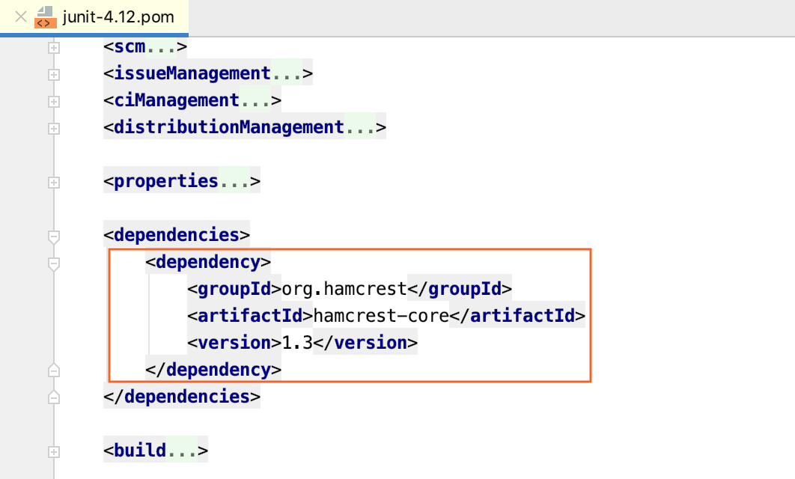
  - &shy;<!-- .element class="fragment highlight-current-blue" -->Transitively resolving dependencies on other projects and avoiding inconsistencies in the project dependency graph.
  - &shy;<!-- .element class="fragment highlight-current-blue" -->Local caching.
  - &shy;<!-- .element class="fragment highlight-current-blue" -->Try to maintain your own artifact repository (Nexus, JFrog, etc.).
    - Simplifies library auditing and avoid legal issues, like using GPL-licensed libraries in BSD-licensed software.

&shy;<!-- .element class="fragment fade-in" -->**Organize** dependencies into **files/subdirectories/sections** for **build-time**, **test-time**, and **runtime** as well as for **testing**, **linting**, **building (app and docs)**, **development**, **packaging**, and **running** to **avoid duplication** and **improve developer convenience**.

------
### Dependency Pinning (Locking)
Dependency pinning means **fixing** a **library's version** to ensure **consistency** and **prevent updates**. This can also be done **recursively** for project dependencies, keeping the **entire tree locked** to specific versions:

<table>
  <tr>
    <th>Tool/Technology</th>
    <th>Direct Dependencies</th>
    <th>Pinned [Recursive] Dependencies</th>
  </tr>
  <tr>
    <td>Python/Pip/Pip-tools</td>
    <td><pre><code>portion>=2.2.0,&lt;3</pre></code></td>
    <td>
      <pre><code>portion==2.4.1 \
    --hash=sha256:9dcbf1808898f440aed304a5e9f0742a2859eca3b0ac7f1f58e50502852a8ef9 \
    --hash=sha256:e4b3d7a394382bed97de0d36458ba62d11a0cbbc01ea13163c2bbde5da6b4eba
    # via -r requirements.txt
sortedcontainers==2.4.0 \
    --hash=sha256:25caa5a06cc30b6b83d11423433f65d1f9d76c4c6a0c90e3379eaa43b9bfdb88 \
    --hash=sha256:a163dcaede0f1c021485e957a39245190e74249897e2ae4b2aa38595db237ee0
    # via portion</code></pre>
    </td>
  </tr>
  <tr>
    <td>Docker</td>
    <td><pre><code>FROM python:3</pre></code></td>
    <td><pre><code>FROM python:3.9.18-slim@sha256:f8bab700e49d929b44a0d95ea78617ab24d5e6028640f78e27ef20183ac2e54d</code></pre></td>
  </tr>
  <tr>
    <td>Java/Gradle</td>
    <td>
      <pre><code>org.springframework:spring-beans:[5.0,6.0)</code></pre>
    </td>
    <td>
      <pre><code>org.springframework:spring-beans:5.0.5.RELEASE=compileClasspath, runtimeClasspath
org.springframework:spring-core:5.0.5.RELEASE=compileClasspath, runtimeClasspath
org.springframework:spring-jcl:5.0.5.RELEASE=compileClasspath, runtimeClasspath
empty=annotationProcessor</code></pre>
    </td>
  </tr>
</table>

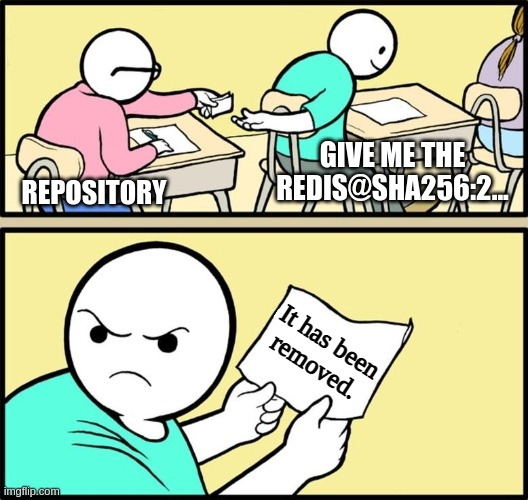

  
Note

  Mention these considerations with the Debian packages and repositories:
  <ul>
    <li>Most standard repositories remove the old versions of a single package. So, the pinned version may not work in the future.</li>
    <li>Some repositories use version in the package name to support installing multiple versions at the same time (e.g. python packages in the deadsnakes repository).</li>
  </ul>

------
### Application vs Library
When developing a **library**:
- &shy;<!-- .element class="fragment highlight-current-blue" -->Support a **range of third-party versions** for **compatibility in various** environments.
- &shy;<!-- .element class="fragment highlight-current-blue" -->**Enforcing a specific version** on clients can **lead to conflicts**.
- &shy;<!-- .element class="fragment highlight-current-blue" -->**Pinning** is used only during **development** for **faster dependency resolution** (**avoiding backtracking** the graph space).

When developing [and deploying] an **application**:
- &shy;<!-- .element class="fragment highlight-current-blue" -->**Pin or lock the versions** of the third-party libraries used, specifying exact versions.
- &shy;<!-- .element class="fragment highlight-current-blue" -->It **enhances reliability and confidence** by reducing the risk of unexpected issues.
- &shy;<!-- .element class="fragment highlight-current-blue" -->For **shared environments with multiple apps**, consider **isolation if different library versions can't coexist**.

------
### Dependency Refactoring
A valuable feature of dependency managers like Maven, Pants/Pip, etc., is their ability to identify **undeclared or unused declared dependencies** in your project.

&shy;<!-- .element class="fragment fade-in-with-next custom" -->**Consolidate common dependencies** (names or only versions) to **avoid duplication**. If your dependency manager lacks direct support, create a **dummy project containing these dependencies** and have your component depend on it:

<table>
  <td>
    Extracting [only] common dependency <strong>versions</strong> in the parent project
    <pre><code><project>
<modelVersion>4.0.0</modelVersion>
<parent>
<groupId>com.continuousdelivery</groupId>
<artifactId>parent</artifactId>
<version>1.0.0</version>
</parent>
<artifactId>simple</artifactId>
<packaging>jar</packaging>
<version>1.0-SNAPSHOT</version>
<name>demo</name>
<url>http://maven.apache.org</url>
<dependencies>
<dependency>
<groupId>junit</groupId>
<artifactId>junit</artifactId>
<scope>test</scope>
</dependency>
</dependencies>
</project></pre></code>
  </td>
  <td>
    Specifying another Pom file as a dependency
    <pre><code><project>
...
<dependencies>
...
  <dependency>
    <groupId>com.thoughtworks.golive</groupId>
    <artifactId>parent</artifactId>
    <version>1.0</version>
    <type>pom</type>
  </dependency>
</dependencies>
</project></code></pre>
  </td>
  <td>
    Including another requirements (using -r)
    <pre><code>-e .[all]
-r requirements-tests.txt
-r requirements-docs.txt
uvicorn[standard] >=0.12.0,&lt;0.23.0
pre-commit >=2.17.0,&lt;4.0.0
playwright</code></pre>
  </td>
</table>

---
## Components

&shy;<!-- .element class="fragment fade-in" -->Software systems include various components. These components **may** be **DLL**s, **JAR**s, **OSGi bundle**s, **Perl module**s, and etc.

&shy;<!-- .element class="fragment fade-in" -->Most apps **begin as a single component**, while **some start as two or three** (like a **client-server app**).

&shy;<!-- .element class="fragment fade-in" -->If these relationships **aren't managed** well, it can **compromise** the ability to use **them as part of a CI** system.

------
### How to Divide a Codebase into Components
&shy;<!-- .element class="fragment fade-in" -->A component is **reusable**, **replaceable** with something else that **implements the same API**, **independently deployable**, and **encapsulates** some **coherent behaviors and responsibilities** of the system.

&shy;<!-- .element class="fragment fade-in" -->**Lower bound**: A component should have a **minimum level of complexity** before it can be considered an independent piece of your application (a **class is not a component** and deployed independently).

&shy;<!-- .element class="fragment fade-in-with-next custom" -->**Upper bound**: We split a system into components to **boost team and software development efficiency**, because components:
- &shy;<!-- .element class="fragment highlight-current-blue" -->Break down the **problem into smaller, clearer parts**.
- &shy;<!-- .element class="fragment highlight-current-blue" -->Reflect **different change rates** and lifecycles in the system parts.
- &shy;<!-- .element class="fragment highlight-current-blue" -->Motivate to design with **clear duties**, **reducing change impacts** and **enhancing code understanding/modification**.
- &shy;<!-- .element class="fragment highlight-current-blue" -->Provide us with additional **degrees of freedom** in **optimizing our build/deployment** process.

&shy;<!-- .element class="fragment fade-in" -->Most components have **kind of APIs**: dynamic linking, static linking, web services, file exchange, message exchange, and more. When they treated independent in build/deployment, the interface/behaviour coupling adds complexity.

&shy;<!-- .element class="fragment fade-in-with-next custom" -->**Reasons** to separate out a component from your codebase:
- &shy;<!-- .element class="fragment highlight-current-blue" -->Part of your codebase needs to be **deployed independently** (for example, a server or a rich client).
- &shy;<!-- .element class="fragment highlight-current-blue" -->You want to turn a **monolithic codebase into a core and plugins**, maybe to replace a system part or allow user extensions.
- &shy;<!-- .element class="fragment highlight-current-blue" -->The component **provides an interface** to another system (for example a framework or a service which provides an API).
- &shy;<!-- .element class="fragment highlight-current-blue" -->It takes **too long to compile and link** the code.
- &shy;<!-- .element class="fragment highlight-current-blue" -->Your codebase is too **large to be worked on by a single team**.
   - To speed up development with over ten people, consider splitting the system into separate components and teams.

------
### Continued: How to Divide a Codebase into Components
We **avoid assigning teams to components** as **requirements often don't divide along component boundaries**. **Cross-functional** teams, where people **handle features end-to-end**, are more efficient, despite the seem efficiency of one team per component:
  - &shy;<!-- .element class="fragment highlight-current-blue" -->**Writing and testing requirements** for **one component is hard** as functions involve multiple components. Grouping teams by components forces them collaborate on features, **increasing communication costs**.
  - &shy;<!-- .element class="fragment highlight-current-blue" -->Component-focused teams often create **isolated silos** and **local optimizations**, **forgetting** the **project**'s broader goals.
  - &shy;<!-- .element class="fragment highlight-current-blue" -->A key issue with component teams is the **entire app may not function** until the **project ends** due to no integration.

&shy;<!-- .element class="fragment fade-in-with-next custom" -->Split teams to focus on **specific story streams** with a common theme and access necessary components to complete their tasks:
- &shy;<!-- .element: class="fragment fade-in-then-semi-out" -->Organize teams by **functional area** rather than by component.
  - &shy;<!-- .element: class="fragment complete-fade-out custom" -->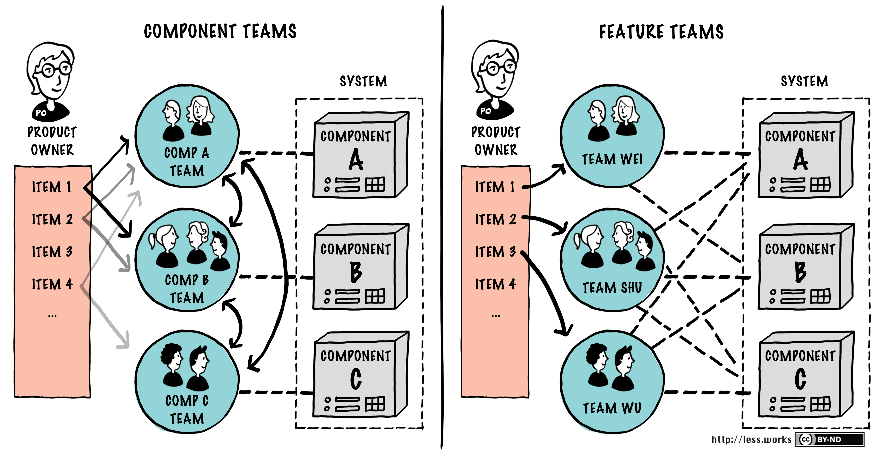
- &shy;<!-- .element: class="fragment fade-in-then-semi-out" -->**Everybody** has the **right to change** any part of the codebase.
- &shy;<!-- .element: class="fragment fade-in-then-semi-out" -->**Rotate** people between teams regularly.
- &shy;<!-- .element: class="fragment fade-in-then-semi-out" -->Ensure that there is good communication between teams.
- &shy;<!-- .element: class="fragment fade-in-then-semi-out" -->**Everyone** is responsible for making **all components work together**, not just the integration team.
- &shy;<!-- .element: class="fragment fade-in-then-semi-out" -->Try to move from [Feature Team to Product Team](https://wind4change.com/product-team-feature-team-difference-marty-cagan-inspired-empowered)
  - &shy;<!-- .element: class="fragment complete-fade-out custom" --><table>
      <tr>
        <th>Feature Team</th>
        <th>Product Team</th>
      </tr>
      <tr>
        <td>
          - Serve the Business 
          - Deliver features 
          - Not involved in product discovery 
          - Not responsible for impact 
          - "Mercenaries"
        </td>
        <td>
          - Partner with Business to serve Customer 
          - Solve problems 
          - Involved in product discovery 
          - Empowered and responsible for impact 
          - "Missionaries"
        </td>
      </tr>
    </table>

&shy;<!-- .element: class="fragment fade-in-with-next custom" -->There are **no fixed rules** for component organization, just design principles. Yet, two common **extreme failures** exist:
- Components everywhere
- The one component to rule them all

------
### Continued: How to Divide a Codebase into Components
Conway's Law:
> Organizations which design systems, are constrained to produce designs which are copies of the communication structures of these organizations.
- &shy;<!-- .element class="fragment highlight-current-blue" -->**Open source** projects where developers communicate **only by email** tend to be **very modular with few interfaces**.
- &shy;<!-- .element class="fragment highlight-current-blue" -->A product developed by a **small, colocated team** will tend to be **tightly coupled and not modular**.

&shy;<!-- .element: class="fragment fade-in" -->Be careful of your **development team setup** as it **impacts** your application's **architecture** (**Reverse Conway** Maneuver).

&shy;<!-- .element: class="fragment fade-in-with-next custom" -->You can find more information in the following books and articles:
<table>
  <tr>
    <td></td>
    <td>
      Clean Architecture: A Craftsman's Guide to Software Structure and Design
       
      <small>by Robert Cecil Martin</small>
    </td>
    <td></td>
    <td>
      Principles of Package Design: Creating Reusable Software Components
       
      <small>by Matthias Noback</small>
    </td>
  </tr>
  <tr>
    <td>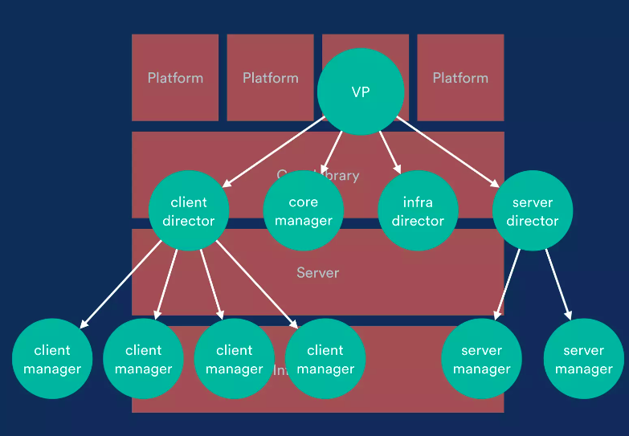</td>
    <td colspan="3">
      Exploring the <strong>Duality</strong> between Product and Organizational Architectures: A Test of the "<strong>Mirroring</strong>" Hypothesis
       
      <small>by Alan MacCormack, John Rusnak, Carliss Baldwin</small>
    </td>
  </tr>
</table>

------
### Pipelining Components
A **simple** [and **scalable**] approach is **one pipeline** for the **entire app** and its components. **All changes** trigger **full build/testing**.

&shy;<!-- .element: class="fragment fade-in" -->**Try** to build your system as **one entity** **until feedback becomes too slow**, as **component-based builds add management overhead**.

&shy;<!-- .element: class="fragment fade-in-with-next custom" -->In **reality**, there are situations where dividing your system into **multiple pipelines is beneficial**:
- &shy;<!-- .element: class="fragment highlight-current-blue" -->Parts of your application may have **different lifecycles** (e.g. you may need build your OS kernel, but only every few weeks).
- &shy;<!-- .element: class="fragment highlight-current-blue" -->**Different and [distributed] teams** work on **separate functional areas** of your app over specific components.
- &shy;<!-- .element: class="fragment highlight-current-blue" -->Components that use **different technologies** or build processes.
- &shy;<!-- .element: class="fragment highlight-current-blue" -->**Shared components** that are used by several other projects.
- &shy;<!-- .element: class="fragment highlight-current-blue" -->Components that are relatively stable and **do not change frequently**.
- &shy;<!-- .element: class="fragment highlight-current-blue" -->If your **app's build is slow**, creating individual component builds can speed up, although it occurs **later than many expect**.

&shy;<!-- .element: class="fragment fade-in" -->After **binaries** (libraries, executables, etc.) pass through their **mini-release process** (including **publishing to an artifact repository**), they're ready for **integration** into the next build phase.

&shy;<!-- .element: class="fragment fade-in" -->In general, the **guiding principle** is to **minimize** the **number of builds** you operate.

------
### The Integration Pipeline
The integration pipeline:
1. &shy;<!-- .element: class="fragment highlight-current-blue" -->Begins with the **binary output** from **each component**.
2. &shy;<!-- .element: class="fragment highlight-current-blue" -->Creates **deployable package**(s) by **combining the necessary binaries**.
3. &shy;<!-- .element: class="fragment highlight-current-blue" -->**Deploys** the app in a **production-like environment**, running **smoke tests** to quickly spot **basic integration issues (fail fast)**.
4. &shy;<!-- .element: class="fragment highlight-current-blue" -->Proceeds to **conventional acceptance test stage**, running whole application acceptance tests as usual.

------
### Continued: The Integration Pipeline
Principles:
- <!-- .element: class="fragment insides-fade-in-then-out" -->Fast feedback
  - **Long** or **chained pipelines** can impact feedback.
  - One solution here is to **trigger downstream** pipelines **as soon as binaries are created and the unit tests pass**.
- &shy;<!-- .element: class="fragment insides-fade-in-then-out" -->Provide **visibility** into the **status of the build** for **all interested parties**
  - **Backward**: Ability to trace back from an integration build to the versions of each component that contributed to it.
  - **Forward**: The team working on the components should be aware of which versions of their component ended up in a green integration pipeline. These are the **truly "green"** versions of the components.

An example of triggering downstream pipelines in GitLab:  <!-- .element: class="fragment fade-in-with-next custom" -->

<table>
  <tr>
    <td>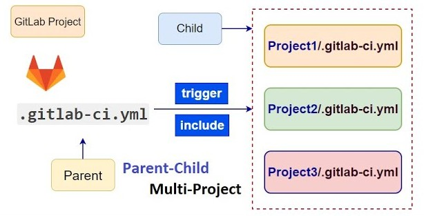</td>
    <td>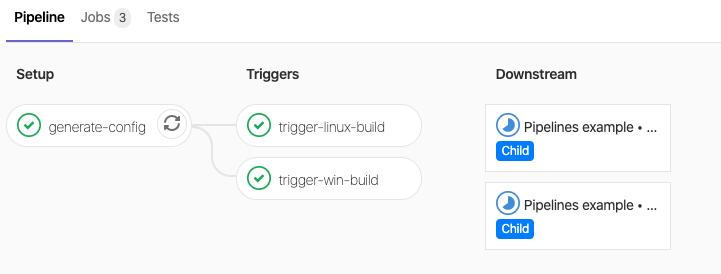</td>
  </tr>
</table>

&shy;<!-- .element: class="fragment fade-in-with-next custom" -->If **several components** change between integration pipeline **runs**, it's probable that it will spend much of its time broken:
- &shy;<!-- .element: class="fragment insides-fade-in-then-out" -->Best and simplest approach: Build all possible combinations of good component versions. Suitable when:
  - <!-- .element: class="fragment highlight-current-blue" -->Your components don't change that often.
  - <!-- .element: class="fragment highlight-current-blue" -->You have sufficient computing power on your build grid.
- &shy;<!-- .element: class="fragment insides-fade-in-then-out" -->Next good approach: Build as many versions of your application as you can:
  - <!-- .element: class="fragment highlight-current-blue" -->Use the latest version of each component to assemble your app as often as possible.
  - <!-- .element: class="fragment highlight-current-blue" -->If this process is quick, run a brief smoke test for each app version.
  - <!-- .element: class="fragment highlight-current-blue" -->You could then have some manual way to "Assemble these and create an instance of integration pipeline with them".

---
## Managing Dependency Graphs
**Versioning dependencies** (e.g., libraries and components) is **essential**; otherwise, **reproducing builds becomes impossible**.

&shy;<!-- .element: class="fragment fade-in" -->Components may depend on other components and third-party libraries. When you draw the dependencies, it **should form a directed acyclic graph (DAG)**.

&shy;<!-- .element: class="fragment fade-in" -->If your graph has **cycles** you have a **pathological dependency problem**, which we'll address later.

------
### Building Dependency Graphs
&shy;<!-- .element: class="fragment fade-in-with-next custom" -->In the diagram, **left is "upstream"** and **right is "downstream"** dependency (CDS pricing library is third-party):

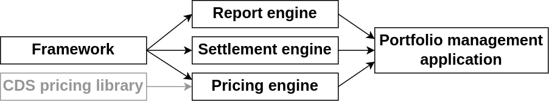

&shy;<!-- .element: class="fragment fade-in" -->Each component **may** have **its own pipeline**. When it **changes**, **triggers a recursive rebuild/test** of **itself and all downstream components** respectively. If any **immediate/intermediate upstream fail**, **downstreams are not initiated**.

&shy;<!-- .element: class="fragment fade-in-with-next custom" -->Imagine if the **framework and pricing engine change**, requiring a **full graph rebuild**. But, there are **various possibilities**:
- &shy;<!-- .element: class="fragment highlight-current-blue" -->The **happy path** is that all three **intermediate components pass** with the new framework and CDS pricing library versions.
- &shy;<!-- .element: class="fragment highlight-current-blue" -->If **settlement engine fails**, **portfolio management app** should**n't** use **new faulty framework**. So, you **may want** it to use **new pricing engine**, built with **new CDS pricing library** and **old green framework**. But, **no such pricing engine version exists**.

&shy;<!-- .element: class="fragment fade-in-with-next custom" -->The **key constraint** is the **portfolio app** should use **one framework version**. **Avoid** **pricing engine with one version** and **settlement engine with another**, which causes the **diamond dependency, build-time analgue of the runtime "dependency hell"**:

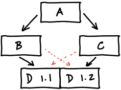

------
### Pipelining Dependency Graphs
The pipelines should provide **rapid feedback on breakages** and **follow the dependency building rules**:

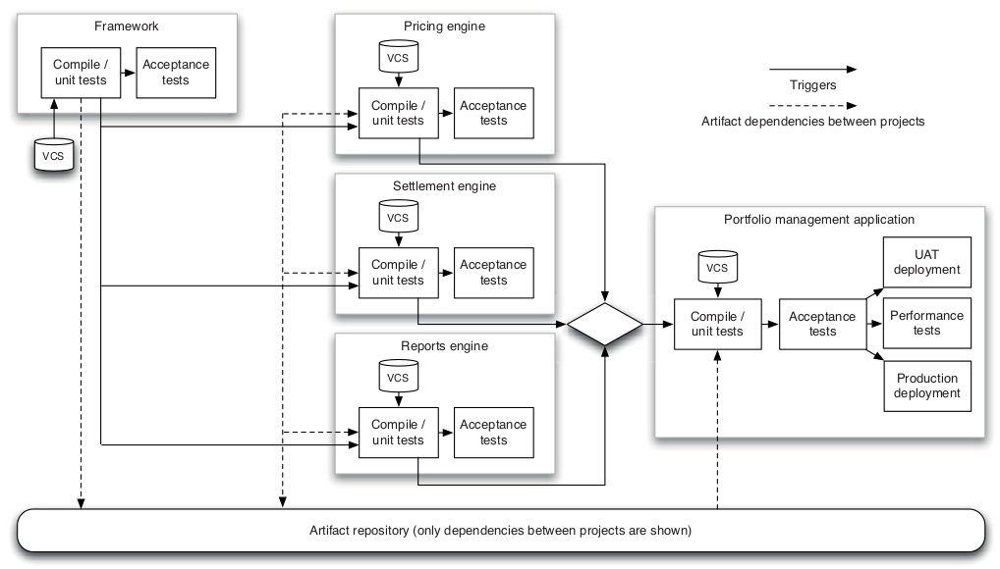

- &shy;<!-- .element: class="fragment highlight-current-blue" -->To **speed up** feedback, **dependent projects trigger** when the **commit stage** of each project's pipeline finishes.
- &shy;<!-- .element: class="fragment highlight-current-blue" -->**All triggers are automatic**, except for deployments to manual testing and production environments.

------
### Continued: Pipelining Dependency Graphs
Teams must be able to **trace the origins** of the components in a particular build of the application:

<table>
  <td>
    Visualizing upstream dependencies
    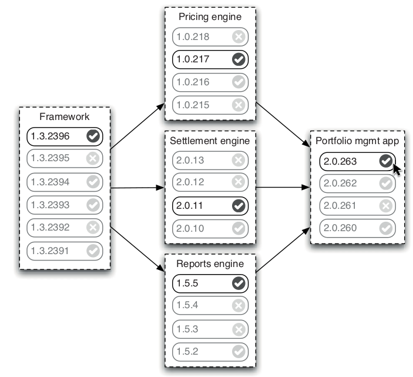
  </td>
  <td>
    Visualizing downstream dependencies
    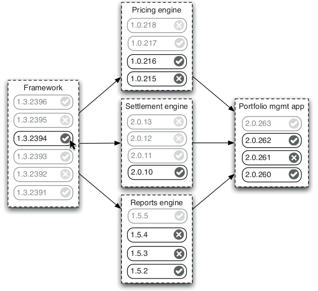
  </td>
</table>

------
### When Should We Trigger Builds?
The discussed examples **assume** triggering new builds with **any upstream changes**, which is **good but not common** in many teams. They often **update dependencies** when their **codebase is stable**, emphasizing **stability but risking more integration time later**.

&shy;<!-- .element: class="fragment fade-in" -->Updating dependencies brings **tension**. Staying **updated** give you the **latest features/fixes**, but **integrating each new version** can be **costly due to fixing issues**. Many teams compromise by updating all dependencies **after a release** when the **risks are lower**.

&shy;<!-- .element: class="fragment fade-in-with-next custom" -->A key consideration when deciding how often to update dependencies is how much you **trust new versions** of these dependencies:
- &shy;<!-- .element: class="fragment highlight-current-blue" -->If you have components depending upon a component **also developed by your team**, fixing API changes is **quick** and **simple**, so **integrating often is best**. For **small** components, having a **single whole application build** is best for the fastest feedback.
- &shy;<!-- .element: class="fragment highlight-current-blue" -->If upstream dependencies are from **another team**, build them **separately in their pipeline**. You can **choose whether** to use the latest version when they update or stick with a specific version based on their **update frequency** and **response to issues**.

&shy;<!-- .element: class="fragment fade-in" -->Find a **balance** between **quick integration feedback** and **excessive builds** that report irrelevant issues.

------
### Cautious Optimism
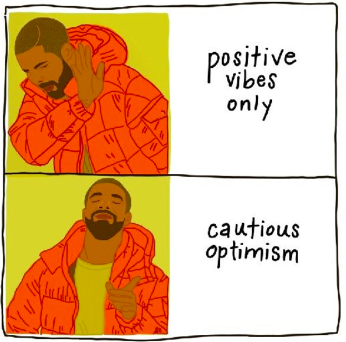

&shy;<!-- .element: class="fragment fade-in-with-next custom" -->This model suggests three **"static"**, **"guarded"**, or **"fluid"** states for **upstream dependencies** in dependency graph:
- &shy;<!-- .element: class="fragment highlight-current-blue" -->**Changes** in **static** upstream dependencies **do not trigger** new builds.
- &shy;<!-- .element: class="fragment highlight-current-blue" -->**Changes** in **fluid** upstream dependencies **always trigger** new builds. If a **fluid dependency update fails**, it **becomes guarded** and the **component sticks to the known-good version of the upstream dependency**.
- &shy;<!-- .element: class="fragment highlight-current-blue" -->A **guarded** upstream dependency is **similar to a static** one, not accepting new changes. However, **it signals an issue** that the development team needs to address with the upstream dependency.

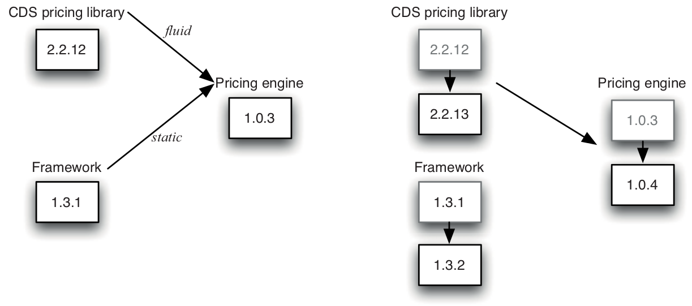

&shy;<!-- .element: class="fragment fade-in-with-next custom" -->You can begin with an **"informed pessimism" strategy** where **triggers are set to static**, but **notify developers** of **new upstream dependency versions**.

------
### Circular Dependencies

&shy;<!-- .element: class="fragment fade-in" -->The **worst dependency problem** is the circular dependency, when **component A depends on component B, and B depends on A**.

&shy;<!-- .element: class="fragment fade-in" -->You may **never begin** a project **with circular dependencies**-they **tend to creep in later**.

&shy;<!-- .element: class="fragment fade-in-with-next custom" -->You can manage this issue if necessary, though it's **not recommended**. You need **a version of A to build B**, then **use the new B to build the new A**, forming a **"build ladder"**:

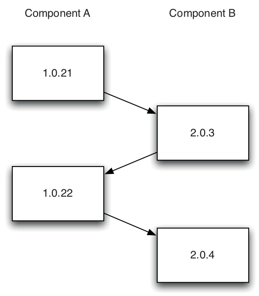

&shy;<!-- .element: class="fragment fade-in" -->Build systems **don't naturally** handle this, so you'll need to tweak your toolchain. You **should only** use the build ladder as a **temporary fix** until you resolve the issue.

---
## Managing Binaries
Usually, components should have **binary rather than source-level dependencies**.

&shy;<!-- .element: class="fragment fade-in-with-next custom" -->Store **generated build artifacts (binaries, packages, etc.)** in the **artifact repository** for **later [stages] use**:
- &shy;<!-- .element: class="fragment highlight-current-blue" -->An artifact repository's should only contain **reproducible items**. You should be **able to delete it without losing valuable data**, as you'll need to free up space eventually.
- &shy;<!-- .element: class="fragment highlight-current-blue" -->So, your **version control** must include **all needed to recreate binaries**.
- &shy;<!-- .element: class="fragment highlight-current-blue" -->The **simplest** artifact repository is a **directory structure on disk**, ideally on RAID or SAN to prevent unexpected data loss. It should **enable linking a binary to the source control version that created it**.
- &shy;<!-- .element: class="fragment highlight-current-blue" -->If a shared drive isn't your choice, you can use a **web service for storing and retrieving artifacts**. At this point, consider using available **free or commercial solutions**.
- <table>
  <td>
    JFrog
    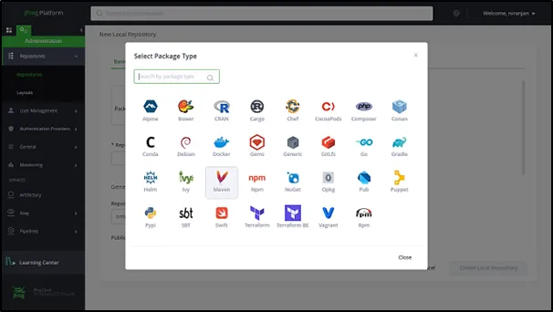
  </td>
  <td>
    Nexus
    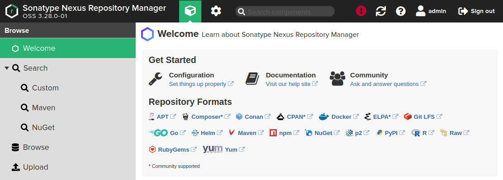
  </td>
</table>

---
## Summary

&shy;<!-- .element: class="fragment fade-in-with-next custom" -->The principle is to ensure teams get **fast feedback** on the **effect of their changes** on the **production-readiness of the application**:
- &shy;<!-- .element: class="fragment highlight-current-blue" -->Ensure **every change** is **broken down into small**, **incremental steps** which are checked into mainline.
- &shy;<!-- .element: class="fragment highlight-current-blue" -->**Break** your application down into **components**.

&shy;<!-- .element: class="fragment fade-in" -->**Until your application becomes large**, you can **use a single pipeline** to **build the entire application** in the initial stage.

&shy;<!-- .element: class="fragment fade-in" -->Emphasizing on **fast commit builds/unit-testing** and **acceptance testing grids** can drive **significant project growth**. A team of up to **20 full-time people** over a **couple of years** need'**nt create multiple pipelines** but should **still separate their app into components**.

&shy;<!-- .element: class="fragment fade-in" -->Exceeding these limits needs **components**, **dependency-based pipelines**, and **artifact management** for better delivery/feedback.
