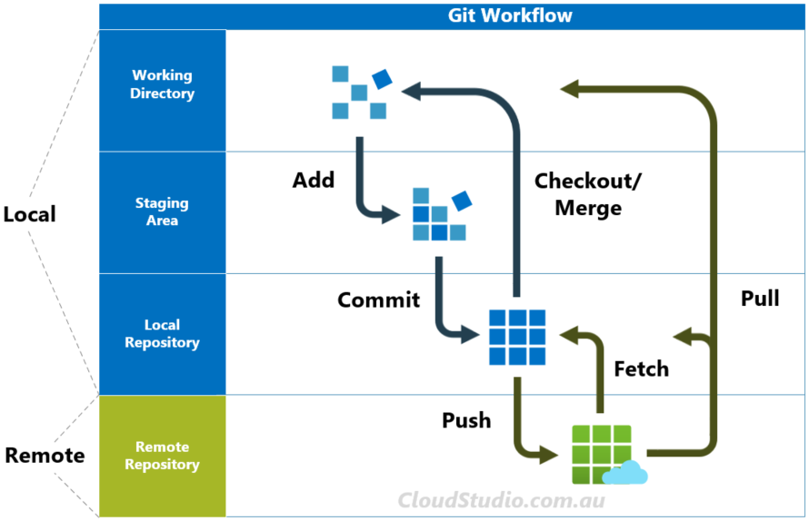
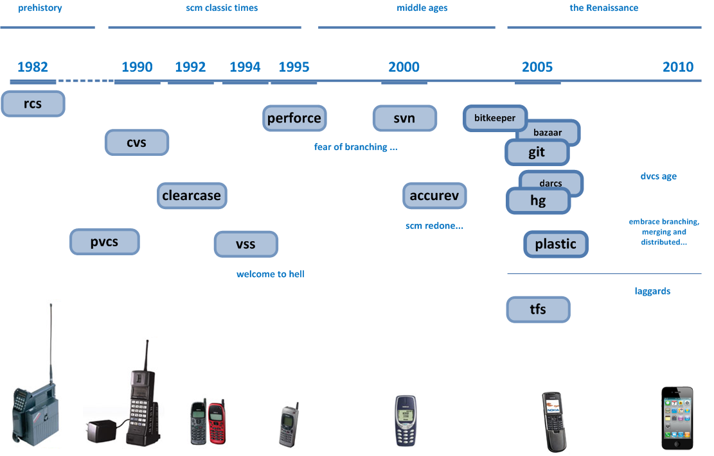

## Continuous Delivery: Advanced Version Control
#### Brief history, Version Control Types, Branching and Merging, Develop on Mainline, Branch for Release, Branch by Feature, Branch by Team, Gitflow

<small><strong>Time to Read:</strong> ? Minutes</small>, <small><strong>Time to Present:</strong> ? Minutes</small>
 
<small><strong>Created By:</strong> Alireza Roshanzamir</small>
 
<small><strong>Keywords:</strong> Continuous Delivery, Continuous Integration, DevOps, Build, Test, Release, Deployment, Automation, Version Control, Deployment Pipeline</small>
 
<small style="color: darkred"><small>Press **"F"** to go fullscreen; some slides may not display properly otherwise.</small></small>

---
## Introduction
Version control systems (source control, revision control systems) along with maintaining a complete history of every change, also serve another important purpose: They enable teams to work together on separate parts of an application while maintaining a system of record—the definitive codebase of the application.

The aim of this chapter is to examine how teams can work productively with version control.

There are three good reasons to branch your code:
- Releasing a new version of your application
  - Allows developers to continue working on new features without affecting the stable public release
  - When bugs are found, they are first fixed in the relevant public release branch, and then the changes are applied to the mainline.
- When you need to spike out a new feature or a refactoring; the spike branch gets thrown away and is never merged
- Short-lived branch when you need to make a large change to the application that is not possible with any of the methods described before (branch by abstraction, etc.)
  - An extremely rare scenario if your codebase is well structured.
  - The sole aim of this branch is to get the codebase to a state where further change can be made either incrementally or through branch by abstraction.

---
## Brief History

