## Continuous Delivery: Advanced Version Control
#### Brief history, Branching and Merging, Distributed Version Control Systems (DVCS), Stream-Based Version Control Systems, Branching Patterns, Popular Branching Policies

<table>
  <tr>
    <td>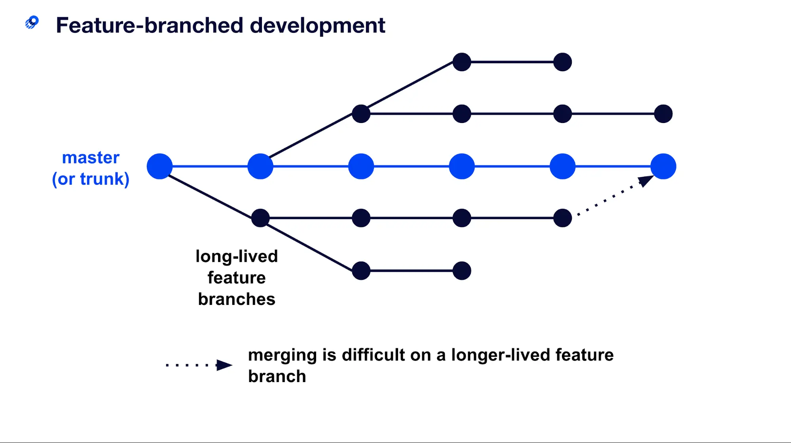</td>
    <td>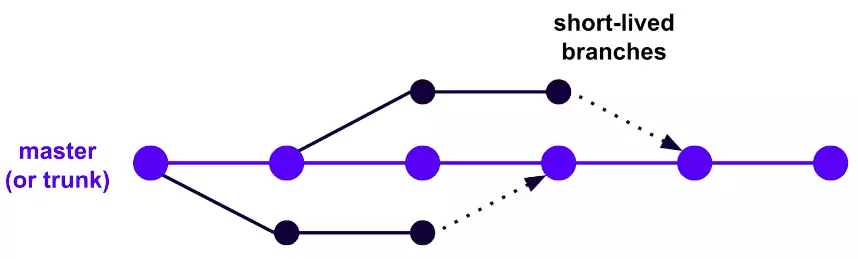</td>
  </tr>
</table>

<small><strong>Time to Read:</strong> 13 Minutes</small>, <small><strong>Time to Present:</strong> 60 Minutes</small>
 
<small><strong>Created By:</strong> Alireza Roshanzamir</small>
 
<small><strong>Keywords:</strong> Continuous Delivery, Continuous Integration, DevOps, Build, Test, Release, Deployment, Automation, Version Control, Deployment Pipeline</small>
 
<small style="color: darkred"><small>Press **"F"** to go fullscreen; some slides may not display properly otherwise.</small></small>

---
## Introduction
Version control systems (aka source control, revision control systems) keep a full history of changes and help teams collaborate on different application parts while preserving the definitive codebase.

The aim of this chapter is to examine how teams can work productively with version control.

There are three good reasons to branch your code:
- Releasing a new version of your application.
  - Lets developers work on new features without impacting the stable public release.
  - Bugs are fixed in the relevant public release branch first and then applied to the mainline.
- When you need to spike out a new feature/refactoring; the spike branch gets thrown away and is never merged.
- Short-lived branch for large changes to the application that can't be done using other methods like branch by abstraction.
  - An extremely rare scenario if your codebase is well structured.
  - The sole purpose is to get the code to a state that make incremental changes or branch by abstraction possible.

---
## Brief History

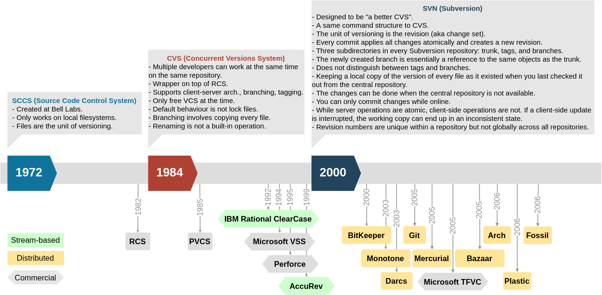

---
## Branching and Merging
The ability to create branches (or streams) in a codebase is a first-class feature of every VCS.

Branches primarily enable parallel development, allowing simultaneous work on multiple streams without interference.

Teams create branches for many reasons, which may overlap: Physical, Functional, Environmental, Organizational, and Procedural.

In most cases where you branch, your entire codebase is going to evolve separately in each branch.

Branching may seem like a great way to solve many problems affecting the process of software development on large teams.

Merging branches highlights the need of planning and processes for each branch, including policies, roles, and contributor access:
- A small team may have a mainline open to all developers and a release branch controlled by the testing team.
- Larger ones might have mainlines for components, plus integration/release/maintenance branches managed by operations.

------
### Merging
Merging can be very time-consuming, although pretty much every VCS on the market has some functionality to make it easier.

The real problem arises when two different and conflicting changes have been made in the two branches that you want to merge.

Long gaps between merges can lead to merge conflicts. Resolving them may require substantial code rewrites and discussions among authors, which may occur weeks after the original code was written.

Semantic conflicts not detected by version control systems can be especially troublesome.

The longer you delay merging and involve more people, the more challenging it becomes.

------
### Early/Deferred Branching
Early branching (aka branch early and often):
  - Create more branches to reduce the number of changes made to a given branch.
  - For example, create a branch every time you start working on a feature.
  - However, this means extra work to track all the branches, delaying future merges.
  - 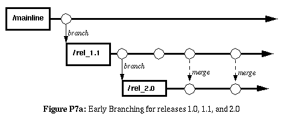

Deferred branching (aka lazy branching, and late branching):
  - Be parsimonious about creating branches, perhaps creating a branch per release.
  - To ease merging, merge frequently. Remember to do it regularly, like daily, for instance.
  - 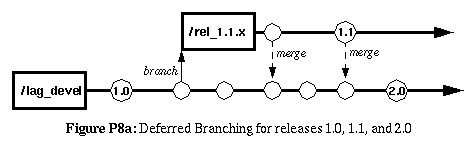

------
### Branches, Streams, and Continuous Integration
There is a tension between using branches and CI.

Some argue that branch work is waste, in the lean sense, waste-inventory that is not yet used in the final product.

<table>
  <tr>
    <th>Poorly controlled branching</th>
    <th>More manageable branching</th>
  </tr>
  <tr>
    <td>
      
    </td>
    <td>
      
    </td>
  </tr>
</table>

Things get much worse if merges are postponed until the release's end. In some projects, we've witnessed weeks of conflict resolution and application setup just to begin testing.

---
## Distributed Version Control Systems (DVCS)
Several open-source DVCSs, like Git and Mercurial, are available. In this section, we'll explore their unique features and usage.

------
### What Is a Distributed Version Control System?
In DVCS, each user maintains a standalone repository on their computer, and a conventional central repository is used for CI. It offers:
- Quick setup: Install it, commit changes locally.
- Individual updates: Pull changes from others without a central repository.
- Selective pushes: Share updates with specific users.
- Efficient patch handling: Propagating patches among users for approval/rejection (aka cherry-picking).
- Offline work: Commit changes without internet access.
- Incremental commits: Safely save incomplete work locally without affecting others.
- Flexible commit management: Rearrange and batching commits (aka rebasing).
- Easy experimentation: Try ideas without creating a branch in central repos.
- Scalability: Central repo is less burdened.
- High availability: Establish and sync local proxy repos.
- Fault tolerance: Multiple full copies enhance resilience.

If DVCS feels like everyone having their own SCCS or RCS, that's correct!

------
### Continued: What Is a Distributed Version Control System?
It's a paradigm shift. Instead of sending patches to a project owner, people publish their versions for experimentation. This speeds up project evolution and accelerates feature/bugfix delivery. Clever ideas become usable, reducing commit access bottlenecks:

------
### A Brief History of Distributed Version Control Systems
The Linux kernel was initially developed without source control. Linus Torvalds shared source code as tarballs and received changes as patches.

In December 1999, the Linux PowerPC project adopted BitKeeper, a proprietary DVCS. Linus embraced it in February 2002, despite it not being open source, calling it the best tool. It was the first widely used DVCS, built on SCCS, allowing users to treat changes as first-class objects.

After that, open source DVCS projects emerged. Popular DVCSs include Git (created by Linus Torvalds to maintain the Linux kernel and used by many other projects), Mercurial (by Mozilla, OpenSolaris, and OpenJDK), and Bazaar (by Ubuntu).

------
### Setup a Remote Git Repository on Ubuntu
You can setup a remote Git repository by (from [here](https://www.geeksforgeeks.org/how-to-setup-git-server-on-ubuntu/)):

- Installing Git:

  <pre class="console"><code>sudo apt-get install git</pre></code>

- Creating a new user to manage the repositories:

  <pre class="console"><code>sudo adduser git</pre></code>

- Creating a repository directory and changing the ownership of the directory to the git user:

  <pre class="console"><code>sudo mkdir /usr/local/git
  sudo chown git:git /usr/local/git
  </pre></code>

- Switching to the git user and initializing a new bare repository:

  <pre class="console"><code>su -l git
  git init -bare myproject.git
  </pre></code>

- Configuring SSH access for the git user:

  <pre class="console"><code>ssh-keygen -t rsa -b 4096
  echo "ssh-rsa <your-public-key>" >> ~/.ssh/authorized_keys
  echo "AllowUsers git" >> /etc/ssh/sshd_config
  </pre></code>

- Cloning the repository from the server:

  <pre class="console"><code>git clone git@server:/usr/local/git/myproject.git</pre></code>

------
### Distributed Version Control Systems in Corporate Environments
Apart from conservatism, there are some objections to the use of DVCSs in companies:
- Unlike centralized systems, DVCS stores the entire history with local copies.
- Auditing and workflow are less defined in DVCS
  - Centralized systems require users to check changes into a central repository.
  - In DVCS, users can send changes to each other and alter local history without central tracking.
- Git actually allows to change history, which can be problematic in regulated corporate environments. 
  - Although, you can disable it on most VC Repository Hosting Platforms (GitLab, GitHub, BitBucket, Azure DevOps, etc.).

Once a central repository is designated, all of the properties of a centralized version control system are available.

------
### Using Distributed Version Control Systems
The key difference between distributed and centralized VCSs is that in DVCS, when you commit, it's to your local copy or branch. To share changes, you must perform two extra actions: pulling changes from a remote repository and pushing changes to it:

<table>
  <tr>
    <th>Subversion (Centralized VCS)</th>
    <th>Mercurial (Distributed VCS)</th>
  </tr>
  <tr>
    <td>
      <ol>
        <li>svn up - Get the most recent revision.</li>
        <li>Write some code.</li>
        <li>svn up - Merge my changes with any new updates to the central repository and fix any conflicts.</li>
        <li>Run the commit build locally.</li>
        <li>svn ci - Check my changes, including my merge, into version control.</li>
      </ol>
    </td>
    <td>
      <ol>
        <li>hg pull - Get the updates from the remote repository into your local one.</li>
        <li>hg co - Update your local working copy from your local repository.</li>
        <li>Write some code.</li>
        <li>hg ci - Save your changes to your local repository.</li>
        <li>hg pull - Get any new updates from the remote repository.</li>
        <li>hg merge - This will update your local working copy with the results of the merge, but will not check in the merge.</li>
        <li>Run the commit build locally.</li>
        <li>hg ci - This checks in the merge to your local repository.</li>
        <li>hg push - Push your updates to the remote repository.</li>
      </ol>
    </td>
  </tr>
</table>

You can repeat steps 1-8 (in DVCs) before moving to step 9 for sending your changes to the CI build. In Mercurial and Git, there's a feature called "rebasing" to consolidate changes into a single commit for the master repository.

------
### Conitunued: Using Distributed Version Control Systems
DVCS workflow:

<table>
  <tr>
    <td>
      Mercurial
      
    </td>
    <td>
      Git
      
    </td>
  </tr>
</table>

---
## Stream-Based VCSs
Stream-based VCSs like ClearCase and AccuRev aim to ease merging by allowing applying changes to multiple branches at once.

Streams replace branches and can inherit changes. When you modify a stream, all its descendant streams inherit those changes.

You promote the change in your branch to the common ancestor of branches needing the change. Consumers then update to receive these changes and create a new build with the change.

<table>
  <td></td>
  <td></td>
</table>

------
### Continued: Stream-Based VCSs
Changes in one stream don't affect other streams until promoted. Once promoted, they become visible to all inheriting streams.

Without stream-based tools, you must merge a bugfix manually to apply it to all other branches simultaneously.

In the stream development model, promotion occurs at the source level, not the binary level. As a result, each promotion requires checking out the source and rebuilding the binary (the problem exists with other branching models like branch by team).

The Linux kernel developers use a similar process with Git and branches. Each branch has an owner responsible for stability, and Linus Torvalds oversees the "release stream". In this hierarchy, changes are pulled by stream owners, not pushed to them.

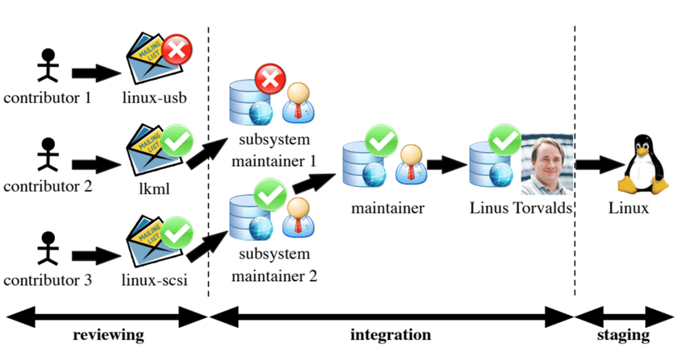

---
## Branching/Merging/Integration Patterns
In this section, we'll explore different branching/merging patterns, their pros and cons, and when to use them.

Some information is from Martin Fowler's highly recommended post on [Patterns for Managing Source Code Branches](https://martinfowler.com/articles/branching-patterns.html):

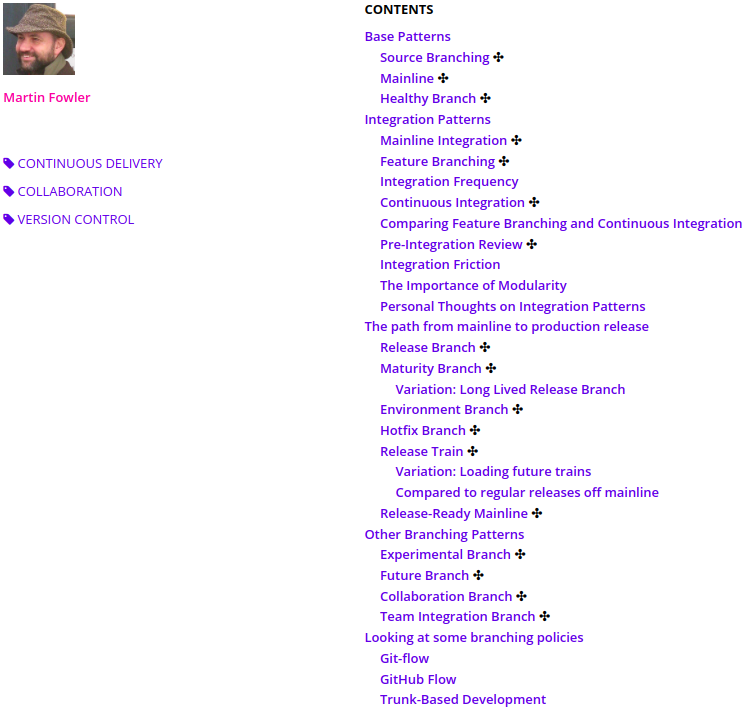

------
### Develop on Mainline (aka Mainline Integration)
In this pattern, developers almost always check in to mainline. Branches are used only rarely. The benefits include:
- Ensuring that all code is continuously integrated
- Ensuring developers pick up each others' changes immediately
- Avoiding "merge hell" and "integration hell" at the end of the project

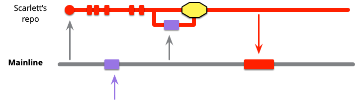

------
### &#9733; Continuous Integration [to Mainline]
If you the mainline integration continuously, it becomes the **Continuous Integration** pattern:

> Developers do mainline integration as soon as they have a healthy commit they can share, usually less than a day's work

<table>
  <tr>
    <td>
      Low Frequency 
      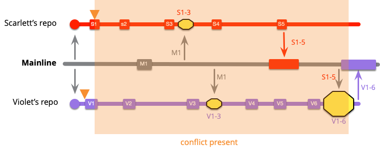
    </td>
    <td>
      High Frequency 
      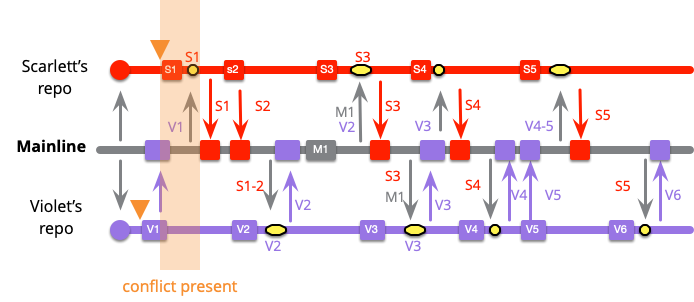
    </td>
  </tr>
</table>

------
### Branch for Release (aka Release Branch)
The time it's okay to create a branch is just before a release. After creating the release branch, testing, validation, and bugfixes of the release is done, while new development continues on the mainline:

<table>
  <tr>
    <td></td>
    <td>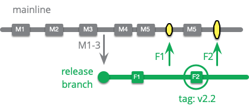</td>
  </tr>
</table>

In this pattern:
- Features are developed on the mainline.
- A branch is created when code is feature-complete for a release, and work on new features begins.
- Only critical defect fixes are committed on branches and merged into the mainline right away.
- When you perform an actual release, this branch is optionally tagged.

------
### &#9733; Release-Ready Mainline (Mixed Mainline and Healthy Branch Patterns)
With a high release frequency, around once a week, branching for releases may no longer be necessary:
- Releasing a new software version is cheaper and easier than patching the release branch.
- The deployment pipeline, with commit tags, tracks release history.

So, keep mainline sufficiently healthy that the head of mainline can always be put directly into production:

------
### Branch by Feature (aka Feature Branching)
An old joke says that if you fall off a tall building, the falling isn't going to hurt you, but the landing will.

In this pattern, stories/features are developed on separate branches, and upon passing tests, they merge into the mainline.

This pattern aims to keep the mainline always releasable, so development occurs on branches to avoid interference with other developers or teams.

Some developers prefer to keep their work private until it's fully completed.

Additionally, it enriches VC history when each commit represents a whole feature/bugfix (using Squash merging).

For this pattern to be effective, several prerequisites are essential:
- Daily merging of mainline changes into all branches.
- Short-lived branches, ideally lasting a few days, never more than an iteration.
- Limited active branches, matching the number of ongoing stories.
- Testing and acceptance of stories before merging.
- Immediate merging of refactorings to minimize conflicts.
- The tech lead is responsible for a releasable trunk (by reviewing and rejecting disruptive changes).

------
### Continued: Branch by Feature (aka Feature Branching)
Open source projects on platforms like GitHub speed up development through user-created feature branches. This works because:
- Managed by a small team of experienced developers with authority to accept or reject patches.
- Flexible release dates, giving committers the freedom to reject suboptimal patches (less common in commercial products).

This pattern is effective in open-source world and can apply to small, experienced core teams in commercial projects. But, for larger projects, it works when:
- Codebase is modular and well-structured.
- Delivery team is divided into small, with experienced leaders.
- Whole team is committed to frequent mainline integration.
- The delivery team isn't rushed to release, so they can make better decisions.

Even ninja-level agile teams can struggle with this, so it's better to begin with the "develop on mainline" approach, then, if you want to try branching by feature, stick to the rules.

However, be aware that you are "running with scissors" when you adopt this pattern.

------
### Branch by Team (aka Team Integration Branch)
This pattern tackles the issue of managing a large developer team across multiple work streams while maintaining a releasable mainline (like branch by feature pattern).

Branches are created for teams, merging into the trunk only when stable. Merges to one branch should promptly update all others:

Here is the workflow for branching by team:
1. Create small teams, each working on its own branch.
2. Once a feature/story is completed, the branch is stabilized and merged to trunk.
3. Any changes on trunk get merged to every branch daily.
4. Unit and acceptance tests are run on every check-in on the branch.
5. All tests, including integration tests, are run on trunk every time a branch is merged into it.

------
### Continued: Branch by Team (aka Team Integration Branch)
This pattern is effective when multiple small, relatively independent teams work on separate areas of the system. Each branch should have an owner responsible for setting and managing its policies, including controlling who can check in to the branch.

From a CI perspective, this approach's drawback is that the unit of work is an entire branch, not just an individual change.

The Linux kernel team uses this pattern; separate repositories (logical branches) for various parts (e.g. scheduler and networking).

Infrequent merges can affect this pattern, compromising CI. So, teams should merge to the trunk after each story and daily from it.

In practice, this pattern is like branch by feature but with:
- +Pros: There are fewer branches, so integration happens more frequently-at the team level at least.
- -Cons: Brranches diverge much more rapidly, because a whole team is checking in to each branch.

------
### Other Patterns
- <!-- .element: class="fragment insides-fade-in-then-out custom" -->Maturity Branch
  - A branch whose head marks the latest version of a level of maturity of the code base.
  - <table>
      <tr>
        <td>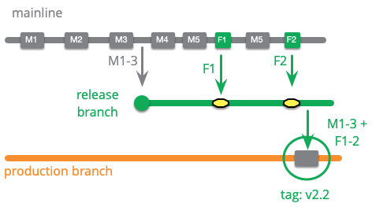</td>
        <td>
          Variation: Long Lived Release Branch 
          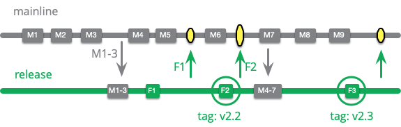
        </td>
      </tr>
    </table>
- <!-- .element: class="fragment insides-fade-in-then-out custom" -->Environment Branch
  - Configure a product to run in a new environment by applying a source code commit.
  - <table>
      <tr>
        <td>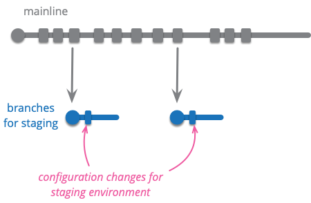</td>
        <td>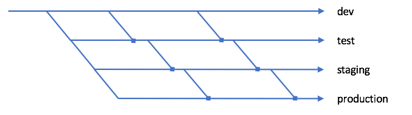</td>
      </tr>
    </table>
- <!-- .element: class="fragment insides-fade-in-then-out custom" -->Hotfix Branch
  - A branch to capture work to fix an urgent production defect.
  - 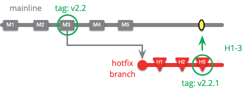
- <!-- .element: class="fragment insides-fade-in-then-out custom" -->Experimental Branch
  - Collects together experimental work on a code base, that's not expected to be merged directly into the product.
- <!-- .element: class="fragment insides-fade-in-then-out custom" -->Future Branch
  - A single branch used for changes that are too invasive to be handled with other approaches.
- <!-- .element: class="fragment insides-fade-in-then-out custom" -->Collabration Branch
  - A branch created for a developer to share work with other members of the team without formal integration.
  - A collaboration branch is usually temporary and closed off once the work in integrated into mainline.
- <!-- .element: class="fragment insides-fade-in-then-out custom" -->Pre-Integration Review
  - Every commit to mainline is peer-reviewed before the commit is accepted.

------
### SCM Patterns Perspective
Some of SCM patterns and their relationships (from [here](https://www.bradapp.com/acme/branching/scm-pats-intro.html)):

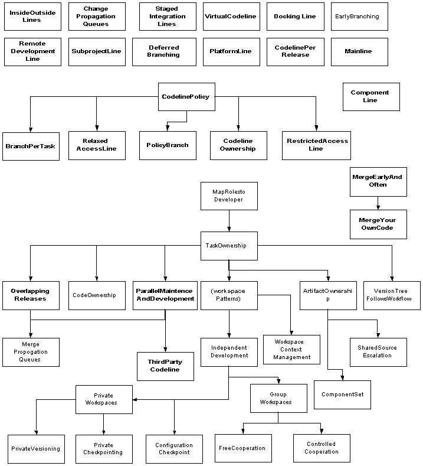

---
## Popular Branching Policies
Lots of branching approaches have been described over the years. But, there are many branching policies which gathers these patterns and some other rules and concepts together:
- Gitflow
- GitHub Flow
- Trunk-Based Development
  - You may use short-lived **Feature Branching** and **Release Branch** or **Release-Ready Mainline**.

------
### Gitflow
[Gitflow](https://nvie.com/posts/a-successful-git-branching-model/) has become one of the most common branching policies which was written by Vincent Driessen in 2010.

Gitflow uses **Mainline** (referred to as "develop") in a single "origin" repository, **Feature Branching** to coordinate developers, and encourages personal repositories as **Collaboration Branches** for coordination on similar work.

In traditional Git, the core branch is named "master". In Gitflow, "master" serves as a Production **Maturity Branch**. Gitflow also uses a **Release Branch** for transitioning work from "develop" to "master". Hotfixes are managed through **Hotfix Branch**es.

Gitflow doesn't specify feature branch length or integration frequency. It doesn't specify if the mainline should be a **Healthy Branch** or not. The presence of release branches suggests it **isn't** a **Release-Ready Mainline**.

------
### GitHub Flow
Many who claim to use Gitflow often follow a different approach. In reality, their practice aligns more closely with GitHub Flow.

GitHub Flow assumes one version in production, frequently integrating onto a **Release-Ready Mainline**. The **Release Branch** and **Hotfix Branch** are **unnecessary** and the production issues are fixed in the same way as regular features.

In GitHub, the pull-request mechanism is a part of **Mainline Integration**, involving **Pre-Integration Review**.

---
## Summary
Controlling assets in software development is crucial for project success, regardless of its size.

We focus on version control patterns for two reasons:
1. They are integral to designing your deployment pipeline.
2. Poor version control practices often hinder fast, low-risk releases.

We've invested time in comparing various version control system paradigms:
- Centralized model
- Distributed model
- Stream-based model

There's a fundamental tension between CI and branching. Each branching decision involves some compromise.
