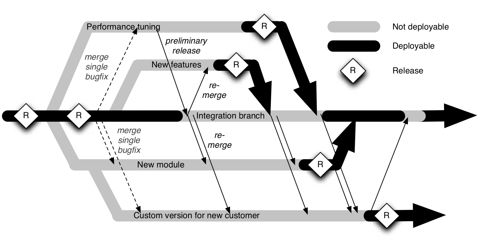
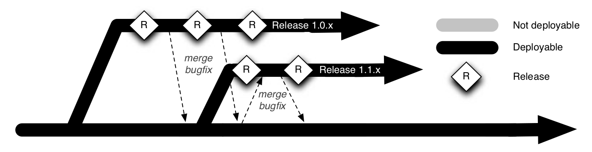
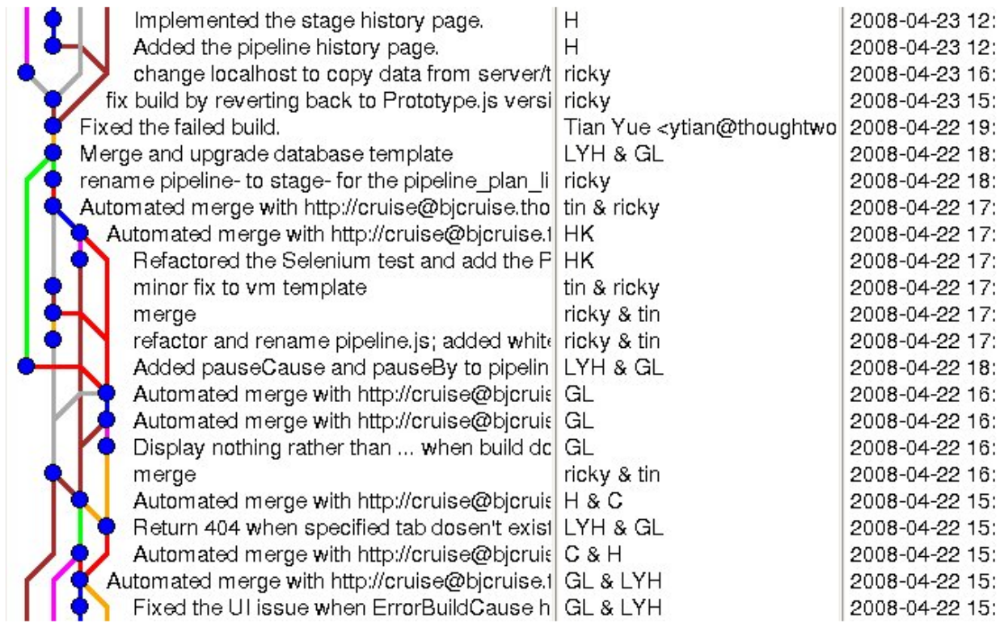
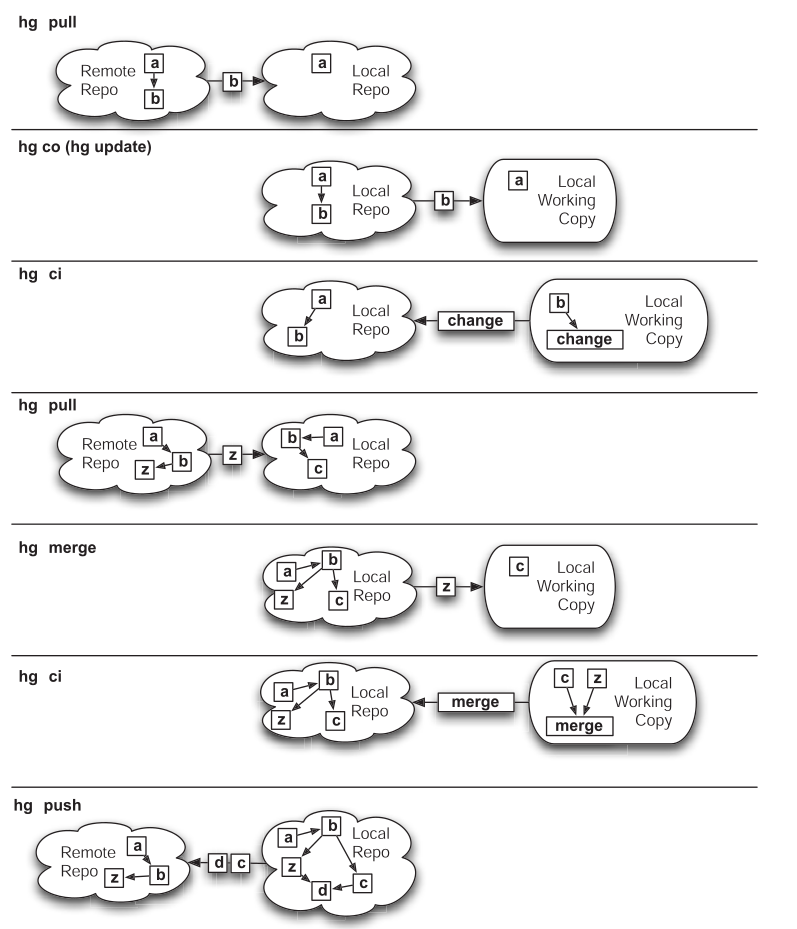
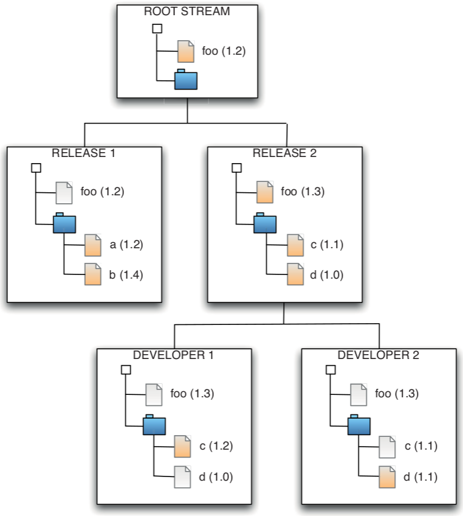
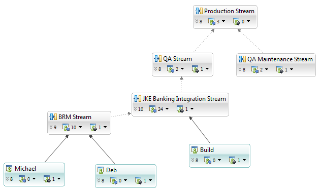
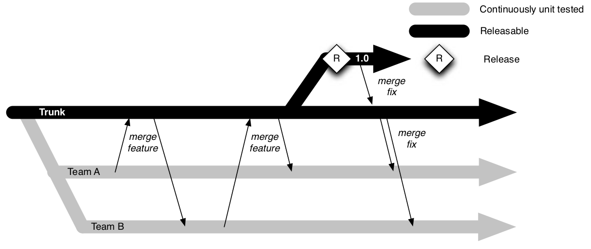
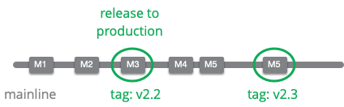
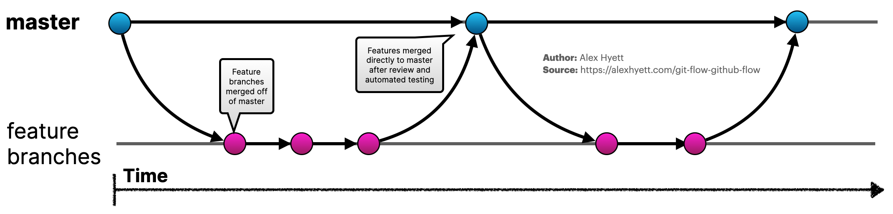

## Continuous Delivery: Advanced Version Control
#### Brief history, Branching and Merging, Distributed Version Control Systems (DVCS), Stream-Based Version Control Systems, Branching Patterns, Popular Branching Policies

<small><strong>Time to Read:</strong> ? Minutes</small>, <small><strong>Time to Present:</strong> ? Minutes</small>
 
<small><strong>Created By:</strong> Alireza Roshanzamir</small>
 
<small><strong>Keywords:</strong> Continuous Delivery, Continuous Integration, DevOps, Build, Test, Release, Deployment, Automation, Version Control, Deployment Pipeline</small>
  
<small style="color: darkred"><small>Press **"F"** to go fullscreen; some slides may not display properly otherwise.</small></small>

---
## Branching and Merging
The ability to create branches, or streams, in a codebase is a first-class feature of every version control system.

The main purpose of branches is to facilitate parallel development: the ability to work on two or more work streams at the same time without one affecting the other.

There are several reasons why teams may choose to branch their code (these categories aren't mutually exclusive):
- Physical: branching of the system's physical configuration-branches are created for files, components, and subsystems.
- Functional: branching of the system's functional configuration-branches are created for features, logical changes, both bugfixes and enhancements, and other significant units of deliverable functionality (e.g., patches, releases, and products).
- Environmental: branching of the system's operating environment-branches are created for various aspects of the build and runtime platforms (compilers, windowing systems, libraries, hardware, operating systems, etc.) and/or for the entire platform.
- Organizational: branching of the team's work efforts-branches are created for activities/tasks, subprojects, roles, and groups.
- Procedural: branching of the team's work behaviors-branches are created to support various policies, processes, and states.

In most cases where you branch, your entire codebase is going to evolve separately in each branch.

Branching and streaming may seem like a great way to solve many problems affecting the process of software development on large teams.

However, the requirement to merge branches means it's important to think carefully before branching and to make sure you have a sensible process to support it. In particular, you need to define a policy for each branch describing its role in the delivery process and prescribing who is allowed to check into it and under what circumstances. For example, a small team might have a mainline which all developers can check into and a release branch that only the testing team is able to approve changes to. The testing team would then be responsible for merging bugfixes into the release branch. In a larger and more heavily regulated organization, each component or product might have a mainline that developers check into, and integration branches, release branches, and maintenance branches that only operations personnel are authorized to make changes to.

------
### Merging
You will reach a point where you need to take the changes you have made in one branch and apply them to another.

Doing this can be very time-consuming, although pretty much every VCS on the market has some functionality to make it easier.

The real problem arises when two different and conflicting changes have been made in the two branches that you want to merge.

When a long time passes between merges, merge conflicts are often symptoms of conflicting implementations of functionality, leading to rewrites of large chunks of the code in order to harmonize the changes that have occurred in the two branches. So, so conversations to between authors have to happen, perhaps weeks after the code being merged was originally written.

Semantic conflicts that are not caught by your version control system can be some of the most pernicious.

The longer you leave things before merging the branches, and the more people you have working on them, the more unpleasant your merge is going to be. There are ways of minimizing this pain:
- Early branching: You could create more branches to reduce the number of changes made to a given branch. For example, you could create a branch every time you start working on a feature. However, this means more work to keep track of all the branches, and you're just delaying the pain of having to do more merges.
- Deferred branching: You could be parsimonious about creating branches, perhaps creating a branch per release. To minimize the pain of merging, you could merge often, which means the merges will be less unpleasant. However, you have to remember to do it at regular intervals-every day, for example.

------
### Branches, Streams, and Continuous Integration
There is a tension between using branches and continuous integration.

There is a school of thought that any work on a branch is, in the lean sense, waste-inventory that is not being pulled into the finished product.

A typical example of poorly controlled branching:

A more manageable branching strategy:

Things are much, much worse if merges are left until the end of the release. We have seen projects where the integration phase
began with weeks of trying to resolve merge conflicts and get the application into a state where it could even be run. Only then could the testing phase of the project even get off the ground.

---
## Distributed Version Control Systems (DVCS)
Several powerful open source DVCSs exist, such as Git and Mercurial. In this section, we'll examine what is special about DVCSs and how to use them.

------
### What Is a Distributed Version Control System?
In DVCS, each user keeps a self-contained, first-class repository on their computer. There is no need for a privileged "master" repository, although most teams designate one by convention (otherwise it is impossible to do CI):
- You can start using a DVCS in a few seconds-just install it, and commit your changes into a local repository.
- You can pull updates individually from other users without them having to check their changes into a central repository.
- You can push updates to a selected group of users without everyone being forced to take them.
- Patches can effectively propagate through networks of users, making it much easier to approve or reject individual patches (a practice known as cherry-picking.
- You can check your changes into source control while you are working offline.
- You can commit incomplete functionality regularly to your local repository to check point without affecting other users.
- You can easily modify, reorder, or batch up your commits locally before you send changes to anybody else (this is known as rebasing).
- It's easy to try out ideas in a local repository without the need to create a branch in a central repository.
- Due to the ability to batch check-ins locally, the central repository doesn't get hit so often, making DCVSs more scalable.
- Local proxy repositories are easily established and synchronized, making it easy to provide high availability.
- Since there are many copies of the full repository, DCVSs are more fault-tolerant, although master repositories should still be backed up.

If you think that using a DVCS sounds rather like everyone having their own SCCS or RCS, you are right.

This represents a paradigm shift in collaboration. Instead of having to submit their patches to the project owner for committing back to the project’s repository, people can now publish their own version for others to experiment with. This leads to much faster evolution of projects, much more experimentation, and faster delivery of features and bugfixes. If somebody does something clever, other people can and will use it. That means that commit access is no longer a bottleneck to people creating new functionality or fixing bugs.

------
### A Brief History of Distributed Version Control Systems
For a number of years, the Linux kernel was developed without the use of source control. Linus Torvalds developed on his own machine and made the source available as tarballs which were rapidly copied to a vast number of systems worldwide. All changes were sent to him as patches, which he could easily apply and back out. As a result, he didn’t need source control-neither for backing up his source code nor to allow multiple users to work on the repository at the same time.

However, in December 1999, the Linux PowerPC project began using BitKeeper, a proprietary distributed version control system which became available in 1998. Linus began to consider adopting BitKeeper for maintaining the kernel. Eventually, in February 2002, Linus adopted BitKeeper, describing it as "the best tool for the job," despite not being an open source product.

BitKeeper was the first widely used distributed version control system, and it was built on top of SCCS. A layer on top of SCCS which allows users to treat deltas, or changes against a particular revision, as first-class domain objects.

Following BitKeeper, a number of open source DVCS projects started. The first of these was Arch, begun by Tom Lord in 2001. Arch is no longer maintained, and has been superseded by Bazaar.

The most popular and feature-rich of DVCSs are Git (created by Linus Torvalds to maintain the Linux kernel and used by many other projects), Mercurial (used by the Mozilla Foundation, OpenSolaris, and OpenJDK), and Bazaar (used by Ubuntu). Other open source DVCSs under active development include Darcs and Monotone.

------
### Git Server on Ubuntu
You can setup a remote Git repository by (from [here](https://www.geeksforgeeks.org/how-to-setup-git-server-on-ubuntu/))

- Installing Git:

  <pre class="console"><code>sudo apt-get install git</pre></code>

- Creating a new user to manage the repositories:

  <pre class="console"><code>sudo adduser git</pre></code>

- Creating a repository directory and changing the ownership of the directory to the git user:

  <pre class="console"><code>sudo mkdir /usr/local/git
  sudo chown git:git /usr/local/git
  </pre></code>

- Switching to the git user and initializing a new bare repository:

  <pre class="console"><code>su -l git
  git init -bare myproject.git
  </pre></code>

- Configuring SSH access for the git user:

  <pre class="console"><code>ssh-keygen -t rsa -b 4096
  echo "ssh-rsa <your-public-key>" >> ~/.ssh/authorized_keys
  echo "AllowUsers git" >> /etc/ssh/sshd_config
  </pre></code>

- Cloning the repository from the server:

  <pre class="console"><code>git clone git@server:/usr/local/git/myproject.git</pre></code>

------
### Distributed Version Control Systems in Corporate Environments
Apart from general conservatism, there are three obvious objections to the use of DVCSs in companies:
- Unlike centralized version control systems, which only store a single version of the repository on the user’s computer, anyone who makes a copy of the local repository of a DVCS has its entire history.
- Auditing and workflow are more slippery concepts in the realm of DVCS. Centralized version control systems require users to check all their changes into a central repository. DVCSs allow users to send changes to each other, and even to change history in their local repository, without these changes being tracked in the central system.
- Git actually does allow you to change history. This may well be a red line in corporate environments subject to regulatory regimes, who will have to back up their repository regularly in order to keep a record of everything that has happened. Although, you can disable it on most wrapping source code management applications (GitLab, GitHub, Azure DevOps, etc.).

As soon as you designate a central repository, all of the properties of a centralized version control system are available.

------
### Using Distributed Version Control Systems
The main difference between distributed and centralized version control systems is that when you commit, you are committing to your local copy of the repository—effectively, to your own branch. In order to share your changes with others, there is an additional set of steps you need to perform. To do this, DVCSs have two new operations: pulling changes from a remote repository and pushing changes to it:

<table>
  <tr>
    <th>Subversion (Centralized VCS)</th>
    <th>Mercurial (Distributed VCS)</th>
  </tr>
  <tr>
    <td>
      <ol>
        <li>svn up - Get the most recent revision.</li>
        <li>Write some code.</li>
        <li>svn up - Merge my changes with any new updates to the central repository and fix any conflicts.</li>
        <li>Run the commit build locally.</li>
        <li>svn ci - Check my changes, including my merge, into version control.</li>
      </ol>
    </td>
    <td>
      <ol>
        <li>hg pull - Get the latest updates from the remote repository into your local repository.</li>
        <li>hg co - Update your local working copy from your local repository.</li>
        <li>Write some code.</li>
        <li>hg ci - Save your changes to your local repository.</li>
        <li>hg pull - Get any new updates from the remote repository.</li>
        <li>hg merge - This will update your local working copy with the results of the merge, but will not check in the merge.</li>
        <li>Run the commit build locally.</li>
        <li>hg ci - This checks in the merge to your local repository.</li>
        <li>hg push - Push your updates to the remote repository.</li>
      </ol>
    </td>
  </tr>
</table>

You can repeat steps 1-8 as many times as you like before executing step 9 to send your changes to the continuous integration build. You can even use a great feature available in Mercurial and Git known as rebasing. You can rebase and send all of your changes to the master repository as a single commit.

---
## Stream-Based Version Control Systems
Stream-based version control systems such as ClearCase and AccuRev are designed to ameliorate the merge problem by making it possible to apply sets of changes to multiple branches at once.

In the stream paradigm, branches are replaced by the more powerful concept of streams, which have the crucial distinction that they can inherit from each other. Thus, if you apply a change to a given stream, all of its descendent streams will inherit those changes:

With stream-based version control, you simply promote the change in your branch to the common ancestor of all the branches that need the change. Consumers of these branches can then update to get these changes, and create a new build which includes the fix.

<table>
  <td></td>
  <td></td>
</table>

Making changes to one stream won’t affect any other stream, unless those changes are promoted. Once promoted, they will be visible to every other stream that inherits from the original stream.

How do you apply that bugfix to all other branches of your code at the same time? Without stream-based tools, the answer is to manually merge it.

One of the problems with the stream model of development is that promotion is done at the source level, not the binary level. As a result, every time you promote a change to a higher stream, you have to check out source and rebuild the binary (this problem also exists with similar branching models such as branch by team).

The Linux kernel development team uses a process (but, using Git and branches) very similar to that described above, but each branch has an owner whose job it is to keep that stream stable, and of course the "release stream" is maintained by Linus Torvalds who is very choosy about what he pulls in to his stream. The way the Linux kernel team works, there is a hierarchy of streams with Linus’ at the top, and changes are pulled by the stream owners, rather than pushed up to them.

---
## Branching Patterns
In the following sections, we’ll look at various patterns for branching and merging, their various advantages and disadvantages, and the circumstances under which they are appropriate.

------
### Develop on Mainline
In this pattern, developers almost always check in to mainline. Branches are used only rarely. The benefits of developing on mainline include:
- Ensuring that all code is continuously integrated
- Ensuring developers pick up each others’ changes immediately
- Avoiding "merge hell" and "integration hell" at the end of the project

------
### Branch for Release
The one situation when it’s always acceptable to create a branch is shortly before a release. Once the branch is created, testing and validation of the release is done from code on the branch, while new development is performed on mainline.

By creating a release branch, developers can keep checking in to mainline, while changes to the release branch are made for critical bugfixes only:

In this pattern:
- Features are always developed on mainline.
- A branch is created when your code is feature-complete for a particular release and you want to start working on new features.
- Only fixes for critical defects are committed on branches, and they are merged into mainline immediately.
- When you perform an actual release, this branch is optionally tagged.

Once you achieve a certain frequency of releases, around once a week or so, it no longer makes sense to branch for release. In this scenario, it’s cheaper and easier to simply put out a new version of the software instead of patching on the release branch. Instead, your deployment pipeline keeps a record of which releases were performed (along with tagging on released commit), when, and what revision in version control they came from (**Release-Ready** Mainline pattern).

------
### Branch by Feature
In this pattern, every story or feature is developed on a separate branch. Only after a story is accepted by testers, it is merged to mainline so as to ensure that mainline is always releasable.

This pattern is generally motivated by the desire to keep the trunk always releasable, and therefore do all of the development on a branch so you don’t interfere with other developers or teams.

Many developers don’t like to have their work exposed and publicly available until they are completely done.

In addition, it makes version control history more semantically rich if each commit represent a complete feature or a complete bugfix (using Squash merging).

There are some prerequisites for this pattern to work at all, let alone well:
- Any changes from mainline must be merged onto every branch on a daily basis.
- Branches must be short-lived, ideally less than a few days, never more than an iteration.
- The number of active branches that exist at any time must be limited to the number of stories in play. Nobody should start a new branch unless the branch representing their previous story is merged back to mainline.
- Consider having testers accept stories before they are merged. Only allow developers to merge to trunk once a story has been accepted.
- Refactorings must be merged immediately to minimize merge conflicts. This constraint is important but can be painful, and further limits the utility of this pattern.
- Part of the technical lead’s role is to be responsible for keeping the trunk releasable. The tech lead should review all merges, perhaps in patch form. The tech lead has the right to reject patches that may potentially break the trunk.

Open source projects that use GitHub (for example) can achieve large gains in development speed by making it easy for users to branch a repository to add a feature and then make the branch available to a committer to pull from. However, there are some key attributes of open source projects that make them especially suitable for this pattern:
- Although many people can contribute to them, they are managed by a relatively small team of experienced developers who have the ultimate power to accept or reject patches.
- Release dates are relatively flexible, allowing the committers of open source projects a wide degree of latitude in rejecting suboptimal patches. While this can also be true of commercial products, it is not the norm.

Therefore, in the open source world this pattern can be very effective. It can also work for commercial projects where the core development team is small and experienced. It can work in larger projects, but only where the following conditions apply:
- The codebase is modular and well factored.
- The delivery team is split into several small teams, each with experienced leaders.
- The whole team is committed to checking in and integrating with mainline frequently.
- The delivery team is not subject to unduer pressure to release which might lead to suboptimal decision making.

We have seen even small, experienced, ninja-level agile teams mess this pattern up, so there is little hope for the rest of us. You should always start with the "develop on mainline" pattern and then, if you want to try branching by feature, proceed rigidly according to the rules above.

However, be aware that you are "running with scissors" when you adopt this pattern.

------
### Branch by Team
This pattern is an attempt to address the problem of having **a large team of developers** working on multiple work streams while still maintaining a mainline that can always be released (similar to branch by feature pattern).

A branch is created for every team, and merged into trunk only when the branch is stable. Every merge to any given branch should immediately be pulled into every other branch:

Here is the workflow for branching by team:
1. Create small teams, each working on its own branch.
2. Once a feature/story is completed, the branch is stabilized and merged to trunk.
3. Any changes on trunk get merged to every branch daily.
4. Unit and acceptance tests are run on every check-in on the branch.
5. All tests, including integration tests, are run on trunk every time a branch is merged into it.

This pattern works when you have several small, relatively independent teams working on functionally independent areas of the system. Crucially, every branch needs to have an owner responsible for defining and maintaining its policy, including governing who checks in to the branch.

From a CI perspective, this strategy has this drawback which the unit of work under this strategy is scoped to a whole branch, not just a particular change.

The Linux kernel development team uses a version of this pattern, keeping logical branches for different parts of the operating system—the scheduler and the networking stack, for example—in independent repositories.

If merges aren’t sufficiently frequent, this pattern suffers from the same drawback as every pattern where the whole team does not check in directly to trunk: True continuous integration is compromised. For this reason, Kniberg recommends that every team merges to trunk whenever a story is completed, and merges from trunk every day.

In practice, this pattern is not dissimilar to branch by feature. Its advantage is that there are fewer branches, so integration happens more frequently—at the team level at least. Its disadvantage is that branches diverge much more rapidly, because a whole team is checking in to each branch.

------
### Other Branching Patterns
This section and the whole next sections are retrieved from Martin Fowler post about [Patterns for Managing Source Code Branches](https://martinfowler.com/articles/branching-patterns.html). It's very valuable to read it.

Some branching patterns:

- Maturity Branch
  - A branch whose head marks the latest version of a level of maturity of the code base.
- Environment Branch
  - Configure a product to run in a new environment by applying a source code commit.
- Hotfix Branch
  - A branch to capture work to fix an urgent production defect.
- Experimental Branch
  - Collects together experimental work on a code base, that's not expected to be merged directly into the product.
- Future Branch
  - A single branch used for changes that are too invasive to be handled with other approaches.
- Collabration Branch
  - A branch created for a developer to share work with other members of the team without formal integration.
- Team Integration Branch
  - Allow a sub-team to integrate with each other, before integrating with mainline.

Some other patterns:
- Realease-Ready Mainline
  - Keep mainline sufficiently healthy that the head of mainline can always be put directly into production
  - 
- Pre-Integration Review
  - Every commit to mainline is peer-reviewed before the commit is accepted.

---
## Popular Branching Policies
Lots of branching approaches have been described over the years. But, there are many branching policies which gathers these patterns and some other rules and concepts together:
- Gitflow
- GitHub Flow
- Trunk-Based Development
  - You may use short-lived **Feature Branching** and **Release Branch** or **Release-Ready Mainline**.

------
### Gitflow
Gitflow has become one of the most common branching policies which was written by Vincent Driessen in 2010.

Gitflow uses **Mainline**, (calling it “develop”) in a single "origin" repository. It uses **Feature Branching** to coordinate multiple developers. Developers are encouraged to use their personal repositories as **Collaboration Branch** to coordinate with other developers working in similar work.

The traditionally named core branch of git is "master", in git-flow, master is used as a Production **Maturity Branch**. Gitflow uses a **Release Branch** so that work passes from "develop" through the release branch to "master". Hotfixes are organized through a Hotfix Branch.

Gitflow doesn't say anything about the length of feature branches, hence nor the expected integration frequency. It's also silent on whether mainline should be a Healthy Branch and if so what level of health is needed. The presence of release branches implies it isn't a Release-Ready Mainline.

------
### GitHub Flow
It's common to find people who say they are using gitflow are actually doing something quite different. Often their actual approach is closer to GitHub Flow.

GitHub Flow assumes a single version in production with high-frequency integration onto a **Release-Ready Mainline**. With that context, **Release Branch** isn't needed. Production issues are fixed in the same way as regular features, so there's no need for **Hotfix Branch**.

Being GitHub, the pull-request mechanism is part of Mainline Integration and uses **Pre-Integration Review**.

---
## Summary
Effective control of the assets that you create and depend upon in the course of software development is essential for the success of a project of any size.

The reason we spend so much time on this arguably tangential topic is twofold:
- Version control patterns are central to the way you design your deployment pipeline.
- It has been our experience that poor version control practices are one of the most common barriers to fast, low-risk releases.

We have spent some time comparing different version control system paradigms:
- Centralized model
- Distributed model
- Stream-based model

There is a fundamental tension between the desire for continuous integration and the desire to branch. Every time you make a decision to branch in a CI-based development system, you compromise to some degree.
