## Continuous Delivery: Managing Continuous Delivery
#### Maturity Models (Jez Humble Maturity Model, Qualitic Maturity Model, Google Test Certified Ladder), Project Lifecycle, Risk Management Process, Common Delivery Problem (Symptoms and Causes), Compliance and Auditing

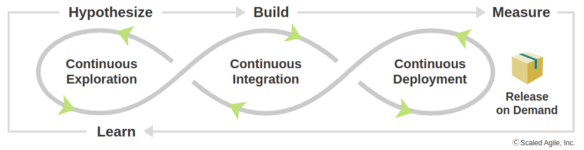

<small><strong>Time to Read:</strong> 15 Minutes</small>, <small><strong>Time to Present:</strong> 75 Minutes</small>
 
<small><strong>Created By:</strong> Alireza Roshanzamir</small>
 
<small><strong>Keywords:</strong> Continuous Delivery, Continuous Integration, DevOps, Build, Test, Release, Deployment, Automation, Version Control, Deployment Pipeline</small>
 
 
<small style="color: darkred"><small>Press **"F"** to go fullscreen; some slides may not display properly otherwise.</small></small>

---
## Introduction
This chapter guides **implementing CD** in your organization.

&shy;<!-- .element: class="fragment fade-in" -->CD is a new paradigm for software-dependent businesses, addressing **corporate governance tensions**.

&shy;<!-- .element: class="fragment fade-in-with-next custom" -->The business aims for **rapid software releases for revenue**, while **corporate governance manages risks**, **preventing financial loss or shutdown**, **including regulatory violations**. Despite shared goals, **performance and conformance often conflict**:

<table>
  <tr>
    <td>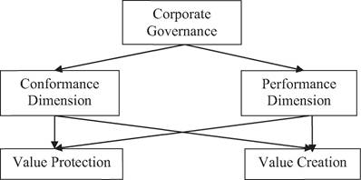</td>
    <td>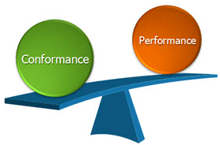</td>
  </tr>
</table>

&shy;<!-- .element: class="fragment fade-in" -->The **deployment pipeline** boosts **performance** with **continuous feedback on production readiness** and ensures **conformance** through **transparent delivery processes**.

&shy;<!-- .element: class="fragment fade-in" -->With CD practices, large organizations with complex applications can rapidly and reliably deliver software. This leads to a faster return on investment, reduced risks, and avoids the opportunity cost of long development cycles or delivering not fit software.

&shy;<!-- .element: class="fragment fade-in" -->According to **Lean**, infrequent software delivery is like **stored inventory** - incurring production costs but lacking revenue, while also incurring storage expenses.

---
## Maturity Models
When discussing **governance**, having a clear view of **organizational change objectives** is highly valuable.

&shy;<!-- .element: class="fragment fade-in" -->Maturity models help determine an organization's **process and practice maturity**, offering a **defined progression** for improvement.

&shy;<!-- .element: class="fragment fade-in-with-next custom" -->The primary goal is **organizational improvement**, with **desired outcomes including**:
- &shy;<!-- .element: class="fragment highlight-current-blue" -->Shortened cycle times &rArr; Faster value delivery and increased profitability
- &shy;<!-- .element: class="fragment highlight-current-blue" -->Fewer defects &rArr; Enhanced efficiency and reduced support costs
- &shy;<!-- .element: class="fragment highlight-current-blue" -->Improved predictability in software delivery &rArr; Effective planning
- &shy;<!-- .element: class="fragment highlight-current-blue" -->Compliance with regulatory requirements
- &shy;<!-- .element: class="fragment highlight-current-blue" -->Effective risk assessment and management
- &shy;<!-- .element: class="fragment highlight-current-blue" -->Reduced costs through better risk management and fewer delivery issues

------
### Deming Cycle ([O]PDCA)
**Plan-do-check-act** is an **iterative method** used in business to **control** and **continuously improve** processes and products:
- &shy;<!-- .element: class="fragment highlight-current-blue" -->**Plan**: Establish objectives and processes required to deliver the desired results.
- &shy;<!-- .element: class="fragment highlight-current-blue" -->**Do**: Implement the plan and carry out the activities.
- &shy;<!-- .element: class="fragment highlight-current-blue" -->**Check**: Evaluate and measure the results to determine if they align with the goals.
- &shy;<!-- .element: class="fragment highlight-current-blue" -->**Act (Adjust)**: Take corrective actions based on the evaluation to improve the process.

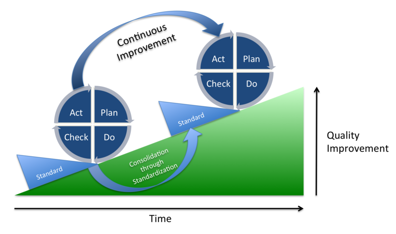

------
### Jez Humble Maturity Model
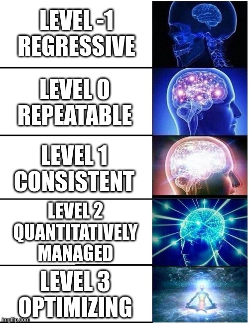

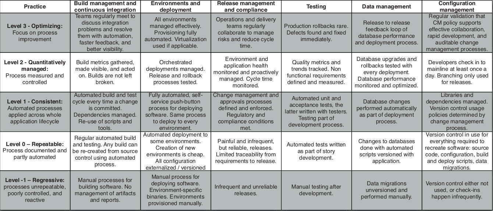

&shy;<!-- .element: class="fragment fade-in" -->The main advice is to **make incremental changes** and **measure their impact**. Attempting a full transition from **level -1 to level 3** across the organization at once can **lead to failure**. Changing large organizations **takes years**.

&shy;<!-- .element: class="fragment fade-in" -->No matter how **good you are**, it is always possible to **improve**.

------
### Qualitic Maturity Model (QMM)
[Qualitic Maturity Model (QMM)](https://maturity.qualitic.ir/QMM-in-detail) is a **guiding principle** to develop **successful and quality software**, following a set of **clear and pragmatic rules**. It is a new approach to measure, guide, and empower the quality of the product development process.

&shy;<!-- .element: class="fragment fade-in" -->QMM stands out from other maturity models by focusing on **practicality** and showing **technical details**.

&shy;<!-- .element: class="fragment fade-in" -->In 2019, **Sahab**'s engineers shifted from **abstract quality to practical definitions**, collaborating with companies like **A'van** and **Hamravesh** to create a list of **5 maturity levels**. Qualitic introduced the model at a Tehran conference in November 2019.

&shy;<!-- .element: class="fragment fade-in-with-next custom" -->Baseline CI Pipeline:
- Commit Stage
- Code Review
- Acceptance Test Stage
- Performance Test Stage
- Staging

------
### Continued: Qualitic Maturity Model (QMM)
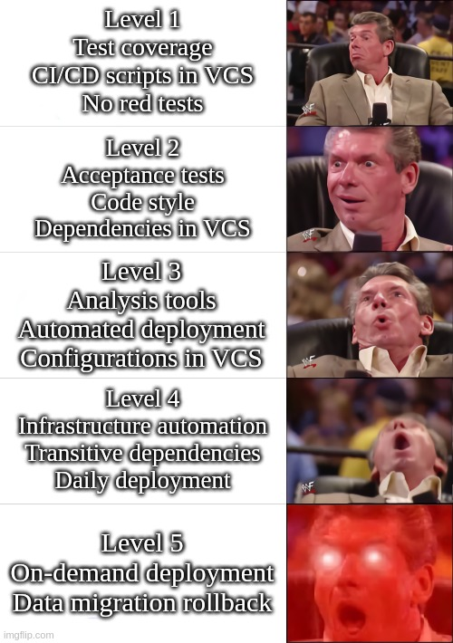

&shy;<!-- .element: class="fragment fade-in-with-next custom" -->Items are categorized as **T**est, **E**nvironment, **B**uild/CI, or **D**elivery (Deployment Frequency, Lead Time, Time to Restore, Change Failure Rate):
- <!-- .element: class="fragment insides-fade-in-then-out custom" -->Level 1
  - [T001](https://maturity.qualitic.ir/catalog/test/T001): Test coverage is measured at the commit stage
  - [B001](https://maturity.qualitic.ir/catalog/build_ci/B001): All CI/CD scripts are kept in version control
  - [T016](https://maturity.qualitic.ir/catalog/test/T016): No release with red tests

- <!-- .element: class="fragment insides-fade-in-then-out custom" -->Level 2
  - [T002](https://maturity.qualitic.ir/catalog/test/T002): Commit stage test coverage > 10%
  - [T007](https://maturity.qualitic.ir/catalog/test/T007): Classify tests as commit, acceptance, and performance
  - [T011](https://maturity.qualitic.ir/catalog/test/T011): There are acceptance tests for at least one feature upon main use cases
  - [B002](https://maturity.qualitic.ir/catalog/build_ci/B002): A specific code style is enforced for main programming languages
  - [B004](https://maturity.qualitic.ir/catalog/build_ci/B004): Compiler warnings are prevented
  - [E001](https://maturity.qualitic.ir/catalog/environment/E001): All direct external dependencies for the software product are specified using fixed versions in version control and also managed with tools/scripts in version control
  - [E012](https://maturity.qualitic.ir/catalog/environment/E012): Secrets are not stored in version control
  - [D001](https://maturity.qualitic.ir/catalog/delivery/D001): Deployment frequency is once per month
  - [D005](https://maturity.qualitic.ir/catalog/delivery/D005): Lead time for changes is less than six months
  - [D009](https://maturity.qualitic.ir/catalog/delivery/D009): Time to restore service is less than one month
  - [D013](https://maturity.qualitic.ir/catalog/delivery/D013): Change failure rate is less than 60%

- <!-- .element: class="fragment insides-fade-in-then-out custom" -->Level 3
  - [T003](https://maturity.qualitic.ir/catalog/test/T003): Commit stage test coverage > 20%
  - [B005](https://maturity.qualitic.ir/catalog/build_ci/B005): Available analysis tools on new code are actively used, as submit gate (50% sonar-way, zero issue, incremental)
  - [T013](https://maturity.qualitic.ir/catalog/test/T013): "Requirement - Acceptance Test" mapping coverage > 5%
  - [E002](https://maturity.qualitic.ir/catalog/environment/E002): Automated application deployment from scratch
  - [E003](https://maturity.qualitic.ir/catalog/environment/E003): Automated application upgrade
  - [E013](https://maturity.qualitic.ir/catalog/environment/E013): All configuration in version control and all production configs from version control
  - [E006](https://maturity.qualitic.ir/catalog/environment/E006): Data is migrated using versioned script only
  - [D002](https://maturity.qualitic.ir/catalog/delivery/D002): Deployment frequency is once per week
  - [D006](https://maturity.qualitic.ir/catalog/delivery/D006): Lead time for changes is less than one month
  - [D010](https://maturity.qualitic.ir/catalog/delivery/D010): Time to restore service is less than one week
  - [D014](https://maturity.qualitic.ir/catalog/delivery/D014): Change failure rate is less than 45%
  - [E010](https://maturity.qualitic.ir/catalog/environment/E010): Same process (scripts) to deploy to every environment

- <!-- .element: class="fragment insides-fade-in-then-out custom" -->Level 4
  - [T004](https://maturity.qualitic.ir/catalog/test/T004): Commit stage test coverage > 50%
  - [T014](https://maturity.qualitic.ir/catalog/test/T014): "Requirement - Acceptance Test" mapping coverage > 20%
  - [B006](https://maturity.qualitic.ir/catalog/build_ci/B006): Available analysis tools are actively used on new code (80% of sonar-way)
  - [B007](https://maturity.qualitic.ir/catalog/build_ci/B007): Build environment can be automatically created from version control
  - [B008](https://maturity.qualitic.ir/catalog/build_ci/B008): No manual configuration of CI/CD agent machines
  - [E004](https://maturity.qualitic.ir/catalog/environment/E004): Automated infrastructure provisioning from scratch
  - [E007](https://maturity.qualitic.ir/catalog/environment/E007): Automated data migration while deploying
  - [E005](https://maturity.qualitic.ir/catalog/environment/E005): Automated infrastructure upgrade
  - [E014](https://maturity.qualitic.ir/catalog/environment/E014): All transitive dependency versions are defined
  - [D003](https://maturity.qualitic.ir/catalog/delivery/D003): Deployment frequency is once per day
  - [D007](https://maturity.qualitic.ir/catalog/delivery/D007): Lead time for changes is less than one week
  - [D011](https://maturity.qualitic.ir/catalog/delivery/D011): Time to restore service is less than one day
  - [D015](https://maturity.qualitic.ir/catalog/delivery/D015): Change failure rate less than 15%

- <!-- .element: class="fragment insides-fade-in-then-out custom" -->Level 5
  - [T015](https://maturity.qualitic.ir/catalog/test/T015): "Requirement - Acceptance Test" mapping coverage > 50%
  - [E008](https://maturity.qualitic.ir/catalog/environment/E008): Data migrations are tested
  - [D004](https://maturity.qualitic.ir/catalog/delivery/D004): Deployment is on-demand (multiple deploys per day)
  - [D008](https://maturity.qualitic.ir/catalog/delivery/D008): Lead time for changes is less than one hour
  - [D012](https://maturity.qualitic.ir/catalog/delivery/D012): Time to restore service is less than one hour
  - [E009](https://maturity.qualitic.ir/catalog/environment/E009): Data migration can be rolled back, automatically

------
### Google Test Certified Ladder (TC Ladder)
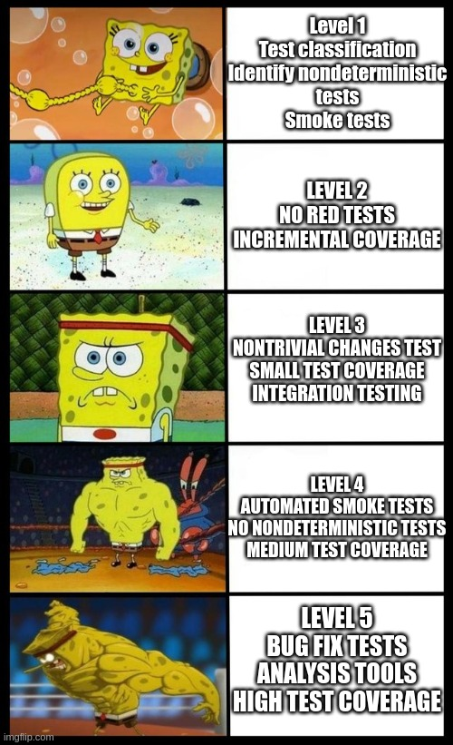

&shy;<!-- .element: class="fragment fade-in" -->The [Test Certified](https://mike-bland.com/2011/10/18/test-certified) program was instrumental in getting the **developer-testing culture** ingrained at **Google**.

&shy;<!-- .element: class="fragment fade-in-with-next custom" -->Test Certified began as a **contest** to **encourage developers to value testing**. By recognizing those who adopt effective practices and attain notable results, we established a "certified" status with a **badge system**, allowing them to showcase their achievements:

&shy;<!-- .element: class="fragment fade-in-with-next custom" -->Levels:
- <!-- .element: class="fragment insides-fade-in-then-out custom" -->Level 1
  - Set up test coverage bundles.
  - Set up a continuous build.
  - Classify your tests as Small, Medium, and Large (think "unit", "integration", and "system" for now).
  - Identify nondeterministic (aka flaky) tests.
  - Create a smoke test suite.
- <!-- .element: class="fragment insides-fade-in-then-out custom" -->Level 2
  - No releases with red tests.
  - Require a smoke test suite to pass before a submit.
  - Incremental coverage by all tests >= 50%.
  - Incremental coverage by small tests >= 10%.
  - At least one feature tested by an integration test.
- <!-- .element: class="fragment insides-fade-in-then-out custom" -->Level 3
  - Require tests for all nontrivial changes.
  - Incremental coverage by small tests >= 50%.
  - New significant features are tested by integration tests.
- <!-- .element: class="fragment insides-fade-in-then-out custom" -->Level 4
  - Automate running of smoke tests before submitting new code.
  - Smoke tests should take less than 30 minutes to run.
  - No nondeterministic tests.
  - Total test coverage should be at least 40%.
  - Test coverage from small tests alone should be at least 25%.
  - All significant features are tested by integration tests.
- <!-- .element: class="fragment insides-fade-in-then-out custom" -->Level 5
  - Add a test for each nontrivial bug fix.
  - Actively use available analysis tools.
  - Total test coverage should be at least 60%.
  - Test coverage from small tests alone should be at least 40%.

---
## Project Lifecycle
Software projects vary, but common elements can be abstracted.

&shy;<!-- .element: class="fragment fade-in-with-next custom" -->Every piece of software goes through several phases:

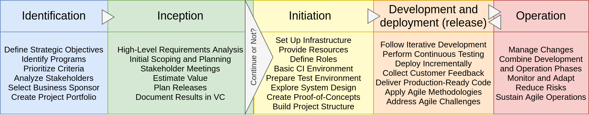

------
### Identification

&shy;<!-- .element: class="fragment fade-in-with-next" -->Medium and large organizations have a **governance strategy**. They define **strategic objectives**, identify **programs** to achieve them, and break these programs into **projects**:

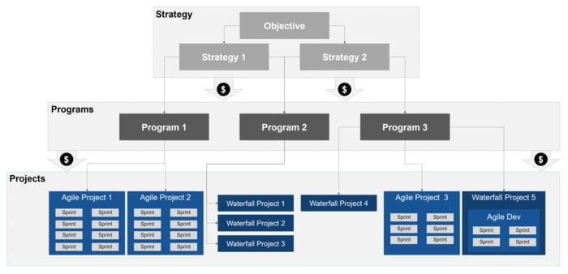

&shy;<!-- .element: class="fragment fade-in" -->Requirements gathering is challenging, and prioritizing them is difficult without a business case. Even with one, the final product may differ significantly from the initial concept.

&shy;<!-- .element: class="fragment fade-in" -->Before gathering requirements, it's crucial to have a **list of stakeholders**, with the **business sponsor** being the most important.

&shy;<!-- .element: class="fragment fade-in" -->Each **project** should have **only one business sponsor** to prevent **political conflicts**. This role is referred to as the **product owner in Scrum** and as the customer in other agile methods.

------
### Inception

&shy;<!-- .element: class="fragment fade-in" -->This phase comes **before coding**. It includes **gathering and analyzing requirements** and **loose scoping and planning** (with a **3 to 6 months horizon**). After inception, we decide whether to **continue or not** (based on project value, costs, and risks).

&shy;<!-- .element: class="fragment fade-in-with-next custom" -->It yields different deliverables based on methodology and project type, but most should include:
- &shy;<!-- .element: class="fragment highlight-current-blue" -->A business case with the project's estimated value.
- &shy;<!-- .element: class="fragment highlight-current-blue" -->High-level functional/nonfunctional requirements, addressing capacity, availability, continuity, and security (enough for estimation and planning).
- &shy;<!-- .element: class="fragment highlight-current-blue" -->A release plan with work schedule and project cost, involving requirements size estimation, coding effort, risk, and staffing.
- &shy;<!-- .element: class="fragment highlight-current-blue" -->A testing strategy.
- &shy;<!-- .element: class="fragment highlight-current-blue" -->A release strategy.
- &shy;<!-- .element: class="fragment highlight-current-blue" -->An architectural evaluation to decide on platforms and frameworks.
- &shy;<!-- .element: class="fragment highlight-current-blue" -->A risk and issue log.
- &shy;<!-- .element: class="fragment highlight-current-blue" -->A description of the development lifecycle.
- &shy;<!-- .element: class="fragment highlight-current-blue" -->A plan to execute this list.

&shy;<!-- .element: class="fragment fade-in" -->The key to a success is uniting **stakeholders in face-to-face meetings**, including developers, customers, operations, and management. The discussions, leading to a shared problem understanding and solution, are the main deliverables.

&shy;<!-- .element: class="fragment fade-in" -->**Document the deliverables**, but as they evolve during the project, store them in **version control**.

&shy;<!-- .element: class="fragment fade-in" -->**A caution**: Decisions at this stage are **speculative and subject to change**. Your output is a guess with limited information. **Avoid excessive effort**, as detailed planning, estimation, or design here is wasteful. **Broad-based decisions** are more durable at this stage.

------
### Initiation

&shy;<!-- .element: class="fragment fade-in-with-next" -->In this phase, set up the **initial project infrastructure**, which usually takes **one or two weeks**:
- &shy;<!-- .element: class="fragment highlight-current-blue" -->Ensuring the team has the necessary hardware and software.
- &shy;<!-- .element: class="fragment highlight-current-blue" -->Establishing basic infrastructure: internet connection, whiteboard, supplies, printer, food, and drinks.
- &shy;<!-- .element: class="fragment highlight-current-blue" -->Creating email accounts and granting resource access permissions.
- &shy;<!-- .element: class="fragment highlight-current-blue" -->Setting up version control.
- &shy;<!-- .element: class="fragment highlight-current-blue" -->Establishing a basic CI environment.
- &shy;<!-- .element: class="fragment highlight-current-blue" -->Defining roles, responsibilities, working hours, and meeting times (e.g., stand-ups, planning meetings).
- &shy;<!-- .element: class="fragment highlight-current-blue" -->Preparing work for the first week, setting targets (not deadlines).
- &shy;<!-- .element: class="fragment highlight-current-blue" -->Creating a simple test environment and test data.
- &shy;<!-- .element: class="fragment highlight-current-blue" -->Exploring system design possibilities in more detail.
- &shy;<!-- .element: class="fragment highlight-current-blue" -->To manage risks, create throwaway proof-of-concept implementations for specific requirements.
- &shy;<!-- .element: class="fragment highlight-current-blue" -->Developing the story or requirement backlog.
- &shy;<!-- .element: class="fragment highlight-current-blue" -->Creating the project structure, a basic "hello world" equivalent in architecture, a build script and initial tests to start CI.

&shy;<!-- .element: class="fragment fade-in" -->This stage is about **establishing essential project infrastructure** and **shouldn't be considered a true development iteration**.

&shy;<!-- .element: class="fragment fade-in" -->Pick a **simple requirement** for **initial design**, **test version control**, run **CI tests**, and **deploy to a test environment**. Finish it and its infrastructure during initiation **before actual development** starts.

------
### Development and Release

&shy;<!-- .element: class="fragment fade-in" -->We suggest an **iterative incremental** software development and release process, which was also used for **space shuttle software**.

&shy;<!-- .element: class="fragment fade-in-with-next custom" -->**Basic conditions** for an iterative process:
- &shy;<!-- .element: class="fragment highlight-current-blue" -->Software is **continuously working**, verified by **automated tests** at all levels (unit, component, and end-to-end).
- &shy;<!-- .element: class="fragment highlight-current-blue" -->**Working software** is **deployed** at each iteration in a **production-like environment** to show to users, making it incremental.
- &shy;<!-- .element: class="fragment highlight-current-blue" -->Iterations are limited to a **maximum of two weeks**.

&shy;<!-- .element: class="fragment fade-in-with-next custom" -->Use an iterative process for these **reasons**:
- &shy;<!-- .element: class="fragment highlight-current-blue" -->**Prioritizing high-value features** means your software becomes **useful early**, even if it's not launched immediately.
- &shy;<!-- .element: class="fragment highlight-current-blue" -->**Regular feedback from customers** helps **refine requirements** as nobody knows exactly what they want at the project's start.
- &shy;<!-- .element: class="fragment highlight-current-blue" -->Completion occurs when the **customer approves** the work during regular showcases, which is the best way to track progress.
- &shy;<!-- .element: class="fragment highlight-current-blue" -->**Keeping the software working** all the time instills discipline and **prevents problems like lengthy integration phases**.
- &shy;<!-- .element: class="fragment highlight-current-blue" -->Iterative methods emphasize having **production-ready code** after each iteration, offering a **unique measure of progress**.

------
### Continued: Development and Release
There are various iterative incremental methodologies, with Scrum being a popular one. However, it can fail for various reasons:
- &shy;<!-- .element: class="fragment highlight-current-blue" -->**Lack of commitment**: Switching to Scrum can be scary for leaders. Agile values transparency, collaboration, discipline, and ongoing enhancement, which may reveal issues which should be fixed promptly.
- &shy;<!-- .element: class="fragment highlight-current-blue" -->**Ignoring good engineering**: Neglecting technical practices like TDD, refactoring, and CI can lead to issues. Scrum alone can't fix a poorly managed codebase.
- &shy;<!-- .element: class="fragment highlight-current-blue" -->**Adapting until the process is no longer an agile one**: People may modify agile processes for their organization but unintentionally lose their agility. Start by the original process before adapting it to your organization.

&shy;<!-- .element: class="fragment fade-in-with-next" -->This last point was so troubling that **Nokia** created a **test to check** if their teams were **truly following Scrum**:
- &shy;<!-- .element: class="fragment highlight-current-blue" -->Are you doing **iterative development**?
  - Iterations must be time-boxed to less than four weeks.
  - Software features must be tested and working at the end of each iteration.
  - The iteration must start before the specification is complete.
- &shy;<!-- .element: class="fragment highlight-current-blue" -->Are you doing **Scrum**?
  - Do you know who the product owner is?
  - Is the product backlog prioritized by business value?
  - Does the product backlog have estimates created by the team?
  - Are there project managers (or others) disrupting the work of the team?

------
### Operation
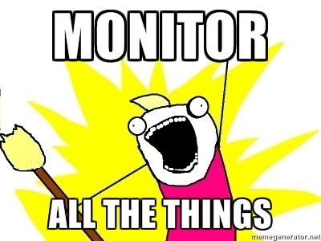

&shy;<!-- .element: class="fragment fade-in" -->Most projects **don't stop after the first release** and keep adding new features.

&shy;<!-- .element: class="fragment fade-in" -->In a **truly iterative** and agile process, the operational phase is **much like** regular development.

&shy;<!-- .element: class="fragment fade-in" -->So, **combining development and operation phases** is a **key way to reduce risk**, which is **central to CD**, as explained before.

&shy;<!-- .element: class="fragment fade-in" -->Yet, there are differences to note between project phases before and after the system goes to production. **Change management**, especially regarding **data** and public interfaces, becomes a significant concern **after the initial public release**.

---
## A Risk Management Process
Risk management ensures:
- &shy;<!-- .element: class="fragment highlight-current-blue" -->**Identifying** main project risks.
- &shy;<!-- .element: class="fragment highlight-current-blue" -->Implementing strategies to **manage them**.
- &shy;<!-- .element: class="fragment highlight-current-blue" -->**Ongoing** risk identification and management throughout the project.

&shy;<!-- .element: class="fragment fade-in-with-next custom" -->A good risk management process includes:
- &shy;<!-- .element: class="fragment highlight-current-blue" -->Standardized **status reporting** structure for project teams.
- &shy;<!-- .element: class="fragment highlight-current-blue" -->**Regular team updates** on progress.
- &shy;<!-- .element: class="fragment highlight-current-blue" -->A **dashboard for program managers** to **monitor project status**.
- &shy;<!-- .element: class="fragment highlight-current-blue" -->**Periodic external audits** to ensure effective risk management.

------
### Risk Management 101
**Not all** risks require mitigation strategies. Some **catastrophic** events like **legislative/economic** changes, **organization's management shifts**, or **sponsor loss** can lead to **project cancellation**.

&shy;<!-- .element: class="fragment fade-in-with-next custom" -->A common risk management model classifies risks based on their **Impact** (the potential damage like financial) and **Likelihood**:

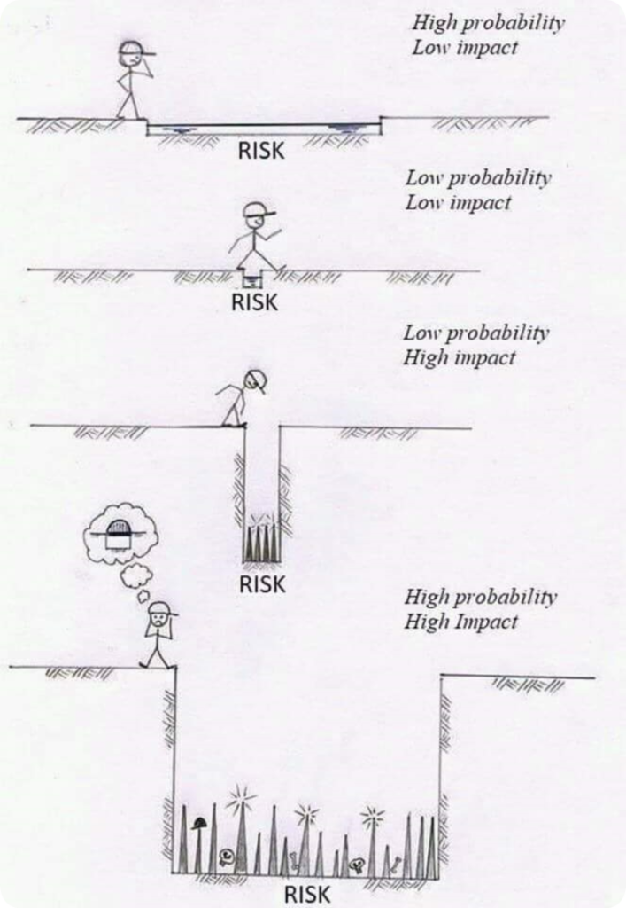

&shy;<!-- .element: class="fragment fade-in" -->This simplifies risk mitigation decisions: If the **strategy costs more than the risk's impact**, it might **not be worth** implementing.

------
### Risk Management Timeline
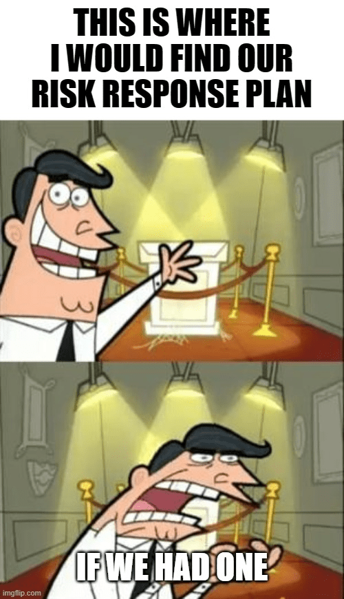

In terms of the **project lifecycle** model, the risk management process should:
- &shy;<!-- .element: class="fragment highlight-current-blue" -->Begin at the end of Inception
  - Deliverables
    - **Release strategy**
    - Plan for the initiation phase
- &shy;<!-- .element: class="fragment highlight-current-blue" -->Revisited at the end of Initiation
  - The key here is to make sure that the team is ready to start developing software (by setting up deployment pipeline).
- &shy;<!-- .element: class="fragment highlight-current-blue" -->Regularly revisited throughout during the Develop and Release phase
  - Several ways of identifying risks:
    - Look at the deployment plan.
    - After each showcase, have short retrospectives where the team brainstorms risks.
    - Make risk identification part of your daily stand up meeting.

------
### How to Do a Risk-Management Exercise

&shy;<!-- .element: class="fragment fade-in-with-next custom" -->It's vital to identify **potential project failure** early. In iterative development:
- &shy;<!-- .element: class="fragment highlight-current-blue" -->**Showcasing working software** in a production-like environment at the end of each iteration is a clear sign of progress.
- &shy;<!-- .element: class="fragment highlight-current-blue" -->**Team velocity**, gauging code production and deployment speed, reliably reflects progress, regardless of estimate accuracy.

&shy;<!-- .element: class="fragment fade-in-with-next" -->To **analyze a project** effectively, consider these questions (this list has worked well on **several** projects):
- &shy;<!-- .element: class="fragment highlight-current-blue" -->How are you **tracking progress**?
- &shy;<!-- .element: class="fragment highlight-current-blue" -->How are you **preventing, discovering, and tracking defects**?
- &shy;<!-- .element: class="fragment highlight-current-blue" -->How do you know a **story is finished**?
- &shy;<!-- .element: class="fragment highlight-current-blue" -->How are you **managing environments**?
- &shy;<!-- .element: class="fragment highlight-current-blue" -->How are you **managing configurations** like tests, deployment scripts, environment and application configuration, database scripts, and libraries?
- &shy;<!-- .element: class="fragment highlight-current-blue" -->How often do you **showcase** working features?
- &shy;<!-- .element: class="fragment highlight-current-blue" -->How often do you do **retrospectives**?
- &shy;<!-- .element: class="fragment highlight-current-blue" -->How often do you run your **automated tests**?
- &shy;<!-- .element: class="fragment highlight-current-blue" -->How are you **deploying** your software?
- &shy;<!-- .element: class="fragment highlight-current-blue" -->How are you **building** your software?
- &shy;<!-- .element: class="fragment highlight-current-blue" -->How are you ensuring that your release plan is workable and **acceptable to the operations** team?
- &shy;<!-- .element: class="fragment highlight-current-blue" -->How are you ensuring that your **risk-and-issue log** is up-to-date?

---
## Common Delivery Problems - Symptoms and Causes
While anything can go wrong with your project, **some issues are more probable** than others.

&shy;<!-- .element: class="fragment fade-in" -->Identifying what's **truly wrong** with your project can be challenging, as you may **only have symptoms**.

&shy;<!-- .element: class="fragment fade-in-with-next" -->After noticing symptoms, perform **"root cause analysis"** to find underlying causes;
- &shy;<!-- .element: class="fragment highlight-current-blue" -->When faced with symptoms, act like a child and **keep asking the team, "Why?"**
- &shy;<!-- .element: class="fragment highlight-current-blue" -->It's advised to ask "Why?" **at least five times**.

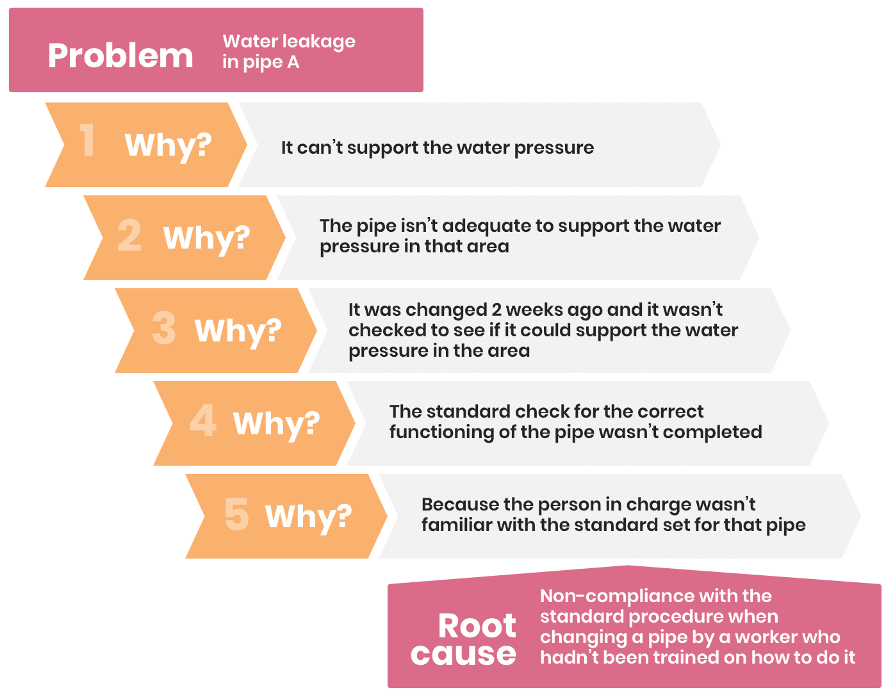

------
### Infrequent or Buggy Deployments
It takes a long time to deploy the build, and the deployment process is brittle.

&shy;<!-- .element: class="fragment fade-in-with-next custom" -->Symptoms:
- &shy;<!-- .element: class="fragment highlight-current-blue" -->Slow bug resolution by testers, possibly due to infrequent deployments.
- &shy;<!-- .element: class="fragment highlight-current-blue" -->Delayed testing and customer sign-off for stories.
- &shy;<!-- .element: class="fragment highlight-current-blue" -->Testers finding old already fixed bugs.
- &shy;<!-- .element: class="fragment highlight-current-blue" -->Lack of trust in UAT, performance, and CI environments, leading to skepticism about release dates.
- &shy;<!-- .element: class="fragment highlight-current-blue" -->Infrequent showcases.
- &shy;<!-- .element: class="fragment highlight-current-blue" -->Rare [truely] working application.
- &shy;<!-- .element: class="fragment highlight-current-blue" -->Slower team progress than expected.

&shy;<!-- .element: class="fragment fade-in-with-next custom" -->Common causes:
- &shy;<!-- .element: class="fragment highlight-current-blue" -->Manual deployment process.
- &shy;<!-- .element: class="fragment highlight-current-blue" -->Insufficient hardware resources.
- &shy;<!-- .element: class="fragment highlight-current-blue" -->Mismanaged hardware and OS configurations.
- &shy;<!-- .element: class="fragment highlight-current-blue" -->External (outside of team's control) dependencies in deployment.
- &shy;<!-- .element: class="fragment highlight-current-blue" -->Lack of understanding of the build and deployment process.
- &shy;<!-- .element: class="fragment highlight-current-blue" -->Insufficient collaboration among team members.
- &shy;<!-- .element: class="fragment highlight-current-blue" -->Developers lacking discipline in making small, incremental changes, leading to frequent functionality issues.

------
### Poor Application Quality
Delivery teams are failing to implement an effective testing strategy.

&shy;<!-- .element: class="fragment fade-in-with-next custom" -->Symptoms:
- &shy;<!-- .element: class="fragment highlight-current-blue" -->Frequent regression bugs and increasing defects despite extensive time spent fixing them.
- &shy;<!-- .element: class="fragment highlight-current-blue" -->Customer complaints about product quality.
- &shy;<!-- .element: class="fragment highlight-current-blue" -->Developers' reluctance to new feature requests.
- &shy;<!-- .element: class="fragment highlight-current-blue" -->Persistent code maintainability complaints.
- &shy;<!-- .element: class="fragment highlight-current-blue" -->Increases in the time required to implement new functionality, causing the team to fall behind.

&shy;<!-- .element: class="fragment fade-in-with-next custom" -->Essential causes:
- &shy;<!-- .element: class="fragment highlight-current-blue" -->Poor collaboration between testers and the rest of delivery team.
- &shy;<!-- .element: class="fragment highlight-current-blue" -->Inadequate or poorly executed automated tests.

&shy;<!-- .element: class="fragment fade-in-with-next custom" -->Detailed causes:
- &shy;<!-- .element: class="fragment highlight-current-blue" -->Lack of collaboration between testers and developers during feature development.
- &shy;<!-- .element: class="fragment highlight-current-blue" -->Stories marked "done" without full automated tests, tester approval, or user showcasing in a production-like environment.
- &shy;<!-- .element: class="fragment highlight-current-blue" -->Defects are routinely entered into a backlog without automated test-driven fixes.
- &shy;<!-- .element: class="fragment highlight-current-blue" -->Inadequate experience in developing automated test suites among developers and testers.
- &shy;<!-- .element: class="fragment highlight-current-blue" -->Lack of understanding about effective test types for the technology or platform.
- &shy;<!-- .element: class="fragment highlight-current-blue" -->Insufficient test coverage due to project management time constraints.
- &shy;<!-- .element: class="fragment highlight-current-blue" -->The system is considered a prototype (some systems initially developed as prototypes and never abandoned).

------
### Poorly Managed Continuous Integration Process
The build process is not properly managed.

&shy;<!-- .element: class="fragment fade-in-with-next custom" -->Symptoms:
- &shy;<!-- .element: class="fragment highlight-current-blue" -->Developers don't check in often enough (at least once a day).
- &shy;<!-- .element: class="fragment highlight-current-blue" -->The commit stage is permanently broken.
- &shy;<!-- .element: class="fragment highlight-current-blue" -->There is a high number of defects.
- &shy;<!-- .element: class="fragment highlight-current-blue" -->There is a long integration phase before each release.

&shy;<!-- .element: class="fragment fade-in-with-next custom" -->Common causes:
- &shy;<!-- .element: class="fragment highlight-current-blue" -->The automated tests take too long to run.
- &shy;<!-- .element: class="fragment highlight-current-blue" -->The commit stage takes too long to run (less than five minutes is ideal, more than ten minutes is unacceptable).
- &shy;<!-- .element: class="fragment highlight-current-blue" -->The automated tests fail intermittently, giving false positives.
- &shy;<!-- .element: class="fragment highlight-current-blue" -->Nobody is empowered to revert check-ins.
- &shy;<!-- .element: class="fragment highlight-current-blue" -->Not enough people understand, and can make changes to, the CI process.

------
### Poor Configuration Management
Environments can't be commissioned, and applications installed reliably, using an automated process.

&shy;<!-- .element: class="fragment fade-in-with-next custom" -->Symptoms:
- &shy;<!-- .element: class="fragment highlight-current-blue" -->Mysterious failures in production environments.
- &shy;<!-- .element: class="fragment highlight-current-blue" -->New deployments are tense, scary events.
- &shy;<!-- .element: class="fragment highlight-current-blue" -->Large teams are dedicated to environment configuration and management.
- &shy;<!-- .element: class="fragment highlight-current-blue" -->Deployments to production often have to be rolled back or patched.
- &shy;<!-- .element: class="fragment highlight-current-blue" -->Unacceptable downtime of production environment.

&shy;<!-- .element: class="fragment fade-in-with-next custom" -->Causes:
- &shy;<!-- .element: class="fragment highlight-current-blue" -->UAT and production environments are different.
- &shy;<!-- .element: class="fragment highlight-current-blue" -->A poor or badly enforced change management process for making changes
to production and staging environments.
- &shy;<!-- .element: class="fragment highlight-current-blue" -->Insufficient collaboration between operations, data management teams,
and delivery teams.
- &shy;<!-- .element: class="fragment highlight-current-blue" -->Ineffective monitoring of production and staging environments to detect
incidents.
- &shy;<!-- .element: class="fragment highlight-current-blue" -->Insufficient instrumentation and logging built into applications.
- &shy;<!-- .element: class="fragment highlight-current-blue" -->Insufficient testing of the nonfunctional requirements of applications.

---
## Compliance and Auditing
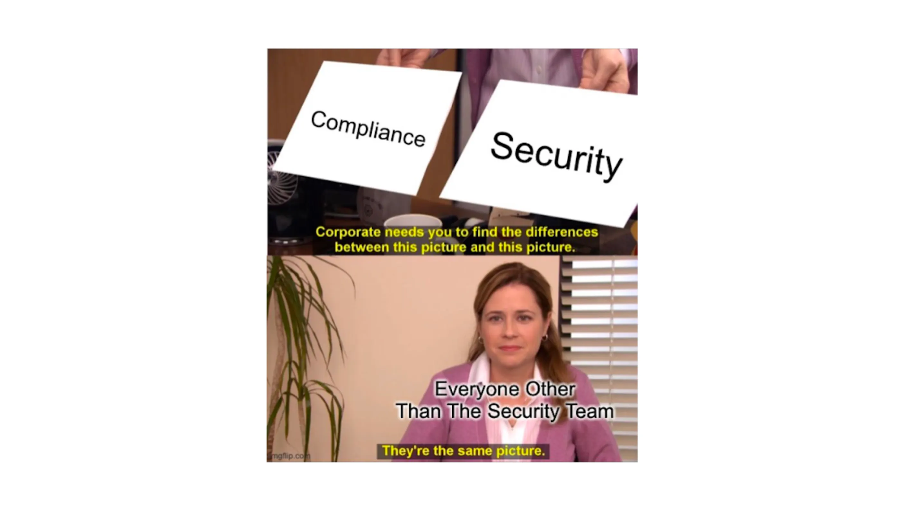

&shy;<!-- .element: class="fragment fade-in-with-next custom" -->Many **large** companies are required to **comply with** legally binding **regulations** that govern their industry:
- &shy;<!-- .element: class="fragment highlight-current-blue" -->US health care companies &rArr; HIPPA
- &shy;<!-- .element: class="fragment highlight-current-blue" -->Systems that deal with credit card information &rArr; PCI DSS Standard

&shy;<!-- .element: class="fragment fade-in" -->Regulatory rules often need **audit** trails to **track code changes in production**, including code **origins**, **contributors**, and **approval**. They are common across various industries like **finance** and **healthcare**.

&shy;<!-- .element: class="fragment fade-in-with-next custom" -->Common **strategies** for **enforcing** these regulations include:
- &shy;<!-- .element: class="fragment highlight-current-blue" -->**Locking down** who is able to **access "privileged" environments**.
- &shy;<!-- .element: class="fragment highlight-current-blue" -->Establishing an efficient **change management process** for **privileged environments**.
- &shy;<!-- .element: class="fragment highlight-current-blue" -->Requiring **approvals** from management before deployments can be performed.
- &shy;<!-- .element: class="fragment highlight-current-blue" -->Requiring every process, from building to release, to be **documented**.
- &shy;<!-- .element: class="fragment highlight-current-blue" -->Set **authorization barriers** to prevent unauthorized software deployment.
- &shy;<!-- .element: class="fragment highlight-current-blue" -->**Audit every deployment** to track changes accurately.

&shy;<!-- .element: class="fragment fade-in" -->Deployment pipeline **simplifies enforcing these strategies** while enabling an **efficient** delivery process.

&shy;<!-- .element: class="fragment fade-in" -->This section outlines principles and practices for **regulatory compliance** with **short cycle times**.

------
### Automation over Documentation
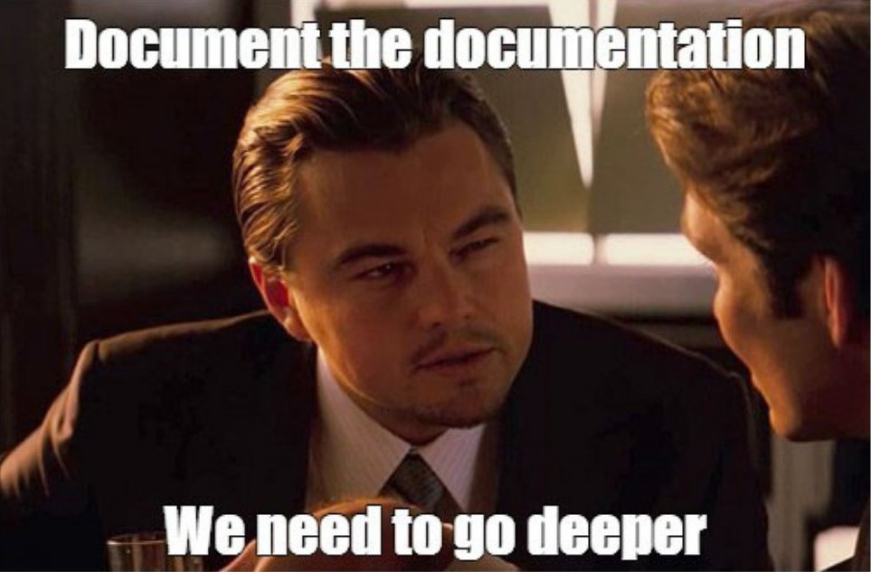

&shy;<!-- .element: class="fragment fade-in" -->A piece of paper that says you did something in a certain way is **no guarantee** that you actually did that thing.

&shy;<!-- .element: class="fragment fade-in" -->Documentation can become **outdated**, especially when it's **overly detailed**. When that happens, people often **neglect** to update it.

&shy;<!-- .element: class="fragment fade-in-with-next custom" -->Typical Dev and Ops conversation:
- &shy;<!-- .element: class="fragment highlight-current-blue" -->Operator:
  - I followed the deployment process you emailed me last month, but it doesn't work.
- &shy;<!-- .element: class="fragment highlight-current-blue" -->Developer:
  - Oh, we changed the way deployment works. You need to copy this new set of files over and set permission x.
  - Or, That's strange, let me take a look ...

&shy;<!-- .element: class="fragment fade-in" -->**Automated scripts** tackle these issues, serving as **up-to-date**, and **precise** process documentation that must function correctly.

------
### Enforcing Traceability
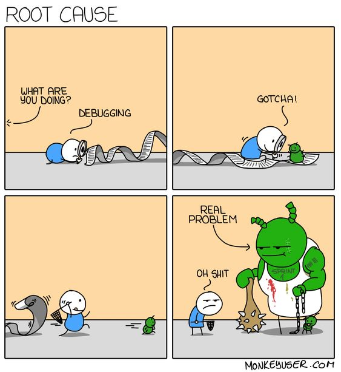

&shy;<!-- .element: class="fragment fade-in" -->Tracing **change history** from **production to source control** versions is often necessary.

&shy;<!-- .element: class="fragment fade-in-with-next custom" -->Best practices:
- &shy;<!-- .element: class="fragment highlight-current-blue" -->Create **binaries only once** and deploy the same ones in production, ensuring their **integrity by hashing**.
- &shy;<!-- .element: class="fragment highlight-cu*rrent-blue" -->Create an **automated process** for testing and deploying binaries while maintaining records of **who did what when**.

------
### Working in Silos
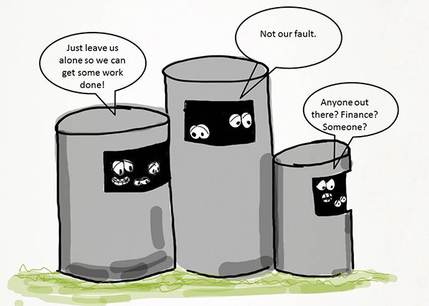

&shy;<!-- .element: class="fragment fade-in" -->Large organizations may have **separate teams/departments** for development, testing, operations, architecture, and data.

&shy;<!-- .element: class="fragment fade-in" -->We **promote open communication** and collaboration, but some responsibilities **must be** clearly assigned to **specific groups**. In regulated environments, some tasks should be reviewed by auditors and **security teams** to **avoid legal issues and breaches**.

&shy;<!-- .element: class="fragment fade-in-with-next custom" -->Some **regulatory regimes** make such cross-functional teams difficult to establish. In such siloed organizations, methods like a **deployment pipeline** can prevent delivery inefficiencies. Still, the key solution is **early communication** among these silos:
- &shy;<!-- .element: class="fragment highlight-current-blue" -->At the project's start, all **stakeholders from various departments** should gather to form the **"release working group"**, shaping the project's **release strategy**.
- &shy;<!-- .element: class="fragment highlight-current-blue" -->The release working group should meet **regularly** during the project, holding **retrospectives, planning, and implementing** using the **PDCA** cycle.
- &shy;<!-- .element: class="fragment highlight-current-blue" -->Even if it has no users yet, **release software frequently**. This follows the principle: "If it hurts, do it more often".
- &shy;<!-- .element: class="fragment highlight-current-blue" -->Provide project status and a **dashboard to all teams** members, ideally displayed on **large monitors**.

------
### Change Management
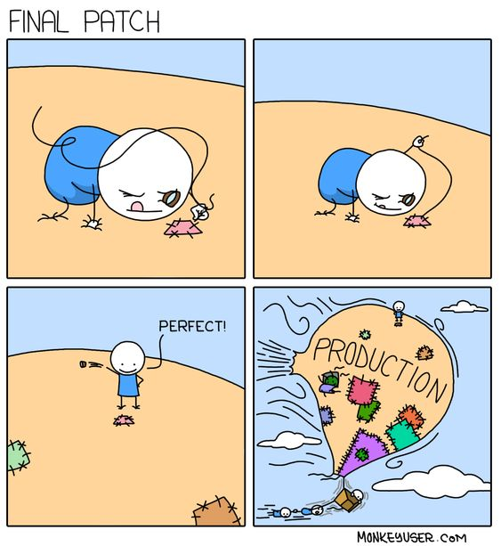

&shy;<!-- .element: class="fragment fade-in" -->In regulated environments, **approval** is often required for parts of the build, deploy, test, and release process.

&shy;<!-- .element: class="fragment fade-in" -->Specifically, UAT, staging, and production environments need **strict access control** via the organization's change management process. It **seems bureaucratic**, but research shows it **reduce** mean time between failures (**MTBF**) and mean time to repair (**MTTR**).

&shy;<!-- .element: class="fragment fade-in-with-next custom" -->If your organization **faces service level issues** from uncontrolled production environment changes, consider this **approval process**:
- &shy;<!-- .element: class="fragment highlight-current-blue" -->Form a **Change Advisory Board (CAB)** with members from **all stakeholder teams** (e.g development, security, and business).
- &shy;<!-- .element: class="fragment highlight-current-blue" -->Define the **environments governed by the change management process**, ensuring strict access control.
- &shy;<!-- .element: class="fragment highlight-current-blue" -->Implement an **automated change request management system** for raising and tracking change requests, **visible to all**.
- &shy;<!-- .element: class="fragment highlight-current-blue" -->Require **all changes**, from deploying new applications to configuration adjustments, to go through a change request.
- &shy;<!-- .element: class="fragment highlight-current-blue" -->Require a **remediation strategy**, such as the ability to **back out, for every change**.
- &shy;<!-- .element: class="fragment highlight-current-blue" -->Set **success criteria** for changes, ideally with an **automated test** that **initially fails, then passes** after the change (see **Behavior-Driven Monitoring**).
- &shy;<!-- .element: class="fragment highlight-current-blue" -->Have an **automated** process for applying changes, enabling approved changes to be applied with a **simple button press**.
- &shy;<!-- .element: class="fragment highlight-current-blue" -->Maintain and **display metrics** on the system, including **approval duration**, **pending changes**, and **denial rates**.
- &shy;<!-- .element: class="fragment highlight-current-blue" -->Track and make visible **success-validation metrics**, such as MTBF, MTTR, and change cycle time, as defined in **ITIL literature**.
- &shy;<!-- .element: class="fragment highlight-current-blue" -->Hold **regular retrospectives** with representatives from all units to enhance the system based on their feedback.

---
## Summary
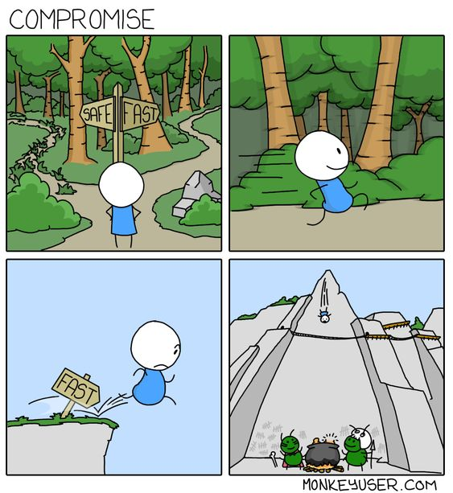

&shy;<!-- .element: class="fragment fade-in" -->Good management creates **efficient software delivery** processes while **managing risks** and **adhering to regulatory requirements**.

&shy;<!-- .element: class="fragment fade-in" -->This session is intended to describe an approach to management that deals with **both conformance and performance**.

&shy;<!-- .element: class="fragment fade-in" -->**Without an iterative incremental process**, it's **hard to assess** your project's **progress** and your application's **fitness for purpose**.

&shy;<!-- .element: class="fragment fade-in" -->We've shown that **iterative delivery** with **automated software development, deployment, testing, and release** within the **deployment pipeline** is highly effective for meeting **conformance** and **performance** objectives.

