## Continuous Delivery: Introduction
#### Definition, Minimum Viable CD, Ingredients, Deployment Pipeline, Impacts (Software Delivery Performance, Culture), Relation with Other Movements, Scrumfall, Case Studies, CD Patterns Mindmap

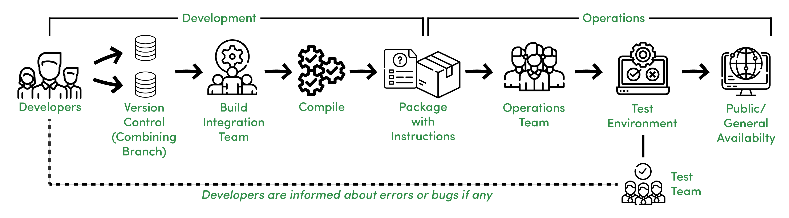

<small><strong>Lecturer:</strong> Alireza Roshanzamir</small>

<small><strong>Keywords:</strong> Continuous Delivery, Continuous Integration, DevOps, Build, Test, Release, Deployment, Automation, Version Control, Deployment Pipeline</small>

<small><small>Tir 1402/August 2023</small></small>

---
## Definition
Contiuous delivery is an **ability**, **development practice**, **discipline**, and **capability** to:

- Get changes of all types into the hands of users safely and quickly in a sustainable way.  <!-- .element: class="fragment fade-in-then-semi-out" -->
- The system can be deployed to production or end users at any time, on-demand (at least once a day).  <!-- .element: class="fragment fade-in-then-semi-out" -->
- The team prioritizes keeping the software in a deployable state over working on new features.  <!-- .element: class="fragment fade-in-then-semi-out" -->
- Fast feedback is available to all team members.  <!-- .element: class="fragment fade-in-then-semi-out" -->

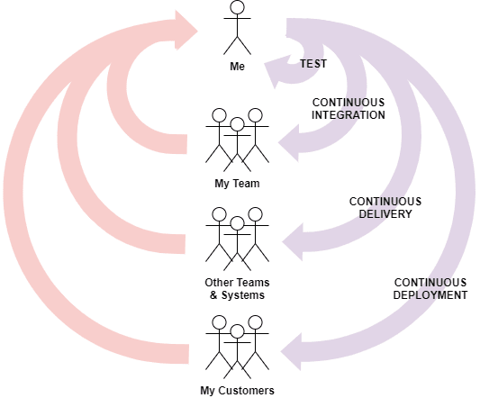

---
## Minimum Viable CD
The **very** minimum activities required for CD are (some items have overlap and may be used interchangeably):

- Small autonomous teams, Small steps (work in small **batches**), Fast feedback, Informed decision making
- Version control (source code, tests, [technical] docs, application configuration, build and deployment scripts, etc.)
- Continuous integration, Trunk-based development
- Deployment pipeline, Traceability
- All feature work stops when the pipeline is red
- Automated testing
- Immutable artifacts
- One route to production, Automated deployment
- Production-like test environment
- Rollback on-demand
- Observability

For detailed information, visit [Minimum CD](https://minimumcd.org/minimumcd) and [14 Step Continuous Delivery Checklist](https://www.youtube.com/watch?v=i2DrLsnETk4).

---
## Ingredients

- **Configuration management**
  - Any new environment reproduced from the same configuration is identical.  <!-- .element: class="fragment fade-in-then-semi-out" -->
  - Everything is versioned and automated.  <!-- .element: class="fragment fade-in-then-semi-out" -->
- **Continuous integration**
  - Developers integrate all their work into the trunk at least daily.  <!-- .element: class="fragment fade-in-then-semi-out" -->
  - If it hurts, do it more often and bring the pain forward (XP principle).  <!-- .element: class="fragment fade-in-then-semi-out" -->
  - A set of automated tests is run both before and after the merge.  <!-- .element: class="fragment fade-in-then-semi-out" -->
  - If the automated tests fail, the team stops what they are doing.  <!-- .element: class="fragment fade-in-then-semi-out" -->
- **Automated and continuous testing**
  - Build quality in  <!-- .element: class="fragment fade-in-then-semi-out" -->
  - Run many different types of tests-both manual and automated-continually throughout the delivery process.  <!-- .element: class="fragment fade-in-then-semi-out" -->
  - Functional acceptance, usability, exploratory, unit, component, system, and non-functional acceptance (capacity, security, availability) tests.  <!-- .element: class="fragment fade-in-then-semi-out" -->

------
### CI Certification Test
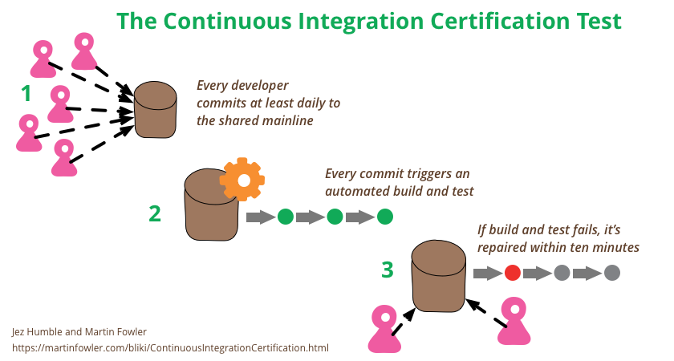

---
## Deployment Pipeline
A key pattern in CD from continuous integration and test automation:

---
## Why?
Why continuous delivery?
- Make releases painless low-risk events  <!-- .element: class="fragment fade-in-then-semi-out" -->
- Reduce time to market  <!-- .element: class="fragment fade-in-then-semi-out" -->
- Increase software quality and stability  <!-- .element: class="fragment fade-in-then-semi-out" -->
- Reduce the cost of ongoing software development  <!-- .element: class="fragment fade-in-then-semi-out" -->
- Increase customer and employee satisfaction  <!-- .element: class="fragment fade-in-then-semi-out" -->

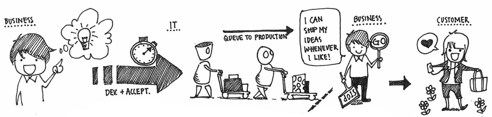

---
## Impacts
The following image is extracted from the book **Accelerate** and represents the culmination of a four-year research project that began in 2013. This study aimed to investigate the crucial capabilities and practices that can accelerate software development and delivery, thereby adding value to companies. To achieve this, the researchers employed rigorous research methods typically associated with academia:

------
### Impacts - Software Delivery Performance
Based on the results of the aforementioned research, the companies have been divided into three clusters:

<table>
  <tr>
    <td></td>
    <td></td>
  </tr>
</table>

Visit https://dora.dev/quickcheck/ to check your software delivery performance.

------
### Impacts - Software Delivery Performance over Time
The performance gap between the high and the low performers widens over time:

<table>
  <tr>
    <td></td>
    <td></td>
  </tr>
  <tr>
    <td></td>
    <td></td>
  </tr>
</table>

------
### Impacts - Westrum Organization Culture Model
The model of how to change culture has changed:

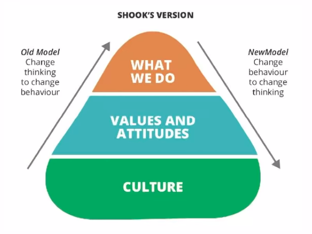

------
### Continued: Impacts - Westrum Organization Culture Model
The set of technical practices known as continuous delivery indeed has a significant impact on the organization's culture, leading to a more generative environment:

---
## Relation with Agile, DevOps, Lean
In short, they differ in their place of **origin**, **history**, **aspects covered**, and **principles**. However, there is a significant **reciprocal relationship** between these movements:

- **Agile:** Flexible, iterative software _development_ approach with short cycles and stakeholder involvement. 
  _Keywords:_ Iterative, XP, Scrum, Kanban, Sprint, Epic, Feature, User Story, Product Owner, Scrum Master, Agile Manifesto
- **DevOps:** _Practices_ bridging development and operations for faster, higher-quality software delivery. 
  _Keywords:_ Wall of Confusion, Collaboration, Automation, Continuous Delivery, Continuously Monitor, Respond to Changes, Feedback Loop, Cultural Transformation
- **Lean:** _Management practices_ aiming to eliminate waste and maximize value in software development. 
  _Keywords:_ Waste Reduction, Define Value, Map the Value Stream, Create Flow, Establish Pull, Pursue Perfection, Lean Startup, MVP, Muda, Mura, Muri, Jidoka
- **Continuous Delivery:** _Automated_, _streamlined_ software deployment to ensure a deployable state at all times. 
  _Keywords:_ Automation, Continuous Testing, Deployment Pipeline, Deployment Frequency, Continuous Deployment, Release Management, Version Control, Configuration Management, Canary Deployment, Rollback Strategies

------
### Continued: Relation with Agile, DevOps, Lean
Finally, look at the first principle behind the Agile manifesto:

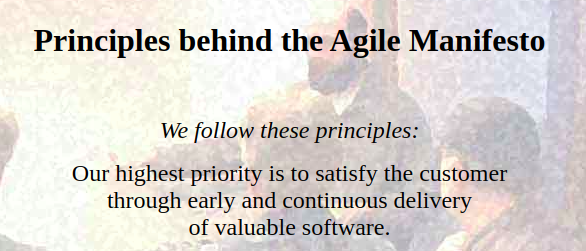

------
### Continued: Relation with Agile, DevOps, Lean
**Agile** aims to optimize software development specifically, without considering other parts of the IT value stream. **DevOps**, on the other hand, recognizes that this approach merely shifts the constraint downstream to Ops, and therefore, it strives to break down walls between development and operations. **Lean** takes a broader perspective, emphasizing the optimization of the entire value stream:

---
## Scrumfall (Water-Scrum-Fall)
Water-Scrum-Fall is a term to describe the reality of the current state of Agile as it exists in many organizations today. But, partial Scrum implementation can have negative consequences.
<table>
  <tr>
    <td>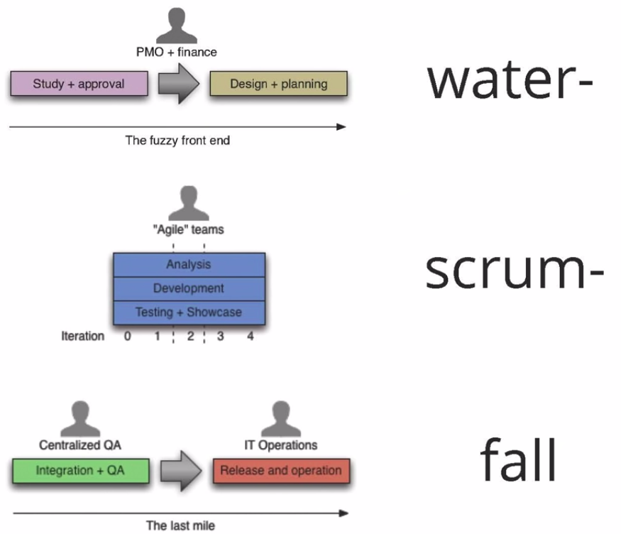</img></td>
    <td>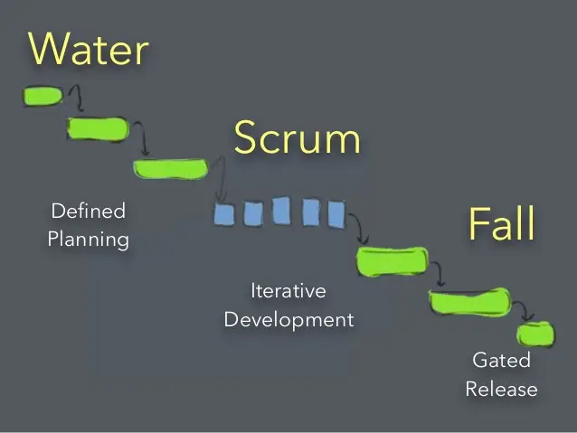</img></td>
  </tr>
</table>

---
## HP Laserjet Framework Case Study
Before CI:

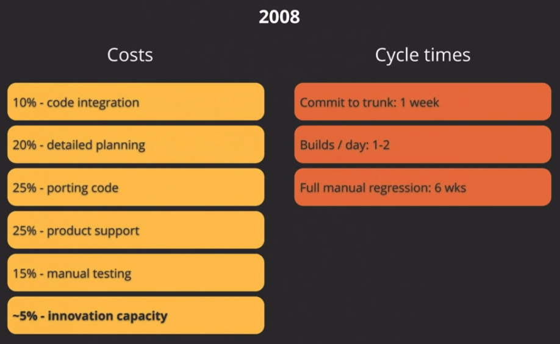

------
## Continued: HP Laserjet Framework Case Study
The CI pipeline:

------
## Continued: HP Laserjet Framework Case Study
After CI:

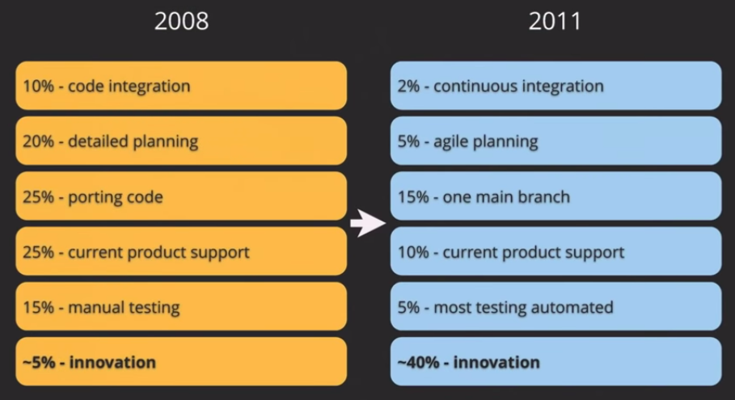

---
## CD Patterns Mindmap
<small><a href="https://app.zenflowchart.com/mindmap/ZLbSFGkwvQBEEnXBxG5V">Link to the mindmap</a></small>

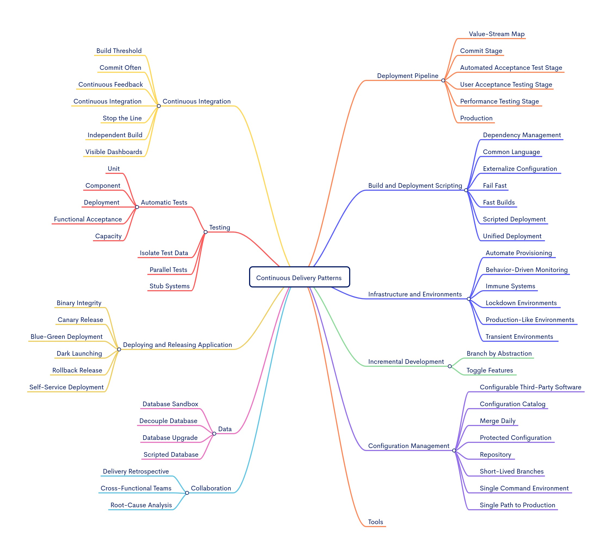

---
## Summary
The practices at the heart of continuous delivery help us achieve several important benefits:
- Low risk releases
- Faster time to market
- Higher quality
- Lower costs
- Better products
  - This means we can avoid the **2/3 of features** we build that  deliver **zero** or **negative value** to our businesses.
- Happier teams

Continuous delivery is not magic. It's about **continuous, daily improvement**: the constant discipline of pursuing higher performance by following the heuristic **"if it hurts, do it more often, and bring the pain forward"**.

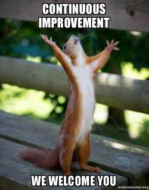
