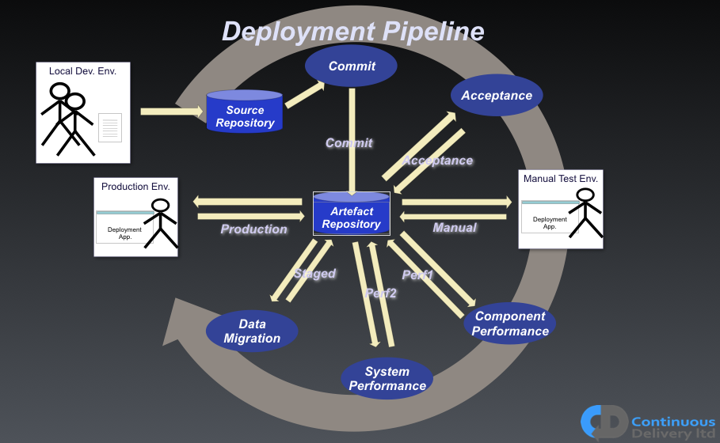
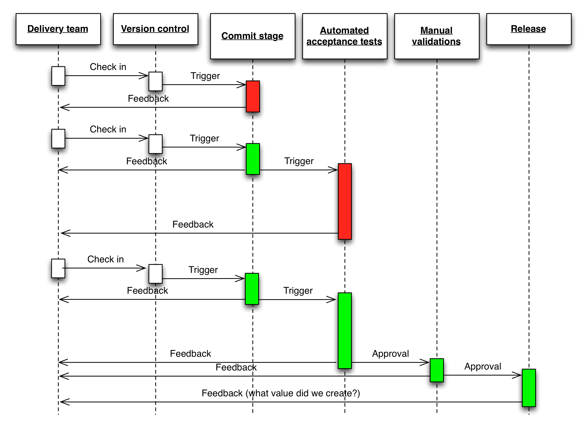
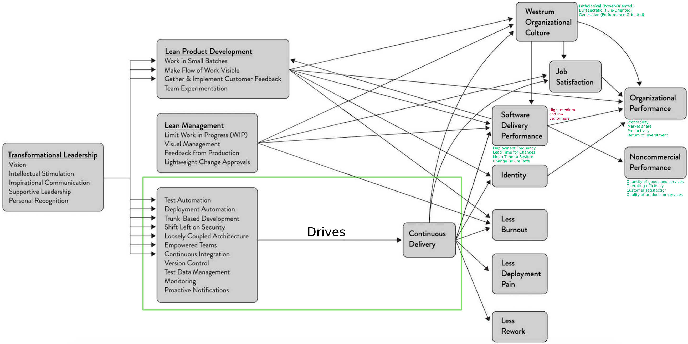
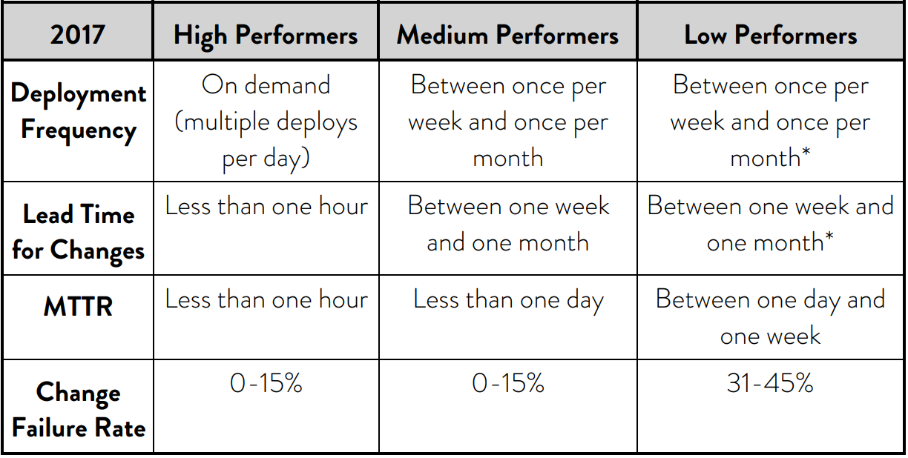
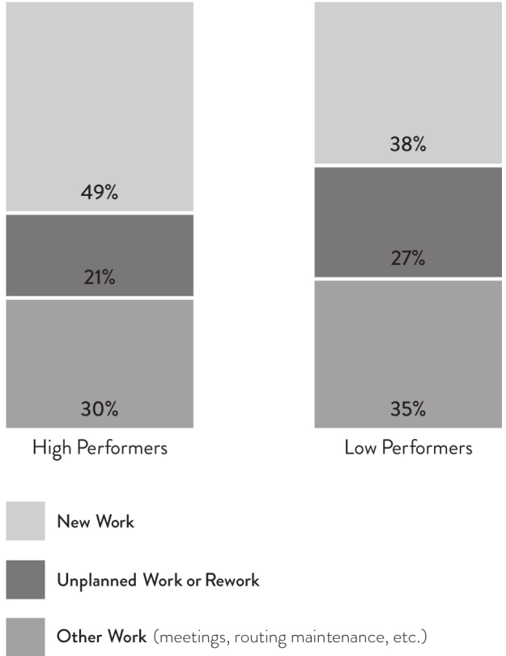
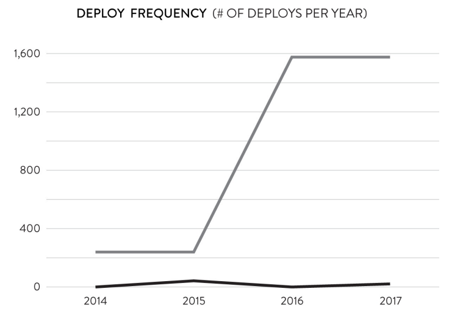
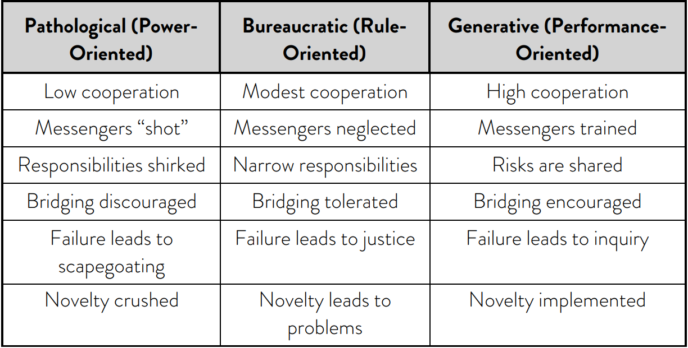
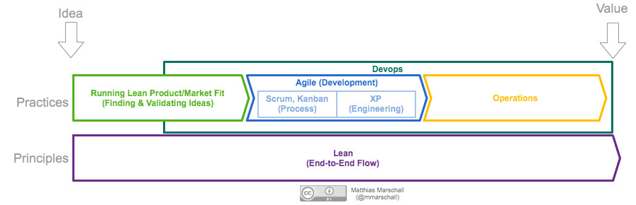

## Continuous Delivery: Introduction
Definition, Ingredients, Impacts, Relation with Other Movements

<small><strong>Lecturer:</strong> Alireza Roshanzamir</small>

<small><strong>Keywords:</strong> Continuous Delivery, Continuous Integration, DevOps, Build, Test, Release, Deployment, Automation, Version Control, Deployment Pipeline</small>

<small><small>Tir 1402/August 2023</small></small>

---
## Definition
Ability, development practice, discipline, and capability to:

- Get changes of all types into the hands of users safely and quickly in a sustainable way.
- The system can be deployed to production or end users at any time, on-demand (at least once a day).
- The team prioritizes keeping the software in a deployable state over working on new features.
- Fast feedback is available to all team members.

---
## Minimum Viable CD
The **very** minimum activities required for CD are (some items have overlap and may be used interchangeably):

- Small autonomous teams, Small steps (work in small **batches**), Fast feedback, Informed decision making
- Version control (source code, tests, [technical] docs, application configuration, build and deployment scripts, etc.)
- Continuous integration, Trunk-based development
- Deployment pipeline, Traceability
- All feature work stops when the pipeline is red
- Automated testing
- Immutable artifacts
- One route to production, Automated deployment
- Production-like test environment
- Rollback on-demand
- Observability

For detailed information, visit [Minimum CD](https://minimumcd.org/minimumcd) and [14 Step Continuous Delivery Checklist](https://www.youtube.com/watch?v=i2DrLsnETk4).

---
## Ingredients

- **Configuration management**
  - Any new environment reproduced from the same configuration is identical.
  - Everything is versioned and automated.
- **Continuous integration**
  - Developers integrate all their work into the trunk at least daily.
  - If it hurts, do it more often and bring the pain forward (XP principle).
  - A set of automated tests is run both before and after the merge.
  - If the automated tests fail, the team stops what they are doing.
- **Automated and continuous testing**
  - Build quality in
  - Run many different types of tests-both manual and automated-continually throughout the delivery process.
  - Functional acceptance, usability, exploratory, unit, component, system, and non-functional acceptance (capacity, security, availability) tests.

---
## Deployment Pipeline
A key pattern in CD from continuous integration and test automation:

---
## Impacts
The following image is extracted from the book **Accelerate** and represents the culmination of a four-year research project that began in 2013. This study aimed to investigate the crucial capabilities and practices that can accelerate software development and delivery, thereby adding value to companies. To achieve this, the researchers employed rigorous research methods typically associated with academia:

---
## Impacts - Software Delivery Performance
Based on the results of the aforementioned research, the companies have been divided into three clusters:

<table>
  <tr>
    <td></td>
    <td></td>
  </tr>
</table>

---
## Impacts - Software Delivery Performance over Time
The performance gap between the high and the low performers widens over time:

<table>
  <tr>
    <td></td>
    <td></td>
  </tr>
  <tr>
    <td></td>
    <td></td>
  </tr>
</table>

---
## Impacts - Westrum Organization Culture Model
The set of technical practices known as continuous delivery indeed has a significant impact on the organization's culture, leading to a more generative environment:

---
## Relation with Agile, DevOps, Lean
In short, they differ in their place of origin, history, aspects covered, and principles. However, there is a significant reciprocal relationship between these movements:

- **Agile:** Flexible, iterative software _development_ approach with short cycles and stakeholder involvement. 
  _Keywords:_ Iterative, XP, Scrum, Kanban, Sprint, Epic, Feature, User Story, Product Owner, Scrum Master, Agile Manifesto
- **DevOps:** _Practices_ bridging development and operations for faster, higher-quality software delivery. 
  _Keywords:_ Wall of Confusion, Collaboration, Automation, Continuous Delivery, Continuously Monitor, Respond to Changes, Feedback Loop, Cultural Transformation
- **Lean:** _Management practices_ aiming to eliminate waste and maximize value in software development. 
  _Keywords:_ Waste Reduction, Define Value, Map the Value Stream, Create Flow, Establish Pull, Pursue Perfection, Lean Startup, MVP, Muda, Mura, Muri, Jidoka
- **Continuous Delivery:** _Automated_, _streamlined_ software deployment to ensure a deployable state at all times. 
  _Keywords:_ Automation, Continuous Testing, Deployment Pipeline, Deployment Frequency, Continuous Deployment, Release Management, Version Control, Configuration Management, Canary Deployment, Rollback Strategies

---
## Continued: Relation with Agile, DevOps, Lean
Agile aims to optimize software development specifically, without considering other parts of the IT value stream. DevOps, on the other hand, recognizes that this approach merely shifts the constraint downstream to Ops, and therefore, it strives to break down walls between development and operations. Lean takes a broader perspective, emphasizing the optimization of the entire value stream:

