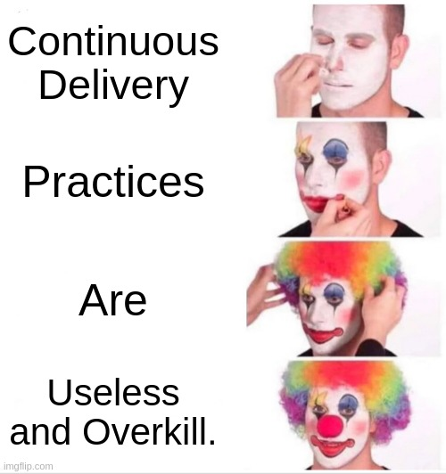
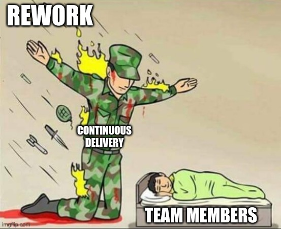

## Continuous Delivery: Introduction
#### Definition, Minimum Viable CD, Ingredients, Deployment Pipeline, Why?, Impacts (Software Delivery Performance, Culture), Relation with Other Movements, Scrumfall, Case Studies, CD Patterns Mindmap

<small><strong>Time to Read:</strong> 12 Minutes</small>, <small><strong>Time to Present:</strong> 60 Minutes</small>

<small><strong>Created By:</strong> Alireza Roshanzamir</small>

<small><strong>Keywords:</strong> Continuous Delivery, Continuous Integration, DevOps, Build, Test, Release, Deployment, Automation, Version Control, Deployment Pipeline</small>

<small><small>Tir 1402/August 2023</small></small>

---
## Definition
Contiuous delivery is an **ability**, **development practice**, **discipline**, and **capability** to:

- Deliver **all kinds of changes** to users **safely**, **quickly**, and **sustainably**.  <!-- .element: class="fragment fade-in-then-semi-out-parent custom" -->
- The system can be **used by users** or put into **production** whenever needed (at least **once daily**).  <!-- .element: class="fragment fade-in-then-semi-out-parent custom" -->
- The team focuses on **maintaining deployable software** rather than **developing new features**.  <!-- .element: class="fragment fade-in-then-semi-out-parent custom" -->
- **Fast feedback** is available to **all team members**.  <!-- .element: class="fragment fade-in-then-semi-out-parent custom" -->

---
## Minimum Viable CD

The **very** minimum activities for CD include (some items can be used interchangeably):
- Small autonomous teams, Small steps (work in small batches), Fast feedback, Informed decision making  <!-- .element class="fragment highlight-current-blue" -->
- Version control (source code, tests, [technical] docs, application configuration, build and deployment scripts, etc.)  <!-- .element class="fragment highlight-current-blue" -->
- Continuous integration, Trunk-based development  <!-- .element class="fragment highlight-current-blue" -->
- Deployment pipeline, Traceability  <!-- .element class="fragment highlight-current-blue" -->
- All feature work stops when the pipeline is red  <!-- .element class="fragment highlight-current-blue" -->
- Automated testing  <!-- .element class="fragment highlight-current-blue" -->
- Immutable artifacts  <!-- .element class="fragment highlight-current-blue" -->
- One route to production, Automated deployment  <!-- .element class="fragment highlight-current-blue" -->
- Production-like test environment  <!-- .element class="fragment highlight-current-blue" -->
- Rollback on-demand  <!-- .element class="fragment highlight-current-blue" -->
- Observability  <!-- .element class="fragment highlight-current-blue" -->

For detailed information, visit [Minimum CD](https://minimumcd.org/minimumcd) and [14 Step Continuous Delivery Checklist](https://www.youtube.com/watch?v=i2DrLsnETk4).

---
## Ingredients

Ingredients:  <!-- .element: class="fragment fade-in-with-next custom" -->
- **Configuration management**
  - Any new environment reproduced from the **same configuration** is **identical**.  <!-- .element: class="fragment fade-in-then-semi-out-parent custom" -->
  - Everything is **versioned** and **automated**.  <!-- .element: class="fragment fade-in-then-semi-out-parent custom" -->
- **Continuous integration**
  - Developers integrate their work **into the trunk daily**.  <!-- .element: class="fragment fade-in-then-semi-out-parent custom" -->
  - **If it hurts, do it more** often and bring the pain forward (XP principle).  <!-- .element: class="fragment fade-in-then-semi-out-parent custom" -->
  - A set of **automated tests** is run both **before** and **after** the merge.  <!-- .element: class="fragment fade-in-then-semi-out-parent custom" -->
  - If the automated tests **fail**, the **team stops** what they are doing.  <!-- .element: class="fragment fade-in-then-semi-out-parent custom" -->
- **Automated and continuous testing**
  - Build **quality in**  <!-- .element: class="fragment fade-in-then-semi-out-parent custom" -->
  - Run various test types-**manual and automated**-continuously during the delivery process.  <!-- .element: class="fragment fade-in-then-semi-out-parent custom" -->
  - **Functional acceptance**, **usability**, **exploratory**, **unit**, **component**, **system**, and **non-functional acceptance** (capacity, security, availability) tests.  <!-- .element: class="fragment fade-in-then-semi-out-parent custom" -->

------
### CI Certification Test

---
## Deployment Pipeline
A key **pattern** in CD from continuous integration and test automation:

---
## Why?

- Make releases **painless** **low-risk** events  <!-- .element: class="fragment fade-in-then-semi-out-parent custom" -->
- Reduce **time to market**   <!-- .element: class="fragment fade-in-then-semi-out-parent custom" -->
- Increase **software quality** and **stability**  <!-- .element: class="fragment fade-in-then-semi-out-parent custom" -->
- Reduce the **cost** of ongoing software development  <!-- .element: class="fragment fade-in-then-semi-out-parent custom" -->
- Increase **customer** and **employee satisfaction**  <!-- .element: class="fragment fade-in-then-semi-out-parent custom" -->

---
## Impacts

The following image is extracted from the book **Accelerate** and embodies a **four-year** research project initiated in **2013**. This study sought to explore vital **capabilities** and **practices** that accelerate software **development** and **delivery**, enhancing **company value**. To achieve this, researchers used rigorous **academic research methods**:  <!-- .element: class="fragment fade-in-paragraph custom" -->

------
### Impacts - Software Delivery Performance
Based on the results of the mentioned research, companies are categorized into **three clusters**:
<table>
  <tr>
    <td></td>
    <td></td>
  </tr>
</table>

Visit https://dora.dev/quickcheck/ to check your software delivery performance.

------
### Impacts - Software Delivery Performance over Time
The **performance gap** between high and low performers **increases over time**:

<table>
  <tr>
    <td></td>
    <td></td>
  </tr>
  <tr>
    <td></td>
    <td></td>
  </tr>
</table>

------
### Impacts - Westrum Organization Culture Model
The model of **how to change culture** has changed:

------
### Continued: Impacts - Westrum Organization Culture Model
The **continuous delivery** practices significantly impact the organization's culture, fostering a more **generative environment**.

---
## Relation with Agile, DevOps, Lean
In short, they vary in **origin**, **history**, **covered aspects**, and **principles**. However, there's a notable **mutual relationship** between these movements:

- **Agile:** Flexible, **iterative** software **development** approach with short cycles and stakeholder involvement. 
  _Keywords:_ Iterative, XP, Scrum, Kanban, Sprint, Epic, Feature, User Story, Product Owner, Scrum Master, Agile Manifesto  <!-- .element class="fragment highlight-current-blue-parent custom" -->
- **DevOps:** **Practices** bridging **development and operations** for faster, higher-quality software delivery. 
  _Keywords:_ Wall of Confusion, Collaboration, Automation, Continuous Delivery, Continuously Monitor, Respond to Changes, Feedback Loop, Cultural Transformation  <!-- .element class="fragment highlight-current-blue-parent custom" -->
- **Lean:** **Management practices** aiming to **eliminate waste** and **maximize value** in software development. 
  _Keywords:_ Waste Reduction, Define Value, Map the Value Stream, Create Flow, Establish Pull, Pursue Perfection, Lean Startup, MVP, Muda, Mura, Muri, Jidoka  <!-- .element class="fragment highlight-current-blue-parent custom" -->
- **Continuous Delivery:** **Automated**, **streamlined** software deployment to ensure a **deployable state at all times**. 
  _Keywords:_ Automation, Continuous Testing, Deployment Pipeline, Deployment Frequency, Continuous Deployment, Release Management, Version Control, Configuration Management, Canary Deployment, Rollback Strategies  <!-- .element class="fragment highlight-current-blue-parent custom" -->

------
### Continued: Relation with Agile, DevOps, Lean
Finally, look at the **first principle** behind the **Agile manifesto**:

------
### Continued: Relation with Agile, DevOps, Lean
**Agile** optimizes **software development**, but doesn't address the full IT **value stream**. In contrast, **DevOps** breaks down **Dev and Ops barriers** for holistic optimization. **Lean** has a broader view, focusing on **entire value stream** improvement:

---
## Scrumfall (Water-Scrum-Fall)
**Water-Scrum-Fall** describes how Agile is often used now. But, **partial Scrum implementation** can cause issues:
<table>
  <tr>
    <td></img></td>
    <td></img></td>
  </tr>
</table>

---
## HP Laserjet Framework Case Study
**Before CI:**

------
## Continued: HP Laserjet Framework Case Study
**The CI pipeline:**

------
## Continued: HP Laserjet Framework Case Study
**After CI:**

---
## CD Patterns Mindmap
<small><a href="https://app.zenflowchart.com/mindmap/ZLbSFGkwvQBEEnXBxG5V">Link to the mindmap</a></small>

---
## Summary
The practices of continuous delivery bring several important **benefits**:
- Low risk releases
- Faster time to market
- Higher quality
- Lower costs
- Better products
  - This means we can avoid the **2/3 of features** we build that  deliver **zero** or **negative value** to our businesses.
- Happier teams

Continuous delivery isn't magic. It's about **continuous, daily improvement**: consistently striving for better results by embracing the principle **"if it hurts, do it more often, and bring the pain forward"**.  <!-- .element: class="fragment fade-in-parent-with-next custom" -->

