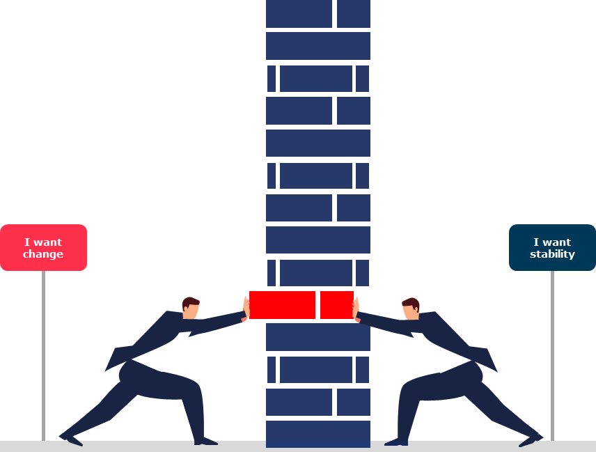
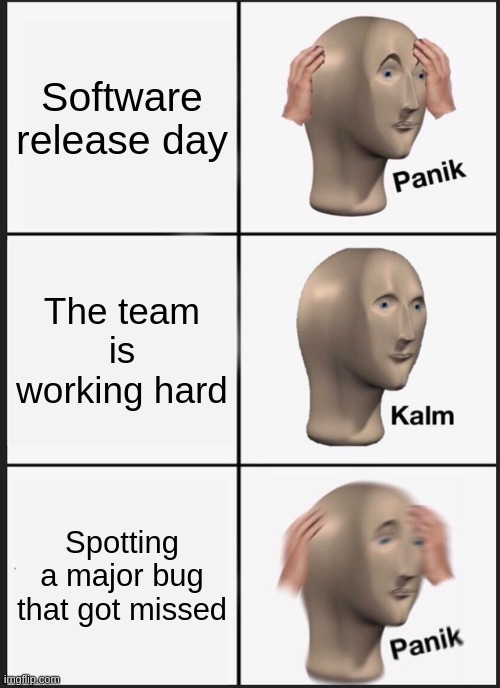
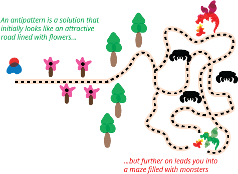
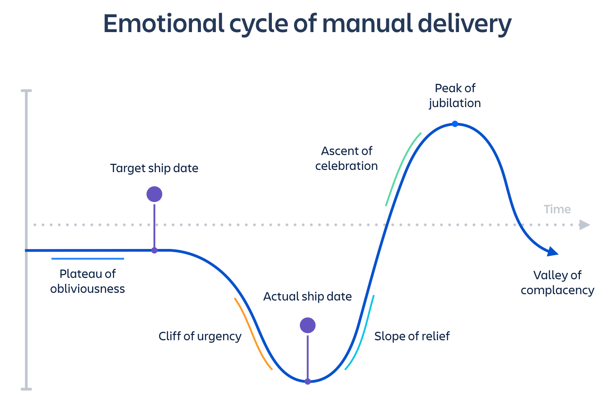
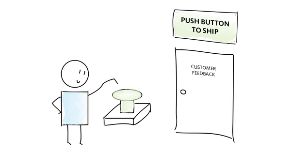
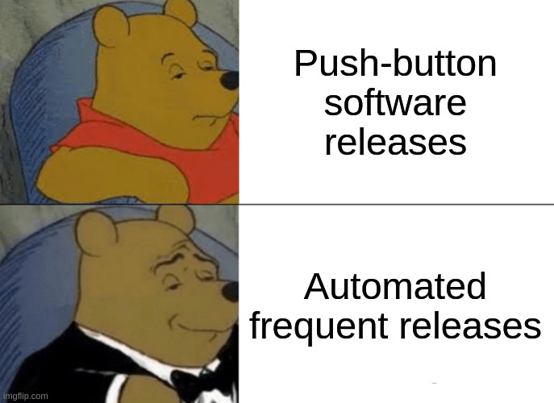
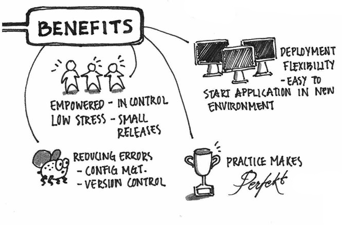
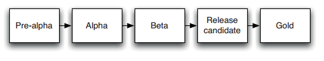
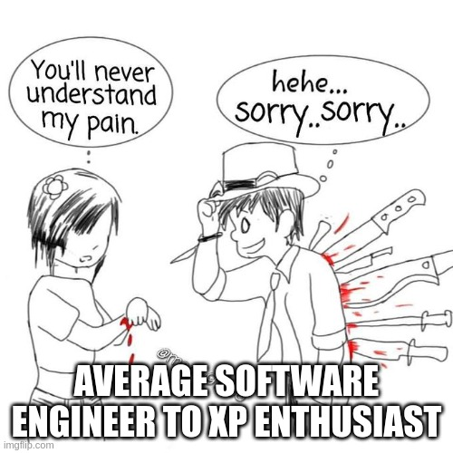
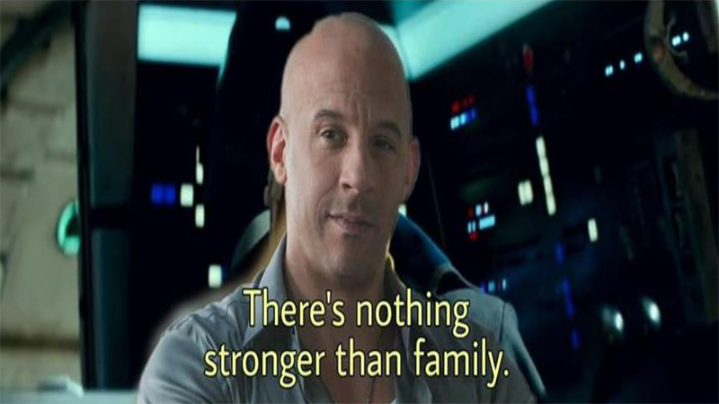

## Continuous Delivery: The Problem of Delivering Software
#### Release Antipatterns, Goals, Criterias, Benefits, Release Candidate, Principles

<small>**Time to Read:** 8 Minutes</small>, <small>**Time to Present:** 30 Minutes</small>

<small>**Created By:** Alireza Roshanzamir</small>

<small>**Keywords:** Continuous Delivery, Continuous Integration, DevOps, Build, Test, Release, Deployment, Automation, Version Control, Deployment Pipeline</small>

<small><small>Tir 1402/August 2023</small></small>

---
## Release Antipatterns

The day of a software release is often stressful due to specific **antipatterns**:  <!-- .element: class="fragment fade-in-parent-with-next custom" -->
- Manual Software Deployment
- Delayed Production-like Deployment
- Manual Production Environment Configuration Management

<table>
  <tr>
    <td></td>
    <td></td>
  </tr>
</table>

------
### Release Antipatterns: Manual Software Deployment
Symptoms:
- Relying on **detailed documentation** for intricate **step-by-step** instructions and potential pitfalls  <!-- .element: class="fragment fade-in-then-semi-out-parent custom" -->
- Performing **manual tests** to check application functionality  <!-- .element: class="fragment fade-in-then-semi-out-parent custom" -->
- **Frequently** requiring **communication** with the **development team**  <!-- .element: class="fragment fade-in-then-semi-out-parent custom" -->
- Making **frequent adjustments** to the release process  <!-- .element: class="fragment fade-in-then-semi-out-parent custom" -->
<!-- - Managing environments within a cluster that possess varying configurations  -->
- Dealing with releases taking **more than a few minutes**  <!-- .element: class="fragment fade-in-then-semi-out-parent custom" -->
- Facing **unpredictable release outcomes**, often **leading to rollbacks**  <!-- .element: class="fragment fade-in-then-semi-out-parent custom" -->
- Feeling tired and staring at a screen **at 2 A.M**.  <!-- .element: class="fragment fade-in-then-semi-out-parent custom" -->

So, moving towards complete **automated deployments** is recommended.  <!-- .element: class="fragment fade-in-paragraph custom" -->

------
### Release Antipatterns: Delayed Production-like Deployment
Symptoms:
- Software is initially **deployed to a production-like** environment (e.g., **staging**) once most **development is finished**  <!-- .element: class="fragment fade-in-then-semi-out-parent custom" -->
- **Releasing to staging** is the first interaction of operations with the new release.  <!-- .element: class="fragment fade-in-then-semi-out-parent custom" -->
- Either a **production-like** environment is **expensive** and **strictly controlled**, or it's **not ready on time**, or **it hasn't been created**.  <!-- .element: class="fragment fade-in-then-semi-out-parent custom" -->
<!-- - The development team assembles installers, configuration files, database migrations, and deployment guidelines for deployment personnel-untested in a production or staging setting.  -->
- **Little collaboration** between **development** and **deployment teams** for creating this collateral.  <!-- .element: class="fragment fade-in-then-semi-out-parent custom" -->
- Thinking it's all about the **DevOps team**  <!-- .element: class="fragment fade-in-then-semi-out-parent custom" -->

Therefore, the solution is to integrating **testing**, **deployment**, and **release tasks** into the **development workflow**. These tasks become routine and continuous during development, reducing risks during eventual production release.  <!-- .element: class="fragment fade-in-paragraph custom" -->

------
### Release Antipatterns: Manual Production Environment Configuration Management
Symptoms:
- **Altering database connection settings** or **increasing thread count** on an app server are **managed manually** for **production environments**.  <!-- .element: class="fragment fade-in-then-semi-out-parent custom" -->
- Despite **successful staging deployments**, **production deployment** encounters **failures**.  <!-- .element: class="fragment fade-in-then-semi-out-parent custom" -->
- **Operations team** invests **significant time** in setting up the release environment.  <!-- .element: class="fragment fade-in-then-semi-out-parent custom" -->
- **Reverting** to previous system configurations (OS, app server, web server, RDBMS, etc.) becomes **unfeasible**.  <!-- .element: class="fragment fade-in-then-semi-out-parent custom" -->
- Clustered servers unintentionally have **varying** **OS versions**, **third-party infrastructure**, or **patches**.  <!-- .element: class="fragment fade-in-then-semi-out-parent custom" -->
<!-- - System configuration involves direct modifications to production systems.  -->
- **Discrepancies** in environment configurations across **testing**, **staging**, and **production**.  <!-- .element: class="fragment fade-in-then-semi-out-parent custom" -->

So, **all aspects of testing, staging, and production**, especially **third-party configurations**, should be **automatically** applied from **version control**.  <!-- .element: class="fragment fade-in-paragraph custom" -->

---
## Goals
Our goal is to explain **deployment pipelines**, along with **high automation** in **testing** and **deployment**, and **comprehensive configuration management** for **push-button software releases**.

---
## Refined Goal

We want to deliver software that's **high-quality** and **valuable** in an **efficient**, **fast**, and **reliable** manner by making releases:  <!-- .element class="fragment fade-in-parent-with-next" -->
- **Automated**
  - Not automated &rArr; Not repeatable  <!-- .element class="fragment highlight-current-blue" -->
  - Not automated &rArr; Error prone  <!-- .element class="fragment highlight-current-blue" -->
  - Not automated &rArr; No review -> No quality  <!-- .element class="fragment highlight-current-blue" -->
- **Frequent**
  - Not frequent &rArr; High difference &rArr; High risk &rArr; Hard roll back  <!-- .element class="fragment highlight-current-blue" -->
  - Not frequent &rArr; Slower feedback  <!-- .element class="fragment highlight-current-blue" -->

---
## Criterias
- Every Change Should Trigger the Feedback Process  <!-- .element: class="fragment insides-fade-in-then-out" -->
  - **Changing components:** executable code, configuration, host environment, and data  <!-- .element: class="fragment fade-in-then-semi-out-parent custom" -->
  - **Feeback process**: Testing every change automatically is essential, covering **syntax**, **units**, **quality metrics**, **acceptance**, **functional/nonfunctional acceptance**, and **exploratory** tests.  <!-- .element: class="fragment fade-in-then-semi-out-parent custom" -->
- The Feedback Must Be Received as Soon as Possible  <!-- .element: class="fragment insides-fade-in-then-out" -->
  - Let **people do interesting** work and leave **repetition to machines**.  <!-- .element: class="fragment fade-in-then-semi-out-parent custom" -->
  - **Commit stage**: **fast**, **comprehensive** (at least 75% of codebase), check only **critical faults** (not UI color), **environment-neutral**.  <!-- .element: class="fragment fade-in-then-semi-out-parent custom" -->
  - **Other stages**: flow and more **parallel**, some of them **may fail**, **run on production like environment**, **test deployment process**  <!-- .element: class="fragment fade-in-then-semi-out-parent custom" -->
- The Delivery Team Must Receive Feedback and Then Act on It  <!-- .element: class="fragment insides-fade-in-then-out-parent" -->
  - **Everyone** in the software delivery process is **part of the feedback loop**: **developers**, **testers**, **operations**, **DB admins**, **infrastructure experts**, and **managers**.  <!-- .element: class="fragment fade-in-then-semi-out-parent custom" -->
  - Reacting to feedback involves using **visible dashboards** and **notifications** to ensure that feedback is understood and acknowledged.  <!-- .element: class="fragment fade-in-then-semi-out-parent custom" -->
  - The entire team is responsible for **stopping** and **deciding on the next steps**.  <!-- .element: class="fragment fade-in-then-semi-out-parent custom" -->

------
### Does This Process Scale?

  <!-- .element: class="fragment complete-fade-out" -->

The techniques and principles that we describe have been **proven in real projects** in all kinds of organizations, both **large** and **small** in all kinds of situations. Much inspired by the philosophy and ideas of the **lean movement** which have been applied to **huge organizations** and **even whole economies**.  <!-- .element: class="fragment fade-in-parent-with-next" -->

---
## Benefits

**Repeatable**, **reliable**, and **predictable release process** significantly reduces **cycle time**, delivering features and fixes to users quickly.  Other benefits are:  <!-- .element: class="fragment fade-in-parent-with-next custom" -->
- Empowering Teams  <!-- .element: class="fragment insides-fade-in-then-out" -->
  - **Pull system**: Testers, operations, or support can **select the application version and environment** they need, **avoiding** endless **emails** and **tickets** for a good build.  <!-- .element: class="fragment fade-in-then-semi-out-parent custom" -->
- Reducing Errors  <!-- .element: class="fragment insides-fade-in-then-out" -->
  - By controlling changes in **version control**, we let **computers** handle **their strengths**.  <!-- .element: class="fragment fade-in-then-semi-out-parent custom" -->
  - You don't want to find out by accident which configuration differences are **important** during your **busiest trading time**.  <!-- .element: class="fragment fade-in-then-semi-out-parent custom" -->
- Lowering Stress  <!-- .element: class="fragment insides-fade-in-then-out" -->
  - Those familiar with software projects **nearing release** know that these are **stressful** situations.  <!-- .element: class="fragment fade-in-then-semi-out-parent custom" -->
  - To minimize stress, you need an **automated deployment process**, **frequently executed**, and a plan for **back changes out** if needed.  <!-- .element: class="fragment fade-in-then-semi-out-parent custom" -->
- Deployment Flexibility  <!-- .element: class="fragment insides-fade-in-then-out" -->
  - Starting your app in a **new environment** should be **easy**.  <!-- .element: class="fragment fade-in-then-semi-out-parent custom" -->
  <!-- - Be able to use your automated deployment process to prepare the new environment for deployment and deploy the chosen version of your application to it.  -->
  - Be able to running **enterprise software** on a **laptop**.  <!-- .element: class="fragment fade-in-then-semi-out-parent custom" -->
- Practice Makes Perfect  <!-- .element: class="fragment insides-fade-in-then-out" -->
  <!-- - There should not be a special QA deployment strategy, or a special acceptance test, or production deployment strategy.  -->
  - Use the **same deployment method** for all targets, **including developer workstations** whenever feasible.  <!-- .element: class="fragment fade-in-then-semi-out-parent custom" -->

---
## Release Candidate
**Every merge (check-in)** to **mainline** is a **release candidate (potential release)**:
- Continuous integration and fix the problem as soon as it occurs &rArr; Always working state  <!-- .element class="fragment highlight-current-blue" -->
-  Comprehensive tests in a production-like environment &rArr; Always releasable state  <!-- .element class="fragment highlight-current-blue" -->

<figure style="text-align: center">
  
  <figcaption>Traditional release candidate</figcaption>
</figure>

---
## Principles

These are the **essential** elements for an **effective delivery process**:
- Create a Repeatable, Reliable Process for Releasing Software  <!-- .element: class="fragment insides-fade-in-then-out" -->
- Automate Almost Everything  <!-- .element: class="fragment insides-fade-in-then-out" -->
  - Automate **gradually** over time.  <!-- .element: class="fragment fade-in-then-semi-out-parent custom" -->
  - There are some things it is **impossible to automate** (such as **exploratory tests**).  <!-- .element: class="fragment fade-in-then-semi-out-parent custom" -->
- Keep Everything in Version Control  <!-- .element: class="fragment insides-fade-in-then-out" -->
  - Everything for **building**, **deploying**, **testing**, and **releasing**. This includes **requirements**, **test scripts and cases**, **network and deployment scripts**, **database scripts**, **app stack configurations**, **libraries**, **tools**, and **documentation**.  <!-- .element: class="fragment fade-in-then-semi-out-parent custom" -->
  - A **new team member** can simply **check out** the project, **run a command**, and **deploy the app** to any environment, even **locally**.  <!-- .element: class="fragment fade-in-then-semi-out-parent custom" -->
  - Each **change set** should have a **single identifier**, like a **build number** or **version control change set**, references every piece.  <!-- .element: class="fragment fade-in-then-semi-out-parent custom" -->
- If It Hurts, Do It More Frequently, and Bring the Pain Forward  <!-- .element: class="fragment insides-fade-in-then-out" -->
  - If releasing software is **painful**, aim to release **every checks in** that **passes** all the automated tests.  <!-- .element: class="fragment fade-in-then-semi-out-parent custom" -->
  - **Work gradually**: Aim for **intermediate goals**, such as an **internal release every few weeks** or, if **you're already doing that, every week**.  <!-- .element: class="fragment fade-in-then-semi-out-parent custom" -->
- Build Quality In (stolen from the lean movement)  <!-- .element: class="fragment insides-fade-in-then-out" -->
  - **Earlier catching defects** &rArr; **Cheaper fixes**.  <!-- .element: class="fragment fade-in-then-semi-out-parent custom" -->
  - **Testing** isn't a phase, and it **shouldn't start after development**.  <!-- .element: class="fragment fade-in-then-semi-out-parent custom" -->
  - **Everyone** in the team is **responsible** for the **application's quality** at all times.  <!-- .element: class="fragment fade-in-then-semi-out-parent custom" -->
- Done Means Released  <!-- .element: class="fragment insides-fade-in-then-out" -->
  - No **"80% done"**. It's either done or not.  <!-- .element: class="fragment fade-in-then-semi-out-parent custom" -->
  - **"Done"** means released into **production**, providing **value to users**.  <!-- .element: class="fragment fade-in-then-semi-out-parent custom" -->
  - The **next best choice**: Functionality is **"done"** when it's **showcased** to and **tested** by **user representatives** in a **production-like** environment.  <!-- .element: class="fragment fade-in-then-semi-out-parent custom" -->
- Everybody Is Responsible for the Delivery Process  <!-- .element: class="fragment insides-fade-in-then-out" -->
- Continuous Improvement  <!-- .element: class="fragment insides-fade-in-then-out" -->
  - The **entire team** should **frequently** come together for a **retrospective on the delivery process**.  <!-- .element: class="fragment fade-in-then-semi-out-parent custom" -->
  - **Deming cycle** or **[O]PDCA**: [Observation], plan, do, study, act.  <!-- .element: class="fragment fade-in-then-semi-out-parent custom" -->

---
## Summary
Through **automated build**, **test**, and **deployment**, we can confirm changes, ensure the process is **reproducible** across various environments, and greatly **reduce chances of errors** in production.

We also get to spend more **weekends with our families** and **friends**, leading **less stressful lives**, and boosting productivity.  <!-- .element: class="fragment fade-in-parent-with-next custom" -->

