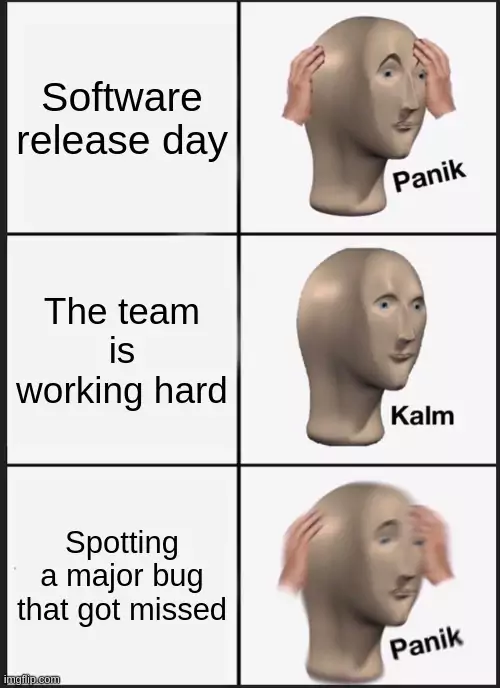
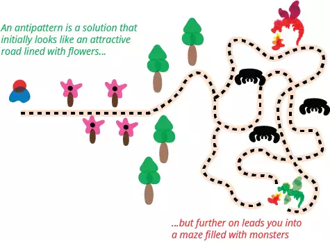
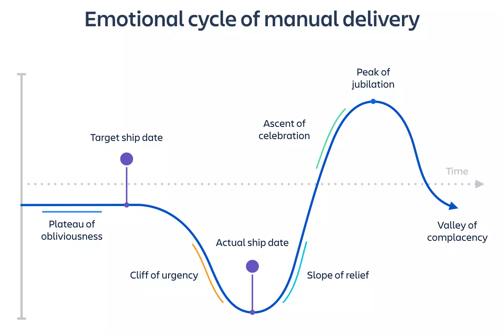
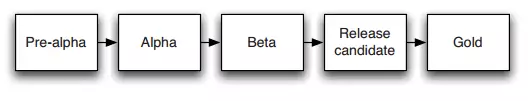

## Continuous Delivery: The Problem of Delivering Software
#### Release Antipatterns, Goals, Criterias, Benefits, Release Candidate, Principles

<small><strong>Time to Read:</strong> 8 Minutes</small>, <small><strong>Time to Present:</strong> 30 Minutes</small>
 
<small><strong>Created By:</strong> Alireza Roshanzamir</small>
 
<small><strong>Keywords:</strong> Continuous Delivery, Continuous Integration, DevOps, Build, Test, Release, Deployment, Automation, Version Control, Deployment Pipeline</small>
  
<small style="color: darkred"><small>Press **"F"** to go fullscreen; some slides may not display properly otherwise.</small></small>

---
## Release Antipatterns

&shy;<!-- .element: class="fragment fade-in-with-next custom" -->The day of a software release is often stressful due to specific **antipatterns**:
- Manual Software Deployment
- Delayed Production-like Deployment
- Manual Production Environment Configuration Management

<table>
  <tr>
    <td></td>
    <td></td>
  </tr>
</table>

------
### Release Antipatterns: Manual Software Deployment
Symptoms:
- &shy;<!-- .element class="fragment fade-in-then-semi-out" -->Relying on **detailed documentation** for intricate **step-by-step** instructions and potential pitfalls
- &shy;<!-- .element class="fragment fade-in-then-semi-out" -->Performing **manual tests** to check application functionality
- &shy;<!-- .element class="fragment fade-in-then-semi-out" -->**Frequently** requiring **communication** with the **development team**
- &shy;<!-- .element class="fragment fade-in-then-semi-out" -->Making **frequent adjustments** to the release process
<!-- - Managing environments within a cluster that possess varying configurations  -->
- &shy;<!-- .element class="fragment fade-in-then-semi-out" -->Dealing with releases taking **more than a few minutes**
- &shy;<!-- .element class="fragment fade-in-then-semi-out" -->Facing **unpredictable release outcomes**, often **leading to rollbacks**
- &shy;<!-- .element class="fragment fade-in-then-semi-out" -->Feeling tired and staring at a screen **at 2 A.M**.

&shy;<!-- .element class="fragment fade-in" -->So, moving towards complete **automated deployments** is recommended.

------
### Release Antipatterns: Delayed Production-like Deployment

Symptoms:
- &shy;<!-- .element class="fragment fade-in-then-semi-out" -->Software is initially **deployed to a production-like** environment (e.g., **staging**) once most **development is finished**
- &shy;<!-- .element class="fragment fade-in-then-semi-out" -->**Releasing to staging** is the first interaction of operations with the new release.
- &shy;<!-- .element class="fragment fade-in-then-semi-out" -->Either a **production-like** environment is **expensive** and **strictly controlled**, or it's **not ready on time**, or **it hasn't been created**.
<!-- - The development team assembles installers, configuration files, database migrations, and deployment guidelines for deployment personnel-untested in a production or staging setting.  -->
- &shy;<!-- .element class="fragment fade-in-then-semi-out" -->**Little collaboration** between **development** and **deployment teams** for creating this collateral.
- &shy;<!-- .element class="fragment fade-in-then-semi-out" -->Thinking it's all about the **DevOps team**

&shy;<!-- .element class="fragment fade-in" -->Therefore, the solution is to integrating **testing**, **deployment**, and **release tasks** into the **development workflow**. These tasks become routine and continuous during development, reducing risks during eventual production release.

------
### Release Antipatterns: Manual Production Environment Configuration Management
Symptoms:
- &shy;<!-- .element class="fragment fade-in-then-semi-out" -->**Altering database connection settings** or **increasing thread count** on an app server are **managed manually** for **production environments**.
- &shy;<!-- .element class="fragment fade-in-then-semi-out" -->Despite **successful staging deployments**, **production deployment** encounters **failures**.
- &shy;<!-- .element class="fragment fade-in-then-semi-out" -->**Operations team** invests **significant time** in setting up the release environment.
- &shy;<!-- .element class="fragment fade-in-then-semi-out" -->**Reverting** to previous system configurations (OS, app server, web server, RDBMS, etc.) becomes **unfeasible**.
- &shy;<!-- .element class="fragment fade-in-then-semi-out" -->Clustered servers unintentionally have **varying** **OS versions**, **third-party infrastructure**, or **patches**.
<!-- - System configuration involves direct modifications to production systems.  -->
- &shy;<!-- .element class="fragment fade-in-then-semi-out" -->**Discrepancies** in environment configurations across **testing**, **staging**, and **production**.

&shy;<!-- .element class="fragment fade-in" -->So, **all aspects of testing, staging, and production**, especially **third-party configurations**, should be **automatically** applied from **version control**.

---
## Goals
Our goal is to explain **deployment pipelines**, along with **high automation** in **testing** and **deployment**, and **comprehensive configuration management** for **push-button software releases**.

---
## Refined Goal

&shy;<!-- .element: class="fragment fade-in-with-next custom" -->We want to deliver software that's **high-quality** and **valuable** in an **efficient**, **fast**, and **reliable** manner by making releases:
- **Automated**
  - Not automated &rArr; Not repeatable  <!-- .element class="fragment highlight-current-blue" -->
  - Not automated &rArr; Error prone  <!-- .element class="fragment highlight-current-blue" -->
  - Not automated &rArr; No review -> No quality  <!-- .element class="fragment highlight-current-blue" -->
- **Frequent**
  - Not frequent &rArr; High difference &rArr; High risk &rArr; Hard roll back  <!-- .element class="fragment highlight-current-blue" -->
  - Not frequent &rArr; Slower feedback  <!-- .element class="fragment highlight-current-blue" -->

---
## Criterias
- Every Change Should Trigger the Feedback Process  <!-- .element: class="fragment insides-fade-in-then-out" -->
  - &shy;<!-- .element: class="fragment fade-in-then-semi-out" -->**Changing components:** executable code, configuration, host environment, and data
  - &shy;<!-- .element: class="fragment fade-in-then-semi-out" -->**Feeback process**: Testing every change automatically is essential, covering **syntax**, **units**, **quality metrics**, **acceptance**, **functional/nonfunctional acceptance**, and **exploratory** tests.
- The Feedback Must Be Received as Soon as Possible  <!-- .element: class="fragment insides-fade-in-then-out" -->
  - &shy;<!-- .element: class="fragment fade-in-then-semi-out" -->Let **people do interesting** work and leave **repetition to machines**.
  - &shy;<!-- .element: class="fragment fade-in-then-semi-out" -->**Commit stage**: **fast**, **comprehensive** (at least 75% of codebase), check only **critical faults** (not UI color), **environment-neutral**.
  - &shy;<!-- .element: class="fragment fade-in-then-semi-out" -->**Other stages**: flow and more **parallel**, some of them **may fail**, **run on production like environment**, **test deployment process**
- The Delivery Team Must Receive Feedback and Then Act on It  <!-- .element: class="fragment insides-fade-in-then-out" -->
  - &shy;<!-- .element: class="fragment fade-in-then-semi-out" -->**Everyone** in the software delivery process is **part of the feedback loop**: **developers**, **testers**, **operations**, **DB admins**, **infrastructure experts**, and **managers**.
  - &shy;<!-- .element: class="fragment fade-in-then-semi-out" -->Reacting to feedback involves using **visible dashboards** and **notifications** to ensure that feedback is understood and acknowledged.
  - &shy;<!-- .element: class="fragment fade-in-then-semi-out" -->The entire team is responsible for **stopping** and **deciding on the next steps**.

------
### Does This Process Scale?
  <!-- .element: class="fragment complete-fade-out" -->

&shy;<!-- .element: class="fragment fade-in-with-next custom" -->The techniques and principles that we describe have been **proven in real projects** in all kinds of organizations, both **large** and **small** in all kinds of situations. Much inspired by the philosophy and ideas of the **lean movement** which have been applied to **huge organizations** and **even whole economies**.

---
## Benefits

&shy;<!-- .element: class="fragment fade-in-with-next custom" -->**Repeatable**, **reliable**, and **predictable release process** significantly reduces **cycle time**, delivering features and fixes to users quickly.  Other benefits are:
- Empowering Teams  <!-- .element: class="fragment insides-fade-in-then-out" -->
  - &shy;<!-- .element: class="fragment fade-in-then-semi-out" -->**Pull system**: Testers, operations, or support can **select the application version and environment** they need, **avoiding** endless **emails** and **tickets** for a good build.
- Reducing Errors  <!-- .element: class="fragment insides-fade-in-then-out" -->
  - &shy;<!-- .element: class="fragment fade-in-then-semi-out" -->By controlling changes in **version control**, we let **computers** handle **their strengths**.
  - &shy;<!-- .element: class="fragment fade-in-then-semi-out" -->You don't want to find out by accident which configuration differences are **important** during your **busiest trading time**.
- Lowering Stress  <!-- .element: class="fragment insides-fade-in-then-out" -->
  - &shy;<!-- .element: class="fragment fade-in-then-semi-out" -->Those familiar with software projects **nearing release** know that these are **stressful** situations.
  - &shy;<!-- .element: class="fragment fade-in-then-semi-out" -->To minimize stress, you need an **automated deployment process**, **frequently executed**, and a plan for **back changes out** if needed.
- Deployment Flexibility  <!-- .element: class="fragment insides-fade-in-then-out" -->
  - &shy;<!-- .element: class="fragment fade-in-then-semi-out" -->Starting your app in a **new environment** should be **easy**.
  <!-- - Be able to use your automated deployment process to prepare the new environment for deployment and deploy the chosen version of your application to it.  -->
  - &shy;<!-- .element: class="fragment fade-in-then-semi-out" -->Be able to running **enterprise software** on a **laptop**.
- Practice Makes Perfect  <!-- .element: class="fragment insides-fade-in-then-out" -->
  <!-- - There should not be a special QA deployment strategy, or a special acceptance test, or production deployment strategy.  -->
  - &shy;<!-- .element: class="fragment fade-in-then-semi-out" -->Use the **same deployment method** for all targets, **including developer workstations** whenever feasible.

---
## Release Candidate
**Every merge (check-in)** to **mainline** is a **release candidate (potential release)**:
- Continuous integration and fix the problem as soon as it occurs &rArr; Always working state  <!-- .element class="fragment highlight-current-blue" -->
-  Comprehensive tests in a production-like environment &rArr; Always releasable state  <!-- .element class="fragment highlight-current-blue" -->

<figure style="text-align: center">
  
  <figcaption>Traditional release candidate</figcaption>
</figure>

---
## Principles

These are the **essential** elements for an **effective delivery process**:
- Create a Repeatable, Reliable Process for Releasing Software  <!-- .element: class="fragment insides-fade-in-then-out" -->
- Automate Almost Everything  <!-- .element: class="fragment insides-fade-in-then-out" -->
  - &shy;<!-- .element: class="fragment fade-in-then-semi-out" -->Automate **gradually** over time.
  - &shy;<!-- .element: class="fragment fade-in-then-semi-out" -->There are some things it is **impossible to automate** (such as **exploratory tests**).
- Keep Everything in Version Control  <!-- .element: class="fragment insides-fade-in-then-out" -->
  - &shy;<!-- .element: class="fragment fade-in-then-semi-out" -->Everything for **building**, **deploying**, **testing**, and **releasing**. This includes **requirements**, **test scripts and cases**, **network and deployment scripts**, **database scripts**, **app stack configurations**, **libraries**, **tools**, and **documentation**.
  - &shy;<!-- .element: class="fragment fade-in-then-semi-out" -->A **new team member** can simply **check out** the project, **run a command**, and **deploy the app** to any environment, even **locally**.
  - &shy;<!-- .element: class="fragment fade-in-then-semi-out" -->Each **change set** should have a **single identifier**, like a **build number** or **version control change set**, references every piece.
- If It Hurts, Do It More Frequently, and Bring the Pain Forward  <!-- .element: class="fragment insides-fade-in-then-out" -->
  - &shy;<!-- .element: class="fragment fade-in-then-semi-out" -->If releasing software is **painful**, aim to release **every checks in** that **passes** all the automated tests.
  - &shy;<!-- .element: class="fragment fade-in-then-semi-out" -->**Work gradually**: Aim for **intermediate goals**, such as an **internal release every few weeks** or, if **you're already doing that, every week**.
- Build Quality In (stolen from the lean movement)  <!-- .element: class="fragment insides-fade-in-then-out" -->
  - &shy;<!-- .element: class="fragment fade-in-then-semi-out" -->**Earlier catching defects** &rArr; **Cheaper fixes**.
  - &shy;<!-- .element: class="fragment fade-in-then-semi-out" -->**Testing** isn't a phase, and it **shouldn't start after development**.
  - &shy;<!-- .element: class="fragment fade-in-then-semi-out" -->**Everyone** in the team is **responsible** for the **application's quality** at all times.
- Done Means Released  <!-- .element: class="fragment insides-fade-in-then-out" -->
  - &shy;<!-- .element: class="fragment fade-in-then-semi-out" -->No **"80% done"**. It's either done or not.
  - &shy;<!-- .element: class="fragment fade-in-then-semi-out" -->**"Done"** means released into **production**, providing **value to users**.
  - &shy;<!-- .element: class="fragment fade-in-then-semi-out" -->The **next best choice**: Functionality is **"done"** when it's **showcased** to and **tested** by **user representatives** in a **production-like** environment.
- Everybody Is Responsible for the Delivery Process  <!-- .element: class="fragment insides-fade-in-then-out" -->
- Continuous Improvement  <!-- .element: class="fragment insides-fade-in-then-out" -->
  - &shy;<!-- .element: class="fragment fade-in-then-semi-out" -->The **entire team** should **frequently** come together for a **retrospective on the delivery process**.
  - &shy;<!-- .element: class="fragment fade-in-then-semi-out" -->**Deming cycle** or **[O]PDCA**: [Observation], plan, do, study, act.

---
## Summary
Through **automated build**, **test**, and **deployment**, we can confirm changes, ensure the process is **reproducible** across various environments, and greatly **reduce chances of errors** in production.

&shy;<!-- .element: class="fragment fade-in-with-next custom" -->We also get to spend more **weekends with our families** and **friends**, leading **less stressful lives**, and boosting productivity.

