## Continuous Delivery: Configuration Management
#### Version Control and Advices, Managing Dependencies, Managing Software Configuration, Managing Environments

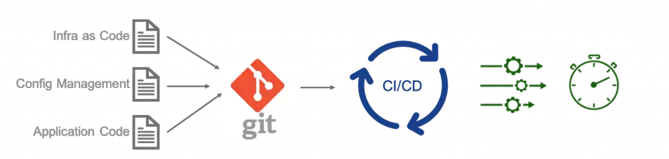

<small><strong>Time to Read:</strong> 15 Minutes</small>, <small><strong>Time to Present:</strong> 75 Minutes</small>
 
<small><strong>Created By:</strong> Alireza Roshanzamir</small>
 
<small><strong>Keywords:</strong> Continuous Delivery, Continuous Integration, DevOps, Build, Test, Release, Deployment, Automation, Version Control, Deployment Pipeline</small>
  
<small style="color: darkred"><small>Press **"F"** to go fullscreen; some slides may not display properly otherwise.</small></small>

---
## Definition
Configuration management is often used interchangeably with **version control**:

> Configuration management involves **storing**, **retrieving**, **uniquely identifying**, and **modifying** all **project-related artifacts** and their **relationships**.

&shy;<!-- .element class="fragment fade-in" -->Although **version control systems are the most obvious tool** in configuration management, the choice to use one (every team should use one, **no matter how small**) is the first step in shaping a configuration management strategy.

&shy;<!-- .element class="fragment fade-in-with-next custom" -->You should **be able to** say **"yes"** to these questions:
- &shy;<!-- .element class="fragment fade-in-then-semi-out" -->Can I precisely **recreate** any of my **environments**, including the **OS version**, **patches**, **network setup**, **software stack**, **deployed apps**, and **their settings**?
- &shy;<!-- .element class="fragment fade-in-then-semi-out" -->Can I easily make an **incremental change** to any of these items and **deploy it to any or all of my environments**?
- &shy;<!-- .element class="fragment fade-in-then-semi-out" -->Can I easily **track** **environment changes** and find out **who** made them and **when**?
<!-- - Can I satisfy all of the compliance regulations that I am subject to? !-->
- &shy;<!-- .element class="fragment fade-in-then-semi-out" -->Can **everyone** on the team **access** the **necessary information** and **make required changes**? <!-- Or does the strategy get in the way of efficient delivery, leading to increased cycle time and reduced feedback? -->

Note
*
It doesn't only mean Git or something but almost means Git or something :)

---
## Version Control
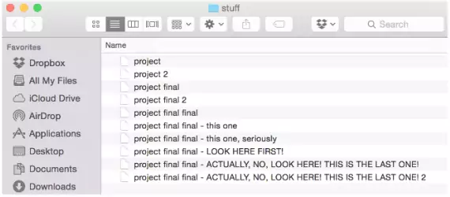

The version control:  <!-- .element class="fragment fade-in-with-next custom" -->
- &shy;<!-- .element class="fragment fade-in-then-semi-out" -->**Keeps** and allows **access** to **all versions** of **every stored file**.
- &shy;<!-- .element class="fragment fade-in-then-semi-out" -->Enables **distributed teams** to **collaborate**, across space and time.

Why?  <!-- .element class="fragment fade-in" -->

- &shy;<!-- .element class="fragment fade-in-then-semi-out" -->What **constitutes** a **specific version** of your software? How can you **reproduce** a particular state of **binaries** and **configurations** that **existed in the production** ?
- &shy;<!-- .element class="fragment fade-in-then-semi-out" -->What was done **when**, by **whom**, and **why**? Not only **helps when issues arise**, but also **tells the story of your application**.

------
### Version Control: Advices
- Keep Absolutely Everything in Version Control
- Check In Regularly to Trunk
- Use Meaningful Commit Messages

Note

<ul>
    <li>Mention the preference for using "version control" instead of "source control".</li>
    <li>If you don't have absolutely every source artifact of your project in version control, you won't enjoy any of the benefits that we discuss in this course.</li>
</ul>

------
### Keep Absolutely Everything in Version Control
- &shy;<!-- .element class="fragment fade-in-then-semi-out" -->All needed to **re-create** your app's **binaries** and their **running environments**, including **infrastructure details** and **scripts** (**GitOps: Git as the single source of truth**).
- &shy;<!-- .element class="fragment fade-in-then-semi-out" -->**Analysts** should store **requirements documents**.
- &shy;<!-- .element class="fragment fade-in-then-semi-out" -->**Testers** should keep their **test scripts** and procedures.
- &shy;<!-- .element class="fragment fade-in-then-semi-out" -->**Project managers** should save their **release plans**, **progress charts**, and **risk logs**.
- &shy;<!-- .element class="fragment fade-in-then-semi-out" -->Many projects also save **binary images** of app servers, **compilers**, VMs, and **toolchain** in version control (**excluding output binaries** that **multiply quickly**, **two commits** might exist for the same version, one for source code and one for binaries).
- &shy;<!-- .element class="fragment fade-in-then-semi-out" -->For handling **big files**, utilize **LFS plugins** like GitLFS. Otherwise, rely on **artifactories**, **storage**, and **file servers** (like JFrog, Nexus, Samba, MinIO, ...), and remember versioning.

------
### Keep Absolutely Everything in Version Control: Documentation
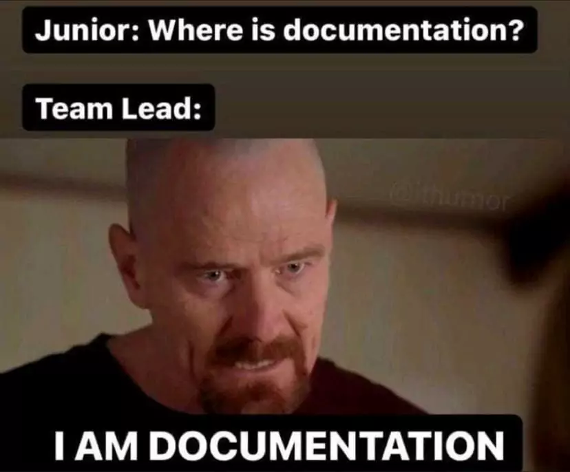

&shy;<!-- .element class="fragment fade-in" -->Having **documentation in version control** and the source code repository offers these advantages:
- &shy;<!-- .element class="fragment fade-in-then-semi-out" -->**Auto-generating** **references** section from the **code**, **docstrings**, **tests**, **changelogs**, **Swagger APIs**, **Protobufs**, etc.
- &shy;<!-- .element class="fragment fade-in-then-semi-out" -->Ensuring **consistency** between documentation and **other entities**.
- &shy;<!-- .element class="fragment fade-in-then-semi-out" -->Taking advantages of the **doctests**.
- &shy;<!-- .element class="fragment fade-in-then-semi-out" -->Supporting **versioning** and **review mechanism**.
- &shy;<!-- .element class="fragment fade-in-then-semi-out" -->With **reStructuredText** or **Markdown**, you can create various views like **HTML**, **Latex**, **PDF**, **Confluence**, **Presentation**. This lets you **publish** them **anywhere** and in any **desired format**.

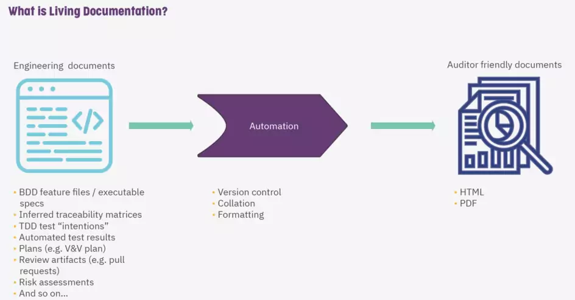

------
### Keep Absolutely Everything in Version Control: Documentation
For example, consider the Python [Click](https://click.palletsprojects.com/) CLI library:

<table>
  <tr>
    <td>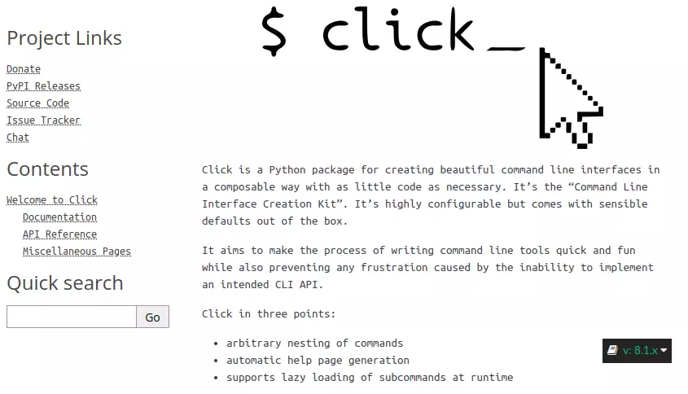</td>
    <td>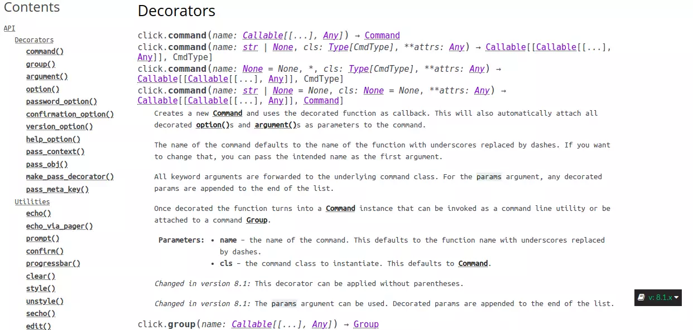</td>
    <td rowspan="2">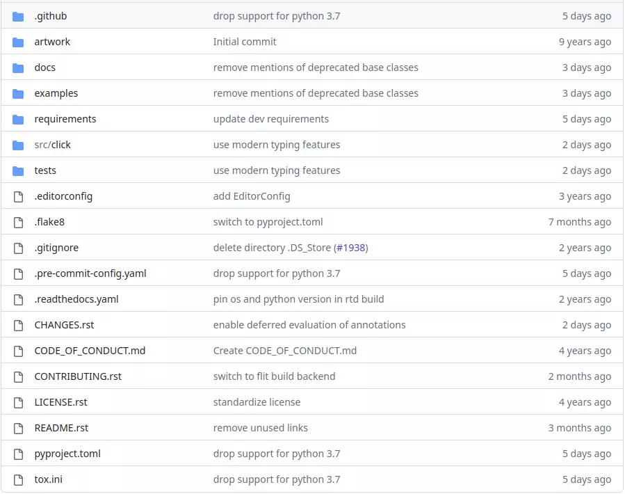</td>
  </tr>
  <tr class="simple">
    <td>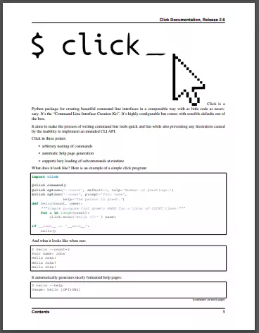</td>
    <td>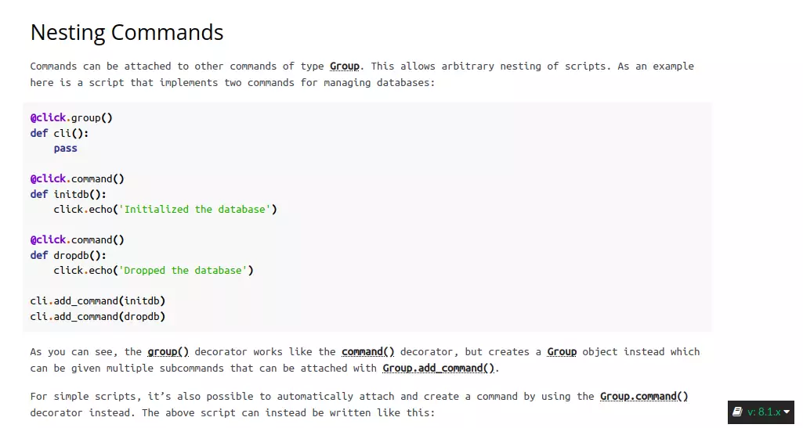</td>
  </tr>
</table>

------
### Check In Regularly to Trunk
- &shy;<!-- .element class="fragment fade-in-then-semi-out" -->They become **public**, **instantly** available to the whole **team**.
- &shy;<!-- .element class="fragment fade-in-then-semi-out" -->Otherwise, **merges** become too **complex**.
- &shy;<!-- .element class="fragment fade-in-then-semi-out" -->**Avoid branching**
- &shy;<!-- .element class="fragment fade-in-then-semi-out" -->Use **commit test suit** (less than **ten minutes**)
- &shy;<!-- .element class="fragment fade-in-then-semi-out" -->**Incremental changes** and **check-in** minimum **once a day**

------
### Use Meaningful Commit Messages

- &shy;<!-- .element class="fragment fade-in-then-semi-out" -->A message like **"fixed obscure bug"** **complicates debugging**.
- &shy;<!-- .element class="fragment fade-in-then-semi-out" -->Add a **link** to the **feature or bug's identifier** in your **project management tool**.
- &shy;<!-- .element class="fragment fade-in-then-semi-out" -->Set a **convention** and stick to it.
- &shy;<!-- .element class="fragment fade-in-then-semi-out" -->For example, "**Enable** server port specification through CLI with --port option (**see #1247**)."
- &shy;<!-- .element class="fragment fade-in-then-semi-out" -->**Multiparagraph** commit message: first paragraph is a **summary**, followed by paragraphs for **additional details**.
- &shy;<!-- .element class="fragment fade-in-then-semi-out" -->**Automatically verify** commit messages.
- &shy;<!-- .element class="fragment fade-in-then-semi-out" -->Consider **[Conventional Commit Messages](https://www.conventionalcommits.org)**.

---
## Managing Dependencies
**External** dependencies include:
- Third-party libraries
- Components or modules being developed by **other teams**

&shy;<!-- .element class="fragment fade-in-with-next custom" -->Key issues of **dependency management**:
- Managing **External Libraries**:
  - &shy;<!-- .element class="fragment fade-in-then-semi-out" -->There's a **debate** about **version-controlling libraries**.
  - &shy;<!-- .element class="fragment fade-in-then-semi-out" -->Maintain **local copies** of external libraries (e.g., in **Maven repository**, **PyPI**, generic **Artifactory**).
- Managing **Components**:
  - &shy;<!-- .element class="fragment fade-in-then-semi-out" -->**Binary dependencies** are usual **between pipelines**, **not source dependencies**. **Recompiling** them is **less efficient** and may lead to **artifacts differing from tested ones**.
  - &shy;<!-- .element class="fragment fade-in-then-semi-out" -->**Easy development** across **multiple components** is **essential**. Making changes in some and running a **single command** that **rebuilds** necessary parts, **creates binaries**, and **performs tests** should be straightforward.

---
## Managing Software* Configuration
**Configuration** is one of the three key parts that comprise an application, along with its **binaries** and **data**. Configuration info alters software behavior at **build time**, **deploy time**, and **run time**.

&shy;<!-- .element class="fragment fade-in" -->**Treat** your system's configuration **like your code**. **Manage** and **test** it properly.

------
### Configuration and Flexibility
Flexibility is a **spectrum**: On one side, single-purpose software excels at a specific task but lacks adjustable behavior. On the opposite end, a programming language can create diverse systems (**ultimate configurability antipattern**):
- It often leads to analysis paralysis  <!-- .element class="fragment highlight-current-blue" -->
- When configuring becomes overly complex, the advantages of flexibility can be lost.  <!-- .element class="fragment highlight-current-blue" -->

------
### Types of Configuration
Configuration information can be **injected into your application** at several points in your:
- Build time
- Packaing time
- Deployment time
- Run time (or startup time)

&shy;<!-- .element class="fragment fade-in" -->Normally, it's **not recommended** to inject configuration during **build** or **packaging** (e.g., J2EE specs and war files). This aligns with the **principle of deploying identical binaries** to **every environment** to ensure the **released** and **tested versions match**.

<!-- There should be a single source of configuration to change, manage, version-control, and override (if necessary). -->

------
### Managing Application Configuration
- How do you **represent** your configuration information?
- How do your **deployment scripts** access it?
- How does it vary between **environments**, **applications**, and **versions of applications**?

&shy;<!-- .element class="fragment fade-in" -->There are a few obvious choices for where to **store** your application configuration: a **database**, a **version control system**, or a **directory** or **registry**.

&shy;<!-- .element class="fragment fade-in" -->Keep the actual configuration for **testing** and **production** **separate from source code** in another repository. This data **changes at a different rate** (but, track **matching configuration and app versions**).

&shy;<!-- .element class="fragment fade-in" -->**Databases**, **directories**, and **registries** are convenient for remote configuration **storage**. However, **track changes** for **audits** and **rollbacks**. For this, use an **automated system** or **version control as your reference, with a script** to load the correct version when needed.

------
### Continued: Managing Application Configuration
- Accessing Configuration
  - &shy;<!-- .element class="fragment fade-in-then-semi-out" -->**Storage** and **access** type: File-system, RDBMS, LDAP, REST API, ESCAPE, Apache Zookepeer
  - &shy;<!-- .element class="fragment fade-in-then-semi-out" -->**Isolate** the details of technology using a **Facade**
- Modeling Configuration
  - Set of tuples, JSON, YAML, XML, Protobuf, INI, TOML, gRPC, OpenAPI, programming language data types, etc.  <!-- .element class="fragment fade-in-then-semi-out" -->
  - &shy;<!-- .element class="fragment fade-in-then-semi-out" -->You may need **versioning**.
  - &shy;<!-- .element class="fragment fade-in-then-semi-out" -->You may consider **backward/forward compatibility**.
  - &shy;<!-- .element class="fragment fade-in-then-semi-out" -->You could think about **adding new environments**, **creating app versions**, **promoting a new version**, **relocating databases**, **virtualizing**, and more.
- Testing System Configuration
  - &shy;<!-- .element class="fragment fade-in-then-semi-out" -->Check that **external service references** in your configuration are **correct** (e.g., **database connections**, **message buses**).
  - &shy;<!-- .element class="fragment fade-in-then-semi-out" -->After **installation**, run **smoke tests** to ensure your **application functions correctly**.

------
### Managing Configuration across Applications
**Keep a catalogue** of configuration **options** for **each application**, detailing **where they're stored**, their **lifecycle**, and **how they can be changed**.

&shy;<!-- .element class="fragment fade-in" -->**If feasible**, such info should be **automatically generated** from the app's code during building. **If not**, put it in a **wiki** or **document system**.

&shy;<!-- .element class="fragment fade-in" -->Deployment and runtime: Understanding the **current configuration of running apps** is crucial. Tools like Nagios, OpenNMS, and HP OpenView can help. **Errors in a few configuration options** of one app can lead to **significant downtime** across services.

------
### Principles of Managing Application Configuration
- &shy;<!-- .element class="fragment fade-in-then-semi-out" -->Think about the **right stage in your app's lifecycle** to **introduce specific configuration**.
- &shy;<!-- .element class="fragment fade-in-then-semi-out" -->**Keep** available app configuration **options with source code**, but **values somewhere else**.
- &shy;<!-- .element class="fragment fade-in-then-semi-out" -->**Automated processes** must **handle configuration** using values from your **configuration repository**.
<!-- - Your configuration system should be able to provide different values to your application (including its packaging, installation, and deployment scripts) based on the application, its version, and the environment it is being deployed into.  -->
- &shy;<!-- .element class="fragment fade-in-then-semi-out" -->Use clear **naming conventions** for configuration options. Imagine someone **reading the file without a manual**.
- &shy;<!-- .element class="fragment fade-in-then-semi-out" -->Ensure **modular**, **encapsulated** configuration information.
- &shy;<!-- .element class="fragment fade-in-then-semi-out" -->**Don't repeat yourself**: define configuration elements so **each concept is represented just once** in the configuration data.
- &shy;<!-- .element class="fragment fade-in-then-semi-out" -->**Be minimalist**: Keep configuration information **simple** and **focused**.
- &shy;<!-- .element class="fragment fade-in-then-semi-out" -->**Avoid overengineering** the configuration system.
- &shy;<!-- .element class="fragment fade-in-then-semi-out" -->Have **tests** for configuration, **executed during deployment or installation**.

---
## Managing Environments
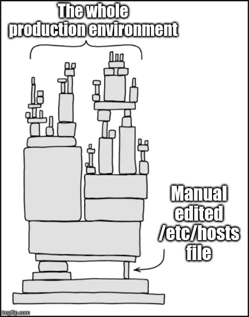

**Automate environment creation** completely:
- &shy;<!-- .element class="fragment fade-in" -->**Removes** the problem of having **random pieces of infrastructure around**.
- &shy;<!-- .element class="fragment fade-in" -->Fixing is **harder** than recreation.
- &shy;<!-- .element class="fragment fade-in" -->Be able to **create copies** of **production** environments **for testing** purposes.

The kinds of environment configuration information:  <!-- .element class="fragment fade-in" -->
- OS: versions, patch levels, and configuration settings.  <!-- .element class="fragment fade-in" -->
- Additional software packages: versions and configuration.  <!-- .element class="fragment fade-in" -->
- External services: versions and configuration  <!-- .element class="fragment fade-in" -->
- Networking topology  <!-- .element class="fragment fade-in" -->
- Any other data or state  <!-- .element class="fragment fade-in" -->

------
### Continued: Managing Environments
<!-- Two principles:
- Keep binary files independent from configuration information.
- Keep all configuration information in one place.

Hence, creating new environments, upgrading parts of your system, and rolling out new configurations without making your system 
unavailable becomes a simple, automated process.  -->

&shy;<!-- .element class="fragment fade-in-with-next custom" -->Managing **third party** products:
- Can we deploy it?  <!-- .element class="fragment highlight-current-blue" -->
- Can we version its configuration effectively?  <!-- .element class="fragment highlight-current-blue" -->
- How will it fit into our automated deployment strategy?  <!-- .element class="fragment highlight-current-blue" -->

&shy;<!-- .element class="fragment fade-in" -->**Treat** your environment **like code**: **Change it incrementally**, **check changes into version control**.

------
### Tools to Manage Environments
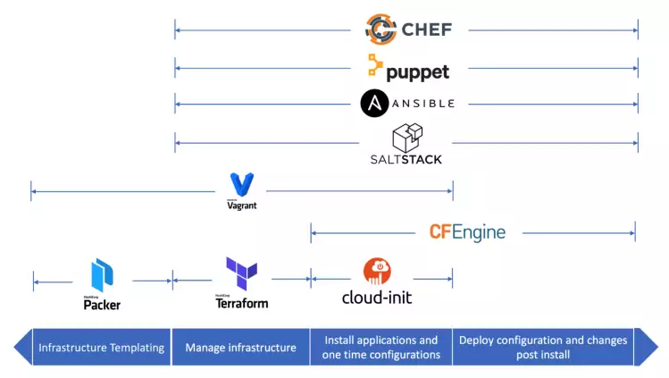

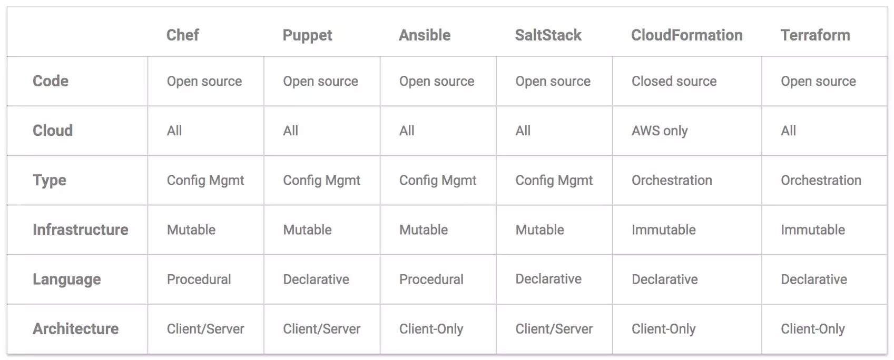

------
### Managing the Change Process

&shy;<!-- .element class="fragment fade-in" -->A production environment must be **locked down**. **No** changes allowed **without** following your **change management process**.

&shy;<!-- .element class="fragment fade-in" -->**Environment changes** are **like software changes**. They **follow** the same **build**, **deploy**, **test**, and **release** process **as code**.

&shy;<!-- .element class="fragment fade-in" -->**Testing environments** should be **treated** the same **as production environments**, with a **simpler approval process**.

---
## Summary
**Configuration management** is **key** to CD. There is **no** continuous integration, release, or deployment pipelining **without it**:
- &shy;<!-- .element class="fragment highlight-current-blue" -->Could you fully **re-create** your **production system**, **excluding production data**, from **version-controlled assets**?
- &shy;<!-- .element class="fragment highlight-current-blue" -->Could you **go back** to a previous, **known good state** of your application?
- &shy;<!-- .element class="fragment highlight-current-blue" -->Are you confident **each deployed environment** (production, staging, test) is set up **the same way**?

&shy;<!-- .element class="fragment fade-in-with-next custom" -->**If not**, your project is **at risk**. It's **crucial** to have a strategy for storing baselines and **controlling changes to**:
- &shy;<!-- .element class="fragment highlight-current-blue" -->App **source code**, **build scripts**, **tests**, **docs**, **requirements**, **DB scripts**, **libraries**, **config files**
- &shy;<!-- .element class="fragment highlight-current-blue" -->Your **development**, **testing**, and **operations** **toolchains**
<!-- - All environments used in development, testing, and production -->
- &shy;<!-- .element class="fragment highlight-current-blue" -->The **application** stack **associated with your applications**-both **binaries** and **configuration**
- &shy;<!-- .element class="fragment highlight-current-blue" -->Configuration for **each app** in all environments **throughout its lifecycle** (build, deploy, test, operation)
