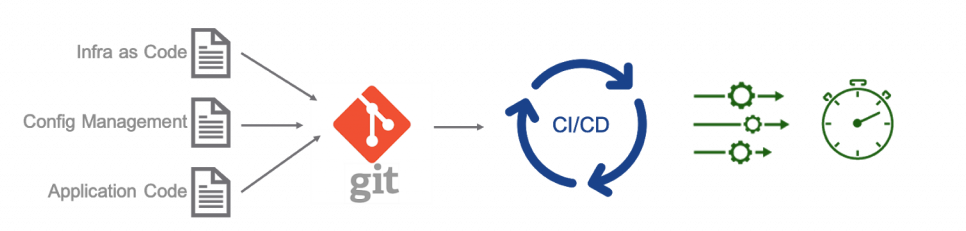
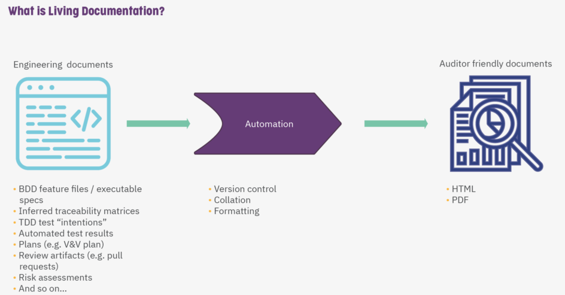
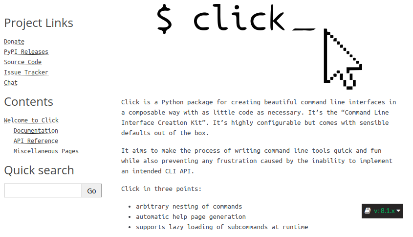
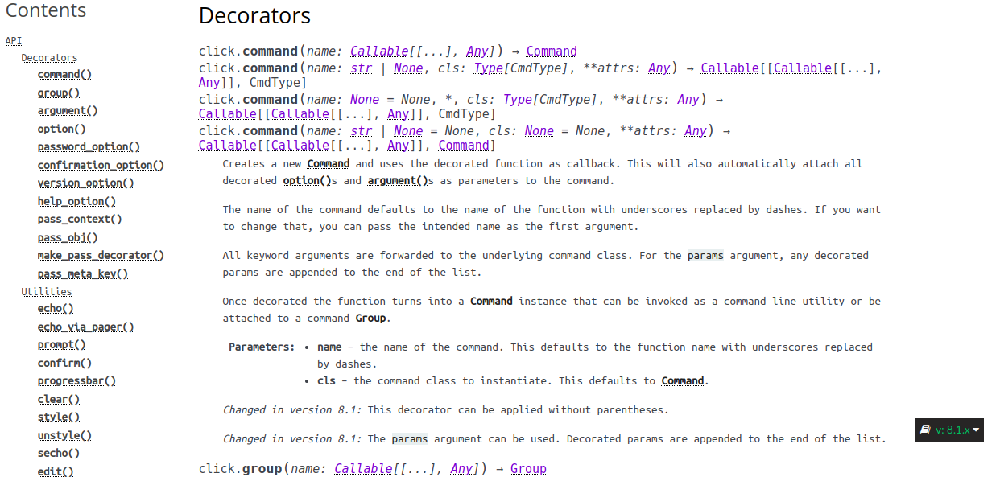
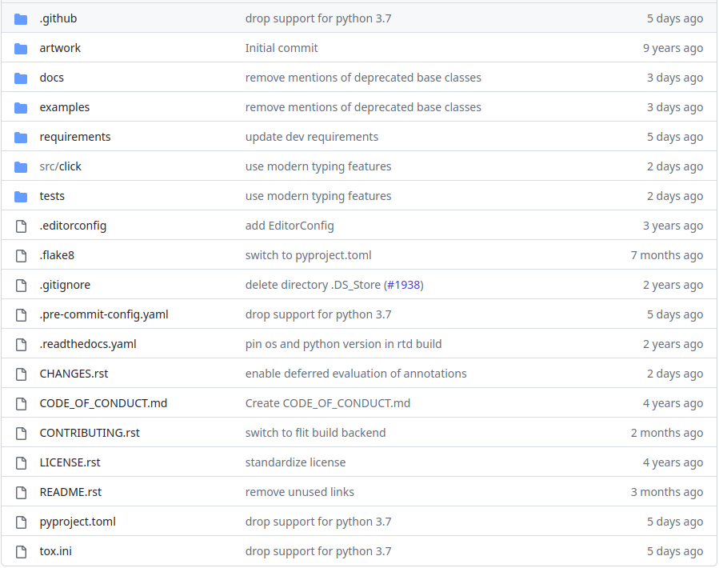
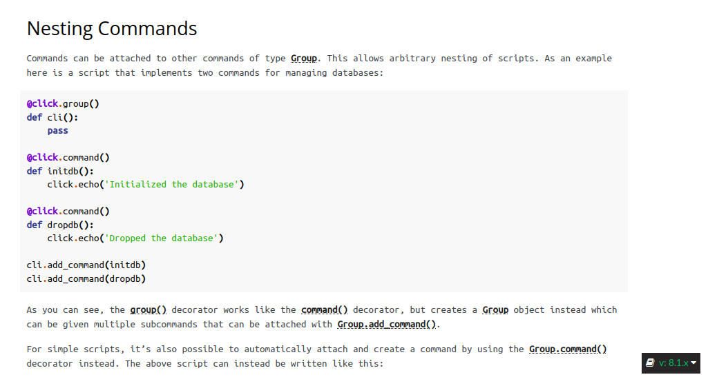
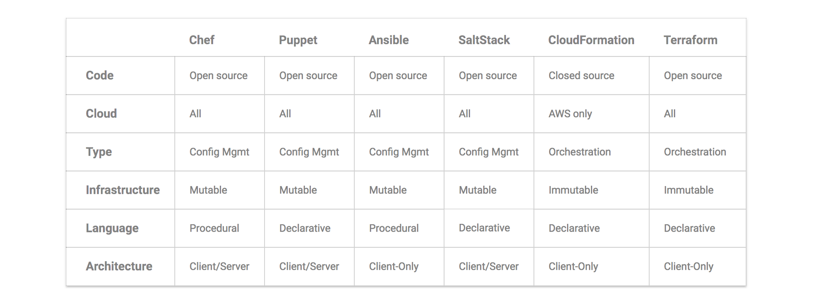
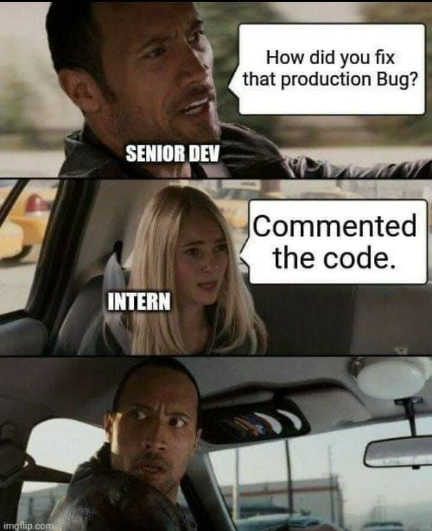

## Continuous Delivery: Configuration Management
#### Version Control and Advices, Managing Dependencies, Managing Software Configuration, Managing Environments

<small><strong>Lecturer:</strong> Alireza Roshanzamir</small>

<small><strong>Keywords:</strong> Continuous Delivery, Continuous Integration, DevOps, Build, Test, Release, Deployment, Automation, Version Control, Deployment Pipeline</small>

<small><small>Tir 1402/August 2023</small></small>

---
## Definition
Configuration management is a term that is widely used, often as a synonym for **version control**:

> Configuration management refers to the process by which all artifacts relevant to your project, and the relationships between them, are stored, retrieved, uniquely identified, and modified.

Although version control systems are the most obvious tool in configuration management, the decision to use one (and every team should use one, no matter how small) is just the first step in developing a configuration management strategy.  <!-- .element class="fragment fade-in" -->

You should be able to say "yes" to these questions:  <!-- .element class="fragment fade-in" -->

- Can I exactly reproduce any of my environments, including the version of the operating system, its patch level, the network configuration, the software stack, the applications deployed into it, and their configuration?  <!-- .element class="fragment fade-in-then-semi-out" -->
- Can I easily make an incremental change to any of these individual items and deploy the change to any, and all, of my environments?  <!-- .element class="fragment fade-in-then-semi-out" -->
- Can I easily see each change that occurred to a particular environment and trace it back to see exactly what the change was, who made it, and when they made it?  <!-- .element class="fragment fade-in-then-semi-out" -->
- Can I satisfy all of the compliance regulations that I am subject to?  <!-- .element class="fragment fade-in-then-semi-out" -->
- Is it easy for every member of the team to get the information they need, and to make the changes they need to make? Or does the strategy get in the way of efficient delivery, leading to increased cycle time and reduced feedback?  <!-- .element class="fragment fade-in-then-semi-out" -->

Note

It doesn't only mean Git or something but almost means Git or something :)

---
## Version Control
The version control:
- Retains, and provides access to, every version of every file that has ever been stored in it.  <!-- .element class="fragment fade-in-then-semi-out" -->
- Allows teams that may be distributed across space and time to collaborate.  <!-- .element class="fragment fade-in-then-semi-out" -->

Why?  <!-- .element class="fragment fade-in" -->

- What constitutes a particular version of your software? How can you reproduce a particular state of the software's binaries and configuration that existed in the production environment?  <!-- .element class="fragment fade-in-then-semi-out" -->
- What was done when, by whom, and for what reason? Not only is this useful to know when things go wrong, but it also tells the story of your application.  <!-- .element class="fragment fade-in-then-semi-out" -->

------
### Version Control: Advices
- Keep Absolutely Everything in Version Control
- Check In Regularly to Trunk
- Use Meaningful Commit Messages

Details on the next slides.

Note

<ul>
    <li>Mention the preference for using "version control" instead of "source control".</li>
    <li>If you don't have absolutely every source artifact of your project in version control, you won't enjoy any of the benefits that we discuss in this course.</li>
</ul>

------
### Keep Absolutely Everything in Version Control
- Everything required to re-create your application's binaries and the environments in which they run. As well as environment infrastructure declarative descriptions and scripts (GitOps: Git is the single source of truth).
- Analysts should store requirements documents.  <!-- .element class="fragment fade-in-then-semi-out" -->
- Testers should keep their test scripts and procedures in version control.  <!-- .element class="fragment fade-in-then-semi-out" -->
- Project managers should save their release plans, progress charts, and risk logs here. In short, every member of the team should store any document or file related to the project in version control.  <!-- .element class="fragment fade-in-then-semi-out" -->
- Many projects also store binary images of their application servers, compilers, virtual machines, and other parts of their toolchain in version control (not output binaries which rapidly proliferate, there may be two commits for the same version, one for source code and another for the binaries).  <!-- .element class="fragment fade-in-then-semi-out" -->
- To manage large files, use LFS plugins such as GitLFS. Otherwise, use other types of artifactories, storages, and file servers (such as JFrog, Nexus, Samba, MinIO, ...) and definitely consider versioning.  <!-- .element class="fragment fade-in-then-semi-out" -->

------
### Keep Absolutely Everything in Version Control: Documentation

Including the documentation in the version control and source code repository has the following benefits:  <!-- .element class="fragment fade-in" -->
- Auto-generating references section from the code, docstrings, tests, changelogs, swagger APIs, Protobufs, and etc.  <!-- .element class="fragment fade-in-then-semi-out" -->
- Forcing the consistency between the docs and the other entities.  <!-- .element class="fragment fade-in-then-semi-out" -->
- Taking advantages of the doctests.  <!-- .element class="fragment fade-in-then-semi-out" -->
- Supporting versioning and review mechanism.  <!-- .element class="fragment fade-in-then-semi-out" -->
- Using the reStructuredText or Markdown, multiple views such as HTML, Latex, PDF, Confluence, Presentation can be generated. Hence, you can publish them everywhere and in any format you want.  <!-- .element class="fragment fade-in-then-semi-out" -->

------
### Keep Absolutely Everything in Version Control: Documentation
For example, consider the Python [Click](https://click.palletsprojects.com/) CLI library:

<table>
  <tr>
    <td></td>
    <td></td>
    <td rowspan="2"></td>
  </tr>
  <tr class="simple">
    <td></td>
    <td></td>
  </tr>
</table>

------
### Check In Regularly to Trunk
- They become public, instantly available to everybody else on the team.  <!-- .element class="fragment fade-in-then-semi-out" -->
- Otherwise, the merges become too complex.  <!-- .element class="fragment fade-in-then-semi-out" -->
- Ovoid branching  <!-- .element class="fragment fade-in-then-semi-out" -->
- Use commit test suit (less than ten minutes)  <!-- .element class="fragment fade-in-then-semi-out" -->
- Introduce changes incrementally -> Check-in minimum once a day  <!-- .element class="fragment fade-in-then-semi-out" -->

------
### Use Meaningful Commit Messages

- A message like "fix obsecure bug." makes debugging very hard.  <!-- .element class="fragment fade-in-then-semi-out" -->
- Include a link to the identifier in your project management tool for the feature or bug you're working on.  <!-- .element class="fragment fade-in-then-semi-out" -->
- Specify a convention and follow it.  <!-- .element class="fragment fade-in-then-semi-out" -->
- e.g. "Support specifying server's port number from the CLI using the --port option (see #1247)."  <!-- .element class="fragment fade-in-then-semi-out" -->
- Multiparagraph commit message: the first paragraph is a summary and the following paragraphs add more detail.  <!-- .element class="fragment fade-in-then-semi-out" -->
- Check commit messages automatically.  <!-- .element class="fragment fade-in-then-semi-out" -->
- <!-- .element class="fragment fade-in-then-semi-out" --> Consider "Conventional Commit Messages" (https://www.conventionalcommits.org).

---
## Managing Dependencies
External dependencies are:
- Third-party libraries
- Components or modules under development of other teams

Key issues of dependency management:  <!-- .element class="fragment fade-in" -->
- Managing External Libraries:  <!-- .element class="fragment fade-in" -->
  - There is some debate as to whether or not to version-control libraries.  <!-- .element class="fragment fade-in-then-semi-out" -->
  - Keep copies of your external libraries somewhere locally (such as Maven repository, PyPI, generic Artifactory, etc.)  <!-- .element class="fragment fade-in-then-semi-out" -->
- Managing Components:  <!-- .element class="fragment fade-in" -->
  - It's common to have binary dependencies between your pipelines rather than source dependencies. Recompiling dependencies is not only less efficient; it also means you're creating an artifact that is potentially different from the one that you already tested.  <!-- .element class="fragment fade-in-then-semi-out" -->
  - Easy deveopment over multiple components should be considered: It should be relatively easy to make changes in some of them and run a single command that rebuilds the necessary bits in the right order, creates the appropriate binaries, and runs relevant tests.  <!-- .element class="fragment fade-in-then-semi-out" -->

---
## Managing Software* Configuration
**Configuration** is one of the three key parts that comprise an application, along with its **binaries** and its **data**. Configuration information can be used to change the behavior of software at **build time**, **deploy time**, and **run time**.

Treat the configuration of your system in the same way you treat your code. Make it subject to proper management and testing.  <!-- .element class="fragment fade-in" -->

------
### Configuration and Flexibility
Flexibility is a **continuoum**: At one end, there is single-purpose software that does one job well but has little or no ability to have its behavior modified. At the other end of the spectrum is a programming language that you can use to write a game, an application server, or a stock control system (**ultimate configurability antipattern**):
- It frequently leads to analysis paralysis  <!-- .element class="fragment highlight-current-blue" -->
- The system becomes so complex to configure that many of the benefits of its flexibility are lost.  <!-- .element class="fragment highlight-current-blue" -->

Configuration is not inherently evil. But it needs to be managed carefully and consistently.  <!-- .element class="fragment highlight-current-blue" -->

------
### Types of Configuration
Configuration information can be injected into your application at several points in your:
- Build time
- Packaing time
- Deployment time
- Run time (or startup time)

  Generally, its <strong>bad practice</strong> to inject configuration information at <strong>build</strong> or <strong>packaging time</strong> (such as J2EE specification and war files). This follows from the principle that <strong>you should be able to deploy the same binaries to every environment</strong> so you can ensure that the thing that you release is the same thing that you tested.

There should be a single source of configuration to change, manage, version-control, and override (if necessary).  <!-- .element class="fragment fade-in" -->

------
### Managing Application Configuration
- How do you represent your configuration information?
- How do your deployment scripts access it?
- How does it vary between environments, applications, and versions of applications?

  There are a few obvious choices for where to store your application configuration: a <strong>database</strong>, a <strong>version control system</strong>, or a <strong>directory</strong> or <strong>registry</strong>.

  Keep the actual configuration information specific to each of your application's testing and production environments in a repository separate from your source code. This information generally changes at a different rate to other version-controlled artifacts (you will have to be careful to track which versions of configuration information match with which versions of the application).

  Databases, directories, and registries are convenient places to store configuration since they can be accessed remotely. However, make sure to keep the history of changes to configuration for the purposes of audit and rollback. Either have a system that automatically takes care of this, or treat version control as your system of reference for configuration and have a script that loads the appropriate version into your database or directory on demand.

------
### Continued: Managing Application Configuration
- Accessing Configuration  <!-- .element class="fragment fade-in" -->
  - Storage and access type: File-system, RDBMS, LDAP, REST API, ESCAPE, Apache Zookepeer  <!-- .element class="fragment fade-in-then-semi-out" -->
  - Isolate the details of technology using a Facade  <!-- .element class="fragment fade-in-then-semi-out" -->
- Modeling Configuration  <!-- .element class="fragment fade-in" -->
  - Set of tuples, JSON, YAML, XML, Protobuf, INI, TOML, gRPC, OpenAPI, and etc.  <!-- .element class="fragment fade-in-then-semi-out" -->
  - You may need versioning.  <!-- .element class="fragment fade-in-then-semi-out" -->
  - You may consider backward/forward compatibility.  <!-- .element class="fragment fade-in-then-semi-out" -->
  - You may consider adding new environments, creating new version of application, promoting a new version of application, relocating database, virtualization, and etc.  <!-- .element class="fragment fade-in-then-semi-out" -->
- Testing System Configuration  <!-- .element class="fragment fade-in" -->
  - Ensure that references to external services in your configuration settings are good (connection to databases, message buses, etc.).  <!-- .element class="fragment fade-in-then-semi-out" -->
  - Run some smoke tests once your application is installed to make sure it is operating as expected  <!-- .element class="fragment fade-in-then-semi-out" -->

------
### Managing Configuration across Applications

  <strong>Keep a catalogue</strong> of all the configuration options that each of your applications has, where they are stored, what their lifecycle is, and how they can be changed.

  If possible, such information should be <strong>generated automatically</strong> from each application's code as part of the build process. But where this is not possible, it should be collected in a wiki or other document management system.

  Deploy and runtime: It is important to know what the <strong>current configuration of each running application</strong> is. Tools such as Nagios, OpenNMS, and HP OpenView may help. <strong>Countless hours have been lost by one application having a few configuration options set wrongly</strong> and thereby bringing down an entire set of services.

------
### Principles of Managing Application Configuration
- Consider where in your application's lifecycle it makes sense to inject a particular piece of configuration.  <!-- .element class="fragment fade-in-then-semi-out" -->
- Keep the available configuration options for your application in the same repository as its source code, but keep the values somewhere else.  <!-- .element class="fragment fade-in-then-semi-out" -->
- Configuration should always be performed by automated processes using values taken from your configuration repository.  <!-- .element class="fragment fade-in-then-semi-out" -->
- Your configuration system should be able to provide different values to your application (including its packaging, installation, and deployment scripts) based on the application, its version, and the environment it is being deployed into.  <!-- .element class="fragment fade-in-then-semi-out" -->
- Use clear naming conventions for your configuration options. Try to imagine someone reading the configuration file without a manual.  <!-- .element class="fragment fade-in-then-semi-out" -->
- Ensure that your configuration information is modular and encapsulated.  <!-- .element class="fragment fade-in-then-semi-out" -->
- Don't repeat yourself: define the elements of your configuration so that each concept has only one representation in the set of configuration information.  <!-- .element class="fragment fade-in-then-semi-out" -->
- Be minimalist: Keep the configuration information as simple and as focused as possible.  <!-- .element class="fragment fade-in-then-semi-out" -->
- Avoid overengineering the configuration system.  <!-- .element class="fragment fade-in-then-semi-out" -->
- Ensure that you have tests for your configuration that are run at deployment or installation time.  <!-- .element class="fragment fade-in-then-semi-out" -->

---
## Managing Environments
Make the environments creation a fully automated process:
- Removes the problem of having random pieces of infrastructure around.  <!-- .element class="fragment fade-in" -->
- Fixing is harder than recreation.  <!-- .element class="fragment fade-in" -->
- Be able to create copies of production environments for testing purposes.  <!-- .element class="fragment fade-in" -->

The kinds of environment configuration information:  <!-- .element class="fragment fade-in" -->
- OS: versions, patch levels, and configuration settings.  <!-- .element class="fragment fade-in" -->
- Additional software packages: versions and configuration.  <!-- .element class="fragment fade-in" -->
- External services: versions and configuration  <!-- .element class="fragment fade-in" -->
- Networking topology  <!-- .element class="fragment fade-in" -->
- Any other data or state  <!-- .element class="fragment fade-in" -->

------
### Continued: Managing Environments
Two principles:
- Keep binary files independent from configuration information.  <!-- .element class="fragment fade-in" -->
- Keep all configuration information in one place.  <!-- .element class="fragment fade-in" -->

Hence, creating new environments, upgrading parts of your system, and rolling out new configurations without making your system 
unavailable becomes a simple, automated process.  <!-- .element class="fragment fade-in" -->

Managing third party products:  <!-- .element class="fragment fade-in" -->
- Can we deploy it?  <!-- .element class="fragment fade-in" -->
- Can we version its configuration effectively?  <!-- .element class="fragment fade-in" -->
- How will it fit into our automated deployment strategy?  <!-- .element class="fragment fade-in" -->

Essentially, you should treat your environment the same way you treat your code-changing it incrementally and checking the changes into version control.  <!-- .element class="fragment fade-in" -->

------
### Tools to Manage Environments

------
### Managing the Change Process

  A production environment should be completely <strong>locked down</strong>. It should <strong>not be possible</strong> for anybody to make a change to it without going through your organization's change management process.

A change to your environment is just like a change to your software. It has to go through your build, deploy, test, and release process in exactly the same way as a change to the application's code.  <!-- .element class="fragment fade-in" -->

Testing environments should be treated the same as production environments but the approval process will usually be simpler.  <!-- .element class="fragment fade-in" -->

---
## Summary
Configuration management is the **foundation of everything in CD**. It is **impossible** to do continuous integration, release management, and deployment pipelining without it:
- Could you completely re-create your production system, excluding production data, from scratch from the version-controlled assets that you store?  <!-- .element class="fragment highlight-current-blue" -->
- Could you regress to an earlier, known good state of your application?  <!-- .element class="fragment highlight-current-blue" -->
- Can you be sure that each deployed environment in production, in staging, and in test is set up in precisely the same way?  <!-- .element class="fragment highlight-current-blue" -->

If not, then your organization is at risk. In particular, we recommend having a strategy for storing baselines and controlling changes to:  <!-- .element class="fragment fade-in-list" -->
- Your applications' source code, build scripts, tests, documentation, requirements, database scripts, libraries, and configuration files  <!-- .element class="fragment highlight-current-blue" -->
- Your development, testing, and operations toolchains  <!-- .element class="fragment highlight-current-blue" -->
- All environments used in development, testing, and production  <!-- .element class="fragment highlight-current-blue" -->
- The entire application stack associated with your applications-both binaries and configuration  <!-- .element class="fragment highlight-current-blue" -->
- The configuration associated with every application in every environment it runs in, across the entire application lifecycle (building, deployment, testing, operation)  <!-- .element class="fragment highlight-current-blue" -->
