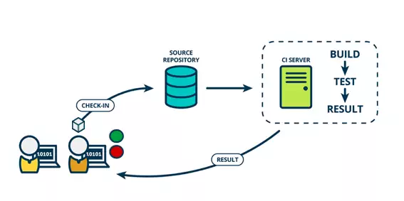
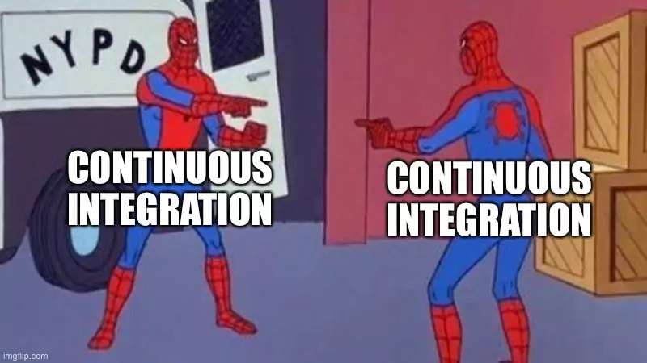
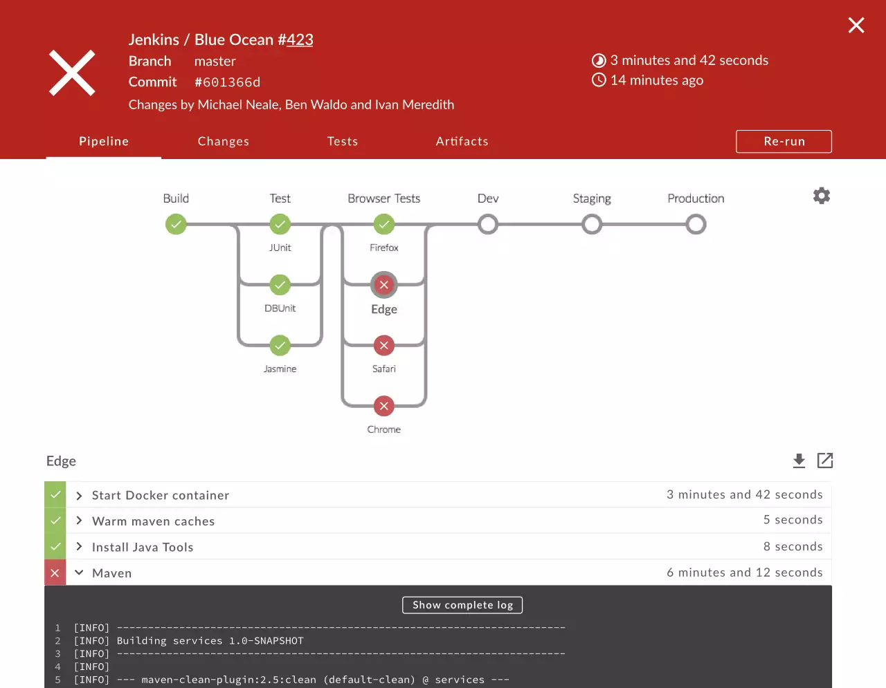
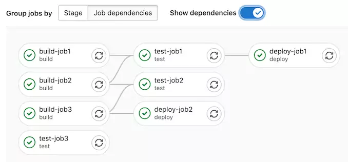
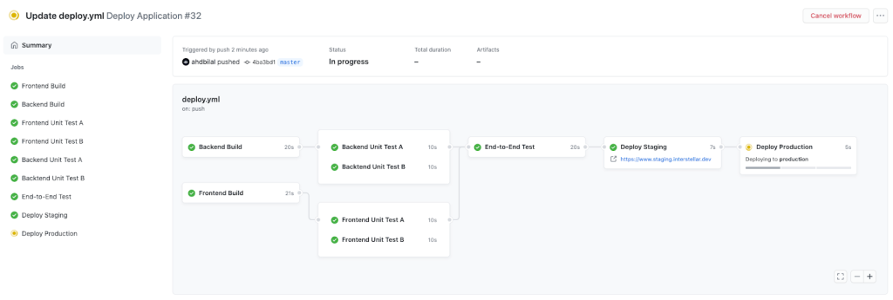
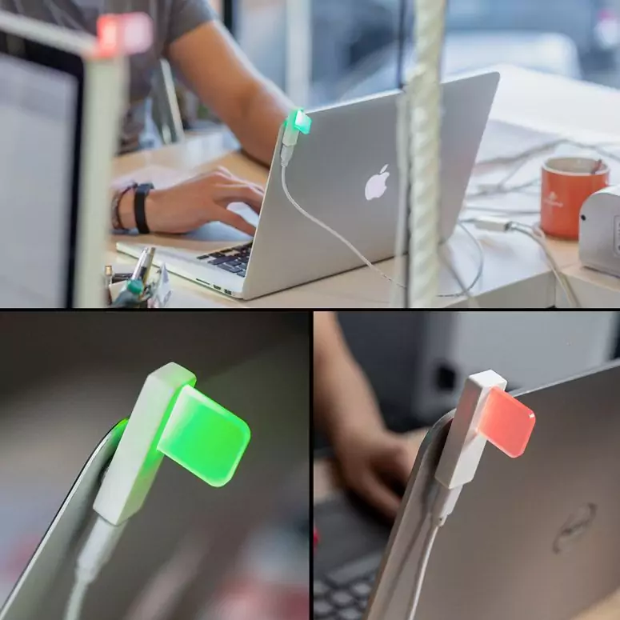
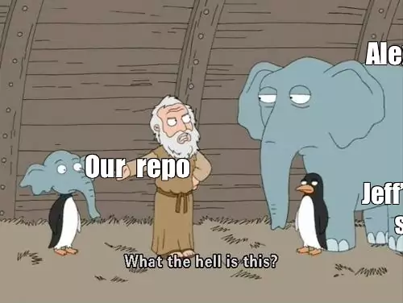

## Continuous Delivery: Continuous Integration
#### Implementation, Prerequisites, Practices, Challenges

<small><strong>Time to Read:</strong> 12 Minutes</small>, <small><strong>Time to Present:</strong> 40 Minutes</small>

<small><strong>Created By:</strong> Alireza Roshanzamir</small>

<small><strong>Keywords:</strong> Continuous Delivery, Continuous Integration, DevOps, Build, Test, Release, Deployment, Automation, Version Control, Deployment Pipeline</small>

<small><small>Tir 1402/August 2023</small></small>

---
## Introduction

Common feature of many software projects is that for long periods of time during the development process the **application is not in a working state.**  <!-- .element class="fragment fade-in-paragraph custom" -->

No one tries **running app till done**. Developers check in changes, run unit tests, but **no one** tries **starting app in prodoction-like environment**. Doubly true for projects with **long-lived branches** or **deferred acceptance testing**.  <!-- .element class="fragment fade-in-paragraph custom" -->

On the other hand, we have seen projects that spend at most **a few minutes** in a **state** where their application is **not working with the latest changes**. The **difference is continuous integration**.  <!-- .element class="fragment fade-in-paragraph custom" -->

Continuous integration means that **whenever someone makes a change**, the whole app is **built** and **tested automatically**. **If it fails**, the **team stops and fixes it immediately**.  <!-- .element class="fragment fade-in-paragraph custom" -->

Continuous integration was first mentioned in **Kent Beck**'s book "**Extreme Programming** Explained" (1999).  <!-- .element class="fragment fade-in-paragraph custom" -->

---
## Implementation
Continuous integration depends on teams using few essential practices.

------
### What You Need Before You Start
1. Version Control
2. An Automated Build
   - You must be able to start your **build** from the **command line**.
3. Agreement of the Team
   - Continuous integration is a **practice**, **not a tool**. It needs **commitment** and **discipline** from your team.

------
### A Basic Continuous Integration System
With your **chosen CI tool** (although it's not necessary) and the right conditions, you can begin in a few minutes. Just inform the tool about your **source code repository**, the **build script**, and the **automated commit tests**, and how to **notify you** if changes **break the software**.

Once you're ready to check in your latest change:  <!-- .element class="fragment fade-in" -->
1. Check **if the build is running**. If so, **wait** for it to finish. **If it fails**, **collaborate** with the team to **make it green before check in**.  <!-- .element class="fragment fade-in-then-semi-out-parent custom" -->
2. **After it's done** and the tests pass, **update your code** in the development environment **from this version** in the repository to get any updates.  <!-- .element class="fragment fade-in-then-semi-out-parent custom" -->
3. Run the **build** script and **tests** on your **local machine** to confirm everything works **or** use your **CI tool's personal build** feature.  <!-- .element class="fragment fade-in-then-semi-out-parent custom" -->
4. **If** your local **build passes**, check your code **into version control**.  <!-- .element class="fragment fade-in-then-semi-out-parent custom" -->
5. **Wait** for your **CI tool** to run the build with your changes.  <!-- .element class="fragment fade-in-then-semi-out-parent custom" -->
6. **If it fails**, **stop** and **fix** the problem **immediately** on your development machine-**go to step 3**.  <!-- .element class="fragment fade-in-then-semi-out-parent custom" -->
7. **If the build passes**, **celebrate** and move on to your **next task**.  <!-- .element class="fragment fade-in-then-semi-out-parent custom" -->

---
## Prerequisites
Continuous integration **won't fix the build process alone**. It can be **painful if started midproject**. **Effective CI** requires **these practices** before you start.

------
### Check In Regularly
The **key practice** for successful continuous integration is **regular check-ins** to trunk. Aim to check in **multiple times a day**:
- Makes your **changes smaller**  <!-- .element class="fragment fade-in-then-semi-out-parent custom" -->
- **Less** likely to **break the build**  <!-- .element class="fragment fade-in-then-semi-out-parent custom" -->
- You have a **recent known good** version of the software to **revert** to when you make a mistake  <!-- .element class="fragment fade-in-then-semi-out-parent custom" -->
- Encourages **disciplined refactoring** and promotes **small**, **behavior-preserving changes**  <!-- .element class="fragment fade-in-then-semi-out-parent custom" -->
- **Less conflicts**  <!-- .element class="fragment fade-in-then-semi-out-parent custom" -->
- Forces regular breaks and **stretching muscles** to prevent **carpal tunnel syndrome** and **RSI**  <!-- .element class="fragment fade-in-then-semi-out-parent custom" -->
- In case of a **major issue (PC explosion :))** , you **won't lose much work**  <!-- .element class="fragment fade-in-then-semi-out-parent custom" -->

Continuous integration is **impossible** when **using branches** since, by definition, working on a **branch means your code isn't integrated** with others.  <!-- .element class="fragment fade-in-paragraph custom" -->

------
### Create a Comprehensive Automated Test Suite

There are three kinds of tests we are interested in running from our continuous integration build:  <!-- .element class="fragment fade-in-with-next" -->
- Unit tests
  - Test small parts of your app, like **methods** or **functions**, **in isolation** or **interactions among a few**.  <!-- .element class="fragment highlight-current-blue-parent custom" -->
  - Usually, **don't** involve the **database**, **filesystem**, or **network**.  <!-- .element class="fragment highlight-current-blue-parent custom" -->
  - Run **quickly**. Even for large apps, the entire suite should finish in **under ten minutes**.  <!-- .element class="fragment highlight-current-blue-parent custom" -->
  - Written by **developers**.  <!-- .element class="fragment highlight-current-blue-parent custom" -->
- Component tests
  - Test the behavior of several **integrated components**, like API endpoints.  <!-- .element class="fragment highlight-current-blue-parent custom" -->
  - **Some** also **call them integration tests**. It depends on your **component size definition**.  <!-- .element class="fragment highlight-current-blue-parent custom" -->
  - **Some** authors say that **component testing is black-box** while **unit-testing is white-box**.  <!-- .element class="fragment highlight-current-blue-parent custom" -->
  - **Some** authors say that **component tests are written by developers and testers** together.  <!-- .element class="fragment highlight-current-blue-parent custom" -->
  - **Not always necessary** to **start the whole application**.  <!-- .element class="fragment highlight-current-blue-parent custom" -->
  - They **may** hit the **database**, the **filesystem**, or **other systems**.  <!-- .element class="fragment highlight-current-blue-parent custom" -->
- Acceptance tests
  - Check if the app meets **business acceptance criteria**, covering **functionality** and **characteristics** like **capacity**, **availability**, **security**, etc.  <!-- .element class="fragment highlight-current-blue-parent custom" -->
  - Run against the **whole app** in a **production-like environment**.  <!-- .element class="fragment highlight-current-blue-parent custom" -->
  - Can be **time-consuming**. They might take **more than a day when run sequentially**.  <!-- .element class="fragment highlight-current-blue-parent custom" -->

------
### Keep the Build and Test Process Short
If it takes **too long** to **build** and run the **unit tests**:
- People **avoid** doing a full **build** and **tests** **before check in**.  <!-- .element class="fragment highlight-current-blue-parent custom" -->
- Causing **multiple commits before the next build**, making it **difficult to find the broken commit**.  <!-- .element class="fragment highlight-current-blue-parent custom" -->
- People **check in less frequently** due to long waits.  <!-- .element class="fragment highlight-current-blue-parent custom" -->

Ideally, the **pre-check-in** and **CI server** **build** and **test** should last a short time (**90s >> 5min >> 10min**). It's comparable to **making tea**, **chatting**, email, or a **stretch**.  <!-- .element class="fragment fade-in-paragraph custom" -->

However, this **shouldn't conflict** with **comprehensive tests**. Eventually, you'll need to **divide your testing into multiple stages**:  <!-- .element class="fragment fade-in-parent-with-next" -->
- **Commit stage**: Compile the software, run unit tests for individual classes, and create a deployable binary.
- **Acceptance test stage**: Use the **binaries from the commit stage** to run **acceptance**, **integration**, and **performance tests** if available.

------
### Managing Your Development Workspace
Developers should begin work from a **known-good point**. They must run the **build**, **tests**, and **deploy** in their **controlled environment**. **Shared environments** should be **exceptions**, **not the norm**.

Ensure **automated tests**, including smoke tests, **can run on developer machines**. A **good architecture** permits easy application **execution on a development machine**.

---
## Using Continuous Integration Software
Continuous integration software's core function is to **poll** your version control **for commits**. If found, it **check out** the latest version (to a server or build agent directory), compiles it using the **build** script, runs **tests**, and **notify** you of the outcomes:

<table class="fragment fade-in">
  <tr>
    <td></td>
    <td></td>
  </tr>
  <tr>
    <td></td>
    <td></td>
  </tr>
</table>

------
### Bells and Whistles
**Visibility** is a **key advantage of using a CI server**. Many CI servers offer a **widget for your desktop** to display build status.

------
### Predecessors to Continuous Integration
Several teams used a **nightly build**, a common practice at **Microsoft** for many years. Those who **broke it** had to **stay** and **monitor** **subsequent builds** until the next break.

---
## Essential Practices
CI system aims to **maintain working software** consistently. To achieve this, we enforce the following **practices** on our teams:
- Don't Check In on a Broken Build  <!-- .element class="fragment fade-in-then-semi-out" -->
- Always Run All Commit Tests Locally before Committing, or Get Your CI Server to Do It for You  <!-- .element class="fragment fade-in-then-semi-out" -->
- Wait for Commit Tests to Pass before Moving On  <!-- .element class="fragment fade-in-then-semi-out" -->
- Never Go Home on a Broken Build  <!-- .element class="fragment fade-in-then-semi-out" -->
- Always Be Prepared to Revert to the Previous Revision  <!-- .element class="fragment fade-in-then-semi-out" -->
- <!-- .element class="fragment fade-in-then-semi-out" --> Time-Box Fixing before Reverting
    - If the build **breaks** on check-in, attempt a **10-minute fix**; otherwise, **revert**.
- Don't Comment Out Failing Tests  <!-- .element class="fragment fade-in-then-semi-out" -->
- <!-- .element class="fragment fade-in-then-semi-out" --> Take Responsibility for All Breakages That Result from Your Changes
    - Even if **your tests pass** but **others fail after your commit**, the build is **still broken**.
- <!-- .element class="fragment fade-in-then-semi-out" --> Test-Driven Development (here, Test-First is intended)
    - The **only way** to get excellent **unit test coverage** is through test-driven development. 

---
## Suggested Practices
The following practices aren't required, yet they're useful:
- <!-- .element class="fragment fade-in-then-semi-out" --> Extreme Programming (XP) Development Practices
  - Pair programming
  - Coding standards
  - Sustainable pace
  - Test-driven development
  - Collective code ownership
  - ...
- Failing a Build for Architectural Breaches  <!-- .element class="fragment fade-in-then-semi-out" -->
- Failing the Build for Slow Tests  <!-- .element class="fragment fade-in-then-semi-out" -->
- Failing the Build for Warnings and Code Style Breaches  <!-- .element class="fragment fade-in-then-semi-out" -->
- <!-- .element class="fragment fade-in-then-semi-out" -->  Failing the Build for Documents Problems and Inconsistencies
  - Always use verifiable cross-references in your documentation.
  - For non-auto-generated elements, create basic tests to ensure consistency.

------
### Code Style and Static Analysis: Linting

Linting is vital in your CI pipeline. It helps spot **known issues** and **coding standard violations**, thus **reducing bugs** and enhancing code maintainability.  <!-- .element class="fragment fade-in-paragraph custom" -->

Linting is a form of **static analysis** (doesn't run code). The name "linter" comes from Bell Labs' 1978 same name tool.  <!-- .element class="fragment fade-in-paragraph custom" -->

Some types of linting issues or features:  <!-- .element class="fragment fade-in-with-next" -->
<table>
  <tr>
    <td>
      <ul>
        <li>Naming Conventions</li>
        <li>Uninitialized Variables</li>
        <li>Unreachable Code</li>
        <li>Security Vulnerabilities</li>
        <li>Unused Variables and Imports</li>
        <li>Aliasing Variables</li>
        <li>Long Function Signatures</li>
        <li>Deeply Nested Code</li>
        <li>Inconsistent Ordering in Imports</li>
        <li>Implicit Type Conversions</li>
      </ul>
    </td>
    <td>
      <ul>
        <li>Duplicated Code</li>
        <li>Typos</li>
        <li>Incorrectly Scoped Variables</li>
        <li>Class Members Order</li>
        <li>Literals and Initializations Conventions</li>
        <li>Commented Code</li>
        <li>Test Names</li>
        <li>Line Length</li>
        <li>Docstring Style</li>
        <li><strong>Type Checks (for dynamically typed languages)</strong></li>
      </ul>
    </td>
  </tr>
<table>

------
### Code Style and Static Analysis: Formatting

Refers to **arranging code elements** consistently to enhance **readability** and **maintainability**.  <!-- .element class="fragment fade-in-paragraph custom" -->

Some common features and aspects of existing formatters:  <!-- .element class="fragment fade-in-with-next" -->
- Indention
- Spacing
- Length
- Brace Placement
- Literals and Initializations
- Imports Orders
- Class Members Order
- Remove Unused Imports
- Auto Update to Modern Language Idioms

Ensure your code formatter **aligns with your linters**. Additionally, run formatters with **only-check** flags as linters.  <!-- .element class="fragment fade-in-paragraph custom" -->

Formatters are essential for **removing code-style comments** in **reviews**. Focus on **consistency** and **don't spend too much time** on **style details**.  <!-- .element class="fragment fade-in-paragraph custom" -->

---
## Challenges

**Tooling usually isn't the problem**. The question **"Why can't we deliver working changes to the trunk today?"** points to the issues to address. Common team challenges include:
- Code review takes too long / has too many approvers  <!-- .element: class="fragment insides-fade-in-then-out" -->
  - Having more than one reviewer on a PR is a process smell for issues with the quality process.  <!-- .element: class="fragment highlight-current-blue" -->
  - Linting, formatting, type-checking, ... should be automated.  <!-- .element: class="fragment highlight-current-blue" -->
  - Worst: Code reviews are done solo and comments are sent back to the developer. This adds the most drag.  <!-- .element: class="fragment highlight-current-blue" -->
  - Less bad: Reviewer and author work together to fix issues, reducing waiting time and increasing efficiency.  <!-- .element: class="fragment highlight-current-blue" -->
  - Best: Pair programming builds code review into the flow.  <!-- .element: class="fragment highlight-current-blue" -->
- Tests are deferred or skipped  <!-- .element: class="fragment insides-fade-in-then-out" -->
  - Never push untested changes.  <!-- .element: class="fragment highlight-current-blue" -->
  - Timelines are irrelevant if we deliver things on time that are broken.  <!-- .element: class="fragment highlight-current-blue" -->
- The team lacks knowledge on how to write tests for CI  <!-- .element: class="fragment insides-fade-in-then-out" -->
  - Learn effective testing and test patterns.  <!-- .element: class="fragment highlight-current-blue" -->
  - People often push back on TDD, but that is most commonly because they never learned how to do it correctly.  <!-- .element: class="fragment highlight-current-blue" -->
  - It takes time to be good at testing.  <!-- .element: class="fragment highlight-current-blue" -->
- Individual tasks are too big  <!-- .element: class="fragment insides-fade-in-then-out" -->
  - <!-- .element: class="fragment highlight-current-blue" --> Use Evolutionary coding methods such as:
    - Keystone Interfaces (aka. Dark Launching)
    - Branch by Abstraction
    - Feature Flags
  - Decompose tasks into hours of work rather than days  <!-- .element: class="fragment highlight-current-blue" -->
- Stories are too big & lack testable acceptance criteria  <!-- .element: class="fragment insides-fade-in-then-out" -->
  - Focus on BDD instead of "story format"  <!-- .element: class="fragment highlight-current-blue" -->
  - Practice work decomposition techniques  <!-- .element: class="fragment highlight-current-blue" -->
- The team uses a push system for work  <!-- .element: class="fragment insides-fade-in-then-out" -->
  - Focusing solely on individual tasks instead of team goals **isn't optimal**.  <!-- .element: class="fragment highlight-current-blue-parent custom" -->
  - A team works together to deliver the highest priority on the backlog.  <!-- .element: class="fragment highlight-current-blue" -->
  - Everyone on the team should be invested in everything the team does.  <!-- .element: class="fragment highlight-current-blue" -->

---
## Summary
CI make a step change to the **productivity of software development teams.**  <!-- .element class="fragment fade-in-paragraph custom" -->

Implementing continuous integration changes your team's approach significantly. Without CI, **your application is broken until you prove otherwise**.  <!-- .element class="fragment fade-in-paragraph custom" -->

CI creates a tight **feedback loop** to identify issues **early**, when they're **less costly to address**.  <!-- .element class="fragment fade-in-paragraph custom" -->

Implementing CI **enforces** two other practices: good **configuration management** and establishing an **automated build and test process**.  <!-- .element class="fragment fade-in-paragraph custom" -->
