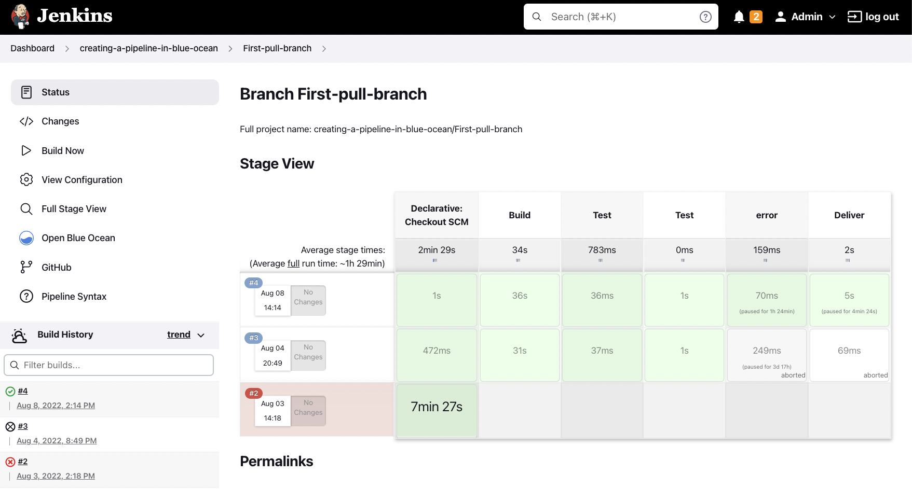
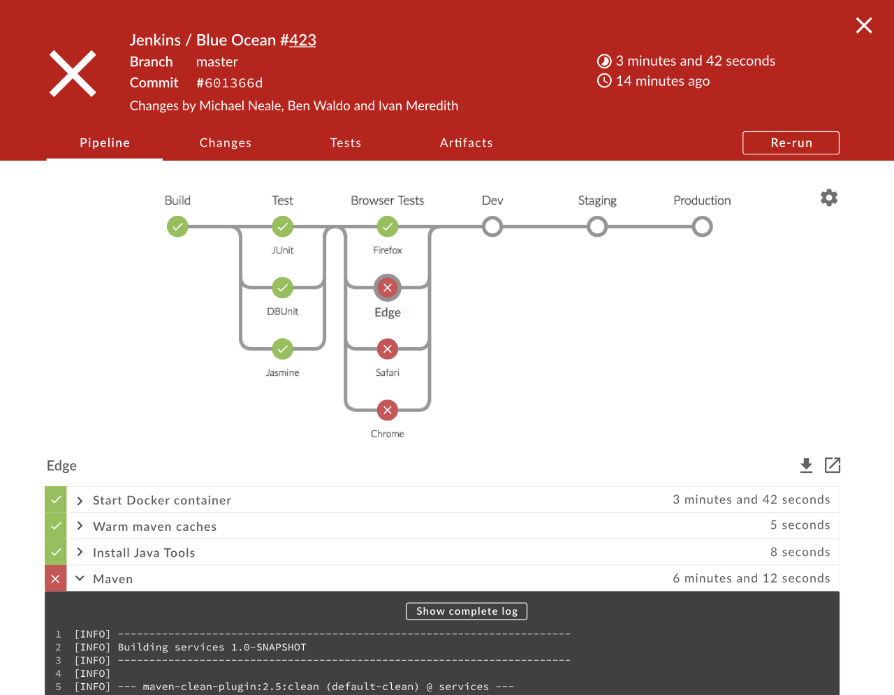
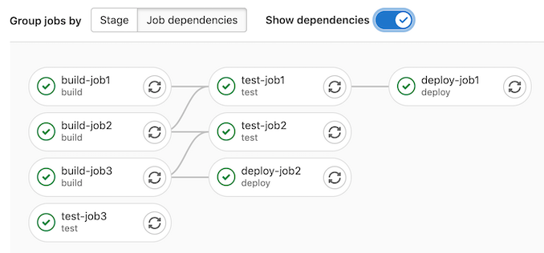

## Continuous Delivery: Continuous Integration
#### Implementation, Prerequisites, Practices, Challenges

<small><strong>Lecturer:</strong> Alireza Roshanzamir</small>

<small><strong>Keywords:</strong> Continuous Delivery, Continuous Integration, DevOps, Build, Test, Release, Deployment, Automation, Version Control, Deployment Pipeline</small>

<small><small>Tir 1402/August 2023</small></small>

---
## Introduction
Common feature of many software projects is that for long periods of time during the development process the application is not in a working state.

Nobody is interested in trying to run the whole application until it is finished. Developers check in changes and might even run automated unit tests, but nobody is trying to actually start the application and use it in a production-like environment This is doubly true in projects that use long-lived branches or defer acceptance testing until the end.

On the other hand, we have seen projects that spend at most a few minutes in a state where their application is not working with the latest changes. The difference is the use of continuous integration.

Continuous integration requires that every time somebody commits any change, the entire application is built and a comprehensive set of automated tests is run against it. Crucially, if the build or test process fails, the development team stops whatever they are doing and fixes the problem immediately.

Continuous integration was first written about in Kent Beck's book Extreme Programming Explained (first published in 1999).

---
## Implementation
Continuous integration depends on teams following a few essential practices.

------
### What You Need Before You Start
1. Version Control
2. An Automated Build
   - You must be able to start your build from the command line.
3. Agreement of the Team
   - Continuous integration is a practice, not a tool. It requires a degree of commitment and discipline from your development team. 

------
### A Basic Continuous Integration System
You don't need a continuous integration software in order to do continuous integration. Once you have your CI tool of choice installed, given the preconditions described above, it should be possible to get started in just a few minutes by telling your tool where to find your source control repository, what script to run in order to compile, if necessary, and run the automated commit tests for your application, and how to tell you if the last set of changes broke the software.

Once you're ready to check in your latest change:
1. Check to see if the build is already running. If so, wait for it to finish. If it fails, you'll need to work with the rest of the team to make it green before you check in.
2. Once it has finished and the tests have passed, update the code in your development environment from this version in the version control repository to get any updates.
3. Run the build script and tests on your development machine to make sure that everything still works correctly on your computer, or alternatively use your CI tool's personal build feature.
4. If your local build passes, check your code into version control.
5. Wait for your CI tool to run the build with your changes.
6. If it fails, stop what you're doing and fix the problem immediately on your development machine-go to step 3.
7. If the build passes, rejoice and move on to your next task.

---
## Prerequisites
Continuous integration won't fix your build process on its own. In fact, it can be very painful if you start doing it midproject. For CI to be effective, the following practices will need to be in place before you start.

------
### Check In Regularly
The most important practice for continuous integration to work properly is frequent check-ins to trunk or mainline. You should be checking in your code at least a couple of times a day:
- Makes your changes smaller
- Less likely to break the build
- You have a recent known good version of the software to revert to when you make a mistake
- Helps you to be more disciplined about your refactoring and stick to small changes that preserve behavior
- Less conflicts
- Forces you to take regular breaks and stretch your muscles to help avoid carpal tunnel syndrome or RSI
- Something catastrophic happens you haven't lost too much work.

It is impossible to truly do continuous integration while using branches because, by definition, if you are working on a branch, your code is not being integrated with that of other developers

------
### Create a Comprehensive Automated Test Suite
There are three kinds of tests we are interested in running from our continuous integration build:
- Unit tests
  - Are written to test the behavior of small pieces of your application in isolation (say, a method, or a function, or the interactions between a small group of them).
  - Usually, they do not hit the database, filesystem, or the network.
  - The should run very fast-your whole suite, even for a large application, should be able to run in under ten minutes.
  - Developers write unit-tests.
- Component tests
  - Test the behavior of several components of your application (API endpoints, etc.)
  - Some authors also call them integration tests. It's going to depend on the "size" that you consider a component in your application (we will talk about different kind of tests in details).
  - Some authors say that component testing is black-box while unit-testing is white-box.
  - Some authors say that component tests are written by developers and testers together.
  - They don't always require starting the whole application
  - They may hit the database, the filesystem, or other systems.
- Acceptance tests
  - Test that the application meets the acceptance criteria decided by the business, including both the functionality provided by the application and its characteristics such as capacity, availability, security, and so on.
  - They run against the whole application in a production-like environment.
  - Can take a long time to run. It's not unheard of for an acceptance test suite to take more than a day to run sequentially

------
### Keep the Build and Test Process Short
If it takes too long to build the code and run the unit tests:
- People will stop doing a full build and running the tests before they check in.
- The continuous integration process will take so long that multiple commits will have taken place by the time you can run the build again, so you won't know which check-in broke the build.
- People will check in less often because they have to sit around for ages waiting for the software to build and the tests to run.

Ideally, the compile and test process that you run prior to check-in and on your CI server should take no more than a few minutes (90s >> 5min >> 10min).  It's around the amount of time you can devote to making a cup of tea, a quick chat, checking your email, or stretching your muscles.

But, it should not contradict comprehensive set of tests. However, at some point you will need to split your test process into multiple stages:
- Commit stage: Compile the software, run your suite of unit tests that test individual classes making up your application, and create a deployable binary.
- Acceptance test stage: Take the binaries from the first stage and run the acceptance tests, as well as integration tests, and performance tests if you have them.

------
### Managing Your Development Workspace
Developers should always work from a known-good starting point when they begin a fresh piece of work. They should be able 
to run the build, execute the automated tests, and deploy the application in an environment under their control. Only in exceptional circumstances should you use shared environments for development.

Make sure that the automated tests, including smoke tests, can be run on developer machines. One sign of a good application architecture is that it allows the application to be run without much trouble on a development machine.

---
## Using Continuous Integration Software
The most basic functionality of continuous integration software is to poll your version control system to see if any commits have occurred and, if so, check out the latest version of the software, run your build script to compile the software, run the tests, and then notify you of the results:

------
### Basic Operation
The usual CI workflow polls your revision control system at regular intervals. If it detects any change, it will check out a copy of your project to a directory on the server, or to a directory on a build agent. It will then execute the commands you specify.

------
### Bells and Whistles
Visibility is one of the most important benefits of using a CI server. Most CI server software ships with a widget that you can install on your development machine to show you the 
status of the build in the corner of your desktop.

------
### Predecessors to Continuous Integration
Many development teams used a nightly build. It was a common practice at Microsoft for many years. Anyone who broke the build was required to stay and monitor subsequent builds until the next person caused a break.

---
## Essential Practices
The objective of our CI system is to ensure that our software is working, in essence, all of the time. In order to ensure that this is the case, here are the practices that we enforce on our teams:

- Don't Check In on a Broken Build
- Always Run All Commit Tests Locally before Committing, or Get Your CI Server to Do It for You
- Wait for Commit Tests to Pass before Moving On
- Never Go Home on a Broken Build
- Always Be Prepared to Revert to the Previous Revision
- Time-Box Fixing before Reverting
  
  When the build breaks on check-in, try to fix it for ten minutes, otherwise, revert.
- Don't Comment Out Failing Tests
- Take Responsibility for All Breakages That Result from Your Changes
  
  If you commit a change and all the tests you wrote pass, but others break, the build is still broken.
- Test-Driven Development (here, Test-First is intended)

  The only way to get excellent unit test coverage is through test-driven development. 

---
## Suggested Practices
The following practices aren't required, but we have found them useful:

- Extreme Programming (XP) Development Practices
  - Pair programming
  - Coding standards
  - Sustainable pace
  - Test-driven development
  - Shared code ownership
  - Collective code ownership
  - ...
- Failing a Build for Architectural Breaches
- Failing the Build for Slow Tests
- Failing the Build for Warnings and Code Style Breaches
- Failing the Build for Documents Problems and Inconsistencies
  - Always use checkable cross-references in the documentation.
  - If something is not auto-generated, write simple tests for consistency checking.

------
### Code Style and Static Analysis: Linting
Linting is a key component to the CI portion of your pipeline: it allows you to identify and flag known issues and coding standard violations, reducing bugs in your code and making it easier to maintain.

Linting is a kind of static analysis (does not execute the code); the name linter comes from the 1978 tool of the same name, created by Bell Labs.

Some types of linting issues or features:
- Naming Conventions
- Uninitialized Variables
- Unreachable Code
- Security Vulnerabilities
- Unused Variables and Imports
- Aliasing Variables
- Long Function Signatures
- Deeply Nested Code
- Inconsistent Ordering in Imports
- Implicit Type Conversions
- Duplicated Code
- Typos
- Incorrectly Scoped Variables
- Class Members Order
- Literals and Initializations Conventions
- Commented Code
- Test Names
- Line Length
- Docstring Style
- **Type Checks (for dynamically typed languages)**

------
### Code Style and Static Analysis: Formatting
Refers to the consistent and standardized arrangement of code elements to improve its readability and maintainability:

Some common features and aspects of existing formatters:
- Indention
- Spacing
- Length
- Brace Placement
- Literals and Initializations
- Imports Orders
- Class Members Order
- Remove Unused Imports
- Auto Update to Modern Language Idioms

Your code formatter should be consistent with your linters. Also, you should also run the formatters with only-check flags as a linter.

The most significant value of the formatters is removing code-style comments in pull requests and side discussions. Don't spend too much time on the code style rules' details and focus on consistency.

---
## Challenges
Tooling is rarely the problem. Always, "why can’t we deliver working changes to the trunk today?", is the roadmap of problems to solve. Many common problems that teams have:

- Code review takes too long / has too many approvers  <!-- .element: class="fragment insides-fade-in-then-out" -->
  - Having more than one reviewer on a PR is a process smell for issues with the quality process.
  - Linting, formatting, type-checking, ... should be automated.
  - Worst: Code reviews are done solo and comments are sent back to the developer. This adds the most drag.
  - Less bad: The reviewer and author meet to review and correct issues. There is still a wait time for that meeting, but it is more efficient.
  - Best: Pair programming builds code review into the flow.
- Tests are deferred or skipped  <!-- .element: class="fragment insides-fade-in-then-out" -->
  - Never push untested changes.
  - Timelines are irrelevant if we deliver things on time that are broken.
- The team lacks knowledge on how to write tests for CI  <!-- .element: class="fragment insides-fade-in-then-out" -->
  - Learn effective testing and test patterns
  - People often push back on TDD, but that is most commonly because they never learned how to do it correctly.
  - It takes time to be good at testing.
- Individual tasks are too big  <!-- .element: class="fragment insides-fade-in-then-out" -->
  - Use Evolutionary coding methods such as:
    - Keystone Interfaces (aka. Dark Launching)
    - Branch by Abstraction
    - Feature Flags
  - Decompose tasks into hours of work rather than days
- Stories are too big & lack testable acceptance criteria  <!-- .element: class="fragment insides-fade-in-then-out" -->
  - Focus on BDD instead of "story format"
  - Practice work decomposition techniques
- The team uses a push system for work  <!-- .element: class="fragment insides-fade-in-then-out" -->
  - Exclusively concentrating on individual tasks rather than working towards team objectives is not ideal.
  - A team works together to deliver the highest priority on the backlog.
  - Everyone on the team should be invested in everything the team does.

---
## Summary
CI make a step change to the productivity of software development teams.

To implement continuous integration is to create a paradigm shift in your team. Without CI, your application is broken ntil you prove otherwise.

CI creates a tight **feedback loop** which allows you to find problems as soon as they are introduced, when they are cheap to fix.

Implementing CI forces you to follow two other important practices: good configuration management and the creation and maintenance of an automated build and test process. 
