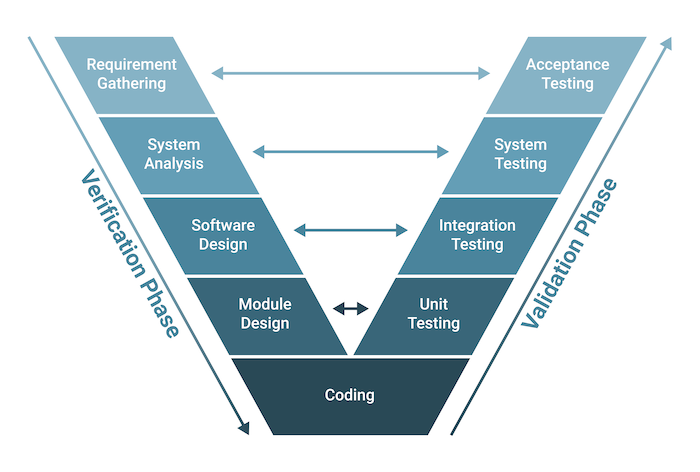
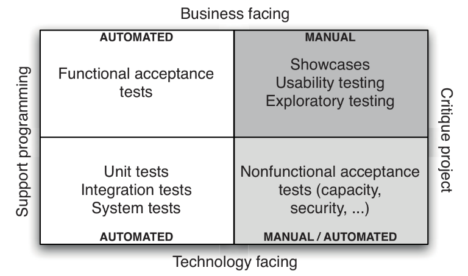
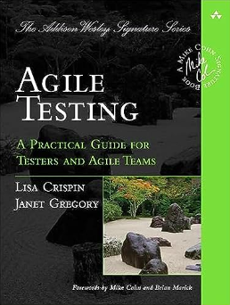
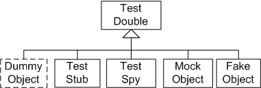

## Continuous Delivery: Testing and [Documentation] Strategy
Test Categories, Test Levels (Types), Test Doubles, Unit-test Coverage Criteria, Effective Unit-testing, TDD, ATDD, BDD, Doctests, SphinX, Auto Documentation

<small><strong>Lecturer:</strong> Alireza Roshanzamir</small>

<small><strong>Keywords:</strong> Continuous Delivery, Continuous Integration, DevOps, Build, Test, Release, Deployment, Automation, Version Control, Deployment Pipeline</small>

<small><small> Tir 1402/August 2023</small></small>

---
### Introduction
W. Edwards Deming:
> Cease dependence on mass inspection to achieve quality. Improve the process and build quality into the product in the first place.

Testing is a cross-functional activity that involves the whole team, and should be done continuously from the beginning of the project. Building quality in means writing automated tests at multiple levels (unit, component, and acceptance) and running them as part of the deployment pipeline, which is triggered every time a change is made to our application, its configuration, or the environment and software stack that it runs on. Manual testing is also an essential part of building quality in: Showcases, usability testing, and exploratory testing need to be done continuously throughout the project.

In our ideal project, testers collaborate with developers and users to write automated tests from the start of the project. These tests are written before developers start work on the features that they test. These tests do not just test the functional aspects of the system. Capacity, security, and other nonfunctional requirements are established early on, and automated test suites are written to enforce them.

The design of a testing strategy is primarily a process of identifying and prioritizing project risks and deciding what actions to take to mitigate them.

---
### Types of Tests
In this diagram, Brian Marick categorized tests according to whether they are business-facing or technology-facing, and whether they support the development process or are used to critique the project:

It is also called Agile testing quadrants. You can find more information in the following book:

<table>
  <tr>
    <td></td>
    <td>
      Agile Testing: A Practical Guide for Testers and Agile Teams
       
      <small>by Lisa Crispin, Janet Gregory</small>
    </td>
  </tr>
</table>

------
### Quadrant TL: Business-Facing Tests That Support the Development Process
Commonly known as **functional** or **acceptance tests**. [F/NF] Acceptance testing ensures that the **acceptance criteria** for a story are met. [F/NF] Acceptance tests should be written, and ideally automated, before development starts on a story. Acceptance tests that concern the functionality of the system are known as functional acceptance tests.

For developers, acceptance tests answer the "How do I know when I am done?" question. For users, it answers the "Did I get what I wanted?" question. So, in an ideal world, customers or users would write acceptance tests, since they define the success criteria for each requirement.

Using the mordern acceptance test frameworks and DSL, it is possible for users to write the test scripts, while developers and testers work together on the code that implements them.

Although it is correct to include **examples**, **prototypes**, and **simulations** in this quadrant, they are no longer fully automatic.

------
### Quadrant TL: Given-When-Then
For each story or requirement there is a single canonical path through the application in terms of the actions that the user will perform. This is known as the **happy path**. However, any use case will, in all but the simplest of systems, allow for variations in the initial state, the actions to be performed, and the final state of the application. Sometimes, these variations constitute distinct use cases, which are then known as **alternate paths**. In other cases, they should cause error conditions, resulting in what is called **sad paths**.  Equivalence partitioning analysis and boundary value analysis will reduce these possibilities to a smaller set of cases that will completely test the requirement in question.

These are often expressed using the form:
- Given

  A few important characteristics of the state of the system when testing begins
- When

  The user performs some set of actions
- Then
  
  A few important characteristics of the new state of the system

Acceptance tests should be run when your system is in a production-like mode. Manual acceptance testing is typically done by putting an application in a user acceptance testing (UAT) environment which is as similar as possible to production both in configuration and in terms of the state of the application—although it might use mock versions of any external services.

------
### Quadrant TL: Automating Acceptance Tests

Automated acceptance tests have a number of valuable properties:
- Faster feedback loop (developers can run them without testers)
- Workload reduction on testers
- Testers can concentrate on exploratory testing
- Powerful regression test (cross-cutting category to quadrant diagram) suite
- If they were human readable, we have auto-generated, always updated requirements and documentations

Automated acceptance tests can be costly to maintain. Done badly, they can inflict a significant cost on your delivery team.  In general, we tend to limit our automated acceptance testing to complete coverage of happy path behaviors and only limited coverage of the most important other parts.

You can gain 80% coverage with 60% unit test coverage and 20% acceptance test coverage.

A good rule of thumb is to automate once you have repeated the same test a couple of times, and when you are confident that you won’t end up spending a lot of time maintaining the test.

A good question to ask yourself every now and again is, "How often do my acceptance tests break due to real bugs, and how often due to changes in requirements?"

Every story or requirement should have at least one automated happy path acceptance test.

------
### Quadrant BL: Technology-Facing Tests That Support the Development Process
There are two main and two optional kinds of tests that fall into this category:
- Unit tests: A particular piece of the code in isolation. For this reason, they often rely on simulating other parts of the system using test doubles.  These tests should also cover virtually every code-path in the system (a bare minimum of 80%). Written in the same programming language as the application.
- Component (integration) tests: Verify the behavior of a larger part of the system, such as a group of classes that provide some service. Written in the same programming language as the application.
- [System (end-to-end) tests]: Usually test things that the customer doesn't really care about, things like "Are database connections committed in the correct order".
- [Deployment tests]: Performed whenever you deploy your application. They check that the deployment worked.

------
### Quadrant TR: Business-Facing Tests That Critique the Project
These manual tests verify that the application will in fact deliver to the users the value they are expecting. This is not just a matter of verifying that the application meets its specifications; it is also about **checking that the specifications are correct**:
- Showcases:  Agile teams perform showcases to users at the end of every iteration to demonstrate the new functionality that they have delivered.
- Exploratory testing: The tester simultaneously designs and performs tests, using critical thinking to analyze the results. Exploratory testing is a creative learning process that will not only discover bugs, but also lead to the creation of new sets of automated tests.
- Usability testing: Usability testing is done to discover how easy it is for users to accomplish their goals with your software. Usability testing is therefore the ultimate test that your application is actually going to deliver value to users (here, "Beta release" or "Canary Releasing" may help).

It is correct to put **User Acceptance Testing (UAT)** and **Alpba\Beta Testing** in this quadrant.

------
### Quadrant BR: Technology-Facing Tests That Critique the Project
By nonfunctional tests, we mean all the qualities of a system other than its 
functionality, such as capacity, availability, security, and so forth. The distinction between functional and nonfunctional testing is in some ways bogus, as is the idea that these tests are not business-facing. Many people that "nonfunctional requirements" is a bad name, with alternatives suggested such as cross-functional requirements or system characteristics.

Whatever you call them, nonfunctional acceptance criteria should be specified as part of your application’s requirements in exactly the same way as functional acceptance criteria.

These tests often require considerable resources such as special environments to run on and specialized knowledge to set up and implement, and they often take a long time to run (whether or not they are automated). Therefore, their implementation tends to be **deferred**.

We recommend that you set up at least some basic nonfunctional tests towards the start of any project, no matter how simple or inconsequential.

---
## Test Doubles
A key part of automated testing involves replacing part of a system at run time with a simulated version:

- Dummy: Never actually used.
- Stub: Provide canned answers.
- Spy: Record some information. Some resources, tell that it can also provide canned answers.
- Mock: Preprogrammed with expectations and the responses.

[Mocks are not stubs](https://martinfowler.com/articles/mocksArentStubs.html). Stub uses state verification while the mock uses behavior verification.

You can find more information in the following books:

<table>
  <tr>
    <td></td>
    <td>
      XUnit Test Patterns: Refactoring Test Code
       
      <small>by Gerard Meszaros</small>
    </td>
  </tr>
  <tr>
    <td></td>
    <td>
      Test Driven Development: By Example
       
      <small>by Kent Beck</small>
    </td>
  </tr>
</table>

Note

Mention the Classical vs Mockist testing and TDD dichotomy.

---
## Real-Life Situations and Strategies
Typical scenarios faced by teams who have decided to automate their tests:

- New Projects
- Midproject
- Legacy Systems

------
### Real-Life Situations and Strategies: New Projects
In this situation, the important thing is to start writing automated acceptance tests from the very beginning. In order to do this, you’ll need:
- Choose a technology platform and testing tools.
- Set up a simple, automated build.
- Work out stories that follow the INVEST principles (they should be Independent Negotiable, Valuable, Estimable, Small, and Testable), with acceptance criteria.

You can then implement a strict process:
 - Customers, analysts, and testers define acceptance criteria.
 - Testers work with developers to automate acceptance tests based on the 
acceptance criteria.
 - Developers code behavior to fulfill the acceptance criteria.
 - If any automated tests fail (whether unit, component, or acceptance tests), 
developers make it a priority to fix them.

------
### Real-Life Situations and Strategies: Midproject
The best way to introduce automated testing is to begin with the most common, important, and high-value use cases of the application. Based on the conversations you made with customer, you should automate happy path tests that cover these high-value scenarios.

Since you are only automating the happy path, you will have to perform a correspondingly larger amount of manual testing to ensure that you system is working fully as it should. The moment you discover you are testing the same function manually more than a couple of times, check and see if that functionality is likely to change. If not, automate the test.

After identifying each bug, write a test that captures it, and then proceed to fix it.

------
### Real-Life Situations and Strategies: Legacy Systems
A legacy system is an old or out-of-date system, technology or software application that continues to be used by an organization.

Create an automated build process if one doesn’t exist, and then create an automated functional test scaffolding around it. Test the code that you change. You will be adding new tests incrementally later for the new behavior that you add. These are essentially smoke tests for your legacy system.

A particular problem of legacy systems is that the code is often not too modular and well structured and testable. If you have time, you can test the alternate paths 
of the story.

It is important to remember that you should only write automated tests where they will deliver value.

------
### Integration Testing
The line between integration testing and component testing is blurry (not least because integration testing is a somewhat overloaded term). We use the term integration testing to refer to tests which ensure that each independent part of your application works correctly with the services it depends on.

Test harnesses can be quite sophisticated, depending, in particular, on whether 
the service it doubles up for remembers state or not. If the external system remem-
bers state, your harness will behave differently according to the requests that you 
send. The highest-value tests that you can write in this situation are black box tests, in which you consider all the possible responses your external system can give and write a test for each of these responses. Your mock external system needs some way of identifying your request and sending back the appropriate response, or an exception if it gets a request it’s not expecting.

---
## Process
- Have a single meeting with all of the stakeholders at the beginning of each iteration, or about a week before a story will start development if you’re not using iterations. We get customers, analysts, and testers in a room together and come up with the highest-priority scenarios to test. Tools like Cucumber, JBehave, Concordion, and Twist allow you to write acceptance criteria down in natural language in a text editor and then write code to make these tests executable. Refactorings to the test code also update the test specifications.

- Use a domain-specific language (DSL) for testing. This allows acceptance criteria to be entered in the DSL. As a minimum, we will ask the customers to write the simplest possible acceptance tests covering the happy paths of these scenarios there and then. Later, after this meeting, people will often add more sets of data to use to improve the coverage of the tests.

These acceptance tests, and the short descriptions of their objectives, then become the starting point for developers working on the stories concerned. Testers and developers should get together as early as possible to discuss the acceptance tests before starting development. This allows developers to get a good overview of the story and understand what the most important scenarios are.

Close collaboration between developers and testers throughout the development of a story is essential to a smooth path to the release.

------
### Managing Defect Backlogs
Two main approaches:
- Having zero defects: Whenever a bug is found, it is immediately fixed.
- Treat defects the same way as features: Prioritizing the relative importance of a particular bug against the features. Classifying bugs as "critical", "blockers", "medium", and "low" priority helps.

---
## Summary
High-quality software is only possible if testing becomes the responsibility of everybody involved in delivering software and is practiced right from the beginning of the project and throughout its life.

The shortest feedback loops are created through sets of automated tests that are run upon every change to the system. Such tests should run at all levels-from unit tests up to acceptance tests (both functional and nonfunctional). Automated tests should be supplemented with manual testing such as exploratory testing and showcases.
