## Continuous Delivery: Testing Strategy
#### Types of Tests, Test Doubles, Test Coverage Criteria, TDD, Real-Life Situations and Strategies, Integration Testing, Process

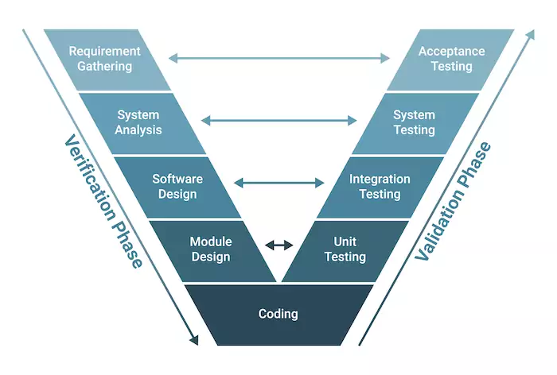

<small><strong>Time to Read:</strong> 15 Minutes</small>, <small><strong>Time to Present:</strong> 105 Minutes</small>
 
<small><strong>Created By:</strong> Alireza Roshanzamir</small>
 
<small><strong>Keywords:</strong> Continuous Delivery, Continuous Integration, DevOps, Build, Test, Release, Deployment, Automation, Version Control, Deployment Pipeline</small>
  
<small style="color: darkred"><small>Press **"F"** to go fullscreen; some slides may not display properly otherwise.</small></small>

---
### Introduction
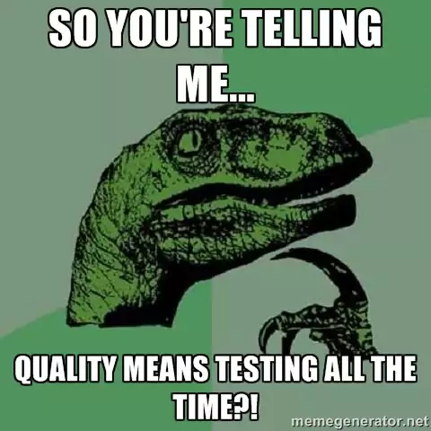

W. Edwards Deming:  <!-- .element class="fragment fade-in-with-next custom" -->
> Cease dependence on mass inspection to achieve quality. Improve the process and build quality into the product in the first place.

Testing is a **cross-functional** activity for **the entire team**, and should be **done continuously** from the **beginning of the project**.  <!-- .element class="fragment fade-in-paragraph custom" -->

**Building quality in** means **writing automated tests at multiple levels (unit, component, and acceptance)** and running them as part of the **deployment pipeline**.  <!-- .element class="fragment fade-in-paragraph custom" -->

**Manual testing** is also an essential part of building quality in: **Showcases**, **usability testing**, and **exploratory testing** need to be done continuously throughout the project.  <!-- .element class="fragment fade-in-paragraph custom" -->

**Testers**, **developers**, and **users** team up to write automated tests right **at the project's beginning**. Ideally, these tests come **before developers create features**. They cover not just **functional** but also **nonfunctional** aspects like capacity and security.  <!-- .element class="fragment fade-in-paragraph custom" -->

Designing a testing strategy is about **identifying** and **prioritizing** project **risks** and **choosing actions** to mitigate them.  <!-- .element class="fragment fade-in-paragraph custom" -->

---
### Types of Tests
Brian Marick categorized tests based on whether they're related to **business or technology**, and if they **aid development or critique the project**:

It's also known as **Agile testing quadrants**. You can find more information in the following book:  <!-- .element class="fragment fade-in-parent-with-next custom" -->
<table>
  <tr>
    <td>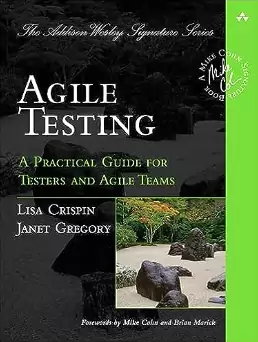</td>
    <td>
      Agile Testing: A Practical Guide for Testers and Agile Teams
       
      <small>by Lisa Crispin, Janet Gregory</small>
    </td>
  </tr>
</table>

------
### Quadrant TL: Business-Facing Tests That Support the Development Process
Called **functional** or **acceptance** tests. **F/NF acceptance** testing ensures that the **acceptance criteria** for a **story** are met. Acceptance tests should be written, and **ideally automated**, **before development starts on a story**. Acceptance tests that concern the functionality of the system are known as **functional acceptance tests**.

Acceptance tests answer:  <!-- .element class="fragment fade-in-with-next custom" -->
- For **developers**: **"How do I know when I am done?"**
- For **users**: **"Did I get what I wanted?"**

Ideally, with modern test frameworks and DSL, **users can write acceptance tests** (as they define the success criteria for each requirement), while **developers and testers work on the implementation**.  <!-- .element class="fragment fade-in-paragraph custom" -->

While including **examples**, **prototypes**, and **simulations** in this quadrant is right, they're **not entirely automatic** anymore.  <!-- .element class="fragment fade-in-paragraph custom" -->

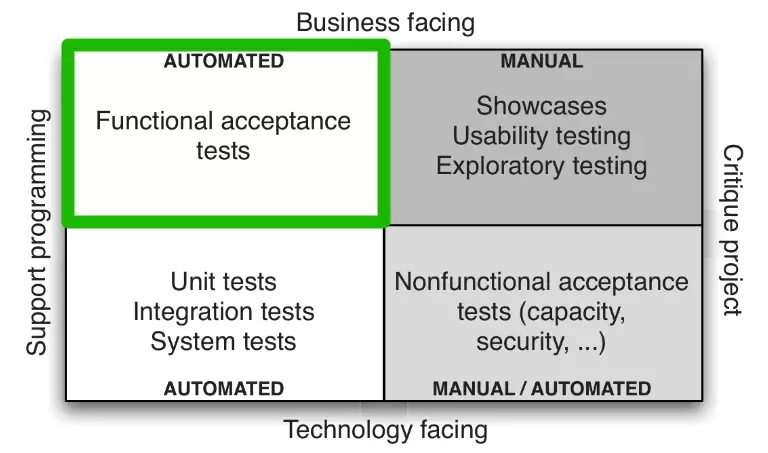

------
### Quadrant TL: Given-When-Then
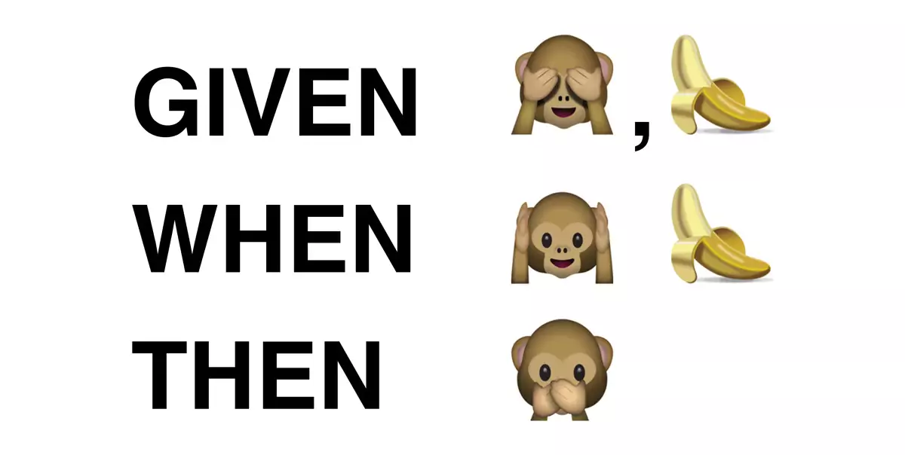

Each story/requirement has:  <!-- .element class="fragment fade-in-with-next custom" -->
- **Happy Path**: Single **canonical path** through the application in terms of **user actions**.
- **Alternete Paths**:  Different variations in **initial state**, **actions**, and **final state** that create distinct use cases.
- **Sad Paths**: Alternete paths that lead to **error conditions**.

These are often expressed using the form:  <!-- .element class="fragment fade-in-with-next custom" -->
- **Given**: A few important characteristics of the state of the system when testing begins.
- **When**: The user performs some set of actions.
- **Then**: A few important characteristics of the new state of the system.

**Equivalence partitioning analysis** and **boundary value analysis** reduce cases for **comprehensive but minimal** testing.  <!-- .element class="fragment fade-in-paragraph custom" -->

Run acceptance test like it's in **production**: **system**, **environment**, **config**, **state** - even with **mock external services**.  <!-- .element class="fragment fade-in-paragraph custom" -->

------
### Quadrant TL: Automating Acceptance Tests
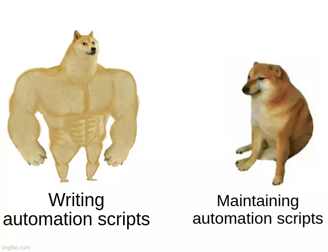

Automated acceptance tests have valuable benefits:
- Faster **feedback loop** (developers can run them without testers)  <!-- .element class="fragment fade-in-then-semi-out-parent custom" -->
- **Workload reduction** on **testers**  <!-- .element class="fragment fade-in-then-semi-out-parent custom" -->
- **Testers** can focus on **exploratory testing**  <!-- .element class="fragment fade-in-then-semi-out-parent custom" -->
- Powerful **regression test** (cross-cutting category to quadrant diagram) suite  <!-- .element class="fragment fade-in-then-semi-out-parent custom" -->
- If they were **human readable**, we have **auto-generated**, **always updated** **requirements** and **documentations**  <!-- .element class="fragment fade-in-then-semi-out-parent custom" -->

Automated acceptance tests can be **costly to maintain**. If done poorly, they can **burden your team**. We mainly cover the **happy path** and **some key parts** to balance costs.  <!-- .element class="fragment fade-in-paragraph custom" -->

Achieving **80% regression testing coverage (for each unit, component, and acceptance)** is comprehensive. But relying solely on 60% unit tests and 20% acceptance tests may not be enough.  <!-- .element class="fragment fade-in-paragraph custom" -->

A handy guideline is to **automate** after **repeating the same test a couple of times** and being sure **maintenance won't be excessive**.  <!-- .element class="fragment fade-in-paragraph custom" -->

Ask periodically: **"Do my acceptance tests break due to real bugs or requirement changes?"**  <!-- .element class="fragment fade-in-paragraph custom" -->

Each **story/requirement** needs at least **one automated happy path acceptance test**.  <!-- .element class="fragment fade-in-paragraph custom" -->

------
### Quadrant BL: Technology-Facing Tests That Support the Development Process
**Two primary** and **two extra** test types fit here:
- <!-- .element class="fragment highlight-current-blue" --> Unit tests
  - Tests a code part **alone** and **isolated**, often using **test doubles** to simulate other parts.
  - These tests should span **almost all code paths** (**minimum 80%**).
  - Written in the **same programming language** as the app.
- <!-- .element class="fragment highlight-current-blue" --> Component (integration) tests
  - Check behavior of a **bigger system part**, such as a **group of classes that provide some service**.
  - Written in the **same programming language** as the app.
- <!-- .element class="fragment highlight-current-blue" --> [System (end-to-end) tests]
  - Usually test **less customer-focused** things, like **"Are database connections committed in the correct order?"**
- <!-- .element class="fragment highlight-current-blue" --> [Deployment tests]
  - Performed when deploying your app to check if the deployment worked.

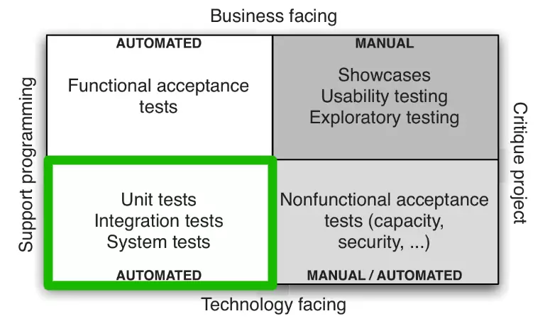

------
### Quadrant TR: Business-Facing Tests That Critique the Project

Manual tests confirm the app **delivers expected value to users**. It's not only about verifying the app meets specs but also about **validating the accuracy of those specs**:  <!-- .element class="fragment fade-in-parent-with-next custom" -->
- <!-- .element class="fragment highlight-current-blue" --> Showcases
  - Agile teams showcase **new functionality** to users at each **iteration's end**.
- <!-- .element class="fragment highlight-current-blue" --> Exploratory testing
  - Testers both **design and perform tests**, using critical thinking to analyze the results. Exploratory testing, a creative learning process, **discover bugs and inspires new automated tests**.
- <!-- .element class="fragment highlight-current-blue" --> Usability testing
  - Check **how easily** users achieve goals in your software. It's the **ultimate test** that your app **brings value to users**. **"Beta release"** or **"Canary Releasing"** can assist in this.
- It is correct to put **User Acceptance Testing (UAT)** and **Alpha/Beta Testing** in this quadrant.  <!-- .element class="fragment highlight-current-blue-parent custom" -->

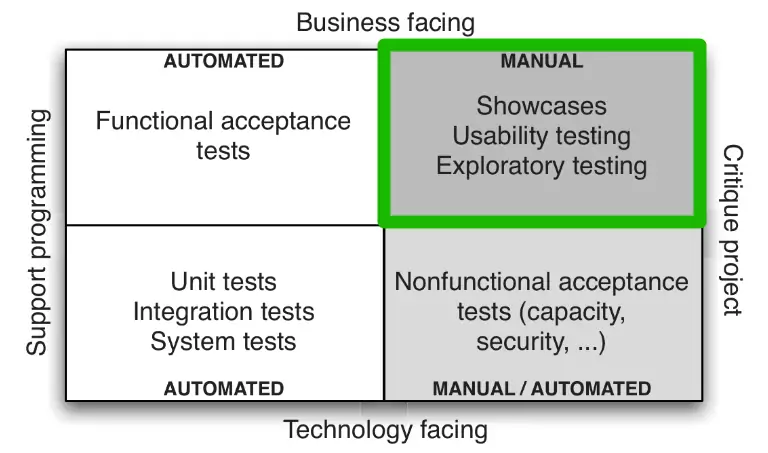

------
### Quadrant BR: Technology-Facing Tests That Critique the Project
Nonfunctional tests address **system qualities beyond functionality**, like **capacity**, **availability**, and **security**. The line between functional and nonfunctional is **blurry**, as is the idea that these tests are not business-facing. "Nonfunctional requirements" name can be debated; alternatives include **"cross-functional requirements"** or **"system characteristics"**.

Regardless of the name, **nonfunctional acceptance criteria** should be defined **similarly to functional ones** within your app's requirements.  <!-- .element class="fragment fade-in-paragraph custom" -->

These tests can require **significant resources** like unique environments and specialized expertise for setup, and they **often run for a long time**, whether automated or not. Therefore, their implementation tends to be **deferred**.  <!-- .element class="fragment fade-in-paragraph custom" -->

We suggest **set up basic nonfunctional tests early** in any project, even if it's simple or inconsequential.  <!-- .element class="fragment fade-in-paragraph custom" -->

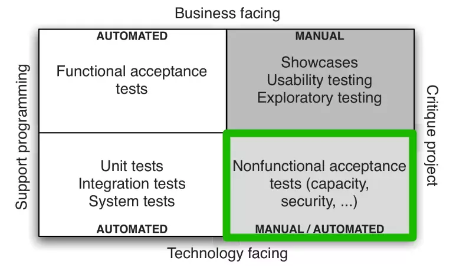

---
## Test Doubles

Automated testing often includes **substituting a system part** with a **simulated version** during runtime:  <!-- .element class="fragment fade-in-parent-with-next custom" -->
- **Dummy**: Never actually used.
- **Stub**: Provide canned answers.
- **Spy**: Record some information. Some resources, tell that it can also provide canned answers.
- **Mock**: Preprogrammed with expectations and the responses.
- **Fake**: Simulate different test objects through a different implementation (usage of in-memory database for testing).

[Mocks are not stubs](https://martinfowler.com/articles/mocksArentStubs.html): Stub uses state verification while the mock uses behavior verification.  <!-- .element class="fragment fade-in-paragraph custom" -->

You can find more information in the following books:  <!-- .element class="fragment fade-in-with-next custom" -->
<table>
  <tr>
    <td></td>
    <td>
      XUnit Test Patterns: Refactoring Test Code
       
      <small>by Gerard Meszaros</small>
    </td>
  </tr>
</table>

Note

Mention the Classical vs Mockist testing and TDD dichotomy.

---
## Test Coverage Criteria (Criteria-Based Testing)
Test coverage is a **metric** used in software testing to gauge how extensively a software system's **features**, **requirements**, or **code components** are tested by a set of **test cases**. It aims to **provide insight** into testing's **quality**.

Start by **creating a model** of the source code or target components for testing. Next, **define coverage criteria** to be met. Then, create thorough **test plans** and **develop tests** aligned with these coverage criteria:  <!-- .element class="fragment fade-in-parent-with-next custom" -->

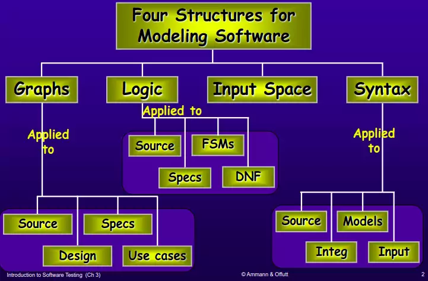

------
### Code Coverage Criteria (Code Coverage-Based Testing)

Code coverage-based unit testing is a form of **white-box** testing. It assesses the **portion of executed code by test cases**, aiming for thorough **examination of the software's internal logic and pathways**:  <!-- .element class="fragment fade-in-parent-with-next custom" -->

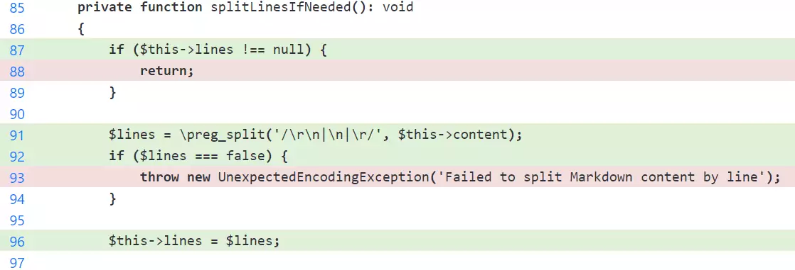

  
Note

  "Code coverage" differs from "test coverage." The former measures how the code is covered by tests, while the latter is a superset of the former, encompassing various entities such as source code, requirements, and use cases, and assessing how they are covered by tests.

------
### Mutation Testing
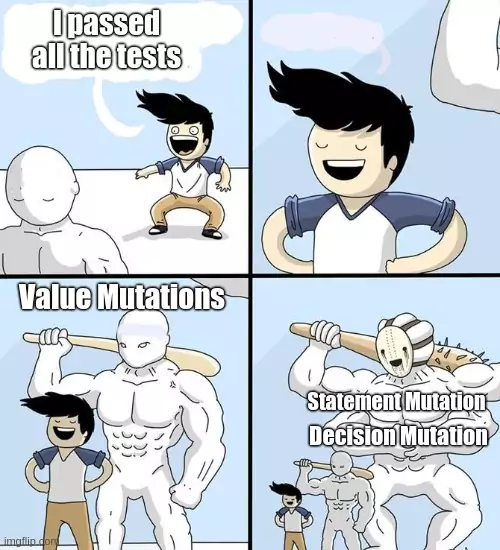

Mutation testing is a software method involving **changing specific statements in the source code**, then evaluating whether the **tests can detect errors**:  <!-- .element class="fragment fade-in-parent-with-next custom" -->
<table>
  <tr>
    <td>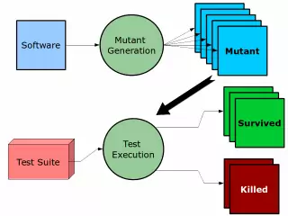</td>
    <td></td>
  </tr>
</table>

------
### Property-Based Testing (Hypothesis Testing)
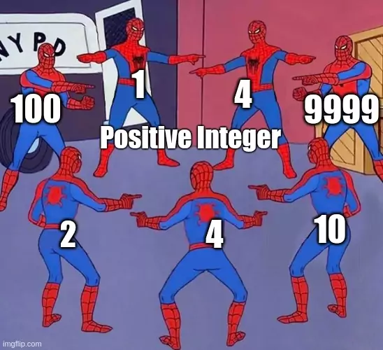

In **typical testing**, you run code and verify the **result matches your expected outcome**. In **property-based testing**, you create tests to **check that the results satisfy certain properties**.  <!-- .element class="fragment fade-in-parent custom" -->

Steps:  <!-- .element class="fragment fade-in-with-next custom" -->
- For all data matching some specification.
- Perform some operations on the data.
- Assert something about the result.

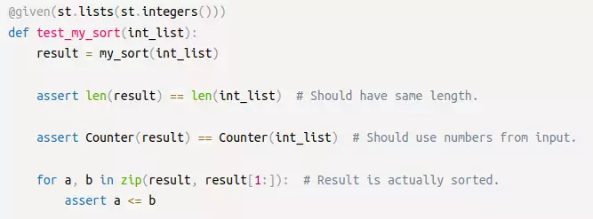

---
## Test-Driven Development (TDD)
Test-driven development (TDD) is a **software programming approach** that interlaces unit testing, programming and refactoring on source code:

<table>
  <tr>
    <td></td>
    <td></td>
  </tr>
</table>

You can find more information in the following books:  <!-- .element class="fragment fade-in-with-next custom" -->
<table>
  <tr>
    <td></td>
    <td>
      Test Driven Development by Example
       
      <small>by Kent Beck</small>
    </td>
  </tr>
</table>

---
## Real-Life Situations and Strategies
Typical scenarios faced by teams deciding for test automation:

- New Projects
- Midproject
- Legacy Systems

------
### Real-Life Situations and Strategies: New Projects
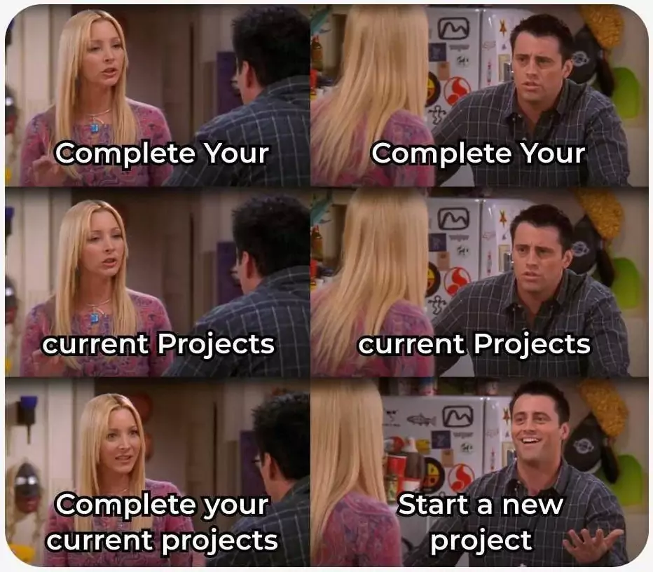

In this case, the key is to begin writing automated acceptance tests right **from the start**.  <!-- .element class="fragment fade-in-paragraph custom" -->

To achieve this, you'll need:  <!-- .element class="fragment fade-in-with-next custom" -->
- Choose a **technology platform** and **testing tools**.  <!-- .element class="fragment highlight-current-blue-parent custom" -->
- Set up a **simple**, **automated build**.  <!-- .element class="fragment highlight-current-blue-parent custom" -->
- Work out **stories** and **acceptance criteria** that follow the **INVEST** principles (**Independent**, **Negotiable**, **Valuable**, **Estimable**, **Small**, and **Testable**).  <!-- .element class="fragment highlight-current-blue-parent custom" -->

You can then implement a strict process:  <!-- .element class="fragment fade-in-with-next custom" -->
 - **Customers**, **analysts**, and **testers** define **acceptance criteria**.  <!-- .element class="fragment highlight-current-blue-parent custom" -->
 - **Testers work with developers** to **automate acceptance tests** based on the acceptance criteria.  <!-- .element class="fragment highlight-current-blue-parent custom" -->
 - **Developers code behavior** to fulfill the acceptance criteria.  <!-- .element class="fragment highlight-current-blue-parent custom" -->
 - If **any automated tests fail** (whether unit, component, or acceptance tests), developers **make it a priority to fix** them.  <!-- .element class="fragment highlight-current-blue-parent custom" -->

------
### Real-Life Situations and Strategies: Midproject
To introduce automated testing effectively, start with the **most common**, **important**, and **high-value** **use cases** of the app. From customer discussions, **automate happy path tests** covering these high-value scenarios.

Automating only the happy path means you'll **need more manual testing** to ensure full functionality. When you find yourself testing the same function **manually multiple times**, assess if the functionality **won't likely change** and consider **automating the test**.  <!-- .element class="fragment fade-in-paragraph custom" -->

Once you **spot a bug**, write a **test that captures it**, and then **proceed to fix it**.  <!-- .element class="fragment fade-in-paragraph custom" -->

------
### Real-Life Situations and Strategies: Legacy Systems
A legacy system is an **old** or **outdated** system, technology, or software application that an organization **still uses**.

If it doesn't exist, create an **automated build process** and build an **automated functional test framework around it**. **Test the code that you change** and gradually include **new tests for added behavior**. These serve as your **legacy system's smoke tests**.  <!-- .element class="fragment fade-in-paragraph custom" -->

Legacy systems often suffer from **unmodular**, **poorly structured**, and **hard-to-test** code.  <!-- .element class="fragment fade-in-paragraph custom" -->

If you have **time**, you can test the **alternate paths** of the story.  <!-- .element class="fragment fade-in-paragraph custom" -->

Remember to focus on writing automated tests where they **add value**.  <!-- .element class="fragment fade-in-paragraph custom" -->

------
### Integration Testing
**Integration testing** and **component testing** can be **blurred** (due to overloaded integration testing term). In our literature, integration tests confirm **each app part works well with its dependent services**.

Test harnesses complexity depends on whether the **doubled-up service retains state**. If the external system **remembers state**, harness behavior changes **based on sent requests**. Here, **black box tests are highly valuable**. Cover all **potential responses**, each with **its own test**. The **mock external system** should **identify requests** and provide the **suitable response** or an **exception for unexpected ones**.  <!-- .element class="fragment fade-in-paragraph custom" -->

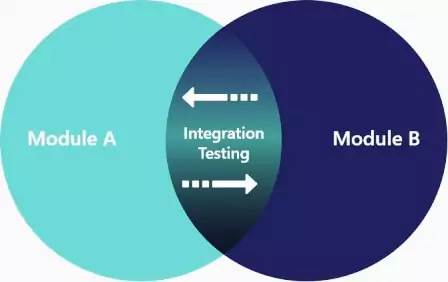

---
## Process
Have a session with all **stakeholders** at each iteration's start. Gather **customers**, **analysts**, and **testers** for **highest-priority test scenarios**. Tools like Cucumber, JBehave, Concordion, and Twist let you write **acceptance criteria in natural language** and code them. Refactoring test code updates the test specifications too.

Use a **domain-specific language (DSL)** for testing. This enables **entering acceptance criteria in the DSL**. Initially, ask customers for **basic acceptance tests covering happy paths**. Later, **after the meeting**, additional data sets can be added to **enhance test coverage**.  <!-- .element class="fragment fade-in-paragraph custom" -->

These acceptance tests, along with short descriptions, serve as the **starting point for developers** tackling the stories. **Testers and developers should collaborate** early on to review the acceptance tests **prior to development**. This offers developers an **overview of the story** and insight into **important scenarios**.  <!-- .element class="fragment fade-in-paragraph custom" -->

**Tight cooperation between developers and testers** during story development is crucial for a smooth path to release.  <!-- .element class="fragment fade-in-paragraph custom" -->

------
### Managing Defect Backlogs
Two main approaches:
- Having **zero defects**: Whenever a bug is found, it is **immediately fixed**.  <!-- .element class="fragment highlight-current-blue-parent custom" -->
- Handle defects **like features**: **Prioritize** them **compared to features**. Consider **"critical"**, **"blockers"**, **"medium"**, or **"low"** categories. <!-- .element class="fragment highlight-current-blue-parent custom" -->

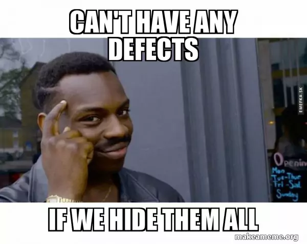

---
## Summary
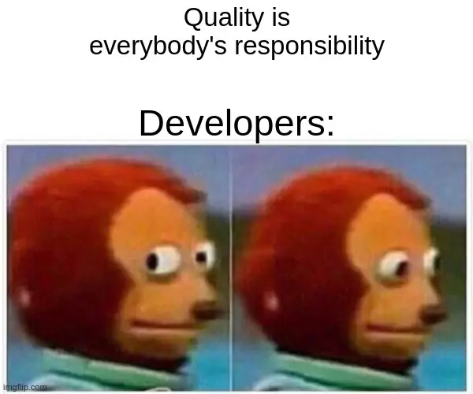

For high-quality software, **everyone in the project** must share testing duties from the start till the end.  <!-- .element class="fragment fade-in-paragraph custom" -->

The **shortest feedback loops** come from **automated tests run on every change**. These tests span all levels, **from unit to acceptance** (both functional and nonfunctional).  <!-- .element class="fragment fade-in-paragraph custom" -->

Combine automated tests with **manual methods** like **exploratory testing** and **showcases**.  <!-- .element class="fragment fade-in-paragraph custom" -->
