## Anatomy of Deployment Pipeline
#### A Basic Deployment Pipeline, Practices, The Commit Stage, Test Stages, Release and Deployment Stages, Implementation, Metrics

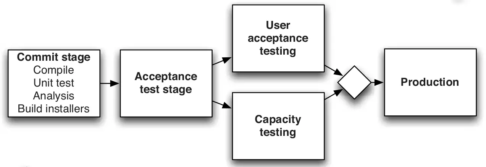

<small><strong>Time to Read:</strong> 13 Minutes</small>, <small><strong>Time to Present:</strong> 50 Minutes</small>
 
<small><strong>Created By:</strong> Alireza Roshanzamir</small>
 
<small><strong>Keywords:</strong> Continuous Delivery, Continuous Integration, DevOps, Build, Test, Release, Deployment, Automation, Version Control, Deployment Pipeline</small>
  
<small style="color: darkred"><small>Press **"F"** to go fullscreen; some slides may not display properly otherwise.</small></small>

---
## What Is a Deployment Pipeline?
In abstract, a deployment pipeline is an automated process to take software **from version control** to **user access**. This demands teamwork among individuals and **teams**:

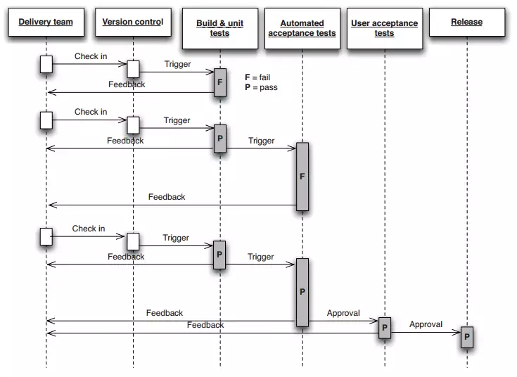

------
### Continued: What Is a Deployment Pipeline?
Common **minimal** deployment pipeline (**continuous integration pipeline** or **build pipeline**) includes:
- **Commit stage(s)**: Compiles, unit-level tests, code analysis. **Five to ten minutes** to run.  <!-- .element class="fragment highlight-current-blue-parent custom" -->
- **Automated acceptance test stages**: Assert that the system works at the functional and nonfunctional level. Executed in parallel to increase their speed. Typically **within an hour or two**.  <!-- .element class="fragment highlight-current-blue-parent custom" -->
- **Manual test stages**: Exploratory tests, UAT, Integration (integration between services) tests.  <!-- .element class="fragment highlight-current-blue-parent custom" -->
- **Release stage**: **Delivers the system to users**, either as **packaged software** or by **deploying it into a production** or staging environment.  <!-- .element class="fragment highlight-current-blue-parent custom" -->

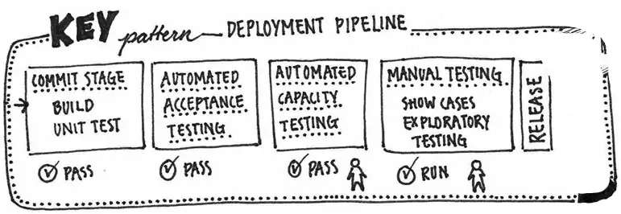

Note

Mention the origin of the term "Deployment Pipeline" because of the CPU pipeline architecture and parallelism and similar function between stages and guessing the next stages result.

------
### A Basic Deployment Pipeline
A typical deployment pipeline:

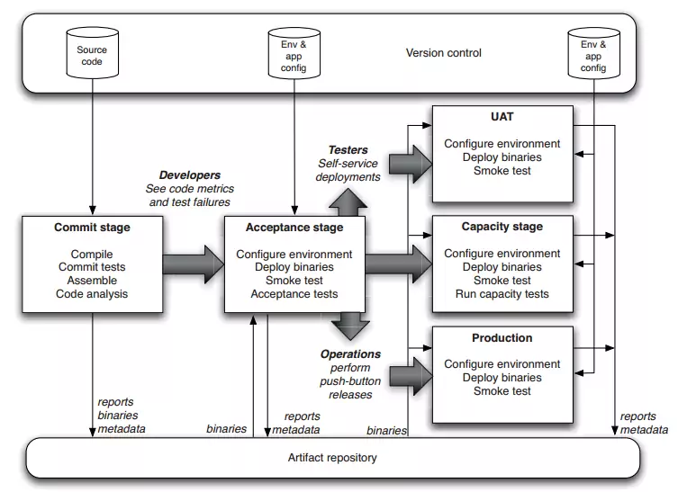

------
### Continued: A Basic Deployment Pipeline
**Testers** and **operations** may need to approve deployment to **UAT** or **production**:

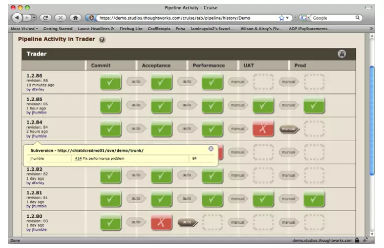

---
## Deployment Pipeline Practices

There are some practices you should follow:  <!-- .element: class="fragment fade-in-with-next custom" -->
- Only Build Your Binaries Once  <!-- .element: class="fragment insides-fade-in-then-out" -->
  - Keep the deployment pipeline efficient.  <!-- .element: class="fragment fade-in-then-semi-out" -->
  - Build upon foundations known to be sound.  <!-- .element: class="fragment fade-in-then-semi-out" -->
- Deploy the Same Way to Every Environment  <!-- .element: class="fragment insides-fade-in-then-out" -->
  - Use the same process to deploy to every environment (developer/analyst workstations, testing, production).  <!-- .element: class="fragment fade-in-then-semi-out" -->
- Smoke-Test Your Deployments (Deployment Test)  <!-- .element: class="fragment insides-fade-in-then-out" -->
  - Could be as simple as launching the app and verifying the main screen displays the expected content.  <!-- .element: class="fragment fade-in-then-semi-out" -->
  - Check external services like databases and messaging buses are running.  <!-- .element: class="fragment fade-in-then-semi-out" -->
- Deploy into a Copy of Production  <!-- .element: class="fragment insides-fade-in-then-out" -->
  - Ensure that infrastructure (network, firewall, etc.), OS, application Stack, and application data are same.  <!-- .element: class="fragment fade-in-then-semi-out" -->
- If Any Part of the Pipeline Fails, Stop the Line  <!-- .element: class="fragment insides-fade-in-then-out" -->
- Each Change Should Propagate through the Pipeline Instantly (for Fully Automated Stages)  <!-- .element: class="fragment insides-fade-in-then-out" -->
  - Do not use hourly builds, nightly acceptance tests, weekly capacity tests.  <!-- .element: class="fragment fade-in-then-semi-out" -->
  - Intelligent scheduling is crucial to implementing a deployment pipeline.  <!-- .element: class="fragment fade-in-then-semi-out" -->

------
## Deployment Pipeline Practices: Scheduling
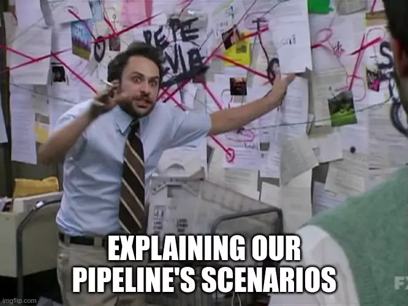

Intelligent scheduling is crucial to implementing a deployment pipeline:  <!-- .element: class="fragment fade-in-with-next custom" -->

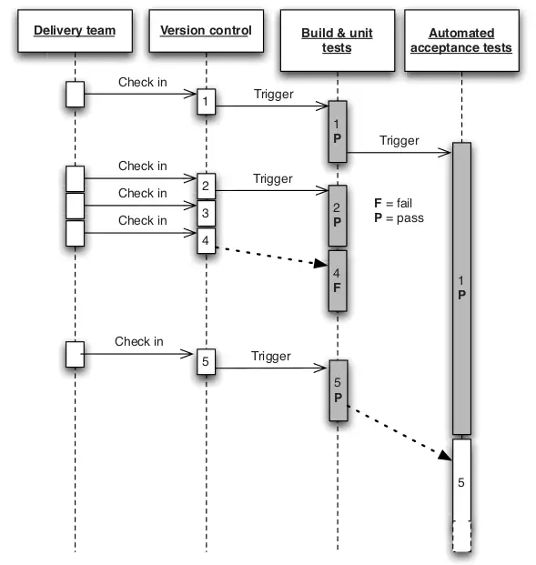

---
## The Commit Stage
Ideally, finish in **under 5 minutes**, and certainly **no more than 10 minutes**.

Typically includes the following steps:  <!-- .element class="fragment fade-in-with-next custom" -->
- Compile the code (if necessary).  <!-- .element class="fragment highlight-current-blue" -->
- Run a set of commit tests (unit-test and small selection of other tests).  <!-- .element class="fragment highlight-current-blue" -->
- Create binaries for use by later stages.  <!-- .element class="fragment highlight-current-blue" -->
- Perform analysis of the code to check its health.  <!-- .element class="fragment highlight-current-blue" -->
- Prepare artifacts, such as test databases, for use by later stages.  <!-- .element class="fragment highlight-current-blue" -->

Some code analysis and metrics:  <!-- .element class="fragment fade-in-with-next custom" -->
- Test coverage (if your commit tests only cover 5% of your codebase, they're pretty useless)  <!-- .element class="fragment highlight-current-blue" -->
- Amount of duplicated code  <!-- .element class="fragment highlight-current-blue" -->
- Cyclomatic complexity  <!-- .element class="fragment highlight-current-blue" -->
- Afferent and efferent coupling  <!-- .element class="fragment highlight-current-blue" -->
- Number of warnings  <!-- .element class="fragment highlight-current-blue" -->
- Code style  <!-- .element class="fragment highlight-current-blue" -->

------
### Commit Stage Best Practices
Developers should **await the commit stage** success. If it fails, they should either **quickly fix the problem**, or **revert changes**.

Once passed, developers can move on, but **they should still monitor later stages' progress**.  <!-- .element class="fragment fade-in-paragraph custom" -->

---
## The Automated Acceptance Test Gate
**Without production-like acceptance tests**, we can't ensure **meeting customer specs or real-world readiness**. **Most** tests in acceptance stage are functional, but **not all** (similar to commit stage tests).

The **development team** must **respond immediately** to acceptance test **breakages** during regular development.  <!-- .element class="fragment fade-in-paragraph custom" -->

------
### Automated Acceptance Test Best Practices
- Consider the environments that your application will encounter in production  <!-- .element: class="fragment insides-fade-in-then-out" -->
  - Use a **scaled-down** version of it if it's complex or expensive  <!-- .element: class="fragment fade-in-then-semi-out-parent custom" -->
- You can use test doubles for any external infrastructure that you depend on  <!-- .element: class="fragment insides-fade-in-then-out" -->
- The whole team owns the acceptance tests  <!-- .element: class="fragment insides-fade-in-then-out" -->
  - Acceptance tests **without developer input** often end up **closely tied to the UI**, making them **fragile**.  <!-- .element: class="fragment fade-in-then-semi-out-parent custom" -->
- Developers must be able to run automated acceptance tests on their development environments  <!-- .element: class="fragment insides-fade-in-then-out" -->
- Acceptance tests should be expressed in the language of the business (Ubiquitous Language)  <!-- .element: class="fragment insides-fade-in-then-out" -->
  - Using the **same programming language** for acceptance tests is **fine**, but focus on **business behavior** (**"place order" not "click order button"**, **"confirm fund transfer" not "check fund_table has results"**).  <!-- .element: class="fragment fade-in-then-semi-out-parent custom" -->
- Don't follow a naive process of taking your acceptance criteria and blindly automating every one  <!-- .element: class="fragment insides-fade-in-then-out" -->
  - While acceptance tests are extremely valuable, they can also be **expensive to create and maintain**.  <!-- .element: class="fragment fade-in-then-semi-out-parent custom" -->

---
## Subsequent [Test] Stages
When delivering software incrementally, automated production deployment (**"Continuous Deployment"**) is possible. Yet, **many systems still require manual testing before release**.

To authorize deployment, you need a method. The main needs include **seeing approved release candidates**, having a **button** to choose and deploy **a version** to the **desired environment** (like UAT, capacity, exploratory, staging, production).  <!-- .element: class="fragment fade-in-paragraph custom" -->

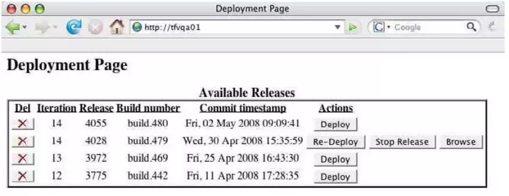

Two common test stages are:  <!-- .element: class="fragment fade-in-with-next custom" -->
- Manual Testing
  - Such as **exploratory testing**, **usability testing**, and **showcases**.
- Nonfunctional Testing
  - Such as **capacity**, **security**, **SLA**s.
  - It makes sense to show results after capacity testing. Then, **a person can choose whether to promote the release candidate or not**.

---
## Preparing to Release
Releasing a production system involves **business risk**. We see the release step as a natural outcome of our deployment pipeline:
- Create and maintain a **release plan** with **all involved**: developers, testers, operations, infrastructure, and support teams.  <!-- .element: class="fragment fade-in-then-semi-out-parent custom" -->
- Reduce the effect of errors by **automating as much** of the process as you can.  <!-- .element: class="fragment fade-in-then-semi-out-parent custom" -->
- Ensure you can **back out** a release if things don't go as according to plan.  <!-- .element: class="fragment fade-in-then-semi-out-parent custom" -->
- Plan how to migrate **configuration** and **production data** during **upgrades** and **rollbacks**.  <!-- .element: class="fragment fade-in-then-semi-out-parent custom" -->

Releasing should be easy: **select a version**, then **press a button**. **Backing out should be equally simple**.  <!-- .element: class="fragment fade-in-paragraph custom" -->

------
### Automating Deployment and Release
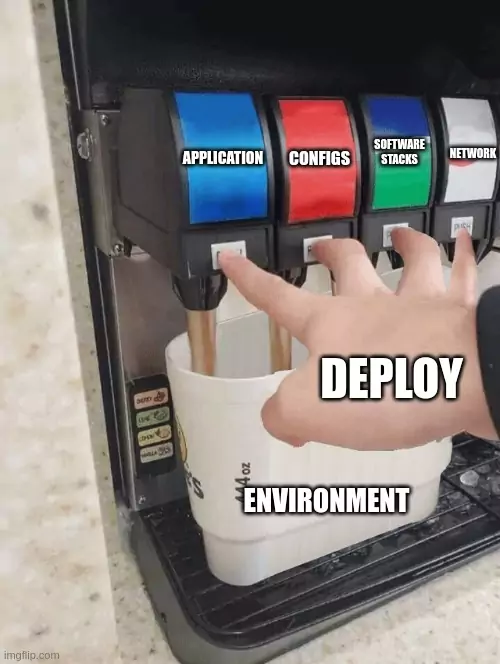

Production environments need to be **locked down**, allowing changes only **via automation**. This covers application **deployment**, **configurations**, **software stacks**, **network topology**, and **state** changes.  <!-- .element: class="fragment fade-in-paragraph custom" -->

Once you've deployed a complex system for the **fiftieth** or **hundredth time without issues**, it becomes **less of a notable event**.  <!-- .element: class="fragment fade-in-paragraph custom" -->

**Even** if you **don't need to release** your software **several times a day**, setting up a deployment pipeline will greatly **boost** your organization's **speed** and **reliability** in delivering software.  <!-- .element: class="fragment fade-in-paragraph custom" -->

------
### Backing Out Changes

Two main reasons why release days are feared:  <!-- .element: class="fragment fade-in-with-next custom" -->
- Issues can arise due to **hard-to-detect mistakes** during the **manual steps** of a software release.
- If a **release fails**, whether due to process issues or software defects, you're commited.

Corresponding solutions:  <!-- .element: class="fragment fade-in-with-next custom" -->
- **Rehearsing the release** many times a day, proving that our automated deployment system works.
- **Providing a back-out strategy**.

A good back-out plan involves **keeping the previous app version** during and after the new version's release. Often, the **biggest challenge** with deployment and rollback is **migrating the production data**.  <!-- .element: class="fragment fade-in-paragraph custom" -->

The next best option is to **redeploy** the **previous good version** of your appliation from scratch.  <!-- .element: class="fragment fade-in-paragraph custom" -->

**Never** use a **different process for backing out than for deployment**, and **avoid step-by-step** deployments or **rollbacks**.  <!-- .element: class="fragment fade-in-paragraph custom" -->

------
### Building on Success
Finally, for deploying a release candidate to production, we can say:
- The code **compiles**.  <!-- .element: class="fragment fade-in-then-semi-out-parent custom" -->
- The code does what **developers** intended, validated by **unit tests**.  <!-- .element: class="fragment fade-in-then-semi-out-parent custom" -->
- The system operates as expected by **analysts** or **users**, validated by **acceptance tests**.  <!-- .element: class="fragment fade-in-then-semi-out-parent custom" -->
- **Infrastructure configuration and baseline environments** are well-handled as the app is **tested in an analog of production**.  <!-- .element: class="fragment fade-in-then-semi-out-parent custom" -->
- The code has the **right components** due to its **deployability**.  <!-- .element: class="fragment fade-in-then-semi-out-parent custom" -->
- The **deployment system works** due to its use in **development** and **testing environments** before the candidate moves next.  <!-- .element: class="fragment fade-in-then-semi-out-parent custom" -->
- The **version control** has **everything** required to deploy, removing manual steps due to prior deployments.  <!-- .element: class="fragment fade-in-then-semi-out-parent custom" -->

---
## Implementing a Deployment Pipeline
Take an **incremental approach** when setting up a deployment pipeline. Typically, the steps are as follows:
1. Model your **value stream** and create a **walking skeleton**.  <!-- .element: class="fragment fade-in-then-semi-out-parent custom" -->
   - Alternatively, begin with the **bare minimum**: Commit, Acceptance, Deploy stages.
2. **Automate** the **build** and **deployment** process.  <!-- .element: class="fragment fade-in-then-semi-out-parent custom" -->
3. Automate **unit tests** and **code analysis**.  <!-- .element: class="fragment fade-in-then-semi-out-parent custom" -->
4. Automate **acceptance tests**.  <!-- .element: class="fragment fade-in-then-semi-out-parent custom" -->
5. Automate **releases**.  <!-- .element: class="fragment fade-in-then-semi-out-parent custom" -->

------
### Modeling Your Value Stream and Creating a Walking Skeleton
Start by mapping the value stream from check-in to release:

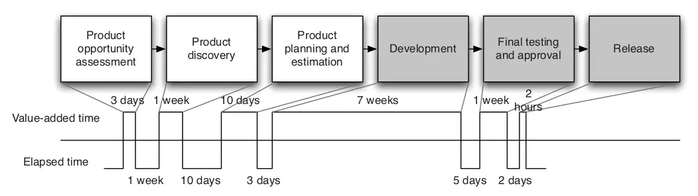

After creating a value stream map, **model your process** in your **CI** and **release management** tool.  <!-- .element: class="fragment fade-in-paragraph custom" -->

**Alternatively**, begin with a **bare minimum**: a **commit stage** for building and testing, an **acceptance test stage**, and a third stage for **deploying** to a production-like **demo** environment.  <!-- .element: class="fragment fade-in-paragraph custom" -->

Initially, use **placeholders** or the **simplest examples**, like a passing test, for some stages. Wait for **manual approval** or **trigger the next stages automatically**.  <!-- .element: class="fragment fade-in-paragraph custom" -->

------
### Automating the Build and Deployment Process
The **build** process:
- Takes **source code as input** and **generates binary output**.
- The CI server **monitors code changes** and generates **accessible shared binaries for the team**.

The next step is **automating deployment**:  <!-- .element: class="fragment fade-in-parent-with-next custom" -->
- You need a **machine** for deploying your app.
- Deployment may involve **packaging**.
- **Automate the installation and configuration** of your application next.
- Lastly, create an **automated deployment test** to verify the successful application deployment.

Next, aim for **push-button deployments**:  <!-- .element: class="fragment fade-in-parent-with-next custom" -->
- Configure CI server to allow **selecting a build** and **clicking a button** to initiate a process. This process **takes the build's binaries**, **runs the deployment script**, and **performs the deployment test**.

The release process **mirrors the testing environment deployment**, **except for user-installed software**.  <!-- .element: class="fragment fade-in-paragraph custom" -->

------
### Automating the Unit Tests and Code Analysis
Next, **enrich** the commit stage.
- Running unit-tests
- Code analysis
- A **selection** of acceptance and other types of tests

------
### Automating Acceptance Tests
The acceptance test phase can utilize the **same deployment script for the testing environment**. **Start the acceptance test framework**, **gather reports**, and **store application logs**. For **GUI apps**, consider using **Vnc2swf** for **screen recording** during tests for debugging.

Acceptance tests have two types: **functional** and **nonfunctional**. Begin testing nonfunctional aspects like capacity and scaling **early in the project** to gauge compliance with requirements. **Initially, combine acceptance and performance tests in a single stage.**  <!-- .element: class="fragment fade-in-paragraph custom" -->

Incorporate **at least one or two** automated **tests of each type** you need into your project's deployment pipeline early on.  <!-- .element: class="fragment fade-in-paragraph custom" -->

------
### Evolving Your Pipeline
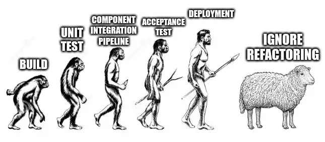

Two common pipeline extensions: **components** and **branches**. For large apps, use **mini-pipelines** for **each component**, then a **final pipeline** for **assembly**, **[F/NF] acceptance testing**, and **deployment to environments (testing, staging, and production)**.  <!-- .element: class="fragment fade-in-paragraph custom" -->

Keep in mind these three key points:  <!-- .element: class="fragment fade-in-with-next custom" -->
1. You can implement the entire pipeline **gradually**.  <!-- .element class="fragment highlight-current-blue-parent custom" -->
2. Your pipeline provides **valuable data** on the **efficiency** of your building, deploying, testing, and releasing.  <!-- .element class="fragment highlight-current-blue-parent custom" -->
3. Your deployment pipeline is a **living system**  <!-- .element class="fragment highlight-current-blue-parent custom" -->
   - Refactor your pipeline just like your applications.

---
## Metrics

Following the **lean philosophy**, focus on **optimizing globally, not locally**. **Don't waste** time on a **bottleneck that isn't the true constraint** in your delivery process. Use a **global metric** to gauge the **overall health of the delivery process**.  <!-- .element: class="fragment fade-in-paragraph custom" -->

In software delivery, the key global metric is **cycle time**:  <!-- .element: class="fragment fade-in-parent-with-next custom" -->

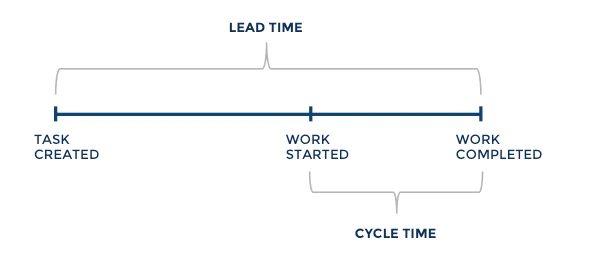

- It's the time from **deciding to implement a feature** to its **release for users**.  <!-- .element: class="fragment fade-in-parent custom" -->
- How fast can your organization **deploy a one-line code change**? Is it **repeatable** and **reliable**?  <!-- .element: class="fragment fade-in-parent custom" -->

Other metrics such as "Number of defects" **are not good as primary metrics**.  <!-- .element: class="fragment fade-in-paragraph custom" -->

------
### Reducing Cycle Time

Once you know your application's cycle time, you can find ways to reduce it, applying the **Theory of Constraints**:  <!-- .element: class="fragment fade-in-parent-with-next custom" -->
1. Identify the system's **limiting constraint**.  <!-- .element class="fragment highlight-current-blue-parent custom" -->
2. **Maximize** the **throughput of the constraint**, exploiting it fully.  <!-- .element class="fragment highlight-current-blue-parent custom" -->
3. **Subordinate all other** processes to the constraint. This implies that **other resources will not work at 100%**.  <!-- .element class="fragment highlight-current-blue-parent custom" -->
4. **Elevate the constraint**. If the cycle time remains too long after steps 2 and 3, **increase available resources**.  <!-- .element class="fragment highlight-current-blue-parent custom" -->
5. **Rinse and repeat**. Find **the next constraint** on your system and **go back to step 1**.  <!-- .element class="fragment highlight-current-blue-parent custom" -->

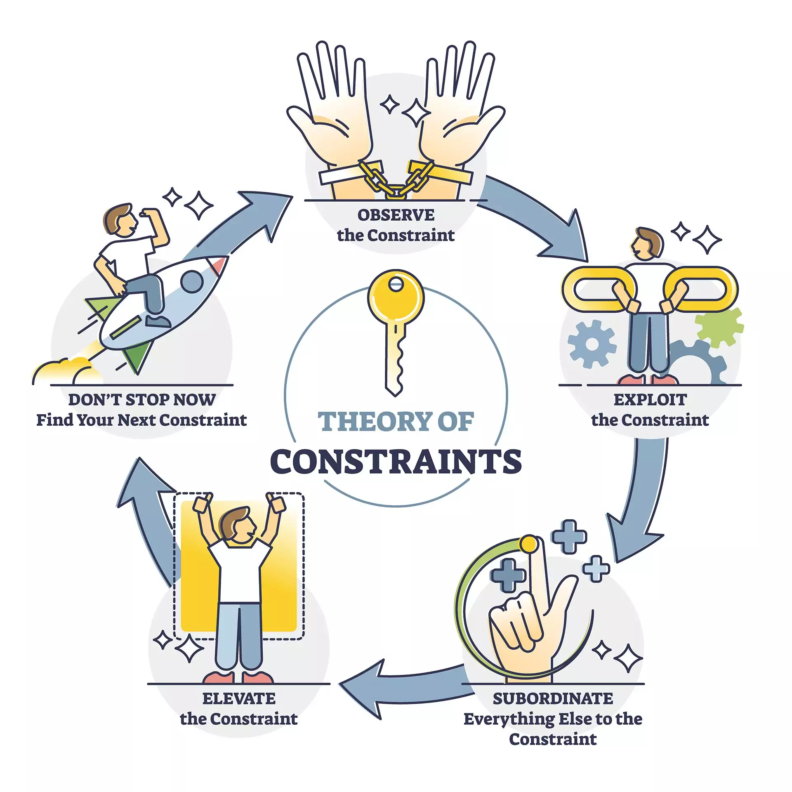

Note

Give the "Manual Testing" as an example for reducing cycle time:
<ol>
  <li>This is the part of your build, test, deploy, and release process that is the bottleneck. To pick an example at random, perhaps it's the manual testing process.</li>
  <li>In our example (manual testing), you would make sure that there is always a buffer of stories waiting to be manually tested, and ensure that the resources involved in manual testing don't get used for anything else.</li>
  <li>Instead, have your developers work just hard enough to keep the backlog constant and spend the rest of their time writing automated tests to catch bugs so that less time needs to be spent testing manually.</li>
  <li>Hire more testers, or perhaps invest more effort in automated testing.</li>
</ol>

------
### Other Metrics
Some other diagnostics that can warn you of problems:
- Automated **test coverage**  <!-- .element class="fragment highlight-current-blue-parent custom" -->
- Codebase properties like **amount of duplication**, **cyclomatic complexity**, efferent and afferent **coupling**, **style issues**, etc.  <!-- .element class="fragment highlight-current-blue-parent custom" -->
- Number of **defects**  <!-- .element class="fragment highlight-current-blue-parent custom" -->
- **Velocity**, the rate at which your team delivers working, tested, ready for use code  <!-- .element class="fragment highlight-current-blue-parent custom" -->
- Number of **commits** to the version control system **per day**  <!-- .element class="fragment highlight-current-blue-parent custom" -->
- Number of **builds per day**  <!-- .element class="fragment highlight-current-blue-parent custom" -->
- Number of **build failures per day**  <!-- .element class="fragment highlight-current-blue-parent custom" -->
- **Duration of build**, including automated tests  <!-- .element class="fragment highlight-current-blue-parent custom" -->

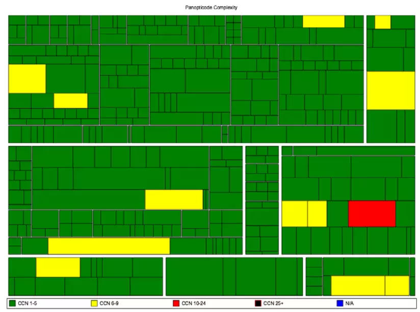

------
### Continued: Other Metrics
Each team's CI server should produce these **reports and visuals** with **every check-in**, **storing** them in the artifact repository. **Publish** these results on an internal **website**, with a **dedicated page for each project**. Additionally, **aggregate** them for monitoring across all projects in your **development program or organization**:

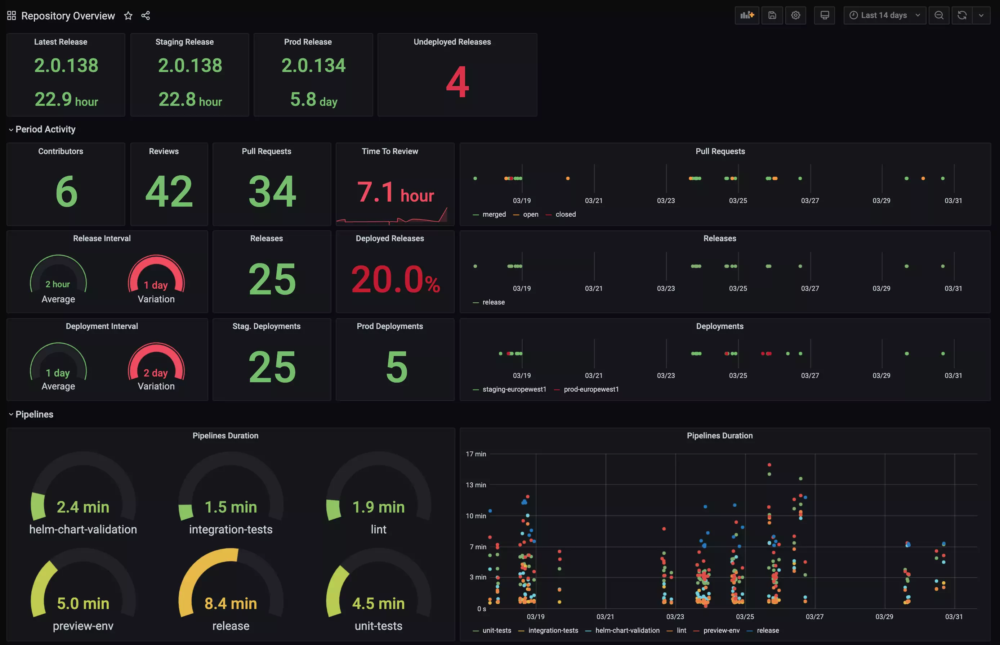

---
## Summary
The deployment pipeline offers **visibility** into build progress from **check-in to release** for **everyone involved in software delivery**.

Once a deployment pipeline is implemented, it will **reveal release process inefficiencies**. With this information, you can **optimize** your software building and release process.  <!-- .element: class="fragment fade-in-paragraph custom" -->

There is **no one-size-fits-all solution** to the complex problem of implementing a deployment pipeline.  <!-- .element: class="fragment fade-in-paragraph custom" -->

For a deployment pipeline to function, you need certain **foundations**: good **configuration management**, **automated scripts** for **building** and **deploying** your app, and **automated tests** to ensure it delivers value to users.  <!-- .element: class="fragment fade-in-paragraph custom" -->
