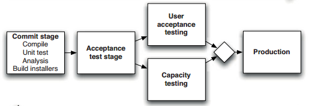
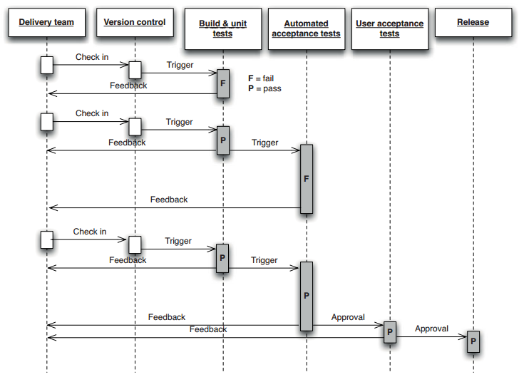
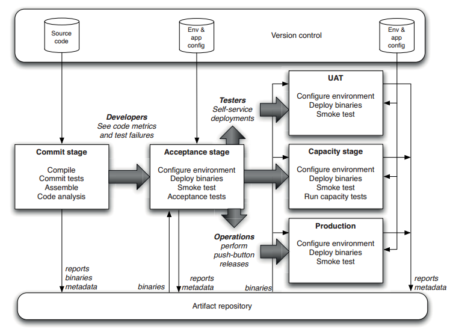
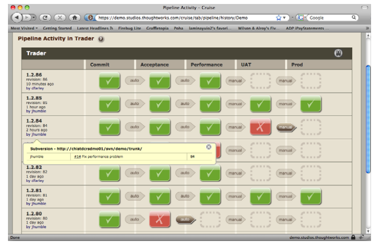
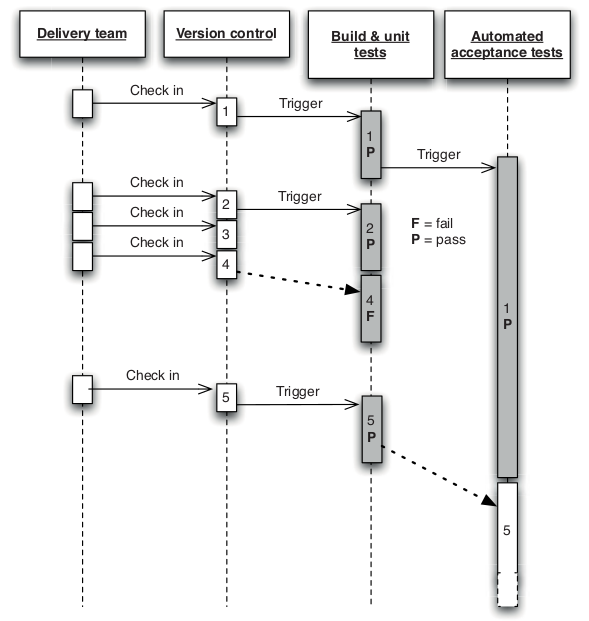
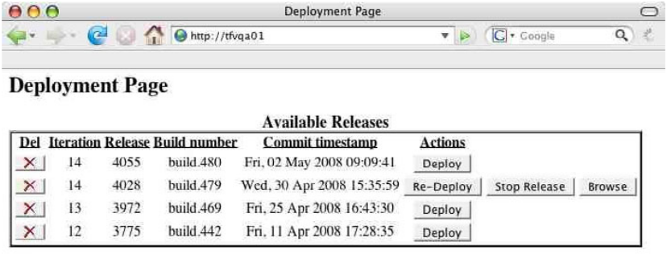
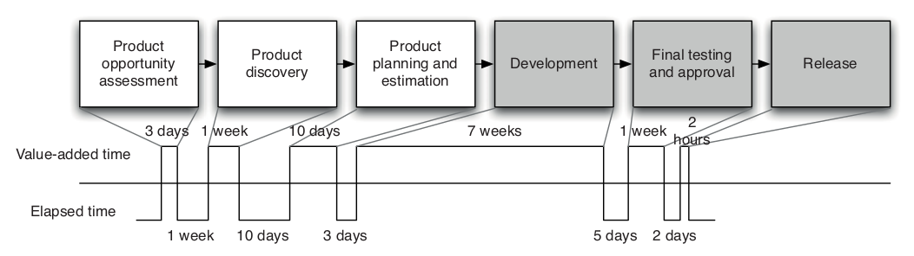
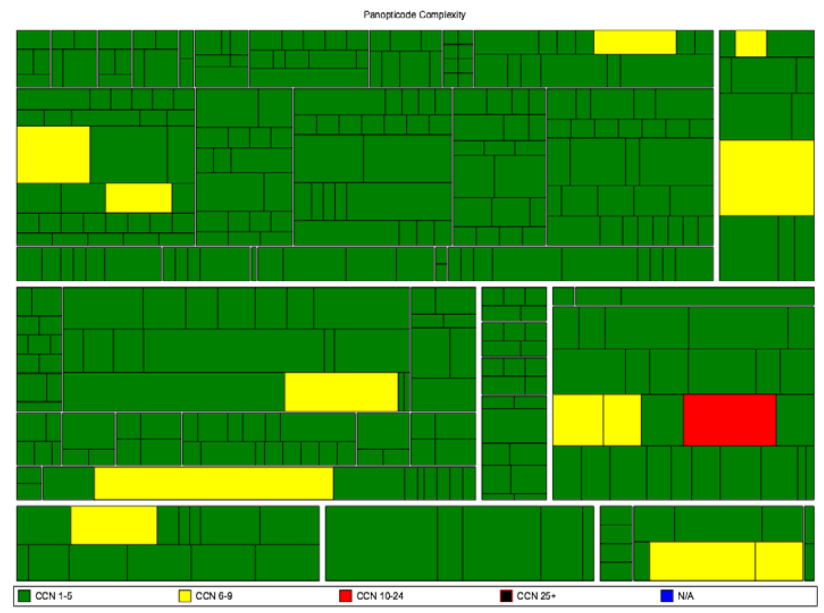

## Anatomy of Deployment Pipeline
Stages, Practices, Commit Stage, Test Stages, Release and Deployment Stages, Metrics, Adoption

<small><strong>Lecturer:</strong> Alireza Roshanzamir</small>

<small><strong>Keywords:</strong> Continuous Delivery, Continuous Integration, DevOps, Build, Test, Release, Deployment, Automation, Version Control, Deployment Pipeline</small>

<small><small> Tir 1402/August 2023</small></small>

---
## What Is a Deployment Pipeline?
At an abstract level, a deployment pipeline is an automated manifestation of your process for getting software from version control into the hands of your users. This requires collaboration between many individuals, and perhaps several teams:

Common minimal deployment pipeline (also called continuous integration pipeline or build pipeline) includes:

- Commit stage(s): Compiles, unit-level tests, code analysis. Five to ten minutes to run.
- Automated acceptance test stages: Executed in parallel to increase their speed. Typically within an hour or two.
- Manual test stages: Exploratory tests, UAT, Integration (integration between services) tests
- Release stage: Delivers the system to users, either as packaged software or by deploying it into a production or staging environment.

Note

Mention the origin of the term "Deployment Pipeline" because of the CPU pipeline architecture and parallelism and similar function between stages and guessing the next stages result.

------
### A Basic Deployment Pipeline
A typical deployment pipeline:

The testers and operations team will likely want to approve deployment to UAT or production environment:

---
## Deployment Pipeline Practices
There are some practices you should follow:
- Only Build Your Binaries Once
  - Keep the deployment pipeline efficient
  - Build upon foundations known to be sound
- Deploy the Same Way to Every Environment
  - Use the same process to deploy to every environment (developer or analyst's workstation, a testing environment, or production)
- Smoke-Test Your Deployments (Deployment Test)
  - Could be as simple as launching the application and checking to make sure that the main screen comes up with the expected content
  - Should also check that external services such as database or messaging bus or external services are running.
- Deploy into a Copy of Production
  - Ensuer that infrastructure (network, firewall, etc.), OS, application Stack, and application data are same.
- Each Change Should Propagate through the Pipeline Instantly (for Fully Automated Stages)
  - Do not use hourly builds, nightly acceptance tests, weekly capacity tests.
  - Intelligent scheduling is crucial to implementing a deployment pipeline.
  
- If Any Part of the Pipeline Fails, Stop the Line

---
## The Commit Stage
Should ideally take less than five minutes to run, and certainly no more than ten minutes. Typically includes the following steps:
- Compile the code (if necessary).
- Run a set of **commit tests** (unit-test and small selection of other tests).
- Create binaries for use by later stages.
- Perform analysis of the code to check its health.
- Prepare artifacts, such as test databases, for use by later stages.

Some code analysis and metrics:
- Test coverage (if your commit tests only cover 5% of your codebase, they're
pretty useless)
- Amount of duplicated code
- Cyclomatic complexity
- Afferent and efferent coupling
- Number of warnings
- Code style

------
### Commit Stage Best Practices
Developers are expected to wait until the commit stage of the deployment pipeline succeeds. If it fails, they should either quickly fix the problem, or back their changes out from version control.

Once passed, frees developers to move on to their next task. However, they retain a responsibility to monitor the progress of the later stages too.

---
## The Automated Acceptance Test Gate
Without running acceptance tests in a production-like environment, we know nothing about whether the application meets the customer's specifications, nor whether it can be deployed and survive in the real world. The majority of tests running during the acceptance test stage are functional acceptance tests, but **not all**‌ (similar to the commit stage tests).

Crucially, the development team must respond immediately to acceptance test breakages that occur as part of the normal development process.

------
### Automated Acceptance Test Best Practices
- Consider the environments that your application will encounter in production
  - Use a scaled-down version of it if it's complex or expensive
- You can use test doubles for any external infrastructure that you depend on
- The whole team owns the acceptance tests
  - Acceptance tests written without developer involvement also tend to be tightly coupled to the UI and thus brittle.
- Developers must be able to run automated acceptance tests on their development environments
- Acceptance tests should be expressed in the language of the business (Ubiquitous Language)
  - It is fine to write the acceptance tests in the same programming language that your team uses for development, but the abstraction should work at the level of business behavior ("place order" rather than "click order button", "confirm fund transfer" rather than "check fund_table has results").
- Don't follow a naive process of taking your acceptance criteria and blindly automating every one
  - While acceptance tests are extremely valuable, they can also be expensive to create and maintain.

---
## Subsequent [Test] Stages
If you are delivering software incrementally, it is possible to have an automated deployment to production (described as "Continuous Deployment"). But for many systems, some form of manual testing is desirable before release.

So, you need a way to authorized deployment. The key requirements are to be able to see a list of release candidates that have passed the acceptance test stage, have a button to deploy the version of your choice into the environment of your choice (UAT, exploratory, staging, production, capacity, etc.):

Two common test stages are:
- Manual Testing
  - Such as exploratory testing, usability testing, and showcases.
- Nonfunctional Testing
  - Such as capacity, security, SLAs.
  - Sometimes it makes sense to present the results at the conclusion of the capacity test stage and allow a human being to decide whether the release candidate should be promoted or not.

---
## Preparing to Release
There is a business risk associated with every release of a production system. We view the release step
as a natural outcome of our deployment pipeline:
- Have a release plan that is created and maintained by everybody involved in delivering the software, including developers and testers, as well as operations, infrastructure, and support personnel
- Minimize the effect of people making mistakes by automating as much of the process as possible
- Have the ability to back out a release if things don't go according to plan
- Have a strategy for migrating configuration and production data as part of the upgrade and rollback processes

Releasing should be as simple as choosing a version of the application to release and pressing a button. Backing out should be just as simple.

------
### Automating Deployment and Release
Production environments should be completely locked down-changes to them should only be made through automated processes. That includes not only deployment of your application, but also changes to their configuration, software stack, network topology, and state.

After you have deployed a complex system for the fiftieth or hundredth time without a hitch, you don't think about it as a big event any more. It should be possible to deploy a single change to production through the deployment pipeline with the minimum possible time and ceremony.

However, even if you don't need to release your software several times a day, the process of implementing a deployment pipeline will still make an enormous positive impact on your organization's ability to deliver software rapidly and reliably.

------
### Backing Out Changes
There are two reasons why release days are traditionally feared:
- Introducing a problem because somebody might make a hard-to-detect mistake while going through the manual steps of a software release
- Release fail, either because of a problem in the release process or a defect in the new version of the software, you are committed

Corresponding fixes:
- Rehearsing the release many times a day, proving that our automated deployment system works
- Providing a back-out strategy

Best back-out strategy is to keep the previous version of your application available while the new version is being released-and for some time afterwards. Usually, the most complex problem associated with both deploying and rolling back is migrating the production data.

The next best option is to redeploy the previous good version of your appliation from scratch.

On no account should you have a different process for backing out than you do for deploying, or perform incremental deployments or rollbacks.

------
### Building on Success
Finally, in order to deploy release candidate to production we can assert that:
- The code can compile.
- The code does what our developers think it should because it passed its unit tests.
- The system does what our analysts or users think it should because it passed all of the acceptance tests.
- Configuration of infrastructure and baseline environments is managed appropriately, because the  pplication has been tested in an analog of production.
- The code has all of the right components in place because it was deployable.
- The deployment system works because, at a minimum, it will have been used on this release candidate at least once in a development environment, once in the acceptance test stage, and once in a testing environment before the candidate could have been promoted to this stage.
- The version control system holds everything we need to deploy, without the need for manual intervention, because we have already deployed the system several times.

---
## Implementing a Deployment Pipeline
You should take an incremental approach to implementing a deployment pipeline. In general, the steps look like this:
1. Model your value stream and create a walking skeleton.
2. Automate the build and deployment process.
3. Automate unit tests and code analysis.
4. Automate acceptance tests.
5. Automate releases.

------
### Modeling Your Value Stream and Creating a Walking Skeleton
The first step is to map out the part of your value stream that goes from check-in to release:

Once you have a value stream map, you can go ahead and model your process in your continuous integration and release management tool.

Alternatively, you could start with a bare minimum: a commit stage to build your application and run basic metrics and unit tests, a stage to run acceptance tests, and a third stage to deploy your application to a production-like environment so you can demo it.

At first, you can simply use placeholders or simplest possible example (such as simple always passing test) for some stages and do nothing but waiting for the manual improval or automatically trigger the next stages.

------
### Automating the Build and Deployment Process
The build process:
- Takes source code as its input and produces binaries as output.
- The CI server should watch the version control changes and generate the binaries on the filesystem where they are accessible to the whole team. 

The next step is automating deployment:
- You need to get a machine to deploy your application on.
- Deployment may involve packaging.
- Next, the process of installing and configuring your application should be automated.
- Finally, you should write some form of automated deployment test that verifies that the application has been successfully deployed.

The next step is to be able to perform push-button deployments:
- Configure your CI server so that you can choose any build of your application and click a button to trigger a process that takes the binaries produced by that build, runs the script that deploys the build, and runs the deployment test.

Except for user-installed software, the release process should be the same process you use to deploy to a testing environment.

------
### Automating the Unit Tests and Code Analysis
The next step is to enrich the commit stage:
- Running unit-tests
- Code analysis
- A selection of acceptance and other types of tests

------
### Automating Acceptance Tests
The acceptance test phase of your pipeline can reuse the script you use to deploy to your testing environment. The acceptance test framework needs to be started up, and the reports it generates should be collected at the end of the test run for analysis. It also makes sense to store the logs created by your application. If your application has a GUI, you can also use a tool like Vnc2swf to create a screen recording as the acceptance tests are running to help you debug problems.

Acceptance tests fall into two types: functional and nonfunctional. It is essential to start testing nonfunctional parameters such as capacity and scaling characteristics from early on in any project, so that you have some idea of whether your application will meet its nonfunctional requirements. When you start off, it is perfectly possible to run acceptance tests and performance tests back-to-back as part of a single stage.

You should try and get at least one or two of each type of test you need to run automated early on
in your project's life, and incorporate them into your deployment pipeline.

------
### Evolving Your Pipeline
There are two other common potential extensions to the pipeline: components and branches. Large applications are best built as a set of components which are assembled together. In such projects, it may make sense to have a minipipeline for each component, and then a pipeline that assembles all the components and puts the entire application through acceptance tests, nonfunctional tests, and then deployment to testing, staging, and production environments.

It is important to remember three things:
1. The whole pipeline does not need to be implemented at once.
2. Your pipeline is a rich source of data on the efficiency of your process for building, deploying, testing, and releasing applications.
3. Your deployment pipeline is a living system
  - You should take care of it and refactor it the same way you work on the applications you are using it to deliver.

---
## Metrics
According to the lean philosophy, it is essential to optimize globally, not locally. If you spend a lot of time removing a bottleneck that is not actually the one constraining your delivery process, you will make no difference to the delivery process. So it is important to have a global metric that can be used to determine if the delivery process as a whole has a problem.

For the software delivery process, the most important global metric is **cycle time**. The time between deciding that a feature needs to be implemented and having that feature released to users:
  - How long would it take your organization to deploy a change that involves just one single line of code? Do you do this on a repeatable, reliable basis?
Other metrics such as "Number of defects" are not good as primary metrics.

------
### Reducing Cycle Time
Once you know the cycle time for your application, you can work out how best to reduce it (using the Theory of Constraints):
1. Identify the limiting constraint on your system.
2. Exploit the constraint. This means ensuring that you should maximize the throughput of that part of the process.
3. Subordinate all other processes to the constraint. This implies that other resources will not work at 100%.
4. Elevate the constraint. If your cycle time is still too long (in other words, steps 2 and 3 haven't helped enough), you need to increase the resources available.
5. Rinse and repeat. Find the next constraint on your system and go back to step 1.

Note

Give the "Manual Testing" as an example for reducing cycle time:
<ol>
  <li>This is the part of your build, test, deploy, and release process that is the bottleneck. To pick an example at random, perhaps it's the manual testing process.</li>
  <li>In our example (manual testing), you would make sure that there is always a buffer of stories waiting to be manually tested, and ensure that the resources involved in manual testing don't get used for anything else.</li>
  <li>Instead, have your developers work just hard enough to keep the backlog constant and spend the rest of their time writing automated tests to catch bugs so that less time needs to be spent testing manually.</li>
  <li>Hire more testers, or perhaps invest more effort in automated testing.</li>
</ol>

------
### Other Metrics
Some other diagnostics that can warn you of problems:

- Automated test coverage
- Properties of the codebase such as the amount of duplication, cyclomatic complexity, efferent and afferent coupling, style problems, and so on
- Number of defects
- Velocity, the rate at which your team delivers working, tested, ready for use code
- Number of commits to the version control system per day
- Number of builds per day
- Number of build failures per day
- Duration of build, including automated tests

Each team's continuous integration server should generate these reports and visualizations on each check-in, and store the reports in your artifact repository. hese results should be published on an internal website-have a page for each project. Finally, aggregate them together so that they can be monitored across all of the projects in your development program, or even your whole organization.

---
### Summary
The purpose of the deployment pipeline is to give everyone involved in delivering software visibility into the progress of builds from check-in to release.

Once you have a deployment pipeline implemented, inefficiencies in your release process will become obvious. Once you have required information, you can work to optimize your process for building and releasing software.

There is no one-size-fits-all solution to the complex problem of implementing a deployment pipeline.

A deployment pipeline, in turn, depends on having some foundations in place: good configuration management, automated scripts for building and deploying your application, and automated tests to prove that your application will deliver value to its users.
