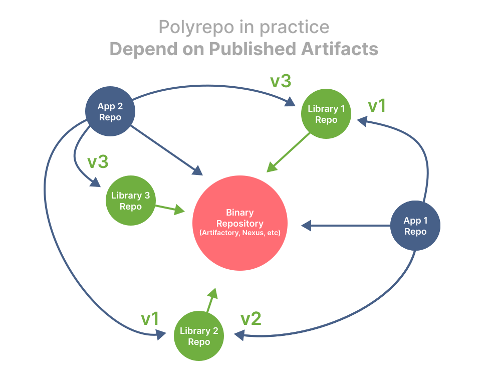
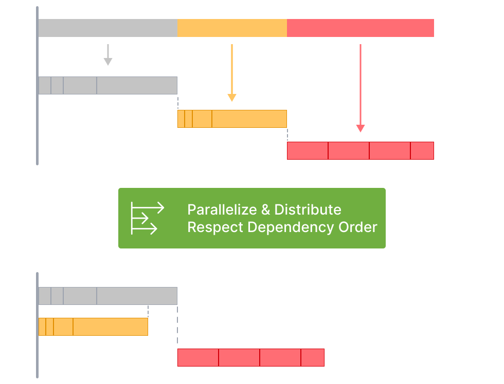
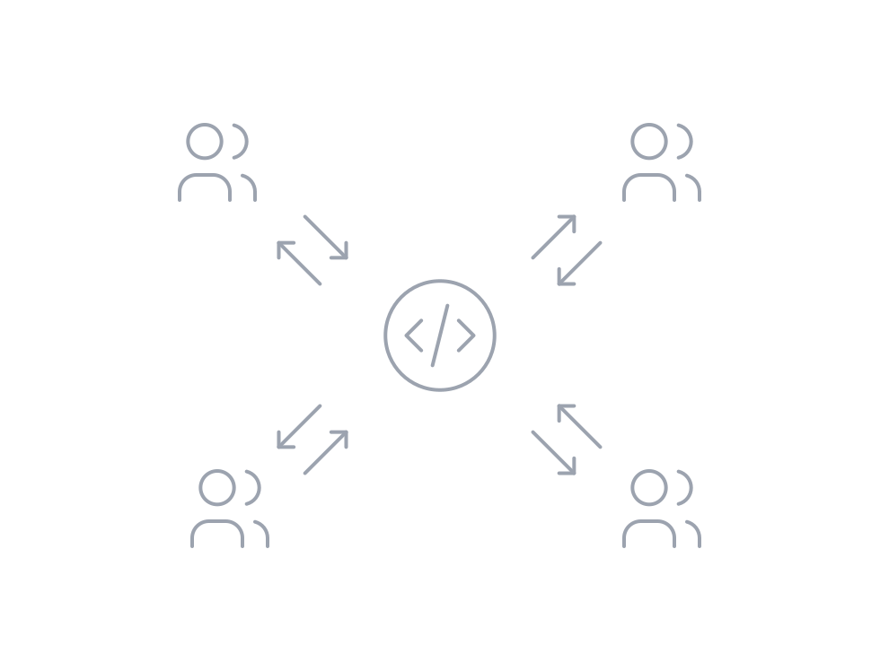

## Continuous Delivery: Build and Deployment Scripting
#### Build Tools, <span style="color: blue">Monorepo vs Polyrepo</span>, Principles and Practices, <span style="color: blue">Package Managers</span>, <span style="color: blue">Code Generation</span>, <span style="color: blue">Sample Project Structure</span>, Deployment Scripting, Tips and Tricks, <span style="color: blue">Infrastructure as Code</span>


<small><strong>Lecturer:</strong> Alireza Roshanzamir</small>

<small><strong>Keywords:</strong> Continuous Delivery, Continuous Integration, DevOps, Build, Test, Release, Deployment, Automation, Version Control, Deployment Pipeline</small>

<small><small> Tir 1402/August 2023</small></small>

---
## Introduction
It is vital to script building, testing, and packaging applications when working on large or distributed teams (including open source projects), since otherwise, it can take days to get a new team member up and running.

Every modern platform has a way to run the build from the command line. Rails projects can run the default Rake task; .NET projects can use MsBuild; Java projects (if set up correctly) can use Ant, Maven, Buildr, or Gradle; and with CMake or SCons, not much is required to get a simple C/C++ project going. Just have your CI server run this command to create binaries and run tests.

However, once your project gets more complex-you have multiple components, or unusual packaging needs-you'll need to roll up your
sleeves and dive into build scripting.

Deploying software into testing and production environments is rarely as simple as dropping a single binary file and requires a series of steps such as configuring your application, initializing data, configuring the infrastructure, operating systems, and middleware, setting up mock external systems, and so on.

This session aims to give you an overview of the principles common to all build and deployment tools, information to get you going, some tips and tricks, and pointers to more information.

---
## An Overview of Build Tools
All build tools have a common core: They allow you to model a dependency network:


Build tool types:
- Task-oriented
  - Describe the dependency network in terms of a set of tasks
  - Such as Ant, NAnt, MSBuild
  - Keep no state between builds, so, less powerful and entirely unsuitable for compiling C++
  - Work fine for languages such as C# since the compilers for these languages have built-in logic for performing incremental builds
- Product-oriented
  - Describe things in terms of the products they generate
  - Such as Make (also supports _phony targets_ such as clean, install, and test), Bazel, Pants, and Buck (these three are almost mixed).
  - Keep their state in the form of timestamps on the files generated by each of the tasks
- Mixed
  - Such as Rake

<details>
<summary>Note</summary>
Mention the _cookie targets_ in Make.
</details>

------
### An Overview of Build Tools: Make
Powerful product-oriented build tool capable of tracking dependencies within a build and building only those components that are affected by a particular change.

But, it's hard to debug complex Makefiles. A common convention adopted by teams working on large codebases is to create a Makefile for each directory, and have a top-level Makefile that recursively runs the Makefiles in each subdirectory:


which is [considered harmful](https://accu.org/journals/overload/14/71/miller_2004/).

Some other drawbacks:
- OS specific (it depends on the shell)
- Whitespace can be significant under certain circumstances
- Doesn't provide for extensions to the core system

------
### An Overview of Build Tools: Ant
The runtime components of Ant are written in Java, but the Ant scripts are an external DSL written in XML. This combination gives Ant powerful cross-platform capabilities.

Some shortcomings:
- XML is neither succinct nor pleasant for humans to read.
- There are no real domain concepts over and above a task.
- You cannot easily ask questions about Ant tasks, such as "How many tests ran?" and "How long did they take?".
- While supports reuse through the import and macrodef tasks, these are poorly understood by novice users.

As a result of these limitations, Ant files tend to be long and poorly factored-it is not unusual for Ant files to be thousands of lines long.

------
### An Overview of Build Tools: NAnt and MSBuild
NAnt uses essentially the same syntax as Ant, with only a few differences. Microsoft later introduced its minor variation on NAnt and called it MSBuild which is more tightly integrated into Visual Studio, understanding how to build Visual Studio solutions and projects and
how to manage dependencies.

------
### An Overview of Build Tools: Maven
Maven attempts to remove a large amount of boilerplate found in Ant files by having a more complex domain that makes many assumptions about the way your Java project is laid out. This principle of favoring convention over configuration means that, so long as your project conforms to the structure dictated by Maven, it will perform almost any build, deploy, test, and release task you can imagine with a single command, without having to write more than a few lines of XML:


Some shortcomings:
- If your project doesn't conform to Maven's assumptions about structure and lifecycle, it can be hard to make Maven do what you want (this could be considered a feature).
- To extend it, you need to write code. However, it has plugins for almost everything you'd want to do.

------
### An Overview of Build Tools: Rake
The dominant Ruby build tool, Rake, came about as an experiment to see if Make's functionality could be easily reproduced by creating an **internal DSL** in Ruby. Rake has no understanding of anything except tasks and dependencies. However, since Rake scripts are plain Ruby, you can use Ruby's API to carry out whatever tasks you want. You have all the native power of a general-purpose programming language at your disposal.

You can refactor and modularize your builds, and you can use your regular development environment. It is straightforward to debug Rake using the standard Ruby debugger.

Some disadvantages:
- You have to ensure that a decent runtime is available on your platform
- you have to interact with RubyGems

------
### An Overview of Build Tools: Buildr
The new generation of build tools, such as Buildr, Gradle, and Gantt, have taken the approach of using real programming languages for build scripts.

Buildr is built on top of Rake, so everything you can do in Rake you can continue to do in Buildr. However, Buildr is also a drop-in replacement for Maven-it uses the same conventions that Maven does, including filesystem layout, artifact specifications, and repositories. It also lets you use Ant tasks (including any custom ones) with zero configuration.

If you're starting a new Java project, or looking for a replacement for Ant or Maven, we strongly suggest you consider Buildr, or Gradle if you prefer your DSLs in Groovy.

------
### An Overview of Build Tools: Psake
Psake is an internal DSL written in PowerShell, which provides task-oriented dependency networks.

------
### An Overview of Build Tools: Bazel (Google), Buck (Facebook), Pants (Twitter)
Three of the most popular Monorepo tools and declarative build systems. Three common concepts are:
- **Goals and Commands:** build, test, lint, check, fmt, export, run, audit, clean, coverage, ...
- **Rules, Targets, and BUILD files:** cc_library, python_source, java_source, docker_image, java_library, protobuf_source, ...

```console
$ ./pants test ::
```

```console
$ ./pants test example:tests@interpreter_constraints=py2
```

```BUILD
# BUILD file

python_test(
  name="tests",
  source="tests.py",
  interpreter_constraints=parametrize(py2=["==2.7.*"], py3=[">=3.6"]),
)
```

They support **multiple programming languages**, **incremental builds**, **heavy and distributed caching**, **parallelization**, **code generation**, **dependency management and visualization**.

---
## Monorepo (Reference: <a href="https://monorepo.tools/">monorepo.tools</a>)
A monorepo is a single repository containing multiple distinct projects, with well-defined relationships:


------
### Monorepo != Monolith
A good monorepo is the opposite of monolithic:


------
### Polyrepo
A polyrepo is the current standard way of developing applications: a repo for each team, application, or project. And it's common that each repo has a single build artifact, and simple build pipeline:



The industry has moved to the polyrepo way of doing things for one big reason: **team autonomy**.

------
### Repository Management and Software Structure Organization Spectrums


------
### Polyrepo Drawbacks
- Cumbersome code sharing

  To share code across repositories, you'd likely create a repository for the shared code (CI, tooling, dependency, versioning, ...).
- Significant code duplication

  No one wants to go through the hassle of setting up a shared repo, so teams just write their own implementations of common services and components in each repo.
- Costly cross-repo changes to shared libraries and consumers
- Inconsistent tooling

  Each project uses its own set of commands for running tests, building, serving, linting, deploying, and so forth.

------
### Monorepo Benefits
- No overhead to create new projects
- Atomic commits across projects
- One version of everything
- Developer mobility
  Developers can confidently contribute to other teams’ applications and verify that their changes are safe.

It is more than code & tools. A monorepo changes your organization and the way you think about code. By adding consistency, lowering the friction in creating new projects and performing large scale refactorings, by facilitating code sharing and cross-team collaboration, it'll allow your organization to work more efficiently.

------
### Monorepo Tools
As your workspace grows, the tools have to help you keep it fast, understandable and manageable:


------
### Monorepo Tools Features: Fast

<table>
  <tr>
    <td>
      Local computation caching
      <br>
      
    </td>
    <td>
      Local task orchestration
      <br>
      
    </td>
    <td>
      Distributed computation caching
      <br>
      
    </td>
  </tr>
  <tr class="simple">
    <td>
      Distributed task execution
      <br>
      
    </td>
    <td>
      Detecting affected projects/packages
      <br>
      
    </td>
    <td>Transparent remote execution</td>
  </tr>
</table>

------
### Monorepo Tools Features: Understandable

<table>
  <tr>
    <td>
      Workspace analysis
      <br>
      
    </td>
    <td>
      Dependency graph visualization
      <br>
      
    </td>
  </tr>
</table>

------
### Monorepo Tools Features: Managable

<table>
  <tr>
    <td>
      Source code sharing
      <br>
      
    </td>
    <td>
      Consistent tooling
      <br>
      
    </td>
  </tr>
  <tr class="simple">
    <td>
      Code generation
      <br>
      
    </td>
    <td>
      Project constraints and visibility
      <br>
      
    </td>
  </tr>
</table>

---
## Principles and Practices
Some general principles and practices of build and deployment scripting should apply to whichever technology you use:
- Create a Script for Each Stage in Your Deployment Pipeline
  - Do not have a single script for whole deployment pipeline
- Use an Appropriate Technology to Deploy Your Application
  - Use the right tool for the job when automating deployment, not a general-purpose scripting language. For example, for WebSphere Application Server, you can use the Wsadmin tool.
- Use the Same Scripts to Deploy to Every Environment
  - If your application is complex in terms of its deployment architecture, you will have to make some simplifications to get it working on developer machines.
- Use Your Operating System's Packaging Tools [forDeployment]
  - For example, Debian and Ubuntu both use the Debian package system; RedHat, SuSE, and many other flavors of Linux use the RedHat package system; Windows users can use the Microsoft Installer system, and so forth.
  - Commercial middleware servers, for example, often require special tools to perform deployments. In this case, a hybrid approach is necessary.
  - You can also use platform-specific packaging systems, such as Ruby Gems, Python Eggs/Wheels, Perl's CPAN, and so on, to distribute your application, but they are designed by and for developers, not system administrators.
- Ensure the Deployment Process Is Idempotent
  - Leave the target environment in the same (correct) state, regardless of the state it finds it in when starting a deployment.
  - If you cannot do this, validate the assumptions your deployment process makes about the environment, and fail the deployment if they are not met.
  - Tools such as Puppet analyzes the configuration of the target environment and makes only the necessary changes to bring it in sync with the declarative specification of the desired state of the environment
- Evolve Your Deployment System Incrementally
  - You don't have to have completed all of the steps at once. The first time you write a script to deploy the application in a local development environment and share it with the team, you have saved lots of work for individual developers.
  - Then, move on to refining these scripts so they can be used in the acceptance test environment to deploy and run the application so that the tests can be run.

---
## Package Managers
A package manager or package-management system is a collection of software tools that automates the process of installing, upgrading, configuring, and removing computer programs for a computer in a consistent manner.


------
### Language Specific and Language Agnostic Package Managers
Some language specific and language agnostic package managers:


Language agnositc package manager doesn't result language agnostic package

------
### Source Distribution (sdist) vs Built Distribution (bdist)

<table>
  <tr>
    <td></td>
    <td></td>
  </tr>
</table>

You may need different systems for generating built distributions.

------
### Package Dependency Inclusion Level

<table>
  <tr>
    <td>
      
    </td>
    <td>
      
    </td>
  </tr>
  <tr class="simple">
    <td colspan="2">
      Python Package Management Options and Comparison
      <br>
      
    </td>
  </tr>
</table>

------
### Virtual Environment and Local Packages Directory

<table>
  <tr>
    <td></td>
  </tr>
  <tr class="simple">
    <td></td>
  </tr>
</table>

<details>
  <summary>Note:</summary>
  Mention the following clues:
  <ul>
    <li>Use "distribution package" instead of "package" when searching</li>
    <li>Dependency pinning (presented in detail in the next sessions)</li>
    <li>Single project multiple versions of a library support</li>
  </ul>
</details>

---
## Sample Project Structure: JVM-Based/Maven

<table>
  <tr>
    <td></td>
    <td></td>
  </tr>
</table>

------
## Sample Project Structure: Pants

<pre style="font-size: 16px">
[project-name]/
  src/                 You can create a directory for each programming language.
    [project-name]/
  tests/
  examples/
    [example1-name]/
    [example2-name]/
    [example3-name]
    run.py
    BUILD
  docs/
    ...
    index.rst
    release.py
    build.py
    doctests.py
    enrich.py
    BUILD
  pants_plugins/
  dist/
  .azuredevops/
    pull_request_template/
      develop.md
      master.md
  .githooks/
    pre-commit
  .jenkins/
    ci.Jenkinsfile
  CHANGELOG.md
  CHANGELOG-fa.md
  requirements.txt
  requirements.lock
  BUILD
  pants.toml
  pyproject.toml
  pants*
</pre>

<details>
  <summary>Note:</summary>
  <ul>
    <li>Put things together that change together.</li>
  </ul>
</details>

------
## Sample Project Structure: JVM-Based/Maven

<pre style="font-size: 20px">
[project-name]/
  common/
    terraform/
    service-parent-pom.xml
    service.Dockerfile
  libraries/
    library-1/
      src/            You can put the unit-test files next to the source files.
      pom.xml
      README.md
    library-2/
    library-3/
  services/
    service-1/
      src/
      terraform/
      pom.xml
      README.md
    service-2/
  terraform/
  tests/
    end-to-end/
    performance/
  Jenkinsfile
  README.md
</pre>

---
## Deployment Scripting
Changes to testing and production environments should only be made through an automated process.

In addition to the previous mentioned notes, the following should be considered:
- Deploying and Testing Layers
  - You should always strive to build on foundations that are known to be good. Before we even bother to copy our binary deliverables to the correct place in the filesystem, we want to know that our environment is ready for us in these layers:
    
- Testing Your Environment's Configuration
  - The objective is to provide a degree of confidence that the layer that has just been deployed is working:
    

<details>
<summary>Note</summary>
Mention the "Smoke-Testing N-Tier Architecture" through simple HTTP requests and displaying the results.
</details>

---
## Tips and Tricks
- Always Use Relative Paths
  - Absolute paths create a tight dependency between the configuration of a specific machine and your build process.
  - Try to minimize absolute paths by making all of the paths in your system relative to one or more well-defined root paths-the deployment root, the configuration root, and so on-and overriding just these roots.
- Eliminate Manual Steps
  - For many organizations, a "build script" is a printed document with a series of instructions like:

    ```
    ...
    STEP 14. Copy all the dlls from the CDROM directory E:\web_server\dlls\ into   the   new
    virtual directory
    STEP 15. Open a command prompt and type: regsvr webserver_main.dll
    STEP 16. Open the Microsoft IIS Management console and click Create New   Application
    ...
    ```
  - "When you have to do it a second time." The third time you do something, it should be done using an automated process.
- Build In Traceability from Binaries to Version Control
  - Some packages such a JAR files can include metadata.
  - You can use simple MD5 hashing.
- Don't Check Binaries into Version Control as Part of Your Build
  - The rule of thumb is not to check in anything created as part of your build, test, and deploy cycle into source control.
- Test Targets Should Not Fail the Build
  - Make the failure set a flag but fail the build later, after generating more useful reports or running a more complete set of tests.
- Constrain Your Application with Integrated Smoke Tests
  - Make sure the deployed version validates its configuration when it is installed.

---
## Infrastructure as Code (IaC)
Infrastructure as Code is the managing and provisioning of infrastructure through code instead of through manual processes.

IaC aids configuration management and helps you to avoid undocumented, ad-hoc configuration changes.

There are 2 ways to approach IaC:
- Declarative: Keeps a list of the current state of your system objects, which makes taking down the infrastructure simpler to manage.
- Imperative: Defines the specific commands needed to achieve the desired configuration, and those commands then need to be executed in the correct order.

These are a few popular choices:
- Chef
- Puppet
- Red Hat Ansible Automation Platform
- Saltstack
- Terraform 
- AWS CloudFormation

------
### Ansible
Ansible is agentless, which means the nodes it manages do not require any software to be installed on them:

<table>
  <tr>
    <td>
      
    </td>
    <td>
      
    </td>
    <td>
      
    </td>
  </tr>
</table>

Ansible can be both declarative and procedural-many modules work declaratively, while other modules prefer a procedural programming approach.

------
### Terraform
Terraform is an agentless infrastructure as code tool that enables you to safely and predictably provision and manage infrastructure in any cloud:

<table>
  <tr>
    <td></td>
    <td></td>
  </tr>
</table>

---
## Summary
Grow your automated build and deployment capabilities step by step, working through the deployment pipeline by iteratively identifying and then automating the most painful steps.

Involve both operations and developers in the creation of the mechanisms.

We use the term "script" in quite a broad sense. Generally, by this we mean all
the automation that helps us build, test, deploy, and release our software.

Scripts are first-class parts of your system. They should be version-controlled, maintained, tested, and refactored, and be the only mechanism that you use to deploy your software.

Spend some time, think about the goals you want to achieve, and design your build and deployment process to attain them.
