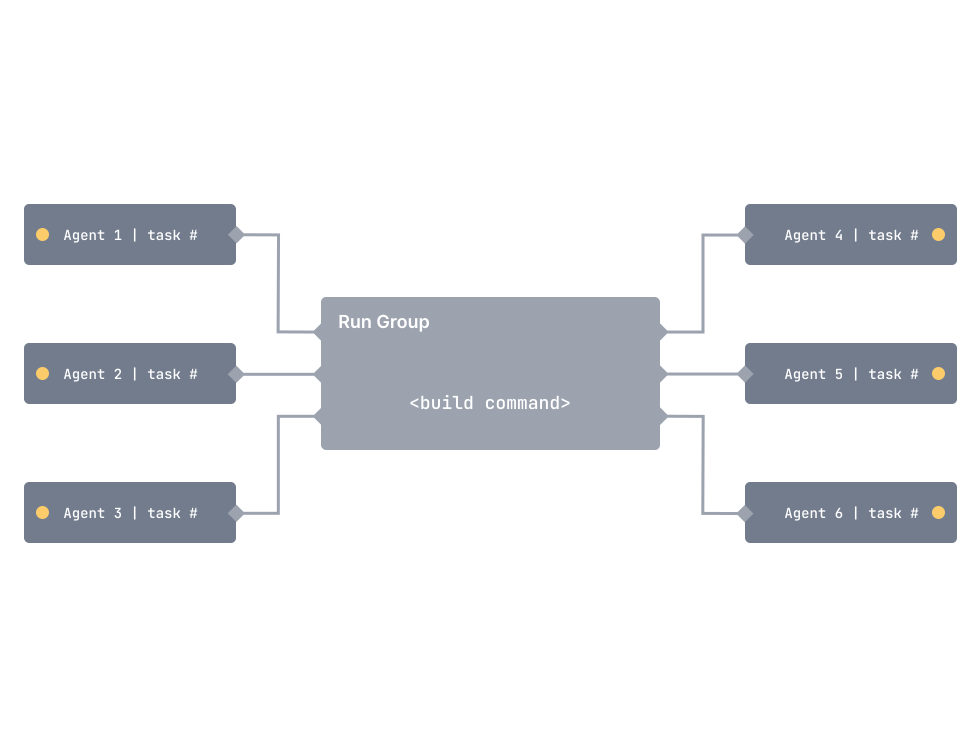
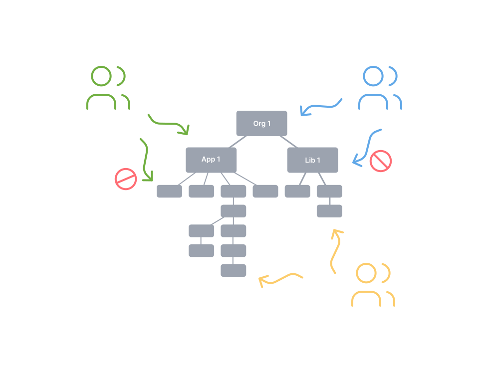
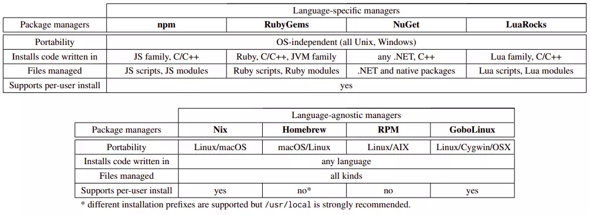

## Continuous Delivery: Build and Deployment Scripting
#### Build Tools, <span style="color: brown">Monorepo vs Polyrepo</span>, Principles and Practices, <span style="color: brown">Package Managers</span>, <span style="color: brown">Code Generation</span>, <span style="color: brown">Sample Project Structure</span>, Deployment Scripting, Tips and Tricks, <span style="color: brown">Infrastructure as Code</span>


<small><strong>Time to Read:</strong> 16 Minutes</small>, <small><strong>Time to Present:</strong> 90 Minutes</small>
<br>
<small><strong>Created By:</strong> Alireza Roshanzamir</small>
<br>
<small><strong>Keywords:</strong> Continuous Delivery, Continuous Integration, DevOps, Build, Test, Release, Deployment, Automation, Version Control, Deployment Pipeline</small>
<br><br>
<small style="color: darkred"><small>Press **"F"** to go fullscreen; some slides may not display properly otherwise.</small></small>

---
## Introduction
**Scripting building**, **testing**, and **packaging** is essential for large or distributed teams to quickly onboard new members.

Modern platforms offer **command-line build options**. Rails uses **Rake**, .NET relies on **MSBuild**, and Java has **Ant, Maven, Buildr, or Gradle**. C/C++ projects benefit from **CMake** or **SCons**. Just have your CI server run these commands to build and test.  <!-- .element: class="fragment fade-in-paragraph custom" -->

As your project becomes more complex with **multiple components** or **unusual packaging** needs, you'll need to delve into build scripting.  <!-- .element: class="fragment fade-in-paragraph custom" -->

**Deploying software** to testing and production environments **isn't as simple as dropping a binary file**. It involves **configuring** your application, **initializing data**, setting up **infrastructure**, and more, including **mock external systems**.  <!-- .element: class="fragment fade-in-paragraph custom" -->

---
## An Overview of Build Tools


Build tools have a common core: **modeling dependencies**:  <!-- .element class="fragment fade-in-with-next custom" -->


------
### Continued: An Overview of Build Tools
Build tool types:
- <!-- .element class="fragment highlight-current-blue" --> Task-oriented
  - Explain the dependency network using a set of tasks
  - Examples: Ant, NAnt, MSBuild
  - Don't retain state between builds, making it unsuitable for C++ compilation
  - Work well with languages like C# because their compilers have built-in logic for incremental builds.
- <!-- .element class="fragment highlight-current-blue" --> Product-oriented
  - Explain things based on the products they generate
  - Examples: Make (also supports _phony targets_ like install), Bazel, Pants, and Buck (these three are almost mixed)
  - Maintain their state using timestamps on the generated files from each task.
- <!-- .element class="fragment highlight-current-blue" --> Mixed
  - Such as Rake

<details>
<summary>Note</summary>
Mention the _cookie targets_ in Make.
</details>

------
### An Overview of Build Tools: Make
A strong, **product-oriented** build tool that tracks dependencies and **only builds affected components**.

But, **it's hard to debug** complex Makefiles. In larger codebases, teams often create a Makefile for each directory and use a top-level Makefile to run them **recursively**, a practice that's [considered problematic](https://accu.org/journals/overload/14/71/miller_2004/): <!-- .element: class="fragment fade-in-parent-with-next custom" -->
<table>
  <tr>
    <td></td>
    <td></td>
  </tr>
</table>

Some other drawbacks:  <!-- .element: class="fragment fade-in-with-next custom" -->
- OS specific (it depends on the shell)
- Whitespace can be important in some cases
- Doesn't support extensions


------
### An Overview of Build Tools: Ant
Ant's core is in Java, while its scripts are an **external DSL in XML**. This mix provides Ant with robust **cross-platform** capabilities:


Some shortcomings:  <!-- .element: class="fragment fade-in-with-next custom" -->
- **XML** is **not concise** or **enjoyable** for humans to read.  <!-- .element class="fragment highlight-current-blue-parent custom" -->
- There are **no real domain concepts** beyond tasks.  <!-- .element class="fragment highlight-current-blue-parent custom" -->
- You can't easily respond to questions like **"How many tests ran?"** or **"How long did they take?"**.  <!-- .element class="fragment highlight-current-blue-parent custom" -->
- Import and macrodef tasks support reuse but may be **confusing for novices**.  <!-- .element class="fragment highlight-current-blue-parent custom" -->

Ant files can become very long and disorganized due to these limitations, sometimes extending to **thousands of lines**.  <!-- .element: class="fragment fade-in-paragraph custom" -->

------
### An Overview of Build Tools: NAnt and MSBuild
**NAnt** and **Ant** have a **similar syntax**, with only a few differences. **Microsoft** later introduced a variant called **MSBuild**, tightly **integrated into Visual Studio**, specializing in building **solutions**, handling dependencies, and managing projects:


------
### An Overview of Build Tools: Maven


Maven simplifies Ant files by **assuming certain Java project layouts**. By favoring **"convention over configuration"**, it can handle various tasks like **build**, **deploy**, **test**, and **release** with just **one command**, often needing minimal XML configuration:  <!-- .element: class="fragment fade-in-parent-with-next custom" -->
<table>
  <tr>
    <td></td>
    <td></td>
  </tr>
</table>

Some shortcomings:  <!-- .element: class="fragment fade-in-with-next custom" -->
- Projects **not following Maven's assumptions** can make achieving desired results **tricky**, **seen as a feature** by some.  <!-- .element class="fragment highlight-current-blue-parent custom" -->
- To extend it, **coding is necessary**, but it **offers plugins** for nearly every desired functionality.  <!-- .element class="fragment highlight-current-blue-parent custom" -->

------
### An Overview of Build Tools: Rake
Rake, the **main Ruby build tool**, started as an experiment to **mimic Make** using an **internal Ruby DSL**. It handles **tasks** and **dependencies**. Since the scripts are standard Ruby code, you can use it's versatility as a **general-purpose programming language**:
<table>
  <tr>
    <td></td>
    <td></td>
  </tr>
</table>

You can **refactor** and **modularize** builds in your regular development environment. Debugging is easy with the **standard Ruby debugger**.  <!-- .element: class="fragment fade-in-paragraph custom" -->

Some disadvantages:  <!-- .element: class="fragment fade-in-with-next custom" -->
- You need to ensure a suitable runtime is available on your platform
- You have to interact with RubyGems

------
### An Overview of Build Tools: Buildr, Gradle
New-gen build tools like Buildr, Gradle, and Gantt use **real programming languages** for build scripts.

Buildr is **based on Rake**, so anything you can do in Rake, you can do in Buildr. Moreover, Buildr seamlessly **replaces Maven**, sharing the **same conventions like filesystem layout**, **artifact specs**, and **repositories**. You can also **use Ant tasks**, with no setup needed.  <!-- .element: class="fragment fade-in-paragraph custom" -->

Gradle was designed for **multi-project builds**, often **large in scale**. It relies on a series of build **tasks** that can run **serially** or in **parallel**. It also supports incremental builds:  <!-- .element: class="fragment fade-in-parent-with-next custom" -->


If you're starting **a new Java project** or seeking an **alternative to Ant or Maven**, consider **Gradle** or Buildr with **DSLs in Groovy**.  <!-- .element: class="fragment fade-in-paragraph custom" -->

------
### An Overview of Build Tools: Psake
Psake is an **internal DSL** written in **PowerShell**, which provides **task-oriented** dependency networks:


------
### An Overview of Build Tools: Bazel (Google), Buck (Facebook), Pants (Twitter)
Three of the most popular **Monorepo tools** and **declarative build systems**.

Common concepts are:
- **Goals and Commands:** build, test, lint, check, fmt, export, run, audit, clean, coverage, ...
- **Rules, Targets:** cc_library, python_source, java_source, docker_image, java_library, protobuf_source, ...
- **BUILD files**

```console
$ ./pants test ::
```

```console
$ ./pants test example:tests@interpreter_constraints=py2
```

```BUILD
# BUILD file

python_test(
  name="tests",
  source="tests.py",
  interpreter_constraints=parametrize(py2=["==2.7.*"], py3=[">=3.6"]),
)
```

They support **multiple programming languages**, **incremental builds**, **heavy and distributed caching**, **parallelization**, **code generation**, **dependency management and visualization**.  <!-- .element: class="fragment fade-in-paragraph custom" -->

---
## Monorepo (Reference: <a href="https://monorepo.tools/">monorepo.tools</a>)
A monorepo is a **single repository** containing **multiple distinct projects**, with **well-defined relationships**:


------
### Monorepo != Monolith
A good monorepo is the opposite of monolithic:


------
### Polyrepo
A polyrepo is the current standard way of developing applications: **one repo per team, app, or project**. Typically, each repo has a **single build artifact** and a **simple build pipeline**.


The industry has moved to the polyrepo way of doing things for one big reason: **team autonomy**.

------
### Repository Management and Software Structure Organization Spectrums


------
### Polyrepo Drawbacks
- <!-- .element class="fragment highlight-current-blue" --> Cumbersome code sharing
  - To share code across repos, you'd likely create a repo for shared code (CI, tools, dependencies, versioning, etc.).
- <!-- .element class="fragment highlight-current-blue" --> Significant code duplication
  - Teams avoid the trouble of setting up a shared repo, creating their own versions of common services and components in each repo.
- Costly cross-repo changes to shared libraries and consumers  <!-- .element class="fragment highlight-current-blue" -->
- <!-- .element class="fragment highlight-current-blue" --> Inconsistent tooling
  - Each project uses its own set of commands for running tests, building, serving, linting, deploying, and so forth.

------
### Monorepo Benefits
- No overhead to create new projects  <!-- .element class="fragment highlight-current-blue" -->
- Atomic commits across projects  <!-- .element class="fragment highlight-current-blue" -->
- One version of everything  <!-- .element class="fragment highlight-current-blue" -->
- <!-- .element class="fragment highlight-current-blue" --> Developer mobility
  - Developers can confidently contribute to other teams' applications and verify that their changes are safe.

It is **more than code & tools**. It changes your **organization** and the **way you think about code**. By adding **consistency**, **lowering the friction in creating new projects** and performing **large scale refactorings**, by facilitating **code sharing** and **cross-team collaboration**, it enhances your organization's **efficiency**.  <!-- .element: class="fragment fade-in-paragraph custom" -->

------
### Monorepo Tools
As your **workspace grows**, the tools have to help you keep it **fast**, **understandable** and **manageable**:


------
### Monorepo Tools Features: Fast
<table>
  <tr>
    <td>
      Local computation caching
      <br>
      
    </td>
    <td>
      Local task orchestration
      <br>
      
    </td>
    <td>
      Distributed computation caching
      <br>
      
    </td>
  </tr>
  <tr class="simple">
    <td>
      Distributed task execution
      <br>
      
    </td>
    <td>
      Detecting affected projects/packages
      <br>
      
    </td>
    <td>Transparent remote execution</td>
  </tr>
</table>

------
### Monorepo Tools Features: Understandable

<table>
  <tr>
    <td>
      Workspace analysis
      <br>
      
    </td>
    <td>
      Dependency graph visualization
      <br>
      
    </td>
  </tr>
</table>

------
### Monorepo Tools Features: Managable

<table>
  <tr>
    <td>
      Source code sharing
      <br>
      
    </td>
    <td>
      Consistent tooling
      <br>
      
    </td>
  </tr>
  <tr class="simple">
    <td>
      Code generation
      <br>
      
    </td>
    <td>
      Project constraints and visibility
      <br>
      
    </td>
  </tr>
</table>

------
### Monorepo Drawbacks
- Weak Multiple Languages Support  <!-- .element: class="fragment insides-fade-in-then-out" -->
  - The ideal monorepo tool for one programming language may not be suitable for others.  <!-- .element: class="fragment fade-in-then-semi-out" -->
  - But, most monorepo tools support internal and external plugins.  <!-- .element: class="fragment fade-in-then-semi-out" -->
  - Git submodules can be an option for managing multiple languages in a monorepo.  <!-- .element: class="fragment fade-in-then-semi-out" -->
- VCS Tooling Challenges  <!-- .element: class="fragment insides-fade-in-then-out" -->
  - The complexity and size of the codebase, which makes it difficult to understand, search, scale, and maintain.  <!-- .element: class="fragment fade-in-then-semi-out" -->
  - Microsoft has released a Virtual File System (VFS) for Git to help manage the overload.  <!-- .element: class="fragment fade-in-then-semi-out" -->
- Limitations Around Access Control  <!-- .element: class="fragment insides-fade-in-then-out" -->
  - Your company may not want every engineer to have access to the entire codebase.  <!-- .element: class="fragment fade-in-then-semi-out" -->
  - GitHub and GitLab support CODEOWNERS file to define which team owns subdirectories in the repository.  <!-- .element: class="fragment fade-in-then-semi-out" -->
- Heavy Build Pipelines  <!-- .element: class="fragment insides-fade-in-then-out" -->
  - Many CI tools offer conditional stages based on directory changes, like SemaphoreCI's "change_in" and Jenkins' "changeset."  <!-- .element: class="fragment fade-in-then-semi-out" -->

---
## Principles and Practices
Key build and deployment scripting principles apply universally, **regardless of the technology used**:
- Create a Script for Each Stage in Your Deployment Pipeline  <!-- .element: class="fragment insides-fade-in-then-out" -->
  - Do not have a single script for whole deployment pipeline.
- Use an Appropriate Technology to Deploy Your Application  <!-- .element: class="fragment insides-fade-in-then-out" -->
  - Use the right tool for automation, like Wsadmin for WebSphere Application Server, instead of a general-purpose scripting language.
- Use the Same Scripts to Deploy to Every Environment  <!-- .element: class="fragment insides-fade-in-then-out" -->
  - Complex deployment architectures may require simplifications for developer machines to work.
- Use Your Operating System's Packaging Tools [for Deployment]  <!-- .element: class="fragment insides-fade-in-then-out" -->
  - Debian and Ubuntu use the Debian package system, while RedHat, SuSE, and other Linux flavors use the RedHat package system. Windows users can use the Microsoft Installer system.  <!-- .element: class="fragment fade-in-then-semi-out" -->
  - Commercial middleware servers may require special tools for deployments,  leading to the use of a hybrid approach.  <!-- .element: class="fragment fade-in-then-semi-out" -->
  - You can use platform-specific packaging systems like Ruby Gems, Python Eggs/Wheels, Perl's CPAN, etc., for distribution, but these are developer-centric, not for system administrators.  <!-- .element: class="fragment fade-in-then-semi-out" -->
- Ensure the Deployment Process Is Idempotent  <!-- .element: class="fragment insides-fade-in-then-out" -->
  - Leave the target environment in the same (correct) state, regardless of its initial state during deployment.  <!-- .element: class="fragment fade-in-then-semi-out" -->
  - Otherwise, verify your deployment assumptions about the environment and stop the deployment if they're not met.  <!-- .element: class="fragment fade-in-then-semi-out" -->
  - Tools like Puppet analyze the target environment's configuration and make necessary changes to sync it with the specified desired state in a declarative manner.  <!-- .element: class="fragment fade-in-then-semi-out" -->
- Evolve Your Deployment System Incrementally  <!-- .element: class="fragment insides-fade-in-then-out" -->
  - You don't have to complete all steps at once. Creating a deployment script for the local development environment and sharing it with the team can save a lot of individual developer effort.  <!-- .element: class="fragment fade-in-then-semi-out" -->
  - Then, refine these scripts for the acceptance test environment, allowing deployment and test execution.  <!-- .element: class="fragment fade-in-then-semi-out" -->

---
## Package Managers


A package manager or package-management system is a set of tools that automates the **installation**, **upgrading**, **configuration**, and **removal** of computer programs for a computer consistently:  <!-- .element: class="fragment fade-in-parent-with-next custom" -->


------
### Language Specific and Language Agnostic Package Managers
Some **language specific** and **language agnostic package managers**:



------
### Source Distribution (sdist) vs Built Distribution (bdist)

<table>
  <tr>
    <td></td>
    <td></td>
  </tr>
</table>

You may need **different systems** for generating **built distributions**.

------
### Levels of Package Dependency Inclusion

<table>
  <tr>
    <td>
      
    </td>
    <td>
      
    </td>
  </tr>
  <tr class="simple">
    <td colspan="2">
      Python Package Management Options and Comparison
      <br>
      
    </td>
  </tr>
</table>

------
### Virtual Environment and Local Packages Directory

<table>
  <tr>
    <td></td>
  </tr>
  <tr class="simple">
    <td></td>
  </tr>
</table>

<details>
  <summary>Note</summary>
  Mention the following clues:
  <ul>
    <li>Use "distribution package" instead of "package" when searching</li>
    <li>Dependency pinning (presented in detail in the next sessions)</li>
    <li>Single project multiple versions of a library support</li>
  </ul>
</details>

---
## Sample Project Structure: JVM-Based/Maven

<table>
  <tr>
    <td></td>
    <td></td>
  </tr>
</table>

------
## Sample Project Structure: Pants

<pre style="font-size: 16px">
[project-name]/
  src/                 You can create a directory for each programming language.
    [project-name]/
  tests/
  examples/
    [example1-name]/
    [example2-name]/
    [example3-name]
    run.py
    BUILD
  docs/
    ...
    index.rst
    release.py
    build.py
    doctests.py
    enrich.py
    BUILD
  pants_plugins/
  dist/
  .azuredevops/
    pull_request_template/
      develop.md
      master.md
  .githooks/
    pre-commit
  .jenkins/
    ci.Jenkinsfile
  CHANGELOG.md
  CHANGELOG-fa.md
  requirements.txt
  requirements.lock
  BUILD
  pants.toml
  pyproject.toml
  pants*
</pre>

<details>
  <summary>Note</summary>
  <ul>
    <li>Put things together that change together.</li>
  </ul>
</details>

------
## Sample Project Structure: JVM-Based/Maven

<pre style="font-size: 20px">
[project-name]/
  common/
    terraform/
    service-parent-pom.xml
    service.Dockerfile
  libraries/
    library-1/
      src/            You can put the unit-test files next to the source files.
      pom.xml
      README.md
    library-2/
    library-3/
  services/
    service-1/
      src/
      terraform/
      pom.xml
      README.md
    service-2/
  terraform/
  tests/
    end-to-end/
    performance/
  Jenkinsfile
  README.md
</pre>

---
## Deployment Scripting
Changes to **testing** and **production environments** should **only be made through an automated process**.

Along with the previous notes, also consider the following:  <!-- .element: class="fragment fade-in-with-next custom" -->
- **Deploying and Testing Layers**: It's essential to build on good known foundations. Before copying binaries to the filesystem, ensure the environment is prepared in these layers:

    
- **Testing Your Environment's Configuration**: Provide a degree of confidence that the deployed layer is working:

    

<details>
<summary>Note</summary>
Mention the "Smoke-Testing N-Tier Architecture" through simple HTTP requests and displaying the results.
</details>

---
## Tips and Tricks
- Always Use Relative Paths  <!-- .element: class="fragment insides-fade-in-then-out" -->
  - Absolute paths create a tight dependency between the configuration of a specific machine and your build process.  <!-- .element: class="fragment fade-in-then-semi-out" -->
  - Minimize absolute paths by using relative paths in your system, relying on defined root paths like deployment and configuration roots, and overriding them as needed.  <!-- .element: class="fragment fade-in-then-semi-out" -->
- Eliminate Manual Steps  <!-- .element: class="fragment insides-fade-in-then-out" -->
  - <!-- .element: class="fragment fade-in-then-semi-out" --> For many organizations, a "build script" is a printed document with a series of instructions like:

    ```text
    ...
    STEP 14. Copy all the dlls from the CDROM directory E:\web_server\dlls\ into   the   new
    virtual directory
    STEP 15. Open a command prompt and type: regsvr webserver_main.dll
    STEP 16. Open the Microsoft IIS Management console and click Create New   Application
    ...
    ```
  - "When you have to do it a second time." The third time you do something, it should be done using an automated process.  <!-- .element: class="fragment fade-in-then-semi-out" -->
- Build In Traceability from Binaries to Version Control  <!-- .element: class="fragment insides-fade-in-then-out" -->
  - Some packages such a JAR files can include metadata.  <!-- .element: class="fragment fade-in-then-semi-out" -->
  - You can use simple MD5 hashing.  <!-- .element: class="fragment fade-in-then-semi-out" -->
- Don't Check Binaries into Version Control as Part of Your Build  <!-- .element: class="fragment insides-fade-in-then-out" -->
  - The rule of thumb is not to check in anything created as part of your build, test, and deploy cycle into source control.  <!-- .element: class="fragment fade-in-then-semi-out" -->
- Test Targets Should Not Fail the Build  <!-- .element: class="fragment insides-fade-in-then-out" -->
  - Flag failures and postpone build failure until after generating reports or running more tests.  <!-- .element: class="fragment fade-in-then-semi-out" -->
- Constrain Your Application with Integrated Smoke Tests  <!-- .element: class="fragment insides-fade-in-then-out" -->
  - Make sure the deployed version validates its configuration when it is installed.

---
## Infrastructure as Code (IaC)


Infrastructure as Code is the **managing** and **provisioning** of infrastructure through **code instead of through manual processes**.  <!-- .element: class="fragment fade-in-paragraph custom" -->

IaC aids configuration management and helps you to **avoid undocumented**, **ad-hoc configuration changes**.  <!-- .element: class="fragment fade-in-paragraph custom" -->

There are 2 ways to approach IaC:  <!-- .element: class="fragment fade-in-with-next custom" -->
- **Declarative**: **Keeps a list of the system objects' current state**, simplifying infrastructure management and enabling **automatic provisioning** of the desired infrastructure.
- **Imperative**: Specifies the **necessary commands** for achieving the desired configuration, requiring them to be executed in the **correct order**.

These are a few popular choices:  <!-- .element: class="fragment fade-in-with-next custom" -->
- Chef
- Puppet
- Red Hat Ansible Automation Platform
- Saltstack
- Terraform 
- AWS CloudFormation

------
### Ansible
Ansible is **agentless**, which means the nodes it manages do not require any software to be installed on them:

<table>
  <tr>
    <td>
      
    </td>
    <td>
      
    </td>
    <td>
      
    </td>
  </tr>
</table>

Ansible can be both **declarative** and **procedural**-many modules work declaratively, while other modules prefer a procedural programming approach.

------
### Terraform
Terraform is an **agentless** infrastructure as code tool that enables you to safely and predictably **provision** and **manage infrastructure** in any cloud:

<table>
  <tr>
    <td></td>
    <td></td>
  </tr>
</table>

---
## Summary
Improve automated build and deployment **step by step**. Identify and **automate the most painful steps** in the deployment pipeline iteratively.

Involve **both operations and developers** in the creation of the mechanisms.  <!-- .element: class="fragment fade-in-paragraph custom" -->

We **broadly** use the term "script" for **all automation** that aids in **building**, **testing**, **deploying**, and **releasing** our software.  <!-- .element: class="fragment fade-in-paragraph custom" -->

Scripts are **first-class** components, **version-controlled**, **maintained**, **tested**, **refactored**, and the **only deployment method** of software.  <!-- .element: class="fragment fade-in-paragraph custom" -->

Spend some time, think about the **goals** you want to achieve, and **design** your build and deployment process to attain them.  <!-- .element: class="fragment fade-in-paragraph custom" -->
