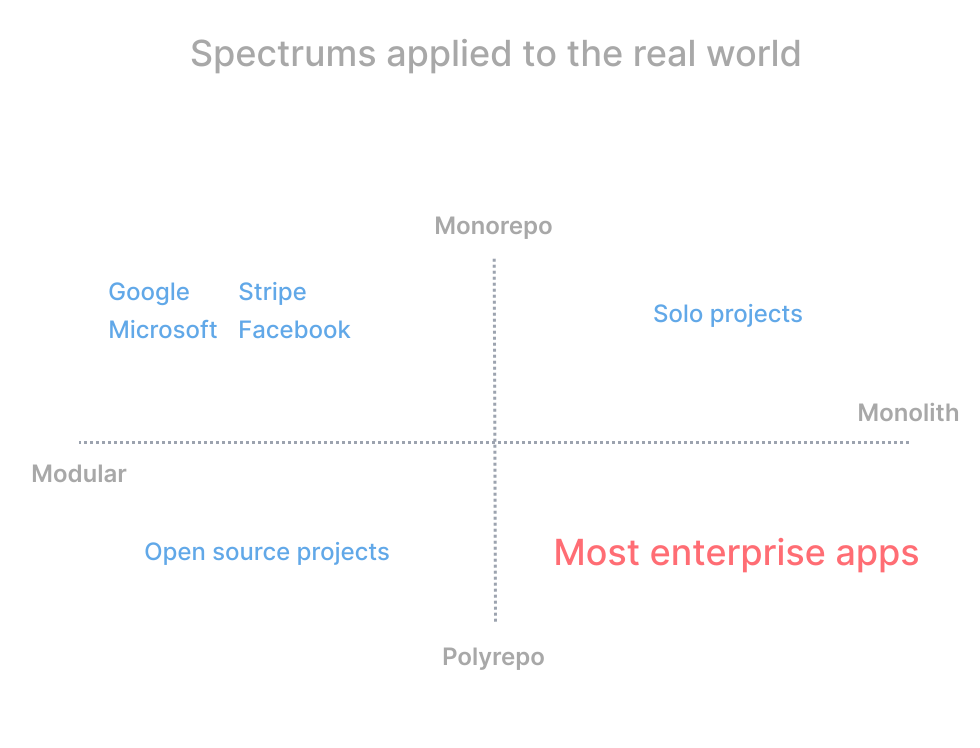
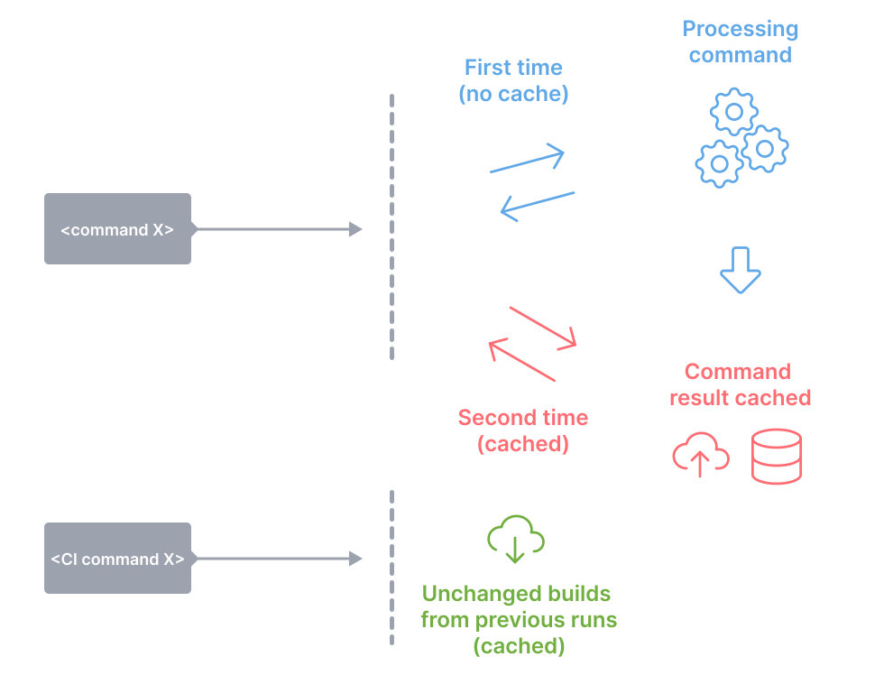
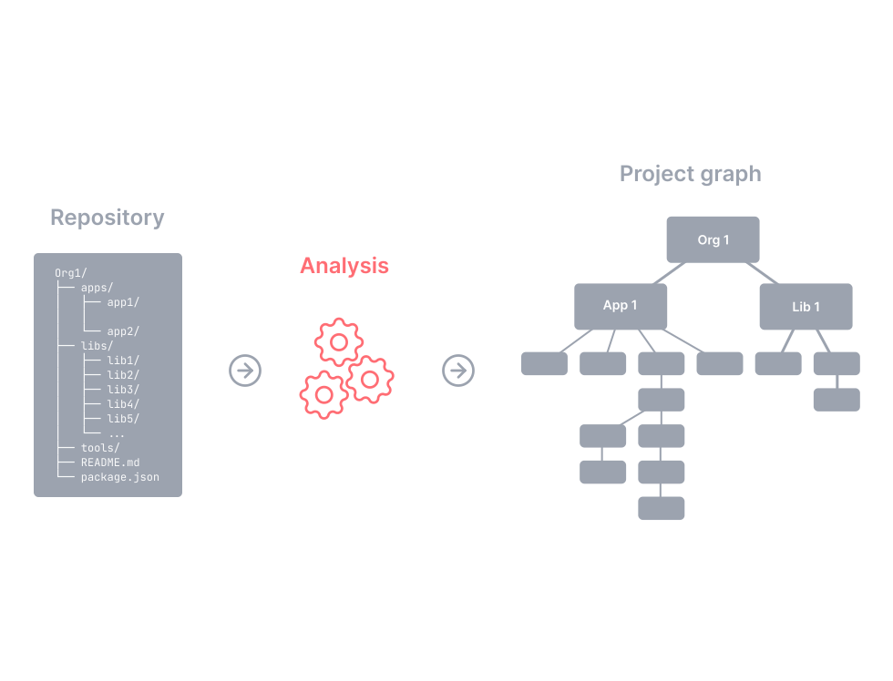
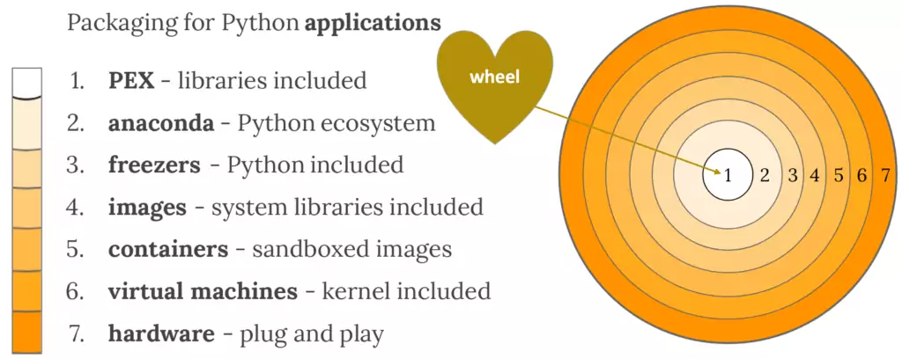

## Continuous Delivery: Build and Deployment Scripting
#### Build Tools, <span style="color: brown">Monorepo vs Polyrepo</span>, Principles and Practices, <span style="color: brown">Package Managers</span>, <span style="color: brown">Code Generation</span>, <span style="color: brown">Sample Project Structure</span>, Deployment Scripting, Tips and Tricks, <span style="color: brown">Infrastructure as Code</span>


<small><strong>Time to Read:</strong> 16 Minutes</small>, <small><strong>Time to Present:</strong> 75 Minutes</small>

<small><strong>Created By:</strong> Alireza Roshanzamir</small>

<small><strong>Keywords:</strong> Continuous Delivery, Continuous Integration, DevOps, Build, Test, Release, Deployment, Automation, Version Control, Deployment Pipeline</small>

<small><small> Tir 1402/August 2023</small></small>

---
## Introduction
**Scripting building**, **testing**, and **packaging** is essential for large or distributed teams to quickly onboard new members.

Modern platforms offer **command-line build options**. Rails uses **Rake**, .NET relies on **MSBuild**, and Java has **Ant, Maven, Buildr, or Gradle**. C/C++ projects benefit from **CMake** or **SCons**. Just have your CI server run these commands to build and test.  <!-- .element: class="fragment fade-in-paragraph custom" -->

As your project becomes more complex with **multiple components** or **unusual packaging** needs, you'll need to delve into build scripting.  <!-- .element: class="fragment fade-in-paragraph custom" -->

**Deploying software** to testing and production environments **isn't as simple as dropping a binary file**. It involves **configuring** your application, **initializing data**, setting up **infrastructure**, and more, including **mock external systems**.  <!-- .element: class="fragment fade-in-paragraph custom" -->

---
## An Overview of Build Tools
Build tools have a common core: **modeling dependencies**:


------
### Continued: An Overview of Build Tools
Build tool types:
- <!-- .element class="fragment highlight-current-blue" --> Task-oriented
  - Explain the dependency network using a set of tasks
  - Examples: Ant, NAnt, MSBuild
  - Don't retain state between builds, making it unsuitable for C++ compilation
  - Work well with languages like C# because their compilers have built-in logic for incremental builds.
- <!-- .element class="fragment highlight-current-blue" --> Product-oriented
  - Explain things based on the products they generate
  - Examples: Make (also supports _phony targets_ like install), Bazel, Pants, and Buck (these three are almost mixed)
  - Maintain their state using timestamps on the generated files from each task.
- <!-- .element class="fragment highlight-current-blue" --> Mixed
  - Such as Rake

<details>
<summary>Note</summary>
Mention the _cookie targets_ in Make.
</details>

------
### An Overview of Build Tools: Make
A strong, **product-oriented** build tool that tracks dependencies and **only builds affected components**.

But, **it's hard to debug** complex Makefiles. In larger codebases, teams often create a Makefile for each directory and use a top-level Makefile to run them **recursively**, a practice that's [considered problematic](https://accu.org/journals/overload/14/71/miller_2004/): <!-- .element: class="fragment fade-in-parent-with-next custom" -->
<table>
  <tr>
    <td></td>
    <td></td>
  </tr>
</table>

Some other drawbacks:  <!-- .element: class="fragment fade-in-with-next custom" -->
- OS specific (it depends on the shell)
- Whitespace can be important in some cases
- Doesn't support extensions


------
### An Overview of Build Tools: Ant
Ant's runtime components are in Java, while its scripts are an **external DSL in XML**. This mix provides Ant with robust **cross-platform** capabilities:


Some shortcomings:  <!-- .element: class="fragment fade-in-with-next custom" -->
- **XML** is **not concise** or **enjoyable** for humans to read.  <!-- .element class="fragment highlight-current-blue-parent custom" -->
- There are **no real domain concepts** beyond tasks.  <!-- .element class="fragment highlight-current-blue-parent custom" -->
- You can't easily respond to questions like **"How many tests ran?"** or **"How long did they take?"**.  <!-- .element class="fragment highlight-current-blue-parent custom" -->
- Import and macrodef tasks support reuse but may be **confusing for novices**.  <!-- .element class="fragment highlight-current-blue-parent custom" -->

Ant files can become very long and disorganized due to these limitations, sometimes extending to **thousands of lines**.  <!-- .element: class="fragment fade-in-paragraph custom" -->

------
### An Overview of Build Tools: NAnt and MSBuild
**NAnt** and **Ant** have a **similar syntax**, with only a few differences. **Microsoft** later introduced a variant called **MSBuild**, tightly **integrated into Visual Studio**, specializing in building **solutions**, handling dependencies, and managing projects:


------
### An Overview of Build Tools: Maven
Maven simplifies Ant files by **assuming certain Java project layouts**. By favoring **"convention over configuration"**, it can handle various tasks like **build**, **deploy**, **test**, and **release** with just **one command**, often needing minimal XML configuration:
<table>
  <tr>
    <td></td>
    <td></td>
  </tr>
</table>

Some shortcomings:  <!-- .element: class="fragment fade-in-with-next custom" -->
- Projects **not following Maven's assumptions** can make achieving desired results **tricky**, **seen as a feature** by some.  <!-- .element class="fragment highlight-current-blue-parent custom" -->
- To extend it, **coding is necessary**, but it **offers plugins** for nearly every desired functionality.  <!-- .element class="fragment highlight-current-blue-parent custom" -->

------
### An Overview of Build Tools: Rake
Rake, the **main Ruby build tool**, was created as an experiment to **mimic Make**'s functionality with an **internal DSL** in Ruby. Rake primarily handles **tasks** and **dependencies**. However, since Rake scripts are standard Ruby code, you can use Ruby's API to perform various tasks, leveraging the versatility of a **general-purpose programming language**:
<table>
  <tr>
    <td></td>
    <td></td>
  </tr>
</table>

You can **refactor** and **modularize** builds in your regular development environment. Debugging Rake is easy with the **standard Ruby debugger**.  <!-- .element: class="fragment fade-in-paragraph custom" -->

Some disadvantages:  <!-- .element: class="fragment fade-in-with-next custom" -->
- You need to ensure a suitable runtime is available on your platform
- You have to interact with RubyGems

------
### An Overview of Build Tools: Buildr, Gradle
New-gen build tools like Buildr, Gradle, and Gantt use **real programming languages** for build scripts.

Buildr is **based on Rake**, so anything you can do in Rake, you can do in Buildr. Moreover, Buildr seamlessly **replaces Maven**, sharing the **same conventions like filesystem layout**, **artifact specs**, and **repositories**. You can also **use Ant tasks**, including custom ones, with no setup needed.  <!-- .element: class="fragment fade-in-paragraph custom" -->

Gradle was designed for **multi-project builds**, which can grow to be large. It operates based on a series of build **tasks** that can run **serially** or in **parallel**. Incremental builds are supported:  <!-- .element: class="fragment fade-in-parent-with-next custom" -->


If you're starting **a new Java project**, or looking for **a replacement for Ant or Maven**, we strongly suggest you consider **Gradle**, or Buildr with **DSLs in Groovy**.  <!-- .element: class="fragment fade-in-paragraph custom" -->

------
### An Overview of Build Tools: Psake
Psake is an **internal DSL** written in **PowerShell**, which provides **task-oriented** dependency networks:


------
### An Overview of Build Tools: Bazel (Google), Buck (Facebook), Pants (Twitter)
Three of the most popular **Monorepo tools** and **declarative build systems**. Three common concepts are:
- **Goals and Commands:** build, test, lint, check, fmt, export, run, audit, clean, coverage, ...
- **Rules, Targets, and BUILD files:** cc_library, python_source, java_source, docker_image, java_library, protobuf_source, ...

```console
$ ./pants test ::
```

```console
$ ./pants test example:tests@interpreter_constraints=py2
```

```BUILD
# BUILD file

python_test(
  name="tests",
  source="tests.py",
  interpreter_constraints=parametrize(py2=["==2.7.*"], py3=[">=3.6"]),
)
```

They support **multiple programming languages**, **incremental builds**, **heavy and distributed caching**, **parallelization**, **code generation**, **dependency management and visualization**.

---
## Monorepo (Reference: <a href="https://monorepo.tools/">monorepo.tools</a>)
A monorepo is a single repository containing multiple distinct projects, with well-defined relationships:


------
### Monorepo != Monolith
A good monorepo is the opposite of monolithic:


------
### Polyrepo
A polyrepo is the current standard way of developing applications: a repo for each team, application, or project. And it's common that each repo has a single build artifact, and simple build pipeline:


The industry has moved to the polyrepo way of doing things for one big reason: **team autonomy**.

------
### Repository Management and Software Structure Organization Spectrums



------
### Polyrepo Drawbacks
- <!-- .element class="fragment highlight-current-blue" --> Cumbersome code sharing
  - To share code across repositories, you'd likely create a repository for the shared code (CI, tooling, dependency, versioning, ...).
- <!-- .element class="fragment highlight-current-blue" --> Significant code duplication
  - No one wants to go through the hassle of setting up a shared repo, so teams just write their own implementations of common services and components in each repo.
- Costly cross-repo changes to shared libraries and consumers  <!-- .element class="fragment highlight-current-blue" -->
- <!-- .element class="fragment highlight-current-blue" --> Inconsistent tooling
  - Each project uses its own set of commands for running tests, building, serving, linting, deploying, and so forth.

------
### Monorepo Benefits
- No overhead to create new projects  <!-- .element class="fragment highlight-current-blue" -->
- Atomic commits across projects  <!-- .element class="fragment highlight-current-blue" -->
- One version of everything  <!-- .element class="fragment highlight-current-blue" -->
- <!-- .element class="fragment highlight-current-blue" --> Developer mobility
  - Developers can confidently contribute to other teams' applications and verify that their changes are safe.

It is **more than code & tools**. A monorepo changes your **organization** and the **way you think about code**. By adding **consistency**, **lowering the friction in creating new projects** and performing **large scale refactorings**, by facilitating **code sharing** and **cross-team collaboration**, it'll allow your organization to work more **efficiently**.  <!-- .element: class="fragment fade-in-paragraph custom" -->

------
### Monorepo Tools
As your workspace grows, the tools have to help you keep it fast, understandable and manageable:


------
### Monorepo Tools Features: Fast

<table>
  <tr>
    <td>
      Local computation caching
      <br>
      
    </td>
    <td>
      Local task orchestration
      <br>
      
    </td>
    <td>
      Distributed computation caching
      <br>
      
    </td>
  </tr>
  <tr class="simple">
    <td>
      Distributed task execution
      <br>
      
    </td>
    <td>
      Detecting affected projects/packages
      <br>
      
    </td>
    <td>Transparent remote execution</td>
  </tr>
</table>

------
### Monorepo Tools Features: Understandable

<table>
  <tr>
    <td>
      Workspace analysis
      <br>
      
    </td>
    <td>
      Dependency graph visualization
      <br>
      
    </td>
  </tr>
</table>

------
### Monorepo Tools Features: Managable

<table>
  <tr>
    <td>
      Source code sharing
      <br>
      
    </td>
    <td>
      Consistent tooling
      <br>
      
    </td>
  </tr>
  <tr class="simple">
    <td>
      Code generation
      <br>
      
    </td>
    <td>
      Project constraints and visibility
      <br>
      
    </td>
  </tr>
</table>

------
### Monorepo Drawbacks
- Weak Multiple Languages Support
  - The best monorepo tool for one programming language is not good for the others.
  - Most monorepo tools support internal and external plugins.
  - You should consider Git submodule for multiple languages.
- VCS Tooling Challenges  <!-- .element class="fragment fade-in" -->
  - The complexity and size of the codebase, which makes it difficult to understand, search, scale, and maintain.
  - Microsoft has released a Virtual File System (VFS) for git to help manage the overload.
- Limitations Around Access Control  <!-- .element class="fragment fade-in" -->
  - Your company may not want every engineer to have access to the entire codebase.
  - GitHub and GitLab support CODEOWNERS file to define which team owns subdirectories in the repository.
- Heavy Build Pipelines  <!-- .element class="fragment fade-in" -->
  - Many CI tools offer the capability of conditional stages that execute only when changes occur in a particular directory. For instance, SemaphorCI uses "change_in," while Jenkins employs "changeset" to implement this functionality.

---
## Principles and Practices
Some general principles and practices of build and deployment scripting should apply to **whichever technology you use**:
- Create a Script for Each Stage in Your Deployment Pipeline  <!-- .element: class="fragment insides-fade-in-then-out" -->
  - Do not have a single script for whole deployment pipeline  <!-- .element: class="fragment fade-in-then-semi-out" -->
- Use an Appropriate Technology to Deploy Your Application  <!-- .element: class="fragment insides-fade-in-then-out" -->
  - Use the right tool for the job when automating deployment, not a general-purpose scripting language. For example, for WebSphere Application Server, you can use the Wsadmin tool.  <!-- .element: class="fragment fade-in-then-semi-out" -->
- Use the Same Scripts to Deploy to Every Environment  <!-- .element: class="fragment insides-fade-in-then-out" -->
  - If your application is complex in terms of its deployment architecture, you will have to make some simplifications to get it working on developer machines.  <!-- .element: class="fragment fade-in-then-semi-out" -->
- Use Your Operating System's Packaging Tools [for Deployment]  <!-- .element: class="fragment insides-fade-in-then-out" -->
  - For example, Debian and Ubuntu both use the Debian package system; RedHat, SuSE, and many other flavors of Linux use the RedHat package system; Windows users can use the Microsoft Installer system, and so forth.  <!-- .element: class="fragment fade-in-then-semi-out" -->
  - Commercial middleware servers, for example, often require special tools to perform deployments. In this case, a hybrid approach is necessary.  <!-- .element: class="fragment fade-in-then-semi-out" -->
  - You can also use platform-specific packaging systems, such as Ruby Gems, Python Eggs/Wheels, Perl's CPAN, and so on, to distribute your application, but they are designed by and for developers, not system administrators.  <!-- .element: class="fragment fade-in-then-semi-out" -->
- Ensure the Deployment Process Is Idempotent  <!-- .element: class="fragment insides-fade-in-then-out" -->
  - Leave the target environment in the same (correct) state, regardless of the state it finds it in when starting a deployment.  <!-- .element: class="fragment fade-in-then-semi-out" -->
  - If you cannot do this, validate the assumptions your deployment process makes about the environment, and fail the deployment if they are not met.  <!-- .element: class="fragment fade-in-then-semi-out" -->
  - Tools such as Puppet analyzes the configuration of the target environment and makes only the necessary changes to bring it in sync with the declarative specification of the desired state of the environment  <!-- .element: class="fragment fade-in-then-semi-out" -->
- Evolve Your Deployment System Incrementally  <!-- .element: class="fragment insides-fade-in-then-out" -->
  - You don't have to have completed all of the steps at once. The first time you write a script to deploy the application in a local development environment and share it with the team, you have saved lots of work for individual developers.  <!-- .element: class="fragment fade-in-then-semi-out" -->
  - Then, move on to refining these scripts so they can be used in the acceptance test environment to deploy and run the application so that the tests can be run.  <!-- .element: class="fragment fade-in-then-semi-out" -->

---
## Package Managers


A package manager or package-management system is a collection of software tools that automates the process of **installing**, **upgrading**, **configuring**, and **removing** computer programs for a computer in a consistent manner.  <!-- .element: class="fragment fade-in-parent-with-next custom" -->


------
### Language Specific and Language Agnostic Package Managers
Some language specific and language agnostic package managers:


Language agnositc package manager doesn't result language agnostic package

------
### Source Distribution (sdist) vs Built Distribution (bdist)

<table>
  <tr>
    <td></td>
    <td></td>
  </tr>
</table>

You may need different systems for generating built distributions.

------
### Levels of Package Dependency Inclusion

<table>
  <tr>
    <td>
      
    </td>
    <td>
      
    </td>
  </tr>
  <tr class="simple">
    <td colspan="2">
      Python Package Management Options and Comparison
      <br>
      
    </td>
  </tr>
</table>

------
### Virtual Environment and Local Packages Directory

<table>
  <tr>
    <td></td>
  </tr>
  <tr class="simple">
    <td></td>
  </tr>
</table>

<details>
  <summary>Note:</summary>
  Mention the following clues:
  <ul>
    <li>Use "distribution package" instead of "package" when searching</li>
    <li>Dependency pinning (presented in detail in the next sessions)</li>
    <li>Single project multiple versions of a library support</li>
  </ul>
</details>

---
## Sample Project Structure: JVM-Based/Maven

<table>
  <tr>
    <td></td>
    <td></td>
  </tr>
</table>

------
## Sample Project Structure: Pants

<pre style="font-size: 16px">
[project-name]/
  src/                 You can create a directory for each programming language.
    [project-name]/
  tests/
  examples/
    [example1-name]/
    [example2-name]/
    [example3-name]
    run.py
    BUILD
  docs/
    ...
    index.rst
    release.py
    build.py
    doctests.py
    enrich.py
    BUILD
  pants_plugins/
  dist/
  .azuredevops/
    pull_request_template/
      develop.md
      master.md
  .githooks/
    pre-commit
  .jenkins/
    ci.Jenkinsfile
  CHANGELOG.md
  CHANGELOG-fa.md
  requirements.txt
  requirements.lock
  BUILD
  pants.toml
  pyproject.toml
  pants*
</pre>

<details>
  <summary>Note:</summary>
  <ul>
    <li>Put things together that change together.</li>
  </ul>
</details>

------
## Sample Project Structure: JVM-Based/Maven

<pre style="font-size: 20px">
[project-name]/
  common/
    terraform/
    service-parent-pom.xml
    service.Dockerfile
  libraries/
    library-1/
      src/            You can put the unit-test files next to the source files.
      pom.xml
      README.md
    library-2/
    library-3/
  services/
    service-1/
      src/
      terraform/
      pom.xml
      README.md
    service-2/
  terraform/
  tests/
    end-to-end/
    performance/
  Jenkinsfile
  README.md
</pre>

---
## Deployment Scripting
Changes to testing and production environments should **only be made through an automated process**.

In addition to the previous mentioned notes, the following should be considered:  <!-- .element: class="fragment fade-in-with-next custom" -->
- **Deploying and Testing Layers**: You should strive to build on good known foundations. Before we even bother to copy our binary deliverables to the correct place in the filesystem, we want to know that our environment is ready for us in these layers:
    
- **Testing Your Environment's Configuration**: Provide a degree of confidence that the deployed layer is working:
    

<details>
<summary>Note</summary>
Mention the "Smoke-Testing N-Tier Architecture" through simple HTTP requests and displaying the results.
</details>

---
## Tips and Tricks
- Always Use Relative Paths  <!-- .element: class="fragment insides-fade-in-then-out" -->
  - Absolute paths create a tight dependency between the configuration of a specific machine and your build process.  <!-- .element: class="fragment fade-in-then-semi-out" -->
  - Try to minimize absolute paths by making all of the paths in your system relative to one or more well-defined root paths-the deployment root, the configuration root, and so on-and overriding just these roots.  <!-- .element: class="fragment fade-in-then-semi-out" -->
- Eliminate Manual Steps  <!-- .element: class="fragment insides-fade-in-then-out" -->
  - <!-- .element: class="fragment fade-in-then-semi-out" --> For many organizations, a "build script" is a printed document with a series of instructions like:

    ```
    ...
    STEP 14. Copy all the dlls from the CDROM directory E:\web_server\dlls\ into   the   new
    virtual directory
    STEP 15. Open a command prompt and type: regsvr webserver_main.dll
    STEP 16. Open the Microsoft IIS Management console and click Create New   Application
    ...
    ```
  - "When you have to do it a second time." The third time you do something, it should be done using an automated process.  <!-- .element: class="fragment fade-in-then-semi-out" -->
- Build In Traceability from Binaries to Version Control  <!-- .element: class="fragment insides-fade-in-then-out" -->
  - Some packages such a JAR files can include metadata.  <!-- .element: class="fragment fade-in-then-semi-out" -->
  - You can use simple MD5 hashing.  <!-- .element: class="fragment fade-in-then-semi-out" -->
- Don't Check Binaries into Version Control as Part of Your Build  <!-- .element: class="fragment insides-fade-in-then-out" -->
  - The rule of thumb is not to check in anything created as part of your build, test, and deploy cycle into source control.  <!-- .element: class="fragment fade-in-then-semi-out" -->
- Test Targets Should Not Fail the Build  <!-- .element: class="fragment insides-fade-in-then-out" -->
  - Make the failure set a flag but fail the build later, after generating more useful reports or running a more complete set of tests.  <!-- .element: class="fragment fade-in-then-semi-out" -->
- Constrain Your Application with Integrated Smoke Tests  <!-- .element: class="fragment insides-fade-in-then-out" -->
  - Make sure the deployed version validates its configuration when it is installed.

---
## Infrastructure as Code (IaC)


Infrastructure as Code is the **managing** and **provisioning** of infrastructure through **code instead of through manual processes**.  <!-- .element: class="fragment insides-fade-in-then-out" -->

IaC aids configuration management and helps you to **avoid undocumented**, **ad-hoc configuration changes**.  <!-- .element: class="fragment fade-in-paragraph custom" -->

There are 2 ways to approach IaC:  <!-- .element: class="fragment fade-in-with-next custom" -->
- **Declarative**: Keeps a list of the current state of your system objects, which makes taking down the infrastructure simpler to manage and will automatically provision the desired infrastructure.
- **Imperative**: Defines the specific commands needed to achieve the desired configuration, and those commands then need to be executed in the correct order.

These are a few popular choices:  <!-- .element: class="fragment fade-in-with-next custom" -->
- Chef
- Puppet
- Red Hat Ansible Automation Platform
- Saltstack
- Terraform 
- AWS CloudFormation

------
### Ansible
Ansible is **agentless**, which means the nodes it manages do not require any software to be installed on them:

<table>
  <tr>
    <td>
      
    </td>
    <td>
      
    </td>
    <td>
      
    </td>
  </tr>
</table>

Ansible can be both **declarative** and **procedural**-many modules work declaratively, while other modules prefer a procedural programming approach.

------
### Terraform
Terraform is an **agentless** infrastructure as code tool that enables you to safely and predictably **provision** and **manage infrastructure** in any cloud:

<table>
  <tr>
    <td></td>
    <td></td>
  </tr>
</table>

---
## Summary
Grow your automated build and deployment capabilities **step by step**, working through the deployment pipeline by iteratively identifying and then **automating the most painful steps**.

Involve **both operations and developers** in the creation of the mechanisms.  <!-- .element: class="fragment fade-in-paragraph custom" -->

We use the term "script" in quite a **broad sense**. Generally, by this we mean **all the automation** that helps us **build**, **test**, **deploy**, and **release** our software.  <!-- .element: class="fragment fade-in-paragraph custom" -->

Scripts are **first-class** parts of your system. They should be **version-controlled**, **maintained**, **tested**, and **refactored**, and be the **only mechanism that you use to deploy** your software.  <!-- .element: class="fragment fade-in-paragraph custom" -->

Spend some time, think about the **goals** you want to achieve, and **design** your build and deployment process to attain them.  <!-- .element: class="fragment fade-in-paragraph custom" -->
