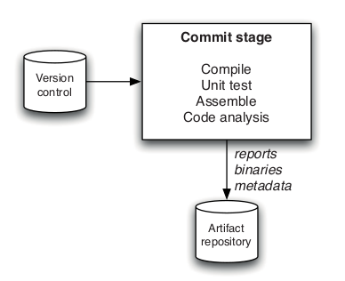
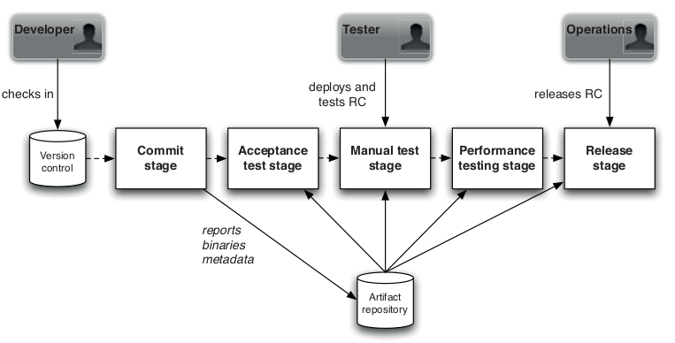
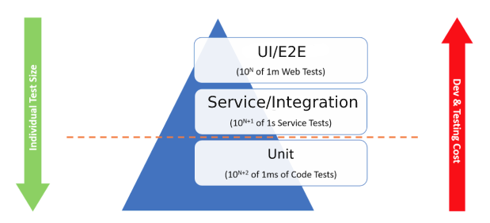

## Continuous Delivery: The Commit Stage
#### Introduction, Principles and Practices, The Results, Commit Test Suite Principles and Practices

<small><strong>Lecturer:</strong> Alireza Roshanzamir</small>

<small><strong>Keywords:</strong> Continuous Delivery, Continuous Integration, DevOps, Build, Test, Release, Deployment, Automation, Version Control, Deployment Pipeline</small>

<small><small> Tir 1402/August 2023</small></small>

---
## Introduction
The commit stage is the point at which you should begin the construction of your deployment pipeline.

Somebody checks a change into mainline (trunk) in version control. Your continuous integration server detects the change, checks out the source code, and performs a series of tasks, including:
- Compiling (if necessary)
- Creating binaries
- Performing any analysis
- Creating any other artifacts

These tasks are orchestrated by build scripts that are run by your continuous integration server.

The binaries and reports are then stored into your central artifact repository for use by your delivery team and by later stages in the pipeline.

For developers, the commit stage is the most important feedback cycle in the development process.

Note

Mention the preflight, pretested, pull-request, merge request builds.

---
## Principles and Practices
Some principles and practices that make for an effective commit stage:
- Provide Fast, Useful Feedback
  - Provide a concise summary of the reasons for the failures, such as a list of failed tests, the compile errors, or any other error conditions.
  - Do not fail fast in the commit stage (if possible) and present aggregated report for this stage.
- What Should Break the Commit Stage?
  - Compilation fails, tests break, or an environmental problem
  - Increasing number of warnings
  - Decreasing percentage of coverages
  - Code-style breaches
  - Don't fail the commit test for some reason that hasn't been agreed upon by the whole team
- Tend the Commit Stage Carefully
  - The build and test scripts should be treated with the same level of respect as you would treat any other part of your application.
  - Many projects effectively grind to a halt under the weight of their build problems.
  - Ensure that your scripts are modular (maybe task-based) but avoid environment-specific scripts
- Give Developers Ownership
  - It is a failure if we get to the point where only specialists can maintain the CI system.
- Use a Build Master for Very Large Teams (over 20-30 individuals)
  - It is useful to have someone to play the role of a "build master." to to encourage and enforce build discipline.
  - The build master should never be a permanent role. Team members should rotate through it, perhaps on a weekly basis.

---
## The Results
The commit stage inputs are source code, and the outputs are binaries and reports which need to be stored somewhere for reuse in the later stages of your pipeline, and for your team to be able to get hold of them:

---
## Commit Test Suite Principles and Practices
Some important principles and practices governing the design of a commit test suite. Here, we only talk about unit-tests while it's recommended to include some acceptance and end-to-end tests in the commit stage test suit:
- The vast majority of your commit tests should be comprised of unit tests
- Should be very fast to execute
- Should cover a large proportion of the codebase (around 80% is a good rule of thumb)
- Avoid the User Interface
  - It tends to involve a lot of components or levels of the software under test.
  - UI elements are desperately slow.
- Use Dependency Injection
  - Makes it very easy to limit the scope of a test to just the classes that you want to test, not all of their dependent baggage too.
- Avoid the Database
  - Dramatically slower to run
  - Statefulness of the tests can be a handicap when you want to repeat them
  - Complexity of the infrastructure setup
  - If it isn't simple to eliminate the database from your tests, it implies poor layering and separation of concerns in your code.
- Avoid Asynchrony in Unit Tests
  - Synchronous wrapper around asynchronous entities may help.
  - Tests which rely on infrastructure, such as messaging (even in-memory), count as component tests, not unit tests.
  - More complex, slower-running component tests should be part of your acceptance test stage, not commit stage.
- Using Test Doubles
- Minimizing State in Tests
  - Do not affect state around the tests.
  - Minimize the dependency on state in your tests.
  - Do not fall into trap of building complex data structures to supporting the tests. It's better to have simple and fast setup-teardown.
- Faking Time
- Ten Minutes Threshold
  - When this limit is broken: cecking in less frequently, stop caring about whether or not the commit test suite passes.
  - Parallel execution on build grids may help (computing power is cheap and people are expensive).
  - Push long-running often passing tests to acceptance test stage.

---
## Summary
The commit stage should be focused on one thing: detecting, as fast as possible, the most common failures that changes to the system may introduce, and notifying the developers so they can fix the problems quickly.

The commit stage of your deployment pipeline should be run every time someone introduces a change into your application's code or configuration.

The establishment of a commit stage-an automated process, launched on every change, that builds binaries, runs automated tests, and generates metrics-is the minimum you can do on the way to your adoption of the practice of continuous integration
