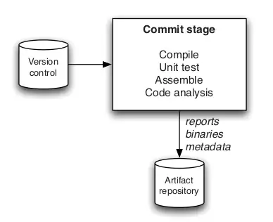
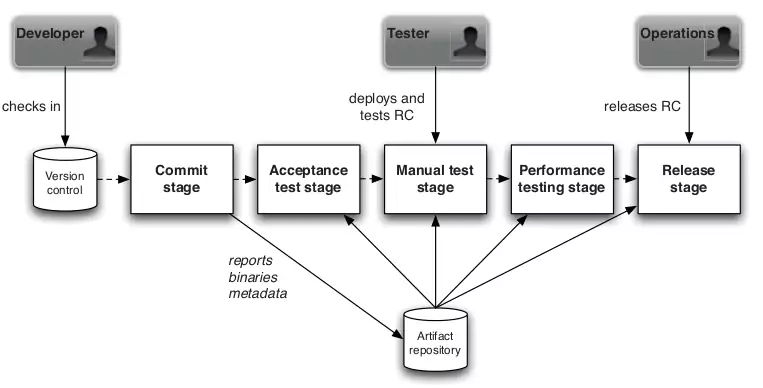
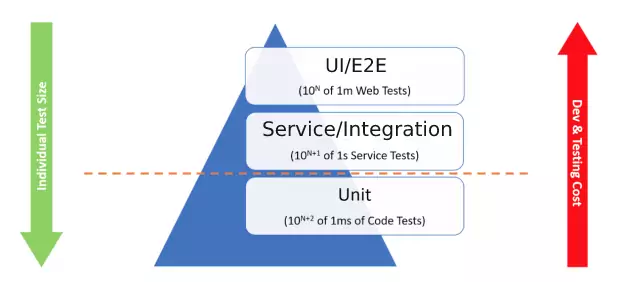
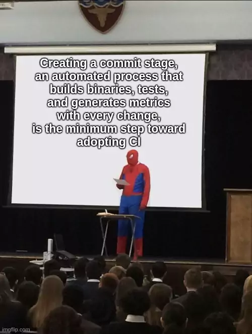

## Continuous Delivery: The Commit Stage
#### Principles and Practices, The Results, Commit Test Suite Principles and Practices

<small><strong>Time to Read:</strong> 5 Minutes</small>, <small><strong>Time to Present:</strong> 20 Minutes</small>
 
<small><strong>Created By:</strong> Alireza Roshanzamir</small>
 
<small><strong>Keywords:</strong> Continuous Delivery, Continuous Integration, DevOps, Build, Test, Release, Deployment, Automation, Version Control, Deployment Pipeline</small>
  
<small style="color: darkred"><small>Press **"F"** to go fullscreen; some slides may not display properly otherwise.</small></small>

---
## Introduction
The commit stage is the point at which you **start building your deployment pipeline**.

&shy;<!-- .element: class="fragment fade-in-with-next custom" -->Somebody checks in a **change into mainline (trunk)**. Your CI server detects it, checks out the code, and does various tasks, like:
- Compiling (if necessary)
- Creating binaries
- Performing any analysis
- Creating any other artifacts

&shy;<!-- .element class="fragment fade-in" -->The **binaries** and **reports** are stored in a central **artifact repository** for your delivery team and later pipeline stages.

&shy;<!-- .element class="fragment fade-in" -->For **developers**, the commit stage is the **most important feedback cycle** in the whole process.

Note

Mention the preflight, pretested, pull-request, merge request builds.

---
## Principles and Practices

Some principles and practices that make for an effective commit stage:  <!-- .element: class="fragment fade-in-with-next custom" -->
- Provide Fast, Useful Feedback  <!-- .element: class="fragment insides-fade-in-then-out" -->
  - &shy;<!-- .element: class="fragment fade-in-then-semi-out" -->Provide a concise summary of **why things failed**, like a list of failed tests, compile errors, or other issues.
  - &shy;<!-- .element: class="fragment fade-in-then-semi-out" -->**Do not fail fast** (if possible) and present aggregated report for this stage.
- What Should Break the Commit Stage?  <!-- .element: class="fragment insides-fade-in-then-out" -->
  - &shy;<!-- .element: class="fragment fade-in-then-semi-out" -->**Compilation** fails, **tests** break, or an **environmental** problem.
  - &shy;<!-- .element: class="fragment fade-in-then-semi-out" -->**Increasing** number of **warnings**.
  - &shy;<!-- .element: class="fragment fade-in-then-semi-out" -->**Decreasing** percentage of **coverages**.
  - &shy;<!-- .element: class="fragment fade-in-then-semi-out" -->**Code-style** breaches.
  - &shy;<!-- .element: class="fragment fade-in-then-semi-out" -->**Don't fail** the commit test for some reason that hasn't been **agreed upon by the whole team**
- Tend the Commit Stage Carefully  <!-- .element: class="fragment insides-fade-in-then-out" -->
  - &shy;<!-- .element: class="fragment fade-in-then-semi-out" -->Give the **same level of respect** to **build** and **test** **scripts** as you would to any other part of your application.
  - &shy;<!-- .element: class="fragment fade-in-then-semi-out" -->Many projects effectively **grind to a halt** under the **weight of their build problems**.
  - &shy;<!-- .element: class="fragment fade-in-then-semi-out" -->Ensure that your scripts are **modular** (maybe task-based) but **avoid environment-specific scripts**.
- Give Developers Ownership  <!-- .element: class="fragment insides-fade-in-then-out" -->
  - &shy;<!-- .element: class="fragment fade-in-then-semi-out" -->It is a **failure if** we get to the point where **only specialists can maintain** the CI system.
- Use a Build Master for Very Large Teams (over 20-30 individuals)  <!-- .element: class="fragment insides-fade-in-then-out" -->
  - &shy;<!-- .element: class="fragment fade-in-then-semi-out" -->It is useful to have **someone to play the role** of a "build master" to encourage and **enforce build discipline**.
  - &shy;<!-- .element: class="fragment fade-in-then-semi-out" -->The build master role should **rotate** among team members, **possibly weekly**, and **not be permanent**.

---
## The Results

&shy;<!-- .element: class="fragment fade-in-with-next custom" -->The commit stage takes in **source code** and produces **binaries** and **reports** that should be **stored** for **later use in the pipeline** and for your **team to access**:

---
## Commit Test Suite Principles and Practices

&shy;<!-- .element: class="fragment fade-in-with-next custom" -->Commit test suite design principles, **emphasizing unit tests** (while suggesting adding **acceptance** and **end-to-end** tests to the commit stage test suite):
- The vast majority of your commit tests should be comprised of unit tests  <!-- .element: class="fragment insides-fade-in-then-out" -->
  
- Should be very fast to execute  <!-- .element: class="fragment insides-fade-in-then-out" -->
- Should cover a large proportion of the codebase (around 80% is a good rule of thumb)  <!-- .element: class="fragment insides-fade-in-then-out" -->
- Avoid the User Interface  <!-- .element: class="fragment insides-fade-in-then-out" -->
  - It tends to involve a lot of components or levels of the software under test.
  - UI elements are desperately slow.
- Use Dependency Injection  <!-- .element: class="fragment insides-fade-in-then-out" -->
  - Makes it easy to limit the scope of a test to just for the classes that you want, not all of their dependent baggage.
- Avoid the Database  <!-- .element: class="fragment insides-fade-in-then-out" -->
  - Dramatically slower to run
  - Statefulness of the tests can be a handicap when you want to repeat them
  - Complexity of the infrastructure setup
  - If it's hard to exclude the database from tests, your code might lack layering and separation of concerns.
- Avoid Asynchrony in Unit Tests  <!-- .element: class="fragment insides-fade-in-then-out" -->
  - Synchronous wrapper around asynchronous entities may help.
  - Tests which rely on infrastructure, such as messaging (even in-memory), count as component tests, not unit tests.
  - More complex, slower-running component tests should be part of your acceptance test stage, not commit stage.
- Using Test Doubles  <!-- .element: class="fragment insides-fade-in-then-out" -->
- Minimizing State in Tests  <!-- .element: class="fragment insides-fade-in-then-out" -->
  - Do not affect state around the tests.
  - Minimize the dependency on state in your tests.
  - Avoid complex data structures for tests. Use simple and fast setup and teardown.
- Faking Time  <!-- .element: class="fragment insides-fade-in-then-out" -->
- Ten Minutes Threshold  <!-- .element: class="fragment insides-fade-in-then-out" -->
  - When this limit is broken, developers check in less and may not care if the commit tests pass.
  - Parallel execution on build grids may help (computing power is cheap and people are expensive).
  - Push long-running often passing tests to acceptance test stage.

---
## Summary

&shy;<!-- .element class="fragment fade-in" -->The commit stage's main aim is to **quickly** spot **common failures** due to changes and notify developers for quick fixes.

&shy;<!-- .element class="fragment fade-in" -->The commit stage in your pipeline should run **every time someone introduces a change** into your **code** or **configuration**.
